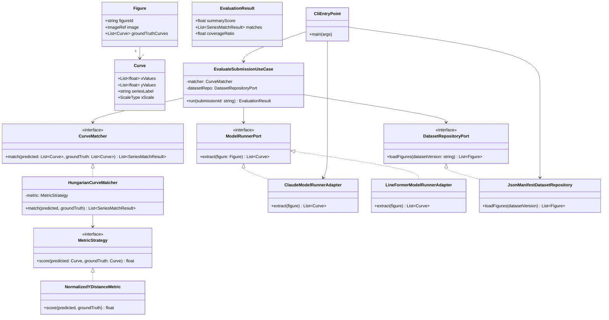
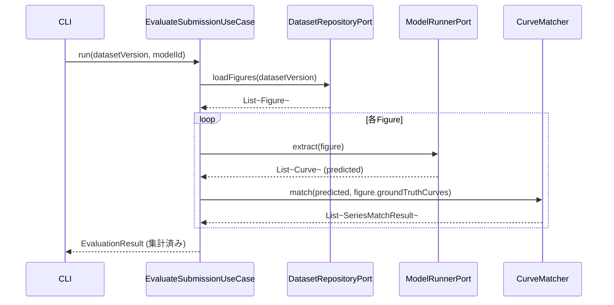

# real-chart-bench ベンチマーク設計書

- Status: **Approved** (2026-08-15、司令塔レビュー合格。PR #1マージ済み)
- Author: worker (Claude, herdr経由)
- Last updated: 2026-08-15
- 実装: Phase 0/1/2完了。Phase 3(データセットv0構築)は熱電材料コーパス全量(9,484論文)の本収集が完了(§7.13): REDISTRIBUTABLE 603論文、ground truth 10,057曲線(100%確保)、画像ペア179論文。パネル分割器(§7.12)を実データ2,458枚で精度評価済み(§7.14、クラッシュ修正・誤検出フィルタ追加)。Tier2画像はHugging Face Hub公開予定(承認待ち、変換スクリプト準備済み)。deep-digitizer連携はローカルパス参照で確定。次は自動ペアリングの技術調査。実装順は §7.7 参照。

## 0. スコープと非スコープ

**やること**: オープンアクセス論文の実験グラフ(主に折れ線・散布図)から、既存モデル/LLMがどれだけ正確に元データ(XY数値列)を再構成できるかを測るベンチマークを構築する。

**やらないこと(v0時点)**:
- 棒グラフ・円グラフ・ヒートマップ等の非XY系グラフ(将来拡張候補)
- チャートQA(自然言語質問応答)。本プロジェクトは値の再構成精度そのものを測る。
- Starrydataのデータそのものの再配布・改変(ライセンス確認が取れるまでは参照・ペアリングのみ)

**初期ドメイン**: README記載の通り、Starrydataが最も厚くカバーする**熱電材料(thermoelectric materials)分野**をv0のシードドメインとする。

---

## 1. データ収集パイプライン設計

### 1.1 収集ソース候補の比較

| ソース | 役割 | 論文メタデータ | ライセンス情報 | 図画像取得 | 備考 |
|---|---|---|---|---|---|
| **OpenAlex** | 一次索引 | ◎ (DOI, OA状態, license) | ◎ `primary_location.license`, `open_access.oa_status` | △ (PDF/HTML URLのみ、図は自前抽出) | 無料・APIキー不要・レート寛容。Crossrefを内包し検索性が高い |
| **Crossref** | ライセンス補完 | ○ | ○ `license.URL` (works API) | × | OpenAlexが拾えないライセンスURLの裏取りに使う |
| **PMC OA Subset** | 図の直接取得 | ○ | ◎ (Commercial/Non-Commercial/Otherの3区分が明示) | ◎ (Bulk/FTP/BioC APIでfigure画像個別取得可) | 生物医学寄り。熱電材料分野の論文は少ない可能性 → 主にパイプライン検証用 |
| **Starrydata (CSV一括DL)** | 起点候補・ground truth | ○ (paper_id, DOI) | × (別途論文側で要確認) | × (画像は持たない。論文DOIのみ) | §2で詳述。**現在API停止、CSV配布のみ稼働** |
| **出版社別OAリポジトリ (arXiv, J-STAGE等)** | 補完 | △ | △ 個別確認要 | ○ | 熱電材料は物理・材料科学誌が多く、出版社OAが主戦場になる見込み |

**方針**: **OpenAlexを一次索引**として使い、`is_oa:true` かつ `primary_location.license` がCC-BY系のレコードを起点候補集合とする。Starrydataの論文DOIリストと**積集合**を取ることで「ground truthあり × 再配布可能」な論文だけに絞り込む(§2.3)。図画像自体はOpenAlexのlanding page / PDF URLから論文側でダウンロードし、パイプライン内でページ抽出する(PMCはBioC等で直接切り出せる場合に優先利用)。

### 1.2 パイプライン全体フロー

```mermaid
flowchart TD
    A[Starrydata CSV一括DL] -->|paper_id, DOI, curve/sample data| B[候補論文DOIリスト]
    B --> C[OpenAlex Works API<br/>DOI逆引き]
    C --> D{is_oa == true?}
    D -- No --> X1[除外: closed access]
    D -- Yes --> E{license が<br/>再配布許容リストに一致?}
    E -- No/不明 --> X2[除外 or 要人手確認キューへ]
    E -- Yes --> F[論文PDF/HTML取得]
    F --> G[図表抽出<br/>PDF figure extraction]
    G --> H{図がXY系<br/>折れ線/散布図か?}
    H -- No --> X3[除外: 対象外グラフ種]
    H -- Yes --> I[Starrydata curveデータと<br/>paper_id/figure番号で紐付け]
    I --> J{ペアリング成立<br/>かつ品質検証OK?}
    J -- No --> X4[保留キュー: 人手レビュー]
    J -- Yes --> K[データセットレコード確定<br/>image + ground truth XY + license metadata]
    K --> L[(dataset manifest<br/>JSON/Parquet)]

    style X1 fill:#4a1f1f,stroke:#a33
    style X2 fill:#4a1f1f,stroke:#a33
    style X3 fill:#4a1f1f,stroke:#a33
    style X4 fill:#4a2f1f,stroke:#a73
    style L fill:#1f3a1f,stroke:#3a7
```



### 1.3 ライセンス判定フィルタリング設計

**原則**: 「再配布可能」の判定は保守的に行う。不明・グレーは自動採用せず保留キューに送る。

**再配布許容ライセンス許可リスト(初期案)**:
- `CC-BY-4.0` / `CC-BY-3.0` — 許可(改変・商用含め再配布可、表示義務あり)
- `CC0` / `Public Domain` — 許可
- `CC-BY-SA` — 許可(同一ライセンス継承の条件を manifest に記録)
- `CC-BY-NC*`, `CC-BY-ND*` — **原則除外**(NDは図の切り出し=改変にあたる可能性、NCはベンチマーク配布が非商用か判断つかないため司令塔確認)
- 出版社独自ライセンス("publisher-specific")・ライセンス欄が空 — **自動除外 → 人手確認キュー**

**判定ロジック(擬似コード、実装はしない)**:
```
function classify_license(openalex_license_field, crossref_license_url):
    normalized = normalize(openalex_license_field)
    if normalized in ALLOWLIST:
        return REDISTRIBUTABLE
    if normalized is null:
        # Crossrefのlicense.URLで裏取りを試みる
        fallback = normalize(fetch_crossref_license(doi))
        if fallback in ALLOWLIST:
            return REDISTRIBUTABLE
        return NEEDS_REVIEW
    return EXCLUDED
```

各レコードには `license_source`(openalex/crossref/manual)、`license_checked_at`、`license_evidence_url` を必ず保存し、後日の監査・司令塔レビューに耐える形にする。**疑わしいものは司令塔に確認**(CLAUDE.md方針通り)。

### 1.4 収集メタデータスキーマ(案)

```
PaperRecord:
  paper_id, doi, title, venue, published_date
  openalex_id, is_oa, license, license_status (REDISTRIBUTABLE/NEEDS_REVIEW/EXCLUDED)
  starrydata_paper_id (nullable)

FigureRecord:
  figure_id, paper_id, figure_number, image_uri, chart_type (line/scatter/mixed/other)
  extraction_source (pdf-embedded / bulk-image / manual-crop)
  split (public / held_out)   # §7.5: 外部提出受付(v2以降)に備え、v0から確保する

GroundTruthCurve:
  curve_id, figure_id, starrydata_curve_id
  x_values[], y_values[], x_unit, y_unit, x_scale (linear/log), series_label
  digitization_method (starrydata_manual)
  quality_flags[]
  alternates[]   # §7.3: 旧デジタイズ版を保持(代表値は最新版、旧版はここに退避)
  license = "CC BY 4.0", license_source = "manual (NIMS MDR)"   # §7.1で確定。図画像の license_status(PaperRecord)とは別軸
```

---

## 2. Ground Truth設計

### 2.1 Starrydataの実態調査まとめ

- Starrydata2は無機機能性材料(熱電・磁性材料が中心)の論文図から**人手デジタイズ**されたXYカーブを集めたオープンデータベース。194,000+曲線、82,000+サンプル、13,000+論文をカバー(2024年時点公開情報)。
- データモデルは概ね `paper → figure → sample → curve` の階層。論文単位のDOIと、図番号、サンプル組成、曲線のXY点列が紐づく。
- API(`/api/paper/{id}`, `/api/figure/{id}`, `/api/sample/{id}` 等)がドキュメント上は存在するが、**現在稼働停止中**であることをユーザーから確認済み。
- 一方、**データセット全体がCSVで一括ダウンロード可能**(Figshareの "Starrydata datasets" プロジェクト等で配布)。

### 2.2 設計への反映(重要な方針転換)

上記を踏まえ、ground truth取得はライブAPI依存をやめ、**CSV一括ダウンロード + オフラインJOIN**を正とする:

1. Starrydata配布CSV(paper/figure/sample/curveに相当するテーブル群)をダウンロードし、リポジトリ外のデータストア(§6のデータ管理方針で規定)に保管。
2. CSVの `paper_id` / `DOI` 列を軸に、§1のOpenAlexライセンス判定パイプラインへ渡す候補DOIリストを生成。
3. 図番号・カーブ系列ラベルでの論文内ペアリングは、CSVに含まれる `figure_id` / `figure_number` 相当列(実データを取得次第、列名を確定してスキーマ§1.4に反映)を使う。
4. APIが将来復旧した場合は差分更新・個別検証用の補助手段として使う設計にしておく(CSVを正、APIを補助という優先順位は崩さない)。

> **RESOLVED (2026-08-15)**: Starrydataデータのライセンスは **CC BY 4.0** で正式確定(NIMS MDR公式ページで確認。出典: https://mdr.nims.go.jp/datasets/be1aaf76-761d-4b73-8ba4-f958348efade 、推奨引用も同ページに記載)。詳細は§7.1参照。デジタイズ済みXY値は**帰属表示付きで再配布可能**であり、§7.1で決めた「非公開参照データ」フォールバックは不要になった。ただし**論文図画像**のライセンスはStarrydataのライセンスとは独立に、論文ごとに§1.3の判定が必要な点は変更なし。

### 2.3 ペアリング方式

`(Starrydata paper_id/DOI, figure_number)` をキーに、§1パイプラインで収集した `FigureRecord` と `GroundTruthCurve` 群を結合する。1論文内に複数図・1図内に複数曲線があるため、キーは `(paper_id, figure_number, curve_index)` の複合キーとする。

ペアリング失敗パターン(保留キューへ):
- Starrydata側の図番号表記ゆれ(例: "Fig. 3(a)" vs "Figure 3a")
- 論文改訂版・プレプリント版とジャーナル版でDOIが異なるケース
- 1図に複数パネル(サブフィギュア)があり、どのパネルの曲線か特定できないケース

### 2.4 品質検証方法

- **軸レンジ整合性チェック**: デジタイズ点のx/y値が、対応する図の軸ラベル範囲(OCRまたは人手で確認した範囲)に収まっているか。
- **点数の妥当性**: 曲線あたりの点数が極端に少ない(3点未満など)場合はサンプリングとして粗すぎる可能性 → 品質フラグを立てる(除外はしない。メトリクス側で重み付けする余地を残す)。
- **重複検出**: 同一論文・同一図に対し複数のデジタイズが存在する場合(Starrydataはクラウドソース型のため起こりうる)、代表値の選定ルールが必要 → **司令塔確認事項**(平均を取るか、最新デジタイズを正とするか等)。
- **サンプリング監査**: v0データセット確定時、ランダムサンプル(例: 30件)を人手で図とground truthを目視突合し、誤ペアリング率を計測してmanifestに記録する。

---

## 3. 評価メトリクス設計

### 3.1 先行研究の調査と比較表

| 手法/ベンチマーク | 対象タスク | メトリクスの考え方 | 系列間対応付け | 弱点 |
|---|---|---|---|---|
| **ChartOCR** | 折れ線データ抽出 | GT各点のy値との正規化差分を平均(連続値ベース) | 曖昧(単一系列前提が多い) | 2%閾値のような硬い足切りがなく外れ値に弱い場合がある |
| **FigureSeer / Linear Programming手法** | 折れ線データ抽出 | 点ごとの差分を**誤差閾値2%で二値化**し正解率を算出 | 単純割当 | 閾値が硬く、僅かな誤差でも0/1化されスコアの解像度が低い |
| **LineFormer (ICDAR2023)** | 折れ線データ抽出(実写含む) | ChartOCR方式(正規化y差分の平均)を採用。複数系列は**予測×GTの全ペアで類似度行列を作り二部マッチング(匈牙利法)で最適割当** | ◎ 二部マッチングで解決 | x軸が非等間隔・非数値(カテゴリ軸)の場合の扱いは別途定義が必要 |
| **LineEX (WACV2023)** | 折れ線データ抽出 | 検出タスクは mPA(mean pixel accuracy的指標)、系列復元は NRMSE(正規化RMSE)で評価 | あり(詳細は論文要確認) | 合成データ430K中心で学習・評価されており実写グラフでの汎化未検証 |
| **CHART-Infographics (ICDAR Task 6a/6b)** | 6a: 要素検出・分類 / 6b: データ抽出 | 6bは「系列名+(x,y)点列の集合」としてGTと予測を比較する**Data Extraction Score**を定義。6aは**Visual Element Detection Score**(IoUベース) | 系列名文字列マッチ + 二部マッチング | x値が文字列(カテゴリ)/数値の両方に対応する必要があり実装が複雑 |
| **ChartQA** | チャートQA(値そのものの抽出ではなく質問応答) | **Relaxed Accuracy**: 数値は5%許容誤差で正解扱い、非数値は完全一致 | N/A(QA形式) | 曲線全体の形状再現度は測れない。単一値の正確性のみ |

### 3.2 推薦メトリクス(v0)

LineFormer/ChartOCR系の「正規化y差分 + 二部マッチング」路線をベースに採用し、real-chart-bench特有の課題(対数軸、非等間隔サンプリング)に対応する拡張を加える。

**採用理由**: (a) 折れ線が主対象という要件に直接合致、(b) 複数系列への対応が二部マッチングで確立済み、(c) 連続値ベースで閾値二値化よりスコアの解像度が高く、モデル間の僅差を比較できる、(d) 先行研究との数値比較可能性を確保できる(LineFormer論文の土俵に乗れる)。

**推薦メトリクス構成(ドメイン層で定義するインターフェースの仕様として)**:

1. **曲線間距離**: 予測曲線を GT の各x座標に線形補間し、正規化誤差 `|y_pred - y_gt| / (y_max - y_min)` を算出。**対数軸の場合はlog空間で誤差計算**(線形空間での絶対誤差は対数軸の意味を壊すため必須の分岐)。
2. **系列内スコア集約**: 点ごと誤差の平均(MAE的)に加え、**Chamfer距離的な曲線類似度**(点集合対点集合の最近傍距離の双方向平均)を補助指標として併記。単純y差分は「予測側がx範囲の一部しかカバーしていない」ケースを過小評価しがちなため、カバレッジ率(GTのx範囲に対する予測x範囲の割合)を別軸で必ずレポートする。
3. **系列間対応付け**: 予測系列数とGT系列数が異なるケースを考慮し、コスト行列(系列間の曲線距離)に対しハンガリアン法で最適割当。未割当のGT系列は「検出漏れ」、未割当の予測系列は「誤検出」として個別カウントし、最終スコアにペナルティとして反映(完全一致しないと0点になる硬直的な設計を避ける)。
4. **サマリスコア**: 図単位スコア = f(系列マッチ率, 平均曲線距離, カバレッジ率) の加重合成。重み付けは司令塔レビューで確定(初期案は等重み)。

**ChartQA型Relaxed Accuracyは補助指標として残す**: 「特定x値でのy値」を問うピンポイント精度チェックとして併記すると、LLM評価時にわかりやすい数値(人間にとって直感的な正答率)を提供できる。ただし主指標にはしない(曲線全体の形状評価にならないため)。

### 3.3 境界ケースのテスト観点(TDD対象)

CLAUDE.md方針「評価メトリクスは境界ケースの単体テストを充実させる」に基づき、実装時に最低限カバーすべきケースを設計時点でリストアップしておく:

- GT曲線が1点のみ(補間不可能なケース)
- 予測系列が0件(全滅ケース)
- 予測系列数 > GT系列数(誤検出過多)
- x軸が対数スケール、値が0または負(log変換不可)
- x値がカテゴリ変数(数値でない)の場合の距離定義
- GTとpredのx範囲が全く重ならない(補間不能・カバレッジ0)
- 予測・GTが完全一致(スコア上限の確認)
- 系列ラベルが空文字列/欠損

---

## 4. 評価対象と実行設計(ハーネスアーキテクチャ)

### 4.1 層構成(クリーンアーキテクチャ)

- **Domain層**(最内側、外部依存ゼロ): `Curve`, `Figure`, `EvaluationResult` 等のエンティティ、`MetricStrategy` インターフェース、`CurveMatcher`(二部マッチングのドメインロジック)。外部ライブラリ・ネットワーク・ファイルI/Oに依存しない。
- **UseCase層**: `EvaluateSubmissionUseCase`, `BuildDatasetManifestUseCase`。Domain層のインターフェースにのみ依存し、具体実装は知らない(DIP)。
- **Adapter層**: `LLMRunnerAdapter`(Claude/GPT/Gemini呼び出し)、`DedicatedModelAdapter`(LineFormer等)、`DatasetRepository`(manifest読み込み)、`LeaderboardExporter`。UseCase層が定義したポートを実装する。
- **Infrastructure層**(最外側): 実際のHTTPクライアント、ファイルシステム、外部API SDK、CLIエントリポイント。

依存方向は常に **Infrastructure → Adapter → UseCase → Domain** の一方向。Domain層はどの層からもimportされる側であり、何もimportしない。CIで `import-linter`(Python想定)により機械的に強制する(§6)。

### 4.2 クラス図



**ポイント**:
- `MetricStrategy` をインターフェース化することで、§3.2の主指標を差し替え/追加(Chamfer距離版、閾値二値化版など)しても UseCase・CLIは無変更で済む。
- `ModelRunnerPort` により、LLM・専用モデル・既存ツール(WebPlotDigitizer的な半自動ツール含む)を同一インターフェースで評価できる。新規モデル追加はAdapter層に実装クラスを1つ足すだけで、Domain/UseCaseに影響しない(OCP)。
- CLIやHTTP等の入り口は Infrastructure 扱いとし、DIコンテナ的な組み立て(依存性注入の配線)はエントリポイントに集約する。

### 4.3 評価実行フロー(補足)



### 4.4 CLI出力契約(LLMO方針、§7.8で追加確定)

Infrastructure層のCLIエントリポイントは、人間だけでなく他のエージェント/スクリプトからの利用を第一級のユースケースとして扱う:

- 全コマンドが `--format json` を持つ。**デフォルトはJSON**とし、人間向けの `--format text` は明示指定で切り替える(機械可読性を既定の挙動にする)。
- JSON出力はパイプ/リダイレクトでそのままパース可能な単一オブジェクト(1行)とし、人間向け装飾(色・罫線・進捗バー等)はstderrに出すかtext modeに限定する。
- Phase 0で `capabilities` / `version` コマンドに先行実装済み。Phase 1以降の `evaluate` コマンド等もこの契約を継承する。

---

## 5. リーダーボード公開方法(提案)

**現状**: リポジトリはprivate。公開判断は司令塔経由で人間承認が必要(CLAUDE.md)。以下は**承認後を見据えた提案**であり、実行は指示を待つ。

- **v0(内部検証)**: 評価結果をリポジトリ内の `results/*.json` に蓄積し、READMEまたは静的サイト生成前の生データとして管理。
- **v1(公開候補)**: 静的サイトジェネレータ(例: 既存の軽量スタック)でGitHub Pages相当にリーダーボードテーブルを描画。モデル名・スコア内訳(§3.2の各指標)・評価日・データセットバージョンを列に持つ。
- **提出方式**: 当面はメンテナ(司令塔/オーナー)が評価を実行してマージする「クローズド提出」形式。外部からのモデル提出受付(PR経由でAdapterを追加する形)はv2以降の検討事項とし、悪意ある提出(不正スコア狙い)への対策(held-outデータセットの非公開保持等)を別途設計する必要がある。
- **バージョニング**: データセットにバージョンタグ(例: `v0.1`)を付与し、リーダーボードのスコアは常にどのデータセットバージョンに対するものか明示する。データセット更新(図の追加・ライセンス再判定による除外等)がスコアの後方互換性を壊しうるため。

---

## 6. 技術スタック推薦

| 領域 | 推薦 | 理由 |
|---|---|---|
| 言語(コア: Domain/UseCase/Adapter) | **Python** | 対象モデル(LineFormer等の専用モデル、各種LLM SDK)のエコシステムがPython中心。画像処理(PDF図抽出、OCR)・数値計算(NumPy/SciPy、ハンガリアン法は`scipy.optimize.linear_sum_assignment`で標準実装あり)との親和性が高い |
| 依存方向の機械的強制 | **import-linter** | CLAUDE.md指定通り。Domain層が外部/Infrastructure層をimportしていないことをCIで検証する契約(`contracts`)を書く |
| データ収集パイプライン | Python (`requests`/`httpx` + OpenAlex/Crossref APIラッパー) | 特別な理由なし、コア言語と統一しメンテコストを下げる |
| リーダーボードUI(v1) | **TypeScript (静的サイト)** | 評価結果JSONを読み込んで表示するだけの静的フロントは型安全なTSが書きやすく、GitHub Pages等との相性が良い。ここのみTS採用とし、`dependency-cruiser`をこのサブパッケージのCIに組み込む(CLAUDE.mdのTS向け指定に対応) |
| テスト | **pytest**(Python側)、**vitest**(TS側) | 標準的選択。境界ケース単体テスト(§3.3)はpytestの`parametrize`で網羅的に書く想定 |
| データ保管形式 | manifestは**JSON Lines / Parquet**、画像は別ストレージ参照(URIのみmanifestに保持) | リポジトリに大容量画像を直接コミットしない。ライセンス上再配布可能なもののみ実データを含める運用ルールとも整合 |

**ドメイン層カバレッジ目標(提案)**: **95%以上**(行カバレッジ)。Domain層はメトリクス計算・マッチングロジックというベンチマークの信頼性そのものを担う部分であり、境界ケース(§3.3)を含めた厳密なテストが不可欠なため、UseCase/Adapter層(目標70-80%程度を想定)より高い基準を置く。具体的な数値は司令塔確認事項として最終決定を仰ぐ。

---

## 7. 未決事項・リスク — 司令塔レビュー結果(2026-08-15、承認)

> 元の7項目は司令塔レビューで全て回答済み。以下、各項目を **RESOLVED** として決定内容を記録する。

### 7.1 Starrydata利用規約・データライセンス — RESOLVED(確定: CC BY 4.0)

**一次調査結果(2026-08-15、実装と並行してワーカーが実施)**:

| 調査先 | 結果 |
|---|---|
| GitHub `starrydata/starrydata_datasets` | リポジトリ内にLICENSEファイル・READMEでのライセンス明記は確認できず |
| Figshare "Starrydata datasets" プロジェクト | ページ本体が403で直接確認不可(bot拒否と推定) |
| starrydata2.org 全般情報 | 「商用・非商用問わず無償利用可」という二次情報はあったが、ライセンス条文としての確証はなし |

上記の時点では `license_status = NEEDS_REVIEW` とし、確認が取れるまでXY値を「非公開参照データ」として扱うフォールバック方針としていた。

**司令塔による正式確定(2026-08-15)**: Starrydataデータのライセンスは **CC BY 4.0** であることを、NIMS MDR(National Institute for Materials Science, Materials Data Repository)の公式ページで確認済み。

- 出典: https://mdr.nims.go.jp/datasets/be1aaf76-761d-4b73-8ba4-f958348efade
- 同ページに推奨引用(citation)の記載あり
- `license_status = REDISTRIBUTABLE`、`license_source = "manual (NIMS MDR)"`、`license_evidence_url = "https://mdr.nims.go.jp/datasets/be1aaf76-761d-4b73-8ba4-f958348efade"` として `GroundTruthCurve`/データセットmanifestに記録する(§1.4スキーマ・§1.3判定ロジックのCC-BY-4.0許可リストにそのまま合致)。

**結論・影響**:
- ground truth(StarrydataのデジタイズXY値)は**帰属表示付きで再配布可能**。§7.1で予定していた「非公開参照データ」フォールバックは不要になった → Phase 3(データセットv0構築)からXY値を公開データとして扱ってよい。
- CC BY 4.0の帰属表示要件(著作者表示・ライセンス表示・変更有無の明示)をデータセットmanifest・配布物に組み込む(具体的な表示文言はStarrydata推奨citationに準拠)。
- **論文図画像のライセンスは本件と独立**。Starrydataのライセンスは同社が生成したデジタイズ済みXY値に対するものであり、元論文の図そのものの著作権・再配布可否は従来通り§1.3のパイプラインで論文ごとに判定する(変更なし)。

### 7.2 図画像の再配布ライセンス許可リスト — RESOLVED

初期案を承認。確定版:

| ライセンス | 扱い |
|---|---|
| CC-BY / CC0 | 採用 |
| CC-BY-SA | 採用(manifestに `license = "CC-BY-SA"` を明記し、同一ライセンス継承条件を下流に伝播させる) |
| CC-BY-NC*, CC-BY-ND* | 除外 |
| 出版社独自ライセンス・ライセンス欄空 | 人手確認キュー送り(自動除外) |

### 7.3 重複デジタイズの代表値選定ルール — RESOLVED

**「最新デジタイズを正」**とする。旧版は `GroundTruthCurve` の `alternates[]` として保持し、`quality_flags` に `superseded_by_newer_digitization` 等を記録する。平均化は不採用(サンプリング点位置が版ごとに異なり、平均を取ると実在しない点列が生成されるため)。

### 7.4 メトリクス加重合成の重み — RESOLVED

v0は**等重み**で確定(系列マッチ率・平均曲線距離・カバレッジ率)。Phase 2のパイロット収集で得た実データを見て、Phase 3以降に再調整する。

### 7.5 外部提出受付 — RESOLVED

v2以降で方針確定(据え置き)。ただし **held-out(非公開)split の枠は最初から確保する**: `FigureRecord`/データセットmanifestに `split: "public" | "held_out"` フィールドを追加し(§1.4スキーマに反映済み、下記参照)、v0構築時点からpublic/held-outを分けて記録する。

### 7.6 ドメイン層カバレッジ目標 — RESOLVED

**Domain層 95%以上(行カバレッジ)で確定**。UseCase/Adapter層は70-80%を参考値とする(必達目標ではなく目安)。

### 7.7 パイロット先行実装順 — RESOLVED(採用)

```
Phase 0: スキャフォールド + CI + import-linter        ← 完了
Phase 1: Domainメトリクス + マッチングロジックをTDDで実装  ← 完了
Phase 2: 数十論文規模のパイロット収集でパイプライン設計を検証   ← 完了(§7.9)
Phase 3: データセットv0構築(熱電材料ドメイン)              ← 収集パイプライン実装+実データパイロット完了(§7.10-7.11)。
                                                    569論文全量への本収集は司令塔確認事項待ち
```

**Phase 1実装メモ**: `src/real_chart_bench/domain/{curve,metrics,matching,evaluation}.py`。§3.3の境界ケース8項目(GT1点のみ・予測0件・予測過多・log軸で非正値・カテゴリx軸・x範囲重複なし・完全一致・空ラベル)をすべて単体テストで先行して書き(Red)、実装後に全てGreen。ドメイン層カバレッジ100%(CIで`--cov-fail-under=95`を強制、§7.6目標を上回る)。カテゴリx軸(§3.3の5番目)はv0スコープ外として、ドメイン層は数値x限定・呼び出し側でのordinal encodingを前提とする設計判断をテストとして明文化した(`tests/domain/test_categorical_x_axis_scope.py`)。

### 7.8 追加要件: LLMO(LLM-Optimization)方針 — 反映済み

司令塔指示により以下を必須設計ルールとして追加(§4に補記):
- CLIは**必ずJSON出力モード**を持つ(`--format json`)。Phase 0のCLI雛形は `--format json` をデフォルトとし、人間向けの `--format text` を別途提供する形で実装済み。
- READMEに**1文の機械可読な能力記述**(構造化JSON1行)を維持する。

### 7.9 Phase 2パイロット結果(2026-08-15実施)

ThermoelectricMaterials(熱電材料)ドメインの実データで、§1パイプラインの前提を検証した。GitHub `starrydata/starrydata_datasets` のReleases("latest"タグ)から実CSVをダウンロードし、OpenAlex APIに実際に問い合わせた。

**1. Starrydata CSVの実カラム構成(§1.4スキーマのTODOだった箇所を確定)**:

| ファイル | 行数 | 実カラム |
|---|---|---|
| `ThermoelectricMaterials_papers.csv.gz` | 9,481論文 | `SID, DOI, URL, issued, author, title, container_title, container_title_short, volume, issue, page, ISSN, publisher, project_names, created_at` |
| `ThermoelectricMaterials_samples.csv.gz` | 76,427サンプル | `sample_name, sample_id, composition, composition_details, SID, DOI, created_at, updated_at, sample_info` |
| `ThermoelectricMaterials_curves.csv.gz` | 155,759曲線 | `SID, DOI, composition, sample_id, figure_id, figure_name, prop_x, prop_y, unit_x, unit_y, x, y, created_at, updated_at, project_names, comments` |

- `curves.csv`に`DOI`が直接含まれており、`samples.csv`経由の結合は不要(§2.3のペアリングキーを`(SID, figure_id)`ベースに簡略化できる)。
- `x`/`y`列はJSON配列リテラル文字列(例: `"[299.86,324.87,...]"`)。`json.loads`でそのままパース可能。
- ライセンス情報はStarrydata側CSVには一切含まれない(想定通り。OpenAlex/Crossref側で判定する設計の妥当性を再確認)。
- `figure_name`は**表記ゆれが実際に存在する**ことを確認(下記4.)。

**2. ライセンス歩留まり率(500論文ランダムサンプル、OpenAlex一括問い合わせ)**:

| license_status | 件数 | 割合 |
|---|---|---|
| EXCLUDED(closed, is_oa=false) | 393 | 78.6% |
| NEEDS_REVIEW(OA だがCC-BY等の明示ライセンスなし: bronze/green/hybrid/diamond) | 65 | 13.0% |
| REDISTRIBUTABLE(CC-BY) | 30 | 6.0% |
| EXCLUDED(CC-BY-NC/ND等の明示) | 12 | 2.4% |

- 熱電材料コーパス全体(9,481論文)に外挿すると、**約569論文がCC-BY相当**(NEEDS_REVIEWの一部がCrossref裏取りやパブリッシャー個別確認で追加救済される可能性あり)。
- 1論文あたり平均約16.4曲線(155,759 / 9,481)のため、v0データセットの規模感は「500〜600論文 × 十数曲線 ≒ 数千〜1万曲線」程度が現実的な一次見積もり。**Phase 3のデータセット規模計画にこの数字を反映する**。
- 最初に無作為30論文だけを個別問い合わせした一次テストではREDISTRIBUTABLE=0件だった(母集団6%に対しサンプル数不足による当然のばらつき)。**教訓**: ライセンス歩留まり検証は最低でも数百件規模のバッチ問い合わせで行うべきで、少数の無作為抽出は「ゼロ件」という誤った悲観的結論を招きうる。

**3. classify_license のリファインメント(実データ起因)**: §1.3の元の擬似コードは `license_id` のみを見ており、closed-access論文(`is_oa=false`)でライセンス欄が空のケース(実測393/500 = 78.6%)を素通りで NEEDS_REVIEW に送ってしまう欠陥があった。`is_oa=False` を最優先でチェックし即座に EXCLUDED とするよう実装時に修正(`domain/licensing.py`のdocstring・テストに記録)。これにより NEEDS_REVIEW キューが本当にレビュー価値のある13%(65/500)に絞られる。

**4. `figure_name`表記ゆれの実例(§2.3で懸念していた問題の実証)**: CC-BY論文30件・曲線364行から観測した`figure_name`の実値: `"2(a)"`, `"2a"`, `"6c"`, `"Figure 6(a)"`, `"Fig 9(a)"`, `"6(b)"`, `"7_b"`, `"6"`(パネルなし)など60種類以上の表記ゆれを確認。`domain/figure_reference.py`の`normalize_figure_reference()`(パイロットの実測値をテストフィクスチャに使用)で正規化する設計とし、実装済み。

**5. パイプライン設計への影響まとめ**:
- §1.4スキーマの`figure_id`/`figure_number`列名の不確定要素はTODO解消。実際は`figure_id`(Starrydata内部連番)+`figure_name`(人間可読・表記ゆれあり)の2列。
- §2.3ペアリングキーを `(SID, figure_id)` に簡略化(`DOI`はcurves.csvに直接あるため中間結合不要)。
- ライセンス判定は「まず`is_oa`で足切り」の二段階方式に更新(§1.3のロジックを`domain/licensing.py`で確定実装、境界ケースを含めテスト済み)。

**実装**: `domain/licensing.py`(classify_license)、`domain/figure_reference.py`(normalize_figure_reference)、`usecase/license_lookup.py` + `usecase/classify_candidate_papers.py`(ポート+ユースケース)、`adapter/openalex.py`(OpenAlex実装、注入可能なtransportで単体テストはライブ通信なし)。ドメイン層カバレッジ100%維持。

### 7.10 deep-digitizerワーカーの知見統合(PDF取得・図抽出)

司令塔指示により、姉妹プロジェクト**deep-digitizer**(教師データ生成)ワーカーが先行実施したパイロット(`docs/experiments/2026-08-15-pilot-figure-pairing.md`、二重実装回避のため参照のみ・コードは自リポジトリ設計で書き直し)の知見を取り込んだ:

- **PDF取得歩留まりが厳しい**: `is_oa=true`論文でも実際にPDFがダウンロードできるのは約29%(出版社のボット対策・paywallインタースティシャルのため)。取得失敗は `not_a_pdf`(paywall/HTML)・`http_error`(403/404)・`no_pdf_url`・接続エラーの4パターンに分類できる。
- **図抽出は埋め込みラスター画像 + ページ全体レンダリングの併用が必須**: ベクター描画のグラフ(Origin/matplotlib由来)は埋め込み画像として存在せず、ページ全体レンダリングでしか拾えないことを実証。
- **複合図(複数パネル)問題**: Starrydataの`figure_name`はパネル単位("1d"等)だが、PDFから抽出できるのは複合図全体。パネル単位の自動切り出しは両プロジェクトとも未実装・今後の技術課題として共有。
- **候補画像の半数以上が無関係画像**(SEM顕微鏡写真等)。自動フィルタは自動化投資判断(§5.4相当の方針)により現時点では見送り。

これらを反映し、`domain/pdf_signature.py`(`is_pdf_content`によるPDF/HTML判別)、`usecase/pdf_fetch.py` + `adapter/pdf_fetch.py`(失敗タクソノミーを型で表現)、`usecase/figure_extraction.py` + `adapter/figure_extraction.py`(pymupdf、埋め込み画像+ページレンダリングfallback、閾値150×150px/150dpiはdeep-digitizerの実測値を踏襲)を実装。

### 7.11 Phase 3実データ収集パイロット(2026-08-15実施)

自リポジトリの実装(`HttpPdfFetchAdapter`/`PyMuPdfFigureExtractor`/`build_ground_truth_for_paper`、モックなし)を使い、CC-BY確定論文29件に対してエンドツーエンドで実行。詳細は [`docs/experiments/2026-08-15-phase3-collection-pilot.md`](../experiments/2026-08-15-phase3-collection-pilot.md)。

**要点**:
- PDF取得成功率 **37.9%**(deep-digitizerの`is_oa`全般サンプル28.9%より改善。CC-BY限定の効果を確認)
- ground truth(Starrydata XY値)のmanifest化は**PDF取得と独立に100%の歩留まり**で可能(29/29論文、101 FigureRecord、365 GroundTruthCurve)
- **v0規模計画の修正**: §7.9の569論文見積り(ground truthベース)に対し、画像ペア付きで確保できるのは実質PDF取得歩留まり(約35〜40%)を乗じた**200〜230論文相当**という、より保守的な数字に更新。v0は「ground truth manifestは全量」「画像ペア確保済みサブセット」の2階層構成を推奨(司令塔確認事項として次アクションに計上)
- 画像↔`figure_id`の自動ペアリングは依然未解決(deep-digitizerと共通の次期技術課題)

### 7.12 パネル分割器の技術調査(2026-08-16実施、司令塔指示によりRCBがオーナー)

§7.11で残った「複合図(複数パネル)からパネル単位を自動特定できない」課題に対し、司令塔指示
(2026-08-16)により real-chart-bench が実装をオーナーする形で一次調査・実装を行った。
deep-digitizer側の観察(§7.10参照、複合図が頻出しパネル単位切り出しが未実装という所見)は
参考にしたが、**実装はゼロから自リポジトリの設計で書き起こした**(コピペ移植なし)。

**手法**: 学習済み検出モデルは導入せず(自動化投資は歩留まり実測後に判断する既定方針を踏襲)、
科学論文の図はほぼ必ず一様な背景(通常白)の上にパネルが配置されるという前提で、**背景ギャップ
(gutter)検出による罫線なしグリッド分割**を実装。行・列ごとに背景ピクセル比率のプロファイルを取り、
一定幅以上連続して背景比率が閾値を超える帯を「本物のgutter」と判定してグリッドをセグメント化する。

**実装(共有部品として汚さないインターフェース設計)**:
- `domain/panel_layout.py`(`detect_panel_grid`): 2D輝度配列 → `PanelRegion(label, row, col, bbox)`
  のタプル。**real-chart-bench固有の型(Curve/FigureRecord等)に一切依存しない**、numpy配列のみを
  扱う純粋関数。deep-digitizer側がそのまま流用できる想定でこの層を切り出した
- `usecase/panel_splitting.py`(`PanelSplitterPort`/`SplitPanel`): 画像バイト列 in → ラベル付き
  画像バイト列 out のポート定義。呼び出し側はドメイン語彙を一切知らなくてよい
- `adapter/panel_layout.py`(`PyMuPdfPanelSplitter`): pymupdfでバイト列⇔numpy配列の変換とクロップ
  ・再エンコードを実装。ポートの1実装に過ぎず、将来別実装(例: OpenCV版)に差し替え可能

**検証**: 実画像(pymupdfで合成したPNG)によるTDD。2×2グリッド・1×3グリッド・単一パネル
(グリッド未検出時は元画像をそのまま1パネルとして返す、誤クロップしないフォールバック)・
gutter幅不足による誤検出防止・ほぼ空白なセルの除外、をテスト済み。ドメイン層カバレッジ100%維持。

**既知の限界**: 本手法は背景が一様な白であることを前提とする。実データ2,458枚での精度評価
(§7.14)で、ネストされたインセットを含む複合図でのunder-segmentationと、`page_render`
(ページ全体レンダリング)画像への適用が原理的に不向きであることが判明した。

**deep-digitizerとの関係**: 本コンポーネントはdeep-digitizerが将来消費する共有部品という前提で
設計した(ポート/ドメイン層をreal-chart-bench固有の概念から独立させている)。deep-digitizer側への
連携方法(パッケージ公開/コピー/サブモジュール等)は司令塔確認事項とする。

### 7.13 Phase 3本収集完了(2026-08-16実施、司令塔承認)

熱電材料コーパス全量(9,484論文)に対する本収集を実行・完了。詳細は
[`docs/experiments/2026-08-16-v0-full-collection.md`](../experiments/2026-08-16-v0-full-collection.md)。

**結果概要**: REDISTRIBUTABLE論文603件(6.36%、Phase 2推計と一致)。ground truth manifest化は
**全603論文で100%**(2,555 FigureRecord、**10,057 GroundTruthCurve**)。画像付きペアは
179論文(pdf_url保有分の34.0%、全体の29.7% — §7.11の予測200〜230論文にほぼ整合、やや下振れ)。
manifestは`data/manifest/v0/`にコミット済み(CC BY 4.0、メタデータのみ)。画像本体(546MB)は
`data/raw/`にローカル保存のみ(design §6方針通りコミットしない)。

**実行中に発見したバグ**: DOI大文字小文字不一致によるKeyErrorが603件中400件処理後に発生
(パイロット規模では非顕在化、本番規模で初めて表面化)。DOIキーの小文字正規化で修正し、
再開可能性(処理済み分をスキップ)も追加。出典サーバーへの不要な再アクセスを避ける観点からも
再開可能性の実装は必須だった。

これでv0のTier 1(ground truth全量)は確定。Tier 2(画像ペア確保済みサブセット)の
恒久ホスティング先、および画像↔`figure_id`自動ペアリング(§7.10/§7.12)は次アクション。

### 7.14 パネル分割器の精度評価・Tier 2公開準備・deep-digitizer連携方式(2026-08-16、司令塔回答)

司令塔から3件の方針決定:

1. **Tier 2画像のホスティング先はHugging Face Hub(dataset repo)で確定**。ただし
   **アップロードは本リポジトリの公開承認 + HFトークン受領後**。それまでは変換スクリプトの
   準備のみ行う
2. **パネル分割器の精度評価を承認**(実データ2,458枚 + サンプリング目視監査)
3. **deep-digitizerとの連携は当面ローカルパス参照で確定**(同一マシン、読み取り専用共有)。
   パッケージ化は両リポジトリ公開後に再検討

**1. への対応**: `scripts/publish/prepare_hf_dataset.py` を実装。Tier 2論文(179件)を
HF datasets形式の`metadata.jsonl`(paper_id/doi/license/image_files/figures/curves)+
データセットカード(`README.md`、CC BY 4.0のfront-matter)に変換する。画像本体は
アップロード時までコピーせず`data/raw/images/`を参照するのみ(546MBの二重化を避ける)。
アップロード関数は`HF_TOKEN`未設定なら**必ず失敗する**多重ガード付きで実装し、
公開承認前の誤アップロードを構造的に防止。ドライラン実行で179論文・2,458画像への
変換を確認済み(アップロードは未実行)。

**2. への対応**: `scripts/eval/evaluate_panel_splitter.py` で全2,458枚を評価。詳細は
[`docs/experiments/2026-08-16-panel-splitter-eval.md`](../experiments/2026-08-16-panel-splitter-eval.md)。

- **実行1回目でクラッシュ発覚**(957/2,458件、39%): `max_panels`超過時の`IndexError`。
  合成テストでは想定していなかった実データ特有の問題(JPEG圧縮ノイズ等でgutter検出が
  過敏反応)。`max_panels`パラメータ追加で修正(フォールバック化、クラッシュ解消)
- **目視監査で系統的な誤検出パターンを発見**: 軸目盛りストリップ・回転した軸ラベル文字・
  パネルラベルの括弧が、細い帯として別パネルに誤分割される。`min_panel_size_fraction`
  (画像辺の5%未満の帯を除外)を追加して対処。TDDで実データ起因の境界テストを追加
- **修正後、全2,458枚でクラッシュ0件**。multi-panel検出率53.5%(1,315枚)。目視監査した
  8枚中、embedded画像2件は真の2×2グリッドを正確に検出(TP)、2件は正しく非分割(TN)、
  1件はネストインセットによるunder-segmentation(FN)、**1件はpage_render画像への適用
  自体が原理的に不向き**(本文テキストを「パネル」と誤検出)と判明
- **推奨事項**: 実運用のペアリングusecaseでは、パネル分割器は`source=embedded`の画像
  にのみ適用し`page_render`画像には適用しない設計とする(次アクション)

**3. への対応**: 特にコード変更なし。deep-digitizer側ワーカーが
`/Users/t29mato/herd/real-chart-bench`(読み取り専用)を直接参照する運用を前提として、
本ドキュメント(および`domain/panel_layout.py`等のdocstring)がそのまま連携ドキュメントを
兼ねる設計を維持する。

### 7.15 評価ハーネス実装 + ベースライン実走(2026-08-16、司令塔加速指示)

「ベンチマークとして動く」状態まで進める指示に対応。Phase 1の`domain/evaluation.py`
(`evaluate_figure`)をそのまま流用し、design §4.2の`ModelRunnerPort`を実装した。

**v0スコープ決定(実装判断)**: 評価ハーネスは「軸較正(x_range/y_range/x_scale)が
既知である前提で、曲線トレース精度を測る」設計とした(`ExtractionTask`が画像バイト列と
較正情報をセットで渡す)。CHART-Infographics task 6a(要素検出)と6b(データ抽出)の分離
(§3.1)に相当し、軸目盛りOCR(6a相当)は本v0のスコープ外と明示する。

**実装**:
- `domain/pixel_calibration.py`: `PixelCalibration` — ピクセル座標⇔データ座標の変換
  (log軸対応)。pure関数、TDD
- `usecase/model_runner.py`: `ModelRunnerPort`(`extract(task) -> list[Curve]`)、
  `ExtractionTask`
- `usecase/evaluate_dataset.py`: `evaluate_model_on_dataset` — モデル実行結果を
  Phase 1のメトリクスで採点。**1図の抽出失敗が全体を止めない**設計(エラーはスコア0として
  記録し継続)
- `adapter/naive_cv_extractor.py`: **ナイーブCVベースライン**。色相バケットで色付き
  ピクセルをクラスタリングし、列ごとの中央値でピクセル空間の折れ線を復元、
  `PixelCalibration`でデータ空間に変換。**既知の限界(意図的に単純な参照実装)**: 黒/グレー系
  の線は軸・文字と区別できないため抽出不可。ピクセル基準枠は色付きピクセルの外接矩形を代用
  (真の軸検出ではない)
- `usecase/build_leaderboard.py`: `results/*.json`からランキング行を構築する純粋関数

**評価セットの構築で判明した重要な事実**: 「単一figure_idの論文」ヒューリスティックは
ペアリング精度を保証しない。17件の単一figure論文のうち3件を候補画像プールから探索したが、
**2件は画像は見つかったが実データ(prop_x/prop_y/数値範囲)と視覚的内容が一致しなかった**
(誤ったパネル・誤った図を選んでいた)。1件のみ数値検証まで含めて確実に一致
(paper 18759, "Figure 3(a)", Electrical conductivity vs Temperature、4曲線)。
**自動/簡易ヒューリスティックによるペアリングは信頼できないことを再確認**(§7.10/§7.12の
既知の課題と一致)。

**実行結果**(`results/naive-cv-v0.json`、`scripts/eval/run_baselines.py`): 実データ1件
(手動検証済み)+ 合成データ3件(単一線・2系列・黒線log軸)の計4件で実走。

| 評価対象 | summary_score | 備考 |
|---|---|---|
| 実データ(paper 18759, Figure 3a) | 0.778 | match_rate=1.0(4曲線とも検出)、mean_curve_distance=0.48 |
| 合成: 単一線形 | 0.997 | ほぼ完璧(単純なケース) |
| 合成: 2系列線形 | 0.997 | 同上 |
| 合成: 黒線+logスケール | 0.0 | **意図した既知の弱点を実証**(黒線を検出できない) |

平均0.693。ナイーブベースラインは「色付きの単純な線」には機能するが「黒線」「複雑な
マーカー付きプロット」には弱い、という直感的に妥当な結果が実データ・合成データ双方で
再現された。

### 7.16 LineFormer実行可能性の検証(2026-08-16)

事前学習済みLineFormer(mmdetectionベース)およびLineFormer-finetune
(HF: `t29mato/lineformer-battery-finetuned`)の実行を試みたが、**本環境(macOS/Apple
Silicon、CUDA無し、Python 3.14)では実行不能と判断**し、無理に動かすことはしなかった
(司令塔指示「動かなければ制約を報告、無理はしない」に従う)。

**根拠**:
- `mmcv`(mmdetectionの必須依存)はPyPI上で**ソース配布のみ**(`mmcv-2.2.0.tar.gz`、
  プリビルドwheelなし)。OpenMMLab公式のプリビルドwheelはLinux+CUDA向けのみで、
  macOS/CPU版は配布されていない
- ソースビルドを試みたところ、`ModuleNotFoundError: No module named 'pkg_resources'`
  で即座に失敗(Python 3.14 + 最新setuptoolsとの非互換。mmcvのビルドシステムは
  レガシーな`pkg_resources`前提で、近年のPython/setuptoolsでは動作しない)
- 仮にビルドが通ってもCUDA拡張(deformable conv等)を要する可能性が高く、GPU無しの
  macOS環境では実行時にも失敗する見込み

**次アクション(司令塔確認事項)**: 実行するには (a) Linux+CUDA環境(クラウドGPUインスタンス
等)、(b) mmcvが対応する古いPython(3.9〜3.11程度)、のいずれかが必要。クラウドGPU環境の
利用要否・予算については司令塔判断を仰ぎたい。

### 7.17 リーダーボードv0(静的サイト生成)

`scripts/leaderboard/generate.py`: `results/*.json`を読み込み`site/index.html`を生成。
`usecase/build_leaderboard.py`(スコア降順ソート、同点はmodel_id昇順で決定的)をTDD実装。
現時点でnaive-cv-v0の1モデルのみ登録。GitHub Pages公開は司令塔承認後(現状はprivateリポジトリ)。

### 7.18 LLMベースラインの雛形(実装のみ、実行なし)

司令塔指示により、API費用が発生する実行は行わず雛形とコスト見積りのみ用意。

**実装**: `usecase/llm_client.py`(`LlmClientPort`、ベンダーSDKに依存しない抽象化)、
`adapter/llm_model_runner.py`(`LlmModelRunner`)。プロンプトに軸較正情報を埋め込み、
JSON形式(`{"series": [{"label","x","y"}, ...]}`、マークダウンのコードフェンス除去にも対応)
でレスポンスをパースして`Curve`に変換。**構造的な実行防止策**: `LlmClientPort`の実装
(Anthropic/OpenAI/Google SDK呼び出し)は本リポジトリに一切含めていない。テストは全て
fakeクライアントを注入して検証しており、実APIを呼ぶには新たにSDK連携コードを書く必要がある
(HF Hubアップロードの多重ガードと同じ設計思想)。

**コスト見積り(1図あたり、概算)**:

前提: チャート画像 約1000×1000px、プロンプト(較正情報込み)300〜500トークン、
レスポンス(JSON、数曲線分の座標)500〜2,000トークン。画像トークン数は
`(横px×縦px)/750`という公開されている近似式(本ベンチマークの画像はAnthropicの
高解像度上限を大きく下回るため、この式がそのまま適用できる)を用いると
1000×1000px ≈ 1,333トークン。**価格は変動するため、本実行前に必ず最新価格を確認すること**
(以下は2026-08-16時点の参考値)。

| モデル | 入力$/1M | 出力$/1M | 1図あたり概算コスト | 出典 |
|---|---|---|---|---|
| Claude Sonnet 5(`claude-sonnet-5`、導入価格) | $2.00 | $10.00 | 約$0.01〜0.02 | Anthropic公式(claude-apiスキル、2026-08-16時点の導入価格。2026-08-31まで) |
| Claude Haiku 4.5(`claude-haiku-4-5`) | $1.00 | $5.00 | 約$0.005〜0.01 | Anthropic公式(claude-apiスキル) |
| GPT-4o | $2.50 | $10.00 | 約$0.01〜0.02 | Web検索(複数ソース、要最新確認) |
| Gemini 2.5 Flash | $0.15〜0.30 | $1.25〜2.50 | 約$0.003〜0.01 | Web検索(複数ソース、要最新確認。GPT/Geminiの価格は本セッションでは一次情報を精査していない) |

**v0規模での概算総コスト**(参考、実行はしない):
- Tier 2(画像ペア確保済み179論文、フィギュア数は§7.13参照)相当を1モデルで全量評価: 数百〜1,000図規模と見積もると **Sonnet 5で約$8〜20、Haiku 4.5で約$4〜10**
- Tier 1全量(2,555 FigureRecord、画像ペアリング問題が未解決のため現状は実行不可)を仮に評価: **Sonnet 5で約$26〜51、Haiku 4.5で約$13〜26**

**要確認**: GPT/Geminiの価格は本セッションで一次ソース(公式pricing page)を精査できておらず、
複数のサードパーティ情報源の要約に基づく参考値。実行承認時に公式ページで再確認が必要。
実行自体はオーナー承認後に、上記コスト規模を踏まえて着手する。

---

## 参考文献・調査ソース

- Starrydata: https://starrydata.wordpress.com/ , https://docs.starrydata.org/ , Tandfonline "Starrydata: from published plots to shared materials data" (2025)
- Starrydata CSVデータ配布(§2.2, §7.1で調査): https://github.com/starrydata/starrydata_datasets , https://figshare.com/projects/Starrydata_datasets/155129 (403のため未直接確認)
- Starrydataライセンス確定根拠(§7.1、CC BY 4.0): NIMS MDR — https://mdr.nims.go.jp/datasets/be1aaf76-761d-4b73-8ba4-f958348efade
- LineFormer: Rethinking Line Chart Data Extraction as Instance Segmentation (ICDAR2023) — https://arxiv.org/pdf/2305.01837
- LineEX: Data Extraction from Scientific Line Charts (WACV2023) — https://arxiv.org/abs/2211 (openaccess.thecvf.com掲載)
- ChartQA: A Benchmark for Question Answering about Charts (2022) — https://arxiv.org/pdf/2203.10244
- ICDAR CHART-Infographics Competition (Task 6a/6b) — https://chartinfo.github.io/
- OpenAlex technical documentation (Location object / license field) — https://docs.openalex.org/
- PMC Open Access Subset — https://pmc.ncbi.nlm.nih.gov/tools/openftlist
