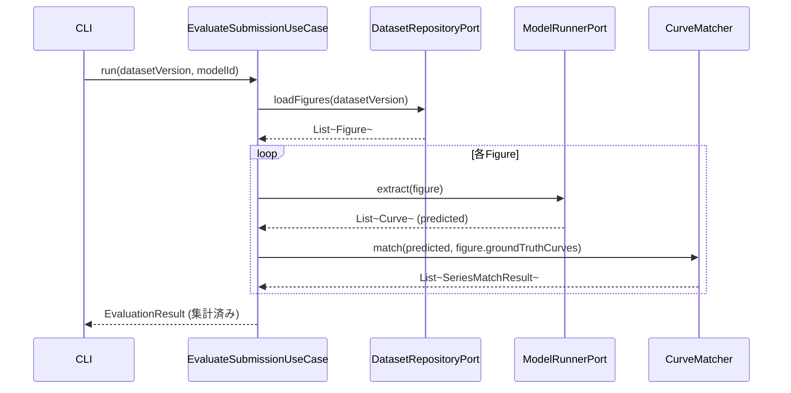

# real-chart-bench ベンチマーク設計書

- Status: **Approved** (2026-08-15、司令塔レビュー合格。PR #1マージ済み)
- Author: worker (Claude, herdr経由)
- Last updated: 2026-08-15
- 実装: Phase 0/1/2完了。Phase 3(データセットv0構築)は熱電材料コーパス全量(9,484論文)の本収集が完了(§7.13): REDISTRIBUTABLE 603論文、ground truth 10,057曲線(100%確保)、画像ペア179論文。パネル分割器(§7.12)を実データ2,458枚で精度評価済み(§7.14、クラッシュ修正・誤検出フィルタ追加)。Tier2画像はHugging Face Hub公開予定(承認待ち、変換スクリプト準備済み)。deep-digitizer連携はローカルパス参照で確定。次は自動ペアリングの技術調査。実装順は §7.7 参照。

## 0. スコープと非スコープ

**やること**: オープンアクセス論文の実験グラフ(主に折れ線・散布図)から、既存モデル/LLMがどれだけ正確に元データ(XY数値列)を再構成できるかを測るベンチマークを構築する。

**やらないこと(v0時点)**:
- 棒グラフ・円グラフ・ヒートマップ等の非XY系グラフ(将来拡張候補)
- チャートQA(自然言語質問応答)。本プロジェクトは値の再構成精度そのものを測る。
- Starrydataのデータそのものの再配布・改変(ライセンス確認が取れるまでは参照・ペアリングのみ)

**初期ドメイン**: README記載の通り、Starrydataが最も厚くカバーする**熱電材料(thermoelectric materials)分野**をv0のシードドメインとする。

---

## 1. データ収集パイプライン設計

### 1.1 収集ソース候補の比較

| ソース | 役割 | 論文メタデータ | ライセンス情報 | 図画像取得 | 備考 |
|---|---|---|---|---|---|
| **OpenAlex** | 一次索引 | ◎ (DOI, OA状態, license) | ◎ `primary_location.license`, `open_access.oa_status` | △ (PDF/HTML URLのみ、図は自前抽出) | 無料・APIキー不要・レート寛容。Crossrefを内包し検索性が高い |
| **Crossref** | ライセンス補完 | ○ | ○ `license.URL` (works API) | × | OpenAlexが拾えないライセンスURLの裏取りに使う |
| **PMC OA Subset** | 図の直接取得 | ○ | ◎ (Commercial/Non-Commercial/Otherの3区分が明示) | ◎ (Bulk/FTP/BioC APIでfigure画像個別取得可) | 生物医学寄り。熱電材料分野の論文は少ない可能性 → 主にパイプライン検証用 |
| **Starrydata (CSV一括DL)** | 起点候補・ground truth | ○ (paper_id, DOI) | × (別途論文側で要確認) | × (画像は持たない。論文DOIのみ) | §2で詳述。**現在API停止、CSV配布のみ稼働** |
| **出版社別OAリポジトリ (arXiv, J-STAGE等)** | 補完 | △ | △ 個別確認要 | ○ | 熱電材料は物理・材料科学誌が多く、出版社OAが主戦場になる見込み |

**方針**: **OpenAlexを一次索引**として使い、`is_oa:true` かつ `primary_location.license` がCC-BY系のレコードを起点候補集合とする。Starrydataの論文DOIリストと**積集合**を取ることで「ground truthあり × 再配布可能」な論文だけに絞り込む(§2.3)。図画像自体はOpenAlexのlanding page / PDF URLから論文側でダウンロードし、パイプライン内でページ抽出する(PMCはBioC等で直接切り出せる場合に優先利用)。

### 1.2 パイプライン全体フロー

```mermaid
flowchart TD
    A[Starrydata CSV一括DL] -->|paper_id, DOI, curve/sample data| B[候補論文DOIリスト]
    B --> C[OpenAlex Works API<br/>DOI逆引き]
    C --> D{is_oa == true?}
    D -- No --> X1[除外: closed access]
    D -- Yes --> E{license が<br/>再配布許容リストに一致?}
    E -- No/不明 --> X2[除外 or 要人手確認キューへ]
    E -- Yes --> F[論文PDF/HTML取得]
    F --> G[図表抽出<br/>PDF figure extraction]
    G --> H{図がXY系<br/>折れ線/散布図か?}
    H -- No --> X3[除外: 対象外グラフ種]
    H -- Yes --> I[Starrydata curveデータと<br/>paper_id/figure番号で紐付け]
    I --> J{ペアリング成立<br/>かつ品質検証OK?}
    J -- No --> X4[保留キュー: 人手レビュー]
    J -- Yes --> K[データセットレコード確定<br/>image + ground truth XY + license metadata]
    K --> L[(dataset manifest<br/>JSON/Parquet)]

    style X1 fill:#4a1f1f,stroke:#a33
    style X2 fill:#4a1f1f,stroke:#a33
    style X3 fill:#4a1f1f,stroke:#a33
    style X4 fill:#4a2f1f,stroke:#a73
    style L fill:#1f3a1f,stroke:#3a7
```



### 1.3 ライセンス判定フィルタリング設計

**原則**: 「再配布可能」の判定は保守的に行う。不明・グレーは自動採用せず保留キューに送る。

**再配布許容ライセンス許可リスト(初期案)**:
- `CC-BY-4.0` / `CC-BY-3.0` — 許可(改変・商用含め再配布可、表示義務あり)
- `CC0` / `Public Domain` — 許可
- `CC-BY-SA` — 許可(同一ライセンス継承の条件を manifest に記録)
- `CC-BY-NC*`, `CC-BY-ND*` — **原則除外**(NDは図の切り出し=改変にあたる可能性、NCはベンチマーク配布が非商用か判断つかないため司令塔確認)
- 出版社独自ライセンス("publisher-specific")・ライセンス欄が空 — **自動除外 → 人手確認キュー**

**判定ロジック(擬似コード、実装はしない)**:
```
function classify_license(openalex_license_field, crossref_license_url):
    normalized = normalize(openalex_license_field)
    if normalized in ALLOWLIST:
        return REDISTRIBUTABLE
    if normalized is null:
        # Crossrefのlicense.URLで裏取りを試みる
        fallback = normalize(fetch_crossref_license(doi))
        if fallback in ALLOWLIST:
            return REDISTRIBUTABLE
        return NEEDS_REVIEW
    return EXCLUDED
```

各レコードには `license_source`(openalex/crossref/manual)、`license_checked_at`、`license_evidence_url` を必ず保存し、後日の監査・司令塔レビューに耐える形にする。**疑わしいものは司令塔に確認**(CLAUDE.md方針通り)。

### 1.4 収集メタデータスキーマ(案)

```
PaperRecord:
  paper_id, doi, title, venue, published_date
  openalex_id, is_oa, license, license_status (REDISTRIBUTABLE/NEEDS_REVIEW/EXCLUDED)
  starrydata_paper_id (nullable)

FigureRecord:
  figure_id, paper_id, figure_number, image_uri, chart_type (line/scatter/mixed/other)
  extraction_source (pdf-embedded / bulk-image / manual-crop)
  split (public / held_out)   # §7.5: 外部提出受付(v2以降)に備え、v0から確保する

GroundTruthCurve:
  curve_id, figure_id, starrydata_curve_id
  x_values[], y_values[], x_unit, y_unit, x_scale (linear/log), series_label
  digitization_method (starrydata_manual)
  quality_flags[]
  alternates[]   # §7.3: 旧デジタイズ版を保持(代表値は最新版、旧版はここに退避)
  license = "CC BY 4.0", license_source = "manual (NIMS MDR)"   # §7.1で確定。図画像の license_status(PaperRecord)とは別軸
```

---

## 2. Ground Truth設計

### 2.1 Starrydataの実態調査まとめ

- Starrydata2は無機機能性材料(熱電・磁性材料が中心)の論文図から**人手デジタイズ**されたXYカーブを集めたオープンデータベース。194,000+曲線、82,000+サンプル、13,000+論文をカバー(2024年時点公開情報)。
- データモデルは概ね `paper → figure → sample → curve` の階層。論文単位のDOIと、図番号、サンプル組成、曲線のXY点列が紐づく。
- API(`/api/paper/{id}`, `/api/figure/{id}`, `/api/sample/{id}` 等)がドキュメント上は存在するが、**現在稼働停止中**であることをユーザーから確認済み。
- 一方、**データセット全体がCSVで一括ダウンロード可能**(Figshareの "Starrydata datasets" プロジェクト等で配布)。

### 2.2 設計への反映(重要な方針転換)

上記を踏まえ、ground truth取得はライブAPI依存をやめ、**CSV一括ダウンロード + オフラインJOIN**を正とする:

1. Starrydata配布CSV(paper/figure/sample/curveに相当するテーブル群)をダウンロードし、リポジトリ外のデータストア(§6のデータ管理方針で規定)に保管。
2. CSVの `paper_id` / `DOI` 列を軸に、§1のOpenAlexライセンス判定パイプラインへ渡す候補DOIリストを生成。
3. 図番号・カーブ系列ラベルでの論文内ペアリングは、CSVに含まれる `figure_id` / `figure_number` 相当列(実データを取得次第、列名を確定してスキーマ§1.4に反映)を使う。
4. APIが将来復旧した場合は差分更新・個別検証用の補助手段として使う設計にしておく(CSVを正、APIを補助という優先順位は崩さない)。

> **RESOLVED (2026-08-15)**: Starrydataデータのライセンスは **CC BY 4.0** で正式確定(NIMS MDR公式ページで確認。出典: https://mdr.nims.go.jp/datasets/be1aaf76-761d-4b73-8ba4-f958348efade 、推奨引用も同ページに記載)。詳細は§7.1参照。デジタイズ済みXY値は**帰属表示付きで再配布可能**であり、§7.1で決めた「非公開参照データ」フォールバックは不要になった。ただし**論文図画像**のライセンスはStarrydataのライセンスとは独立に、論文ごとに§1.3の判定が必要な点は変更なし。

### 2.3 ペアリング方式

`(Starrydata paper_id/DOI, figure_number)` をキーに、§1パイプラインで収集した `FigureRecord` と `GroundTruthCurve` 群を結合する。1論文内に複数図・1図内に複数曲線があるため、キーは `(paper_id, figure_number, curve_index)` の複合キーとする。

ペアリング失敗パターン(保留キューへ):
- Starrydata側の図番号表記ゆれ(例: "Fig. 3(a)" vs "Figure 3a")
- 論文改訂版・プレプリント版とジャーナル版でDOIが異なるケース
- 1図に複数パネル(サブフィギュア)があり、どのパネルの曲線か特定できないケース

### 2.4 品質検証方法

- **軸レンジ整合性チェック**: デジタイズ点のx/y値が、対応する図の軸ラベル範囲(OCRまたは人手で確認した範囲)に収まっているか。
- **点数の妥当性**: 曲線あたりの点数が極端に少ない(3点未満など)場合はサンプリングとして粗すぎる可能性 → 品質フラグを立てる(除外はしない。メトリクス側で重み付けする余地を残す)。
- **重複検出**: 同一論文・同一図に対し複数のデジタイズが存在する場合(Starrydataはクラウドソース型のため起こりうる)、代表値の選定ルールが必要 → **司令塔確認事項**(平均を取るか、最新デジタイズを正とするか等)。
- **サンプリング監査**: v0データセット確定時、ランダムサンプル(例: 30件)を人手で図とground truthを目視突合し、誤ペアリング率を計測してmanifestに記録する。

---

## 3. 評価メトリクス設計

### 3.1 先行研究の調査と比較表

| 手法/ベンチマーク | 対象タスク | メトリクスの考え方 | 系列間対応付け | 弱点 |
|---|---|---|---|---|
| **ChartOCR** | 折れ線データ抽出 | GT各点のy値との正規化差分を平均(連続値ベース) | 曖昧(単一系列前提が多い) | 2%閾値のような硬い足切りがなく外れ値に弱い場合がある |
| **FigureSeer / Linear Programming手法** | 折れ線データ抽出 | 点ごとの差分を**誤差閾値2%で二値化**し正解率を算出 | 単純割当 | 閾値が硬く、僅かな誤差でも0/1化されスコアの解像度が低い |
| **LineFormer (ICDAR2023)** | 折れ線データ抽出(実写含む) | ChartOCR方式(正規化y差分の平均)を採用。複数系列は**予測×GTの全ペアで類似度行列を作り二部マッチング(匈牙利法)で最適割当** | ◎ 二部マッチングで解決 | x軸が非等間隔・非数値(カテゴリ軸)の場合の扱いは別途定義が必要 |
| **LineEX (WACV2023)** | 折れ線データ抽出 | 検出タスクは mPA(mean pixel accuracy的指標)、系列復元は NRMSE(正規化RMSE)で評価 | あり(詳細は論文要確認) | 合成データ430K中心で学習・評価されており実写グラフでの汎化未検証 |
| **CHART-Infographics (ICDAR Task 6a/6b)** | 6a: 要素検出・分類 / 6b: データ抽出 | 6bは「系列名+(x,y)点列の集合」としてGTと予測を比較する**Data Extraction Score**を定義。6aは**Visual Element Detection Score**(IoUベース) | 系列名文字列マッチ + 二部マッチング | x値が文字列(カテゴリ)/数値の両方に対応する必要があり実装が複雑 |
| **ChartQA** | チャートQA(値そのものの抽出ではなく質問応答) | **Relaxed Accuracy**: 数値は5%許容誤差で正解扱い、非数値は完全一致 | N/A(QA形式) | 曲線全体の形状再現度は測れない。単一値の正確性のみ |

### 3.2 推薦メトリクス(v0)

LineFormer/ChartOCR系の「正規化y差分 + 二部マッチング」路線をベースに採用し、real-chart-bench特有の課題(対数軸、非等間隔サンプリング)に対応する拡張を加える。

**採用理由**: (a) 折れ線が主対象という要件に直接合致、(b) 複数系列への対応が二部マッチングで確立済み、(c) 連続値ベースで閾値二値化よりスコアの解像度が高く、モデル間の僅差を比較できる、(d) 先行研究との数値比較可能性を確保できる(LineFormer論文の土俵に乗れる)。

**推薦メトリクス構成(ドメイン層で定義するインターフェースの仕様として)**:

1. **曲線間距離**: 予測曲線を GT の各x座標に線形補間し、正規化誤差 `|y_pred - y_gt| / (y_max - y_min)` を算出。**対数軸の場合はlog空間で誤差計算**(線形空間での絶対誤差は対数軸の意味を壊すため必須の分岐)。
2. **系列内スコア集約**: 点ごと誤差の平均(MAE的)に加え、**Chamfer距離的な曲線類似度**(点集合対点集合の最近傍距離の双方向平均)を補助指標として併記。単純y差分は「予測側がx範囲の一部しかカバーしていない」ケースを過小評価しがちなため、カバレッジ率(GTのx範囲に対する予測x範囲の割合)を別軸で必ずレポートする。
3. **系列間対応付け**: 予測系列数とGT系列数が異なるケースを考慮し、コスト行列(系列間の曲線距離)に対しハンガリアン法で最適割当。未割当のGT系列は「検出漏れ」、未割当の予測系列は「誤検出」として個別カウントし、最終スコアにペナルティとして反映(完全一致しないと0点になる硬直的な設計を避ける)。
4. **サマリスコア**: 図単位スコア = f(系列マッチ率, 平均曲線距離, カバレッジ率) の加重合成。重み付けは司令塔レビューで確定(初期案は等重み)。

**ChartQA型Relaxed Accuracyは補助指標として残す**: 「特定x値でのy値」を問うピンポイント精度チェックとして併記すると、LLM評価時にわかりやすい数値(人間にとって直感的な正答率)を提供できる。ただし主指標にはしない(曲線全体の形状評価にならないため)。

### 3.3 境界ケースのテスト観点(TDD対象)

CLAUDE.md方針「評価メトリクスは境界ケースの単体テストを充実させる」に基づき、実装時に最低限カバーすべきケースを設計時点でリストアップしておく:

- GT曲線が1点のみ(補間不可能なケース)
- 予測系列が0件(全滅ケース)
- 予測系列数 > GT系列数(誤検出過多)
- x軸が対数スケール、値が0または負(log変換不可)
- x値がカテゴリ変数(数値でない)の場合の距離定義
- GTとpredのx範囲が全く重ならない(補間不能・カバレッジ0)
- 予測・GTが完全一致(スコア上限の確認)
- 系列ラベルが空文字列/欠損

---

## 4. 評価対象と実行設計(ハーネスアーキテクチャ)

### 4.1 層構成(クリーンアーキテクチャ)

- **Domain層**(最内側、外部依存ゼロ): `Curve`, `Figure`, `EvaluationResult` 等のエンティティ、`MetricStrategy` インターフェース、`CurveMatcher`(二部マッチングのドメインロジック)。外部ライブラリ・ネットワーク・ファイルI/Oに依存しない。
- **UseCase層**: `EvaluateSubmissionUseCase`, `BuildDatasetManifestUseCase`。Domain層のインターフェースにのみ依存し、具体実装は知らない(DIP)。
- **Adapter層**: `LLMRunnerAdapter`(Claude/GPT/Gemini呼び出し)、`DedicatedModelAdapter`(LineFormer等)、`DatasetRepository`(manifest読み込み)、`LeaderboardExporter`。UseCase層が定義したポートを実装する。
- **Infrastructure層**(最外側): 実際のHTTPクライアント、ファイルシステム、外部API SDK、CLIエントリポイント。

依存方向は常に **Infrastructure → Adapter → UseCase → Domain** の一方向。Domain層はどの層からもimportされる側であり、何もimportしない。CIで `import-linter`(Python想定)により機械的に強制する(§6)。

### 4.2 クラス図


**ポイント**:
- `MetricStrategy` をインターフェース化することで、§3.2の主指標を差し替え/追加(Chamfer距離版、閾値二値化版など)しても UseCase・CLIは無変更で済む。
- `ModelRunnerPort` により、LLM・専用モデル・既存ツール(WebPlotDigitizer的な半自動ツール含む)を同一インターフェースで評価できる。新規モデル追加はAdapter層に実装クラスを1つ足すだけで、Domain/UseCaseに影響しない(OCP)。
- CLIやHTTP等の入り口は Infrastructure 扱いとし、DIコンテナ的な組み立て(依存性注入の配線)はエントリポイントに集約する。

### 4.3 評価実行フロー(補足)



### 4.4 CLI出力契約(LLMO方針、§7.8で追加確定)

Infrastructure層のCLIエントリポイントは、人間だけでなく他のエージェント/スクリプトからの利用を第一級のユースケースとして扱う:

- 全コマンドが `--format json` を持つ。**デフォルトはJSON**とし、人間向けの `--format text` は明示指定で切り替える(機械可読性を既定の挙動にする)。
- JSON出力はパイプ/リダイレクトでそのままパース可能な単一オブジェクト(1行)とし、人間向け装飾(色・罫線・進捗バー等)はstderrに出すかtext modeに限定する。
- Phase 0で `capabilities` / `version` コマンドに先行実装済み。Phase 1以降の `evaluate` コマンド等もこの契約を継承する。

---

## 5. リーダーボード公開方法(提案)

**現状**: リポジトリはprivate。公開判断は司令塔経由で人間承認が必要(CLAUDE.md)。以下は**承認後を見据えた提案**であり、実行は指示を待つ。

- **v0(内部検証)**: 評価結果をリポジトリ内の `results/*.json` に蓄積し、READMEまたは静的サイト生成前の生データとして管理。
- **v1(公開候補)**: 静的サイトジェネレータ(例: 既存の軽量スタック)でGitHub Pages相当にリーダーボードテーブルを描画。モデル名・スコア内訳(§3.2の各指標)・評価日・データセットバージョンを列に持つ。
- **提出方式**: 当面はメンテナ(司令塔/オーナー)が評価を実行してマージする「クローズド提出」形式。外部からのモデル提出受付(PR経由でAdapterを追加する形)はv2以降の検討事項とし、悪意ある提出(不正スコア狙い)への対策(held-outデータセットの非公開保持等)を別途設計する必要がある。
- **バージョニング**: データセットにバージョンタグ(例: `v0.1`)を付与し、リーダーボードのスコアは常にどのデータセットバージョンに対するものか明示する。データセット更新(図の追加・ライセンス再判定による除外等)がスコアの後方互換性を壊しうるため。

---

## 6. 技術スタック推薦

| 領域 | 推薦 | 理由 |
|---|---|---|
| 言語(コア: Domain/UseCase/Adapter) | **Python** | 対象モデル(LineFormer等の専用モデル、各種LLM SDK)のエコシステムがPython中心。画像処理(PDF図抽出、OCR)・数値計算(NumPy/SciPy、ハンガリアン法は`scipy.optimize.linear_sum_assignment`で標準実装あり)との親和性が高い |
| 依存方向の機械的強制 | **import-linter** | CLAUDE.md指定通り。Domain層が外部/Infrastructure層をimportしていないことをCIで検証する契約(`contracts`)を書く |
| データ収集パイプライン | Python (`requests`/`httpx` + OpenAlex/Crossref APIラッパー) | 特別な理由なし、コア言語と統一しメンテコストを下げる |
| リーダーボードUI(v1) | **TypeScript (静的サイト)** | 評価結果JSONを読み込んで表示するだけの静的フロントは型安全なTSが書きやすく、GitHub Pages等との相性が良い。ここのみTS採用とし、`dependency-cruiser`をこのサブパッケージのCIに組み込む(CLAUDE.mdのTS向け指定に対応) |
| テスト | **pytest**(Python側)、**vitest**(TS側) | 標準的選択。境界ケース単体テスト(§3.3)はpytestの`parametrize`で網羅的に書く想定 |
| データ保管形式 | manifestは**JSON Lines / Parquet**、画像は別ストレージ参照(URIのみmanifestに保持) | リポジトリに大容量画像を直接コミットしない。ライセンス上再配布可能なもののみ実データを含める運用ルールとも整合 |

**ドメイン層カバレッジ目標(提案)**: **95%以上**(行カバレッジ)。Domain層はメトリクス計算・マッチングロジックというベンチマークの信頼性そのものを担う部分であり、境界ケース(§3.3)を含めた厳密なテストが不可欠なため、UseCase/Adapter層(目標70-80%程度を想定)より高い基準を置く。具体的な数値は司令塔確認事項として最終決定を仰ぐ。

---

## 7. 未決事項・リスク — 司令塔レビュー結果(2026-08-15、承認)

> 元の7項目は司令塔レビューで全て回答済み。以下、各項目を **RESOLVED** として決定内容を記録する。

### 7.1 Starrydata利用規約・データライセンス — RESOLVED(確定: CC BY 4.0)

**一次調査結果(2026-08-15、実装と並行してワーカーが実施)**:

| 調査先 | 結果 |
|---|---|
| GitHub `starrydata/starrydata_datasets` | リポジトリ内にLICENSEファイル・READMEでのライセンス明記は確認できず |
| Figshare "Starrydata datasets" プロジェクト | ページ本体が403で直接確認不可(bot拒否と推定) |
| starrydata2.org 全般情報 | 「商用・非商用問わず無償利用可」という二次情報はあったが、ライセンス条文としての確証はなし |

上記の時点では `license_status = NEEDS_REVIEW` とし、確認が取れるまでXY値を「非公開参照データ」として扱うフォールバック方針としていた。

**司令塔による正式確定(2026-08-15)**: Starrydataデータのライセンスは **CC BY 4.0** であることを、NIMS MDR(National Institute for Materials Science, Materials Data Repository)の公式ページで確認済み。

- 出典: https://mdr.nims.go.jp/datasets/be1aaf76-761d-4b73-8ba4-f958348efade
- 同ページに推奨引用(citation)の記載あり
- `license_status = REDISTRIBUTABLE`、`license_source = "manual (NIMS MDR)"`、`license_evidence_url = "https://mdr.nims.go.jp/datasets/be1aaf76-761d-4b73-8ba4-f958348efade"` として `GroundTruthCurve`/データセットmanifestに記録する(§1.4スキーマ・§1.3判定ロジックのCC-BY-4.0許可リストにそのまま合致)。

**結論・影響**:
- ground truth(StarrydataのデジタイズXY値)は**帰属表示付きで再配布可能**。§7.1で予定していた「非公開参照データ」フォールバックは不要になった → Phase 3(データセットv0構築)からXY値を公開データとして扱ってよい。
- CC BY 4.0の帰属表示要件(著作者表示・ライセンス表示・変更有無の明示)をデータセットmanifest・配布物に組み込む(具体的な表示文言はStarrydata推奨citationに準拠)。
- **論文図画像のライセンスは本件と独立**。Starrydataのライセンスは同社が生成したデジタイズ済みXY値に対するものであり、元論文の図そのものの著作権・再配布可否は従来通り§1.3のパイプラインで論文ごとに判定する(変更なし)。

### 7.2 図画像の再配布ライセンス許可リスト — RESOLVED

初期案を承認。確定版:

| ライセンス | 扱い |
|---|---|
| CC-BY / CC0 | 採用 |
| CC-BY-SA | 採用(manifestに `license = "CC-BY-SA"` を明記し、同一ライセンス継承条件を下流に伝播させる) |
| CC-BY-NC*, CC-BY-ND* | 除外 |
| 出版社独自ライセンス・ライセンス欄空 | 人手確認キュー送り(自動除外) |

### 7.3 重複デジタイズの代表値選定ルール — RESOLVED

**「最新デジタイズを正」**とする。旧版は `GroundTruthCurve` の `alternates[]` として保持し、`quality_flags` に `superseded_by_newer_digitization` 等を記録する。平均化は不採用(サンプリング点位置が版ごとに異なり、平均を取ると実在しない点列が生成されるため)。

### 7.4 メトリクス加重合成の重み — RESOLVED

v0は**等重み**で確定(系列マッチ率・平均曲線距離・カバレッジ率)。Phase 2のパイロット収集で得た実データを見て、Phase 3以降に再調整する。

### 7.5 外部提出受付 — RESOLVED

v2以降で方針確定(据え置き)。ただし **held-out(非公開)split の枠は最初から確保する**: `FigureRecord`/データセットmanifestに `split: "public" | "held_out"` フィールドを追加し(§1.4スキーマに反映済み、下記参照)、v0構築時点からpublic/held-outを分けて記録する。

### 7.6 ドメイン層カバレッジ目標 — RESOLVED

**Domain層 95%以上(行カバレッジ)で確定**。UseCase/Adapter層は70-80%を参考値とする(必達目標ではなく目安)。

### 7.7 パイロット先行実装順 — RESOLVED(採用)

```
Phase 0: スキャフォールド + CI + import-linter        ← 完了
Phase 1: Domainメトリクス + マッチングロジックをTDDで実装  ← 完了
Phase 2: 数十論文規模のパイロット収集でパイプライン設計を検証   ← 完了(§7.9)
Phase 3: データセットv0構築(熱電材料ドメイン)              ← 収集パイプライン実装+実データパイロット完了(§7.10-7.11)。
                                                    569論文全量への本収集は司令塔確認事項待ち
```

**Phase 1実装メモ**: `src/real_chart_bench/domain/{curve,metrics,matching,evaluation}.py`。§3.3の境界ケース8項目(GT1点のみ・予測0件・予測過多・log軸で非正値・カテゴリx軸・x範囲重複なし・完全一致・空ラベル)をすべて単体テストで先行して書き(Red)、実装後に全てGreen。ドメイン層カバレッジ100%(CIで`--cov-fail-under=95`を強制、§7.6目標を上回る)。カテゴリx軸(§3.3の5番目)はv0スコープ外として、ドメイン層は数値x限定・呼び出し側でのordinal encodingを前提とする設計判断をテストとして明文化した(`tests/domain/test_categorical_x_axis_scope.py`)。

### 7.8 追加要件: LLMO(LLM-Optimization)方針 — 反映済み

司令塔指示により以下を必須設計ルールとして追加(§4に補記):
- CLIは**必ずJSON出力モード**を持つ(`--format json`)。Phase 0のCLI雛形は `--format json` をデフォルトとし、人間向けの `--format text` を別途提供する形で実装済み。
- READMEに**1文の機械可読な能力記述**(構造化JSON1行)を維持する。

### 7.9 Phase 2パイロット結果(2026-08-15実施)

ThermoelectricMaterials(熱電材料)ドメインの実データで、§1パイプラインの前提を検証した。GitHub `starrydata/starrydata_datasets` のReleases("latest"タグ)から実CSVをダウンロードし、OpenAlex APIに実際に問い合わせた。

**1. Starrydata CSVの実カラム構成(§1.4スキーマのTODOだった箇所を確定)**:

| ファイル | 行数 | 実カラム |
|---|---|---|
| `ThermoelectricMaterials_papers.csv.gz` | 9,481論文 | `SID, DOI, URL, issued, author, title, container_title, container_title_short, volume, issue, page, ISSN, publisher, project_names, created_at` |
| `ThermoelectricMaterials_samples.csv.gz` | 76,427サンプル | `sample_name, sample_id, composition, composition_details, SID, DOI, created_at, updated_at, sample_info` |
| `ThermoelectricMaterials_curves.csv.gz` | 155,759曲線 | `SID, DOI, composition, sample_id, figure_id, figure_name, prop_x, prop_y, unit_x, unit_y, x, y, created_at, updated_at, project_names, comments` |

- `curves.csv`に`DOI`が直接含まれており、`samples.csv`経由の結合は不要(§2.3のペアリングキーを`(SID, figure_id)`ベースに簡略化できる)。
- `x`/`y`列はJSON配列リテラル文字列(例: `"[299.86,324.87,...]"`)。`json.loads`でそのままパース可能。
- ライセンス情報はStarrydata側CSVには一切含まれない(想定通り。OpenAlex/Crossref側で判定する設計の妥当性を再確認)。
- `figure_name`は**表記ゆれが実際に存在する**ことを確認(下記4.)。

**2. ライセンス歩留まり率(500論文ランダムサンプル、OpenAlex一括問い合わせ)**:

| license_status | 件数 | 割合 |
|---|---|---|
| EXCLUDED(closed, is_oa=false) | 393 | 78.6% |
| NEEDS_REVIEW(OA だがCC-BY等の明示ライセンスなし: bronze/green/hybrid/diamond) | 65 | 13.0% |
| REDISTRIBUTABLE(CC-BY) | 30 | 6.0% |
| EXCLUDED(CC-BY-NC/ND等の明示) | 12 | 2.4% |

- 熱電材料コーパス全体(9,481論文)に外挿すると、**約569論文がCC-BY相当**(NEEDS_REVIEWの一部がCrossref裏取りやパブリッシャー個別確認で追加救済される可能性あり)。
- 1論文あたり平均約16.4曲線(155,759 / 9,481)のため、v0データセットの規模感は「500〜600論文 × 十数曲線 ≒ 数千〜1万曲線」程度が現実的な一次見積もり。**Phase 3のデータセット規模計画にこの数字を反映する**。
- 最初に無作為30論文だけを個別問い合わせした一次テストではREDISTRIBUTABLE=0件だった(母集団6%に対しサンプル数不足による当然のばらつき)。**教訓**: ライセンス歩留まり検証は最低でも数百件規模のバッチ問い合わせで行うべきで、少数の無作為抽出は「ゼロ件」という誤った悲観的結論を招きうる。

**3. classify_license のリファインメント(実データ起因)**: §1.3の元の擬似コードは `license_id` のみを見ており、closed-access論文(`is_oa=false`)でライセンス欄が空のケース(実測393/500 = 78.6%)を素通りで NEEDS_REVIEW に送ってしまう欠陥があった。`is_oa=False` を最優先でチェックし即座に EXCLUDED とするよう実装時に修正(`domain/licensing.py`のdocstring・テストに記録)。これにより NEEDS_REVIEW キューが本当にレビュー価値のある13%(65/500)に絞られる。

**4. `figure_name`表記ゆれの実例(§2.3で懸念していた問題の実証)**: CC-BY論文30件・曲線364行から観測した`figure_name`の実値: `"2(a)"`, `"2a"`, `"6c"`, `"Figure 6(a)"`, `"Fig 9(a)"`, `"6(b)"`, `"7_b"`, `"6"`(パネルなし)など60種類以上の表記ゆれを確認。`domain/figure_reference.py`の`normalize_figure_reference()`(パイロットの実測値をテストフィクスチャに使用)で正規化する設計とし、実装済み。

**5. パイプライン設計への影響まとめ**:
- §1.4スキーマの`figure_id`/`figure_number`列名の不確定要素はTODO解消。実際は`figure_id`(Starrydata内部連番)+`figure_name`(人間可読・表記ゆれあり)の2列。
- §2.3ペアリングキーを `(SID, figure_id)` に簡略化(`DOI`はcurves.csvに直接あるため中間結合不要)。
- ライセンス判定は「まず`is_oa`で足切り」の二段階方式に更新(§1.3のロジックを`domain/licensing.py`で確定実装、境界ケースを含めテスト済み)。

**実装**: `domain/licensing.py`(classify_license)、`domain/figure_reference.py`(normalize_figure_reference)、`usecase/license_lookup.py` + `usecase/classify_candidate_papers.py`(ポート+ユースケース)、`adapter/openalex.py`(OpenAlex実装、注入可能なtransportで単体テストはライブ通信なし)。ドメイン層カバレッジ100%維持。

### 7.10 deep-digitizerワーカーの知見統合(PDF取得・図抽出)

司令塔指示により、姉妹プロジェクト**deep-digitizer**(教師データ生成)ワーカーが先行実施したパイロット(`docs/experiments/2026-08-15-pilot-figure-pairing.md`、二重実装回避のため参照のみ・コードは自リポジトリ設計で書き直し)の知見を取り込んだ:

- **PDF取得歩留まりが厳しい**: `is_oa=true`論文でも実際にPDFがダウンロードできるのは約29%(出版社のボット対策・paywallインタースティシャルのため)。取得失敗は `not_a_pdf`(paywall/HTML)・`http_error`(403/404)・`no_pdf_url`・接続エラーの4パターンに分類できる。
- **図抽出は埋め込みラスター画像 + ページ全体レンダリングの併用が必須**: ベクター描画のグラフ(Origin/matplotlib由来)は埋め込み画像として存在せず、ページ全体レンダリングでしか拾えないことを実証。
- **複合図(複数パネル)問題**: Starrydataの`figure_name`はパネル単位("1d"等)だが、PDFから抽出できるのは複合図全体。パネル単位の自動切り出しは両プロジェクトとも未実装・今後の技術課題として共有。
- **候補画像の半数以上が無関係画像**(SEM顕微鏡写真等)。自動フィルタは自動化投資判断(§5.4相当の方針)により現時点では見送り。

これらを反映し、`domain/pdf_signature.py`(`is_pdf_content`によるPDF/HTML判別)、`usecase/pdf_fetch.py` + `adapter/pdf_fetch.py`(失敗タクソノミーを型で表現)、`usecase/figure_extraction.py` + `adapter/figure_extraction.py`(pymupdf、埋め込み画像+ページレンダリングfallback、閾値150×150px/150dpiはdeep-digitizerの実測値を踏襲)を実装。

### 7.11 Phase 3実データ収集パイロット(2026-08-15実施)

自リポジトリの実装(`HttpPdfFetchAdapter`/`PyMuPdfFigureExtractor`/`build_ground_truth_for_paper`、モックなし)を使い、CC-BY確定論文29件に対してエンドツーエンドで実行。詳細は [`docs/experiments/2026-08-15-phase3-collection-pilot.md`](../experiments/2026-08-15-phase3-collection-pilot.md)。

**要点**:
- PDF取得成功率 **37.9%**(deep-digitizerの`is_oa`全般サンプル28.9%より改善。CC-BY限定の効果を確認)
- ground truth(Starrydata XY値)のmanifest化は**PDF取得と独立に100%の歩留まり**で可能(29/29論文、101 FigureRecord、365 GroundTruthCurve)
- **v0規模計画の修正**: §7.9の569論文見積り(ground truthベース)に対し、画像ペア付きで確保できるのは実質PDF取得歩留まり(約35〜40%)を乗じた**200〜230論文相当**という、より保守的な数字に更新。v0は「ground truth manifestは全量」「画像ペア確保済みサブセット」の2階層構成を推奨(司令塔確認事項として次アクションに計上)
- 画像↔`figure_id`の自動ペアリングは依然未解決(deep-digitizerと共通の次期技術課題)

### 7.12 パネル分割器の技術調査(2026-08-16実施、司令塔指示によりRCBがオーナー)

§7.11で残った「複合図(複数パネル)からパネル単位を自動特定できない」課題に対し、司令塔指示
(2026-08-16)により real-chart-bench が実装をオーナーする形で一次調査・実装を行った。
deep-digitizer側の観察(§7.10参照、複合図が頻出しパネル単位切り出しが未実装という所見)は
参考にしたが、**実装はゼロから自リポジトリの設計で書き起こした**(コピペ移植なし)。

**手法**: 学習済み検出モデルは導入せず(自動化投資は歩留まり実測後に判断する既定方針を踏襲)、
科学論文の図はほぼ必ず一様な背景(通常白)の上にパネルが配置されるという前提で、**背景ギャップ
(gutter)検出による罫線なしグリッド分割**を実装。行・列ごとに背景ピクセル比率のプロファイルを取り、
一定幅以上連続して背景比率が閾値を超える帯を「本物のgutter」と判定してグリッドをセグメント化する。

**実装(共有部品として汚さないインターフェース設計)**:
- `domain/panel_layout.py`(`detect_panel_grid`): 2D輝度配列 → `PanelRegion(label, row, col, bbox)`
  のタプル。**real-chart-bench固有の型(Curve/FigureRecord等)に一切依存しない**、numpy配列のみを
  扱う純粋関数。deep-digitizer側がそのまま流用できる想定でこの層を切り出した
- `usecase/panel_splitting.py`(`PanelSplitterPort`/`SplitPanel`): 画像バイト列 in → ラベル付き
  画像バイト列 out のポート定義。呼び出し側はドメイン語彙を一切知らなくてよい
- `adapter/panel_layout.py`(`PyMuPdfPanelSplitter`): pymupdfでバイト列⇔numpy配列の変換とクロップ
  ・再エンコードを実装。ポートの1実装に過ぎず、将来別実装(例: OpenCV版)に差し替え可能

**検証**: 実画像(pymupdfで合成したPNG)によるTDD。2×2グリッド・1×3グリッド・単一パネル
(グリッド未検出時は元画像をそのまま1パネルとして返す、誤クロップしないフォールバック)・
gutter幅不足による誤検出防止・ほぼ空白なセルの除外、をテスト済み。ドメイン層カバレッジ100%維持。

**既知の限界**: 本手法は背景が一様な白であることを前提とする。実データ2,458枚での精度評価
(§7.14)で、ネストされたインセットを含む複合図でのunder-segmentationと、`page_render`
(ページ全体レンダリング)画像への適用が原理的に不向きであることが判明した。

**deep-digitizerとの関係**: 本コンポーネントはdeep-digitizerが将来消費する共有部品という前提で
設計した(ポート/ドメイン層をreal-chart-bench固有の概念から独立させている)。deep-digitizer側への
連携方法(パッケージ公開/コピー/サブモジュール等)は司令塔確認事項とする。

### 7.13 Phase 3本収集完了(2026-08-16実施、司令塔承認)

熱電材料コーパス全量(9,484論文)に対する本収集を実行・完了。詳細は
[`docs/experiments/2026-08-16-v0-full-collection.md`](../experiments/2026-08-16-v0-full-collection.md)。

**結果概要**: REDISTRIBUTABLE論文603件(6.36%、Phase 2推計と一致)。ground truth manifest化は
**全603論文で100%**(2,555 FigureRecord、**10,057 GroundTruthCurve**)。画像付きペアは
179論文(pdf_url保有分の34.0%、全体の29.7% — §7.11の予測200〜230論文にほぼ整合、やや下振れ)。
manifestは`data/manifest/v0/`にコミット済み(CC BY 4.0、メタデータのみ)。画像本体(546MB)は
`data/raw/`にローカル保存のみ(design §6方針通りコミットしない)。

**実行中に発見したバグ**: DOI大文字小文字不一致によるKeyErrorが603件中400件処理後に発生
(パイロット規模では非顕在化、本番規模で初めて表面化)。DOIキーの小文字正規化で修正し、
再開可能性(処理済み分をスキップ)も追加。出典サーバーへの不要な再アクセスを避ける観点からも
再開可能性の実装は必須だった。

これでv0のTier 1(ground truth全量)は確定。Tier 2(画像ペア確保済みサブセット)の
恒久ホスティング先、および画像↔`figure_id`自動ペアリング(§7.10/§7.12)は次アクション。

### 7.14 パネル分割器の精度評価・Tier 2公開準備・deep-digitizer連携方式(2026-08-16、司令塔回答)

司令塔から3件の方針決定:

1. **Tier 2画像のホスティング先はHugging Face Hub(dataset repo)で確定**。ただし
   **アップロードは本リポジトリの公開承認 + HFトークン受領後**。それまでは変換スクリプトの
   準備のみ行う
2. **パネル分割器の精度評価を承認**(実データ2,458枚 + サンプリング目視監査)
3. **deep-digitizerとの連携は当面ローカルパス参照で確定**(同一マシン、読み取り専用共有)。
   パッケージ化は両リポジトリ公開後に再検討

**1. への対応**: `scripts/publish/prepare_hf_dataset.py` を実装。Tier 2論文(179件)を
HF datasets形式の`metadata.jsonl`(paper_id/doi/license/image_files/figures/curves)+
データセットカード(`README.md`、CC BY 4.0のfront-matter)に変換する。画像本体は
アップロード時までコピーせず`data/raw/images/`を参照するのみ(546MBの二重化を避ける)。
アップロード関数は`HF_TOKEN`未設定なら**必ず失敗する**多重ガード付きで実装し、
公開承認前の誤アップロードを構造的に防止。ドライラン実行で179論文・2,458画像への
変換を確認済み(アップロードは未実行)。

**2. への対応**: `scripts/eval/evaluate_panel_splitter.py` で全2,458枚を評価。詳細は
[`docs/experiments/2026-08-16-panel-splitter-eval.md`](../experiments/2026-08-16-panel-splitter-eval.md)。

- **実行1回目でクラッシュ発覚**(957/2,458件、39%): `max_panels`超過時の`IndexError`。
  合成テストでは想定していなかった実データ特有の問題(JPEG圧縮ノイズ等でgutter検出が
  過敏反応)。`max_panels`パラメータ追加で修正(フォールバック化、クラッシュ解消)
- **目視監査で系統的な誤検出パターンを発見**: 軸目盛りストリップ・回転した軸ラベル文字・
  パネルラベルの括弧が、細い帯として別パネルに誤分割される。`min_panel_size_fraction`
  (画像辺の5%未満の帯を除外)を追加して対処。TDDで実データ起因の境界テストを追加
- **修正後、全2,458枚でクラッシュ0件**。multi-panel検出率53.5%(1,315枚)。目視監査した
  8枚中、embedded画像2件は真の2×2グリッドを正確に検出(TP)、2件は正しく非分割(TN)、
  1件はネストインセットによるunder-segmentation(FN)、**1件はpage_render画像への適用
  自体が原理的に不向き**(本文テキストを「パネル」と誤検出)と判明
- **推奨事項**: 実運用のペアリングusecaseでは、パネル分割器は`source=embedded`の画像
  にのみ適用し`page_render`画像には適用しない設計とする(次アクション)

**3. への対応**: 特にコード変更なし。deep-digitizer側ワーカーが
`/Users/t29mato/herd/real-chart-bench`(読み取り専用)を直接参照する運用を前提として、
本ドキュメント(および`domain/panel_layout.py`等のdocstring)がそのまま連携ドキュメントを
兼ねる設計を維持する。

### 7.15 評価ハーネス実装 + ベースライン実走(2026-08-16、司令塔加速指示)

「ベンチマークとして動く」状態まで進める指示に対応。Phase 1の`domain/evaluation.py`
(`evaluate_figure`)をそのまま流用し、design §4.2の`ModelRunnerPort`を実装した。

**v0スコープ決定(実装判断)**: 評価ハーネスは「軸較正(x_range/y_range/x_scale)が
既知である前提で、曲線トレース精度を測る」設計とした(`ExtractionTask`が画像バイト列と
較正情報をセットで渡す)。CHART-Infographics task 6a(要素検出)と6b(データ抽出)の分離
(§3.1)に相当し、軸目盛りOCR(6a相当)は本v0のスコープ外と明示する。

**実装**:
- `domain/pixel_calibration.py`: `PixelCalibration` — ピクセル座標⇔データ座標の変換
  (log軸対応)。pure関数、TDD
- `usecase/model_runner.py`: `ModelRunnerPort`(`extract(task) -> list[Curve]`)、
  `ExtractionTask`
- `usecase/evaluate_dataset.py`: `evaluate_model_on_dataset` — モデル実行結果を
  Phase 1のメトリクスで採点。**1図の抽出失敗が全体を止めない**設計(エラーはスコア0として
  記録し継続)
- `adapter/naive_cv_extractor.py`: **ナイーブCVベースライン**。色相バケットで色付き
  ピクセルをクラスタリングし、列ごとの中央値でピクセル空間の折れ線を復元、
  `PixelCalibration`でデータ空間に変換。**既知の限界(意図的に単純な参照実装)**: 黒/グレー系
  の線は軸・文字と区別できないため抽出不可。ピクセル基準枠は色付きピクセルの外接矩形を代用
  (真の軸検出ではない)
- `usecase/build_leaderboard.py`: `results/*.json`からランキング行を構築する純粋関数

**評価セットの構築で判明した重要な事実**: 「単一figure_idの論文」ヒューリスティックは
ペアリング精度を保証しない。17件の単一figure論文のうち3件を候補画像プールから探索したが、
**2件は画像は見つかったが実データ(prop_x/prop_y/数値範囲)と視覚的内容が一致しなかった**
(誤ったパネル・誤った図を選んでいた)。1件のみ数値検証まで含めて確実に一致
(paper 18759, "Figure 3(a)", Electrical conductivity vs Temperature、4曲線)。
**自動/簡易ヒューリスティックによるペアリングは信頼できないことを再確認**(§7.10/§7.12の
既知の課題と一致)。

**実行結果**(`results/naive-cv-v0.json`、`scripts/eval/run_baselines.py`): 実データ1件
(手動検証済み)+ 合成データ3件(単一線・2系列・黒線log軸)の計4件で実走。

| 評価対象 | summary_score | 備考 |
|---|---|---|
| 実データ(paper 18759, Figure 3a) | 0.778 | match_rate=1.0(4曲線とも検出)、mean_curve_distance=0.48 |
| 合成: 単一線形 | 0.997 | ほぼ完璧(単純なケース) |
| 合成: 2系列線形 | 0.997 | 同上 |
| 合成: 黒線+logスケール | 0.0 | **意図した既知の弱点を実証**(黒線を検出できない) |

平均0.693。ナイーブベースラインは「色付きの単純な線」には機能するが「黒線」「複雑な
マーカー付きプロット」には弱い、という直感的に妥当な結果が実データ・合成データ双方で
再現された。

### 7.16 LineFormer実行可能性の検証(2026-08-16)

事前学習済みLineFormer(mmdetectionベース)およびLineFormer-finetune
(HF: `t29mato/lineformer-battery-finetuned`)の実行を試みたが、**本環境(macOS/Apple
Silicon、CUDA無し、Python 3.14)では実行不能と判断**し、無理に動かすことはしなかった
(司令塔指示「動かなければ制約を報告、無理はしない」に従う)。

**根拠**:
- `mmcv`(mmdetectionの必須依存)はPyPI上で**ソース配布のみ**(`mmcv-2.2.0.tar.gz`、
  プリビルドwheelなし)。OpenMMLab公式のプリビルドwheelはLinux+CUDA向けのみで、
  macOS/CPU版は配布されていない
- ソースビルドを試みたところ、`ModuleNotFoundError: No module named 'pkg_resources'`
  で即座に失敗(Python 3.14 + 最新setuptoolsとの非互換。mmcvのビルドシステムは
  レガシーな`pkg_resources`前提で、近年のPython/setuptoolsでは動作しない)
- 仮にビルドが通ってもCUDA拡張(deformable conv等)を要する可能性が高く、GPU無しの
  macOS環境では実行時にも失敗する見込み

**次アクション(司令塔確認事項)**: 実行するには (a) Linux+CUDA環境(クラウドGPUインスタンス
等)、(b) mmcvが対応する古いPython(3.9〜3.11程度)、のいずれかが必要。クラウドGPU環境の
利用要否・予算については司令塔判断を仰ぎたい。

### 7.17 リーダーボードv0(静的サイト生成)

`scripts/leaderboard/generate.py`: `results/*.json`を読み込み`site/index.html`を生成。
`usecase/build_leaderboard.py`(スコア降順ソート、同点はmodel_id昇順で決定的)をTDD実装。
現時点でnaive-cv-v0の1モデルのみ登録。GitHub Pages公開は司令塔承認後(現状はprivateリポジトリ)。

### 7.18 LLMベースラインの雛形(実装のみ、実行なし)

司令塔指示により、API費用が発生する実行は行わず雛形とコスト見積りのみ用意。

**実装**: `usecase/llm_client.py`(`LlmClientPort`、ベンダーSDKに依存しない抽象化)、
`adapter/llm_model_runner.py`(`LlmModelRunner`)。プロンプトに軸較正情報を埋め込み、
JSON形式(`{"series": [{"label","x","y"}, ...]}`、マークダウンのコードフェンス除去にも対応)
でレスポンスをパースして`Curve`に変換。**構造的な実行防止策**: `LlmClientPort`の実装
(Anthropic/OpenAI/Google SDK呼び出し)は本リポジトリに一切含めていない。テストは全て
fakeクライアントを注入して検証しており、実APIを呼ぶには新たにSDK連携コードを書く必要がある
(HF Hubアップロードの多重ガードと同じ設計思想)。

**コスト見積り(1図あたり、概算)**:

前提: チャート画像 約1000×1000px、プロンプト(較正情報込み)300〜500トークン、
レスポンス(JSON、数曲線分の座標)500〜2,000トークン。画像トークン数は
`(横px×縦px)/750`という公開されている近似式(本ベンチマークの画像はAnthropicの
高解像度上限を大きく下回るため、この式がそのまま適用できる)を用いると
1000×1000px ≈ 1,333トークン。**価格は変動するため、本実行前に必ず最新価格を確認すること**
(以下は2026-08-16時点の参考値)。

| モデル | 入力$/1M | 出力$/1M | 1図あたり概算コスト | 出典 |
|---|---|---|---|---|
| Claude Sonnet 5(`claude-sonnet-5`、導入価格) | $2.00 | $10.00 | 約$0.01〜0.02 | Anthropic公式(claude-apiスキル、2026-08-16時点の導入価格。2026-08-31まで) |
| Claude Haiku 4.5(`claude-haiku-4-5`) | $1.00 | $5.00 | 約$0.005〜0.01 | Anthropic公式(claude-apiスキル) |
| GPT-4o | $2.50 | $10.00 | 約$0.01〜0.02 | Web検索(複数ソース、要最新確認) |
| Gemini 2.5 Flash | $0.15〜0.30 | $1.25〜2.50 | 約$0.003〜0.01 | Web検索(複数ソース、要最新確認。GPT/Geminiの価格は本セッションでは一次情報を精査していない) |

**v0規模での概算総コスト**(参考、実行はしない):
- Tier 2(画像ペア確保済み179論文、フィギュア数は§7.13参照)相当を1モデルで全量評価: 数百〜1,000図規模と見積もると **Sonnet 5で約$8〜20、Haiku 4.5で約$4〜10**
- Tier 1全量(2,555 FigureRecord、画像ペアリング問題が未解決のため現状は実行不可)を仮に評価: **Sonnet 5で約$26〜51、Haiku 4.5で約$13〜26**

**要確認**: GPT/Geminiの価格は本セッションで一次ソース(公式pricing page)を精査できておらず、
複数のサードパーティ情報源の要約に基づく参考値。実行承認時に公式ページで再確認が必要。
実行自体はオーナー承認後に、上記コスト規模を踏まえて着手する。

### 7.19 実画像評価の検証ゲート + LineFormer Colabノートブック(2026-08-16、司令塔回答)

司令塔からの2件の判断を受けた実装。

**背景**: §7.15のベースライン実走で、画像↔ground truthの自動ペアリング未解決問題(§7.10/§7.12)
の回避策として「単一figure_idの論文」ヒューリスティックで3件を手動突合したところ、
数値まで厳密に一致したのは **1/3のみ**だった(paper 47139は印字されている軸レンジと
ground truthの桁が2桁ずれ、paper 5904は候補画像6枚中2枚しか確認できず未解決)。
この結果を受けた司令塔の指示: **「量より信頼性。ベンチマークの信用が資産」**
— 手動突合をその場限りの確認で終わらせず、構造的な検証ゲートに昇格させる。

**設計**: `domain/verified_pairing.py`に`VerifiedPairing`(frozen dataclass:
`paper_id, figure_id, image_path, panel_label, x_range, y_range, status, verified_at,
evidence, x_scale`)と`VerificationStatus`(`VERIFIED`/`REJECTED`)を定義。
REJECTEDエントリは**意図的に削除せず保持**する — 却下理由の監査証跡として残すことで、
将来のワーカーが同じ候補を再調査して誤って採用してしまうことを防ぐ。

- `adapter/verified_pairing_registry.py`: `data/verified_pairs/registry.json`(gitコミット対象、
  `data/manifest/`と同じ「小さいメタデータは追跡する」方針)からI/O経由でロード。
- `usecase/real_image_gate.py`: `select_verified_pairings(registry)`(status=VERIFIEDのみ抽出)、
  `is_verified(registry, *, paper_id, figure_id)`(真偽判定)。
- `scripts/eval/run_baselines.py`をレジストリ駆動にリファクタリング
  (旧`_real_gold_item()`のハードコードされた単一実例を撤廃し、
  `select_verified_pairings()`を通過したエントリだけから`DatasetItem`を構築)。
  リファクタリング後も同一の実データ実例(paper 18759, figure 12217)で
  同一スコア(summary_score=0.7776…)を再現し、等価性を確認済み。

現在のレジストリ内容(3件、すべて`docs/experiments/`に手動突合の詳細記録あり):

| paper_id | figure_id | figure参照 | status | 却下理由/検証根拠 |
|---|---|---|---|---|
| 18759 | 12217 | Figure 3(a) | VERIFIED | 4曲線、x/y値・軸レンジとも印字軸と整合(単位換算後)。1曲線に未解決の外れ値あり(桁が違う)、監査証跡として明記済み |
| 47139 | 48697 | 4b | REJECTED | ground truthの桁が印字y軸(log σ)と約2桁不整合 |
| 5904 | 13761 | 5 | REJECTED(未確定) | 候補画像6枚中2枚のみ確認、いずれも別物理量のチャート。残り4枚は未確認 |

**結果**: real-imageスイートはVERIFIED 1件のみに縮小(旧: 暗黙に信頼されていた1件のまま
数を偽装していなかったが、構造的な保証がなかった)。TDD: `tests/domain/test_verified_pairing.py`
(2)、`tests/usecase/test_real_image_gate.py`(5)、`tests/adapter/test_verified_pairing_registry.py`(5)
= 計12テスト、すべて緑。

**LineFormer Colabノートブック**: ローカル実行(§7.16でmacOS上のmmcv/mmdetectionビルド不可と
結論済み)を諦め、**Google Colab無料枠で完結する自己完結ノートブック**を用意する方針
(実行はオーナーがワンクリック、費用ゼロ)。リーダーボードには
`status: "pending_external_run"`としてLineFormerの行を掲載する(§7.17のスキーマ拡張)。
`notebooks/lineformer_colab.ipynb`として実装済み(§7.21参照)。

### 7.20 リーダーボード「pending external run」ステータス対応

`usecase/build_leaderboard.py`の`LeaderboardRow`に`status`(`"scored"` / `"pending_external_run"`)
と`note`フィールドを追加。pending行は`mean_summary_score=None`で常にscored行より後ろにソートされる
(モデルIDでタイブレーク)。`results/lineformer-pending.json`(`status: "pending_external_run"`のみを
持つ結果ファイル)を追加し、`scripts/leaderboard/generate.py`のHTMLテンプレートに専用の行スタイル
(`tr.pending`、グレーアウト+イタリック)を追加。TDD: `tests/usecase/test_build_leaderboard.py`に
5テスト追加(scored行の互換性、pending行のnote伝播、pending行が常に後ろにソートされること、
複数pending行のモデルID順ソート、pending行にも連番rankが振られること)。

### 7.21 検証済みペアの拡充: 1件 → 10件(2026-08-19、HQ並行タスク指示)

**背景**: deep-digitizer側で「実画像評価が1件しかなくノイズ過大でcheckpoint判定が不能」という
課題が報告され、HQから「検証済みペアを最低10件まで増やす」並行タスクの指示があった
(Colabノートブック実行はオーナー待ちのまま継続)。§7.19の検証ゲート・監査証跡方針をそのまま
踏襲し、`data/verified_pairs/registry.json`に新たな候補を追加investigationした。

**手法**: `data/manifest/v0/{papers,figures,curves}.json`から「1論文=1 figure_id」「1論文=2
figure_id」の低画像枚数(候補が絞り込みやすい)論文を優先度順に抽出し、各候補について
(1) 該当figure_idのground truth数値(x/y範囲・曲線数・series_label)を取得、(2) 論文の抽出済み
画像群を目視で走査して該当チャートを特定、(3) 数値レンジ(単位換算込み)がチャート上の
印字軸レンジ・凡例系列数と一致するかを突合、という§7.19と同じ手続きを繰り返した。

**結果**: 新規9件VERIFIED(既存1件と合わせて計10件)、新規6件REJECTED(既存2件と合わせて計8件)。

新規VERIFIED(paper/figure/根拠概要):
- 16111/15452「4」: ZT vs T、14系列すべて一致
- 17038/20816「4a」: KPM/Two-probe両系列、6点すべて数値完全一致
- 4965/13164「Fig 5」: Seebeck係数vs T(2曲線中1つは空、実質1曲線で検証)
- 47534/49581「1」: STF35/STF50、2系列一致。**既知の制約**: 元図のY軸がlog scaleだが
  `ExtractionTask`はlog-x のみ対応でlog-yは未対応 — ペアリング自体は数値検証済みだが、
  現行ハーネスでのナイーブ線形ピクセル前提ベースラインは正しくスコアできない
  (§7.22で追跡)。
- 17037/20736「6d」: 4パネル図のパネル(d)、n=284点の密な電圧振動波形が一致
- 5166/23909「5a」: 8系列(フォノン熱コンダクタンス)すべて一致
- 47998/50803「3c」: PLNBSCC Dry/Wet airの2系列一致(PBC系列2本は元々digitize対象外)
- 4176/20123, 4176/20124: 同一ページの2パネル図(電気伝導率・Seebeck係数)、各5系列すべて一致。
  **技術的な発見**: この図はベクター描画でPDF埋め込み画像として抽出されず、ページ全体の
  page-render fallbackで捕捉されていた。`PyMuPdfPanelSplitter`の自動パネル分割をページ全体
  画像にそのまま適用すると、本文テキスト段落を「パネル」として誤検出し(意図した2パネルでは
  なく4パネルに分割され、しかもうち1つは図と無関係な本文段落だった)、naive-cvベースラインが
  無言で0点を返す不具合を誘発した。応急対応として該当パネルを手動クロップし
  `data/verified_pairs/crops/4176/`にコミット対象として保存(`data/raw/`はgitignore対象のため、
  再現不可能な手動生成物はここに置く)。`scripts/eval/run_baselines.py`の画像パス解決を、
  `image_path`に`/`を含む場合はリポジトリルート相対パスとして扱うよう拡張(通常の抽出画像は
  従来通り`data/raw/images/{paper_id}/{image_path}`のベア filename)。

新規REJECTED(paper/figure/理由):
- 48052/50906「Fig 4a」: 該当ページの6枚の埋め込み画像すべて確認したが、GTのy範囲
  (302-579 S/cm)がパネル(a)の8系列いずれとも一致せず(桁ではなく系列自体が見当たらない)
- 48080/50979「3a」: 論文本文が明示的に言及する抵抗率グラフが、抽出済み11枚のどれにも
  見当たらず(同ページの別の埋め込み画像がページ閾値を満たしたためpage-render fallbackが
  発火せず、ベクター図が抽出漏れした可能性)
- 17024/18598「6(a)」: 抽出済み15枚がすべて装飾バナーか結晶構造図で、目的のチャートなし
  (48080と同じ抽出漏れパターンの疑い)
- 46256/46343「4a」: 候補画像(時間軸の電気伝導率チャート)との対応関係が数値的に
  クリーンに一致せず、確信を持てないため不確実性を理由にREJECTED
  (「量より信頼性」方針: 曖昧なものは無理に採用しない)
- 43697/39917「8」: 21枚中12枚を確認したが目的の抵抗率チャートが見つからず、
  未確認9枚を残したまま時間の都合で中断(不完全な調査として明示)
- 46123/45876「6」: 画像照合以前に**ground truthデータ自体の品質問題**を発見。
  5曲線すべてのx値が(0.0, 0.0)に潰れており使用不能。これはHQが指示した
  「検証手順(GT品質チェック)」がまさに想定する種類の発見であり、画像は一切確認せずに
  数値異常のみでREJECTED判定できた。

**リーダーボードへの反映**: `scripts/eval/run_baselines.py`をレジストリ駆動のまま
(§7.19のリファクタ済みコード)VERIFIEDかつ評価可能な全件を読み込むよう変更なし(自動反映)。
`results/naive-cv-v0.json`を再実行。空のground truth曲線(paper 4965)でCurveコンストラクタが
例外を出すバグを`run_baselines.py`側で修正(x値が空の行はスキップ)。

**未解決の課題(HQへの申し送り、§7.22/§7.23で対応方針確定)**:
1. `ExtractionTask`にy_scale(log-y)がない — 47534のような対数Y軸チャートを正しく評価できない
2. `PyMuPdfPanelSplitter`はページ全体画像に対して機能しない(本文段落を誤ってパネル扱いする)
   — page-render fallbackで捕捉された複数パネル図全般に影響しうる既知の欠陥
3. ベクター描画チャートがPDF抽出パイプラインから漏れるケースが複数件確認された
   (48080, 17024) — embedded-image閾値とpage-render fallbackの発火条件を要見直し

### 7.22 既知の制約: log-y軸チャートの評価非対応 — HQ判断確定(2026-08-19)

§7.21で発見。`domain/curve.py`の`ScaleType`と`usecase/model_runner.py`の`ExtractionTask`は
`x_scale`のみを持ち、y軸の対数スケールをモデルに伝える手段がない。対数Y軸のchart
(例: paper 47534)はground truthとしては有効(§7.21で数値検証済み)だが、ピクセル空間で
線形補間を行う素朴なモデル(naive-cv baseline等)は原理的に正しくスコアできない。
LLMベースのモデルは画像内の印字軸ラベルを直接読み取れるためこの制約の影響を受けない
可能性が高い。

**HQ判断(2026-08-19)**: 当面log-y図はreal-image評価から除外する運用とし、
線形スケールの検証済みペア10件到達を最優先(deep-digitizerの律速のため)。
y_scale対応はTODO(§7.23)として10件達成後の機能タスクに登録。

**実装**: `domain/verified_pairing.py`の`VerifiedPairing`に`excluded_reason: str | None`
フィールドを追加。`None`=評価スイートに含めてよい通常のペア、非`None`=ペアリング自体は
`status=VERIFIED`のまま正しいが、現行ハーネスでは正しくスコアできないため評価対象から除外
(`REJECTED`とは異なる概念 — ペアの信頼性ではなくハーネスの機能不足が理由)。
`usecase/real_image_gate.py`の`select_verified_pairings()`は`status=VERIFIED`かつ
`excluded_reason is None`のエントリのみを返すよう変更(`is_verified()`は`excluded_reason`に
関わらず`status`のみで判定 — 「検証済みか」と「今スコア可能か」は別の問い)。paper 47534の
レジストリエントリに`excluded_reason`を設定し、real-image評価スイートから除外した。
TDD: 6テスト追加(domain 2、usecase 2、adapter 2)、計199テストすべて緑。

### 7.23 検証済みペア10件到達(線形スケール)+ TODO登録

§7.22の除外運用により、線形スケールの検証済みペアは47534を除いた9件のみとなったため、
追加で1件を検証: **paper 17040 / figure 21020(ref "2a")**、
4系列(側ゲート電圧Vig=0/-0.5/-1.0/-1.5V)、Vbg範囲-60〜60V、抵抗範囲0.26-3.32kΩが
チャートと一致(数値完全一致)。これも§7.21のpaper 4176と同じくpage-render fallbackで
捕捉されたベクター図であり、`PyMuPdfPanelSplitter`のページ全体分割バグを再度踏むため、
同じ手動クロップ運用(`data/verified_pairs/crops/17040/`にコミット)で対応した。

**手動クロップ手順(§7.21のpaper 4176と共通、HQ指示により記録)**:
1. `pymupdf.Pixmap(page_render_path)` でページ全体画像を読み込み、`.width`/`.height`を確認
2. 目的のパネルのおおよそのピクセル矩形を目視で見積もり、`pymupdf.IRect(x0,y0,x1,y1)` +
   `Pixmap(colorspace, rect, alpha).copy(pix, rect)` でクロップ
3. クロップ結果を目視確認し、隣接パネルの数値が写り込んでいないか確認(軸ラベルの文字が
   少し入り込む程度は許容 — naive-cv baselineは色付きピクセルのみ見るため無害)
4. `data/verified_pairs/crops/{paper_id}/` に保存してコミット対象とする(`data/raw/`は
   gitignore対象のため、再現不能な手動生成物はここに置く)
5. レジストリの`image_path`にリポジトリルート相対パス(`/`を含む)を指定、
   `panel_label`は`null`(クロップ済みで単一パネルのため分割不要)
6. evidenceにクロップ元ページのpx寸法・render_dpi・クロップ矩形を明記し、
   将来の再現(PDF再取得+同dpiでの再レンダリング+同矩形クロップ)を可能にする

**結果**: `data/verified_pairs/registry.json`は計19エントリ(VERIFIED 11、うちevaluatable
10件[線形]+1件[47534、excluded_reason設定済み]、REJECTED 8)。
`results/naive-cv-v0.json`再実行: 13図(実画像10[評価可能]+合成3)、
17040-21020のsummary_score=0.887。`site/index.html`再生成、リーダーボードcaveat文言も
「実図1枚」から「検証済みレジストリでゲートされた実図10件」に更新済み。

**TODO登録(post-10件到達の機能タスク、HQ指示により明示的にTODOとして記録)**:
- [x] ~~`ExtractionTask`/`PixelCalibration`にy_scale(log-y)サポートを追加し、
  47534のexcluded_reasonを解除できるようにする~~ → §7.25で実装完了(2026-08-21)
- [x] ~~`PyMuPdfPanelSplitter`をページ全体画像に対応させ、paper 4176・17040の
  手動クロップ運用を自動化に置き換える~~ → §7.24で対応・一部解決(誤検出バグは
  恒久修正、ページ全体の自動分割自体は依然不可能と判明 — 手動クロップ運用は継続)
- [ ] embedded-image抽出閾値とpage-render fallbackの発火条件を見直し、ベクター描画チャートの
  抽出漏れ(48080, 17024, 17049で確認)を減らす(§7.21/§7.27)
- [ ] `figure_extraction.py`がPDFの画像配置変換行列(回転・反転)を適用せず生ピクセルを
  抽出しているため、埋め込み画像が誤った向きで抽出されるケースがある(paper 5904, 83で
  確認、§7.27)。手動補正した画像を`data/verified_pairs/crops/`に保存して当面回避

### 7.24 PanelSplitter恒久修正(2026-08-19、HQ優先タスク1)

**対象のバグ**: §7.21で2回踏んだ「本文段落がパネルとして誤検出される」バグ。
HQ指示「2度同じバグを踏んでいるため。TDDで再現テストを先に書くこと」に従い対応。

**再現テスト(Red)**: `tests/domain/test_panel_layout.py`に、実際の本文段落
(見出し無し、複数行のテキスト)を模した合成キャンバスを追加し、修正前のコードで
実際に失敗することを確認してから着手(`test_text_paragraph_band_is_excluded_...`)。

**恒久修正**: `domain/panel_layout.py`の`detect_panel_grid()`が生成する各候補セルに対し、
`_looks_like_text()`によるテキスト判定を追加。判定根拠は2段階:
1. セル内の行ごとの背景率プロファイルから「content行の連続run」を数える
   (本文テキストは行間ギャップで区切られた多数の短いrunになる)
2. **run数だけでは不十分**と判明(下記の回帰参照)。runの**高さの均一性**
   (変動係数 = 標準偏差/平均、`max_run_height_cv`、デフォルト0.3)も同時に要求。
   実測値: 本物のテキスト行 = run高さ`[15, 20, 20, 16]`(CV≈0.12、非常に均一) vs
   busy chartのrun高さ`[3, 71, 87, 121, 10]`(CV≈0.79、バラバラ)。

**開発中に発見した回帰(重要)**: run数のみの初版実装を実データ(全VERIFIEDペア画像)に
対して検証したところ、paper 17037/figure 20736のパネル(a)(6系列の折れ線グラフ)が
誤って「テキストらしい」と判定され除外される回帰を発見。busy chartは複数系列が
重なることで本文テキストと同程度の行run数を作り得るため、run数単体は不十分な判別式
だった。CV(runの高さのばらつき)を追加要件にすることで、実データ回帰を解消しつつ
元のバグ(§7.21のpaper 4176)も引き続き修正できることを確認。この回帰と修正過程は
`tests/domain/test_panel_layout.py`の
`test_busy_multi_series_chart_panel_is_not_misclassified_as_text`に恒久的な
リグレッションガードとして残した(実測run高さ`[3, 71, 87, 121, 10]`をそのまま再現)。

**検証範囲**: 修正後、既存VERIFIED 10件が参照する実画像すべて
(18759, 17037, 5166, 47998の埋め込み画像 — panel_labelを使う4件)に対して
`scripts/eval/run_baselines.py`を再実行し、`results/naive-cv-v0.json`の
`mean_summary_score`が**実行時刻以外一切変化しない**(0.664824135478101のまま)ことを
確認 — 既存の正しい動作への回帰がないことの直接的な証拠とした。

**分かったこと・スコープの限界(正直に記録)**: この修正はTHE BUG
(本文段落がパネルとして誤検出される)を確実に直すが、**ページ全体レンダー画像から
目的の図パネルを自動抽出できるようにするものではない**。修正後に paper 4176・17040の
ページ全体画像へ実際に適用したところ、誤検出対象が「段落」から「別の要素(表の断片)」に
変わっただけで、依然として目的の2パネル図を正しく自動抽出できなかった
(2カラムの学術論文レイアウトは、図が左カラムのみに存在し右カラムには無関係な
本文/表が続く、という非矩形構造のため、行×列のCartesian gridを仮定する現アルゴリズムの
根本的な限界)。これは今回のスコープを超える、本格的なPDFレイアウト解析
(「Figure N」キャプションの位置からPDF構造上の図領域を特定する等)が必要な、
別の大きな課題と判断し、**手動クロップ運用(§7.21/§7.23)は継続**する。
paper 4176・17040のレジストリエントリは変更していない(すでに手動クロップ画像を
参照しており、影響なし)。

**テスト**: `tests/domain/test_panel_layout.py`に4テスト追加
(再現テスト、無効化エスケープハッチ、busy-chart回帰ガード、既存11テストは維持) —
domain層カバレッジ100%を維持。計202テストすべて緑。

### 7.25 y_scale(log-y)対応 — 設計 + 実装完了(2026-08-19設計 / 2026-08-21実装、HQ優先タスク2)

**背景**: §7.22で発見・HQ判断確定した既知の制約。paper 47534の図はY軸がlog scaleで
描画されており、ground truthとしては数値検証済み(§7.21)だが、現行の
`ExtractionTask`/`PixelCalibration`はlog-xのみモデル化しておりlog-yを表現できないため、
ピクセル位置ベースで動作するモデル(naive-cv baseline等)がこの図を正しく評価できない。
HQ指示により`excluded_reason`で暫定除外中(§7.22)。

**実装状況(2026-08-21追記)**: HQ指示「設計に沿って実装」に従い、下記の設計通りに実装済み。

**スコープの確認: y_scaleが実際に必要な層はどこか**

既存コードを調査した結果、log-x対応は2箇所に及んでいる一方(下表)、log-yはそのうち
**1箇所のみ**で足りることが分かった:

| 層 | log-xの現状 | log-yに同様の対応が必要か |
|---|---|---|
| `domain/pixel_calibration.py` `PixelCalibration.to_data()` | `x_scale`でピクセル→データ変換をlog補間 | **必要**。ピクセル位置ベースのモデルがY軸方向も同様に誤変換するため |
| `usecase/model_runner.py` `ExtractionTask` | `x_scale`をモデルに渡す較正情報として保持 | **必要**(上記のための入力) |
| `domain/metrics.py` `NormalizedYDistanceMetric._to_x_space()` | GT/予測曲線のx値をlog空間に変換してから補間(np.interpの整合性のため) | **不要**。この関数はcurveの**生データ値**(x_values/y_values)を直接比較する際の話であり、元のチャートがどう"見た目描画"されていたか(log-y軸か否か)とは無関係。Y誤差はGT y-rangeで線形正規化するだけで、対数軸で描かれていたかどうかに依存しない計算になっている |
| `domain/curve.py` `Curve.x_scale` | GT curve自体のx軸解釈(メトリクス層が参照) | **不要**。上記と同じ理由でCurveにy_scaleを追加する必要はない |

これは非対称に見えるが原理的に正しい: **x_scaleは「メトリクスが2つの曲線をどう比較するか」
にも影響する**(log-x軸のデータは対数空間で補間しないと誤った距離になる)一方、
**y_scaleは「モデルがチャート画像から正しい生データ値を読み取れるか」という抽出時の
問題にすぎず**、一度正しいdata-space値が得られてしまえば、比較・スコアリングの計算自体は
元のチャートが線形軸で描かれていたかlog軸で描かれていたかに依存しない。つまりy_scaleは
`ExtractionTask`/`PixelCalibration`という「抽出インターフェース」層だけの関心事であり、
`domain/curve.py`/`domain/metrics.py`という「評価」層には影響しない。

**具体的な変更(実装時のタスク一覧)**:

1. `usecase/model_runner.py`: `ExtractionTask`に`y_scale: ScaleType = ScaleType.LINEAR`を追加
2. `domain/pixel_calibration.py`: `PixelCalibration`に`y_scale: ScaleType = ScaleType.LINEAR`を
   追加。`to_data()`のy計算を、既存のx計算と対称的にlog対応:
   ```python
   y_lo, y_hi = self.y_range
   if self.y_scale is ScaleType.LOG:
       if y_lo <= 0 or y_hi <= 0:
           raise ValueError("log y_scale requires a strictly positive y_range")
       log_y = math.log10(y_lo) + y_frac * (math.log10(y_hi) - math.log10(y_lo))
       y = 10**log_y
   else:
       y = y_lo + y_frac * (y_hi - y_lo)
   ```
3. `adapter/naive_cv_extractor.py`: `PixelCalibration`構築時に`y_scale=task.y_scale`を渡す
   (現在`x_scale=task.x_scale`のみ渡している箇所に1行追加)
4. `domain/verified_pairing.py`: `VerifiedPairing`に`y_scale: ScaleType = ScaleType.LINEAR`を追加
   (既存`x_scale`と対称)
5. `adapter/verified_pairing_registry.py`: `y_scale`のJSON parse追加(既存`x_scale`と対称)
6. `scripts/eval/run_baselines.py`: `ExtractionTask`構築時に`y_scale=pairing.y_scale`を渡す
7. `notebooks/lineformer_colab.ipynb`の`LineFormerModelRunner.extract()`(既に`task.x_scale`で
   log-x分岐している箇所)にy軸の対称的な分岐を追加 — Colab実行はオーナー待ちのため
   このノートブック更新は破壊的ではない(まだ実行されていない)
8. `data/verified_pairs/registry.json`のpaper 47534エントリ: `excluded_reason`を解除し、
   `y_scale: "log"`を設定。`select_verified_pairings()`が自動的にこのペアを
   real-image評価スイートに含めるようになる(コード変更不要、レジストリ更新のみ)

**TDD計画(実装時)**:
- `PixelCalibration.to_data()`: y_scale=LOGでの正しいlog-yピクセル→データ変換
  (既存の log-x テストと対称なケースを追加)
- `PixelCalibration.to_data()`: y_scale=LOGかつ`y_range`が非正の場合に`ValueError`
  (既存の log-x エラーケーステストと対称)
- `ExtractionTask`/`PixelCalibration`のデフォルト`y_scale=LINEAR`が後方互換であること
  (既存の全テスト・全VERIFIEDペアがy_scale省略時と同じ結果になることを確認)
- `NaiveCvModelRunner`のend-to-endテストに、色付き線・log-y軸の合成チャートを追加
  (既存の`synthetic-log-black-line`はx軸のみ・黒線のためnaive-cvが原理的に検出不能な
  ケース — log-y版は色付き線にして、ピクセル較正の正しさ自体を検証できるようにする)
- `verified_pairing_registry`のy_scale JSON parseテスト(既存x_scaleテストと対称)

**実装後の期待効果**: paper 47534がreal-image評価スイートに復帰し、線形スケール10件+
log-y 1件で計11件のVERIFIEDペアが評価可能になる。将来log-y図の候補が増えた場合も
同じ仕組みでそのまま対応できる。

**実装結果(2026-08-21)**: 上記タスク一覧・TDD計画通りに実装(`PixelCalibration`の
x/y計算は共通ヘルパー`_scale_frac()`に統合し、コード重複を避けた点のみ設計からの
差分)。`data/verified_pairs/registry.json`のpaper 47534を更新:
`excluded_reason`を削除し`y_scale: "log"`を設定(y_rangeの値自体は変更不要 —
元々printed log軸の全域[10.0, 1000.0] ohm^-1*m^-1を表しており、linear計算前提から
log計算前提に解釈が変わるだけで正しく機能する)。

`select_verified_pairings()`は自動的にこのペアを含むようになり、real-image評価
スイートは11件(線形10件+log-y1件)に拡大。`scripts/eval/run_baselines.py`を再実行し
`results/naive-cv-v0.json`を更新(14図: 実画像11+合成3、mean_summary_score=0.617)。

**分かったこと(正直な記録)**: paper 47534のnaive-cvスコアは実装後も0.0のまま —
ただしこれはy_scale実装のバグではなく、**別の既知の制約**(白抜きマーカーが黒背景に
描かれており無彩色のため、naive-cvの色相ベース検出が原理的に検出不能。17037パネル(d)
や`synthetic-log-black-line`と同じ「naive-cvは黒/白/灰色系列を見れない」制約)による。
`PixelCalibration.to_data()`のlog-y変換自体の正しさは、色付き線を使った新規end-to-end
テスト(`test_respects_log_y_scale`)で別途検証済み(この合成テストはy>0であることと
方向性を確認しており、naive-cvが実際にトレースできることを示している)。

`notebooks/lineformer_colab.ipynb`の`LineFormerModelRunner.extract()`にも対称的な
log-y分岐を追加(x/y共通の`_scale_frac`静的メソッドとして実装、
`domain/pixel_calibration.py`のロジックと平仄を合わせた) — このノートブックは
まだColab上で未実行(#31、オーナー実行待ち)。

テスト: 新規9件(domain: pixel_calibration 4件・verified_pairing 2件、
adapter: naive_cv_extractor 1件・verified_pairing_registry 2件)追加、計211テスト
すべて緑。domain層カバレッジ100%維持。

### 7.26 Colabノートブックのeditable installバグ修正(2026-08-19、HQ優先割込み)

**症状**: オーナーが`notebooks/lineformer_colab.ipynb`のCell 2を実行したところ、
`%pip install -q -e .`(editable install)自体は成功したにもかかわらず、直後の
`import real_chart_bench`が`ModuleNotFoundError`で失敗(#31、2回目の再現)。

**原因**: editable install(PEP 660)はsrcレイアウトのプロジェクトを`.pth`ファイル
経由で`src/`にマッピングする実装が一般的だが、Pythonの`site`モジュールは`.pth`
ファイルを**インタプリタ起動時にしか処理しない**。ColabやJupyterのカーネルは
1つの長命インタプリタなので、`%pip install -e .`とその後の`import`が**同一
プロセス内**で実行される — つまりインタプリタを再起動しない限り、新しく書かれた
`.pth`ファイルはsys.pathに反映されない。`importlib.invalidate_caches()`は既存の
sys.pathディレクトリ内のモジュールキャッシュを無効化するだけで、新しいディレクトリを
sys.pathに追加する処理ではないため、この問題には効かない。

**疑似再現テスト(push前に実施、HQ指示通り)**: クリーンな使い捨てvenv
(`python3 -m venv`で新規作成、プロジェクトの`.venv`とは別)を用意し、単一のPython
プロセス内で`subprocess`経由の`pip install -e .`実行 → 直後の`import real_chart_bench`
という、Colabカーネルの制約を忠実に再現するスクリプトを書いて実行:
- **修正前**(editable): `pip install -e .`成功 → 同一プロセスでの`import`が
  `ModuleNotFoundError`で**確かに失敗**(オーナー報告のバグを再現)
- **修正後**(regular): `pip install .`(editable無し)成功 → 同一プロセスでの
  `import`が**成功**(`site-packages`に直接コピーされるため、インタプリタ再起動不要)
- Cell 2の実際の2行(`%pip install -q .` → `%pip install -q pymupdf requests`)と
  後続セルが使う`load_registry`/`select_verified_pairings`のimportまで含めて
  同一プロセス内で再現し、成功することを確認

**修正**: `notebooks/lineformer_colab.ipynb` Cell 2を`%pip install -q -e .`から
`%pip install -q .`(非editable)に変更。このノートブックは実行のたびにgit clone
し直す使い捨て環境のため、editableのライブリロード機能自体が不要 — 非editableへの
変更にデメリットはない。Cell 0の手順説明・Cell 1の見出しも整合するよう更新。

**HQ指示(2)への対応**: sys.path明示追加のフォールバックは、今回の再現テストで
非editable installだけで確実に直ることを確認できたため、追加の複雑さを持ち込まない
判断とした(必要になった場合の代替案として本節に記録: `sys.path.insert(0, "src")`
を明示追加する手段もあるが、シンプルな非editable installで十分)。

**未実行**: このノートブック自体はまだColab上で実行されていない(オーナーの3回目の
実行待ち)。ローカルでの疑似再現テストは「editable installが同一プロセスで失敗する」
「非editable installなら成功する」というPythonのimportメカニズムの一般的性質を
検証したものであり、Colab固有のmmcv/mmdetectionインストール等(§7.16参照)の
成否までは検証していない。

### 7.27 検証済みペア20件到達(2026-08-21、HQ task 3)

**背景**: deep-digitizer側でreal-image評価分散(±0.375)が大きすぎてモデル構成の
優劣を判定できない状態が続いていたため、HQ判断により検証済みペアを10件→20件に拡充。
「量より信頼性」を維持しつつ「多様性」(描画スタイル・線種・マーカー・軸スケール)も
意識するようHQから追加指針あり。

**新規VERIFIED10件**(§7.21時点の10件+この節の10件=計20件):

| paper/figure | 内容 | 系列数 | 特記事項 |
|---|---|---|---|
| 5904/13761 | Seebeck係数 vs T | 2 | **PDF画像抽出の新規既知バグ発見**: 埋め込み画像が回転・反転した状態で抽出されていた(numpy transpose+flip補正で復元)。既存の4176/17040とは異なる原因(page-render fallbackではなく、埋め込み画像自体の変換行列が無視されている) |
| 43697/39917 | 電気抵抗率 vs T(Si/YSZ/MgO 3系列) | 3 | §7.21で「未完了」だった調査(21枚中12枚のみ確認)を完了させて発見 |
| 83/9049 | 熱電能 vs 1000/T | 1 | 5904と同種だが異なる回転パターン(flipud単独で補正可能)。**同一paper内のもう1図(9048)はピーク位置が約160Kずれておりnumeric mismatchでREJECTED**(量より信頼性の原則通り、ピーク一致しない候補は無理に採用しない) |
| 21682/21283, 21682/21284 | Seebeck係数 vs T(FeSe薄膜厚み依存, 4a) / バルク参照材料(4b) | 5, 3 | page-render fallback + 手動クロップ(4176/17040と同パターン) |
| 34286/33296, 34286/33297 | パワーファクター vs T(4c) / ZT vs T(4d) | 6, 6 | page-render fallback + 手動クロップ |
| 22102/21245, 22102/21246 | 温度プロファイル vs 時間(LPE成長プロセス、3a/3c) | 各1 | **多様性の観点で意義あり**: 他の19件はすべて「物性値 vs 温度」だが、これは「温度 vs 時間」というプロセスパラメータの時系列チャート。軸の意味・レンジ・チャート形状のいずれも他候補と異なる。不規則な複合レイアウト(chart+SEM像+line-profileが混在)のため手動クロップ |

**新規REJECTED2件**(§7.21時点の7件+2件=計9件):
- 23001/21272, 23001/21346(s1a, s1b): 8枚の抽出画像すべて確認したが該当なし。
  この論文の補足図(Supplementary Figure)は別ファイルで配布されており、
  本体PDFには含まれていない可能性
- 17049/13287, 17049/13288(7a, 7b): 論文本文が「Figure 6 = DOS」「Figure 8 = 熱伝導率」
  と明言しており、Figure 7(Seebeck係数・抵抗率)はその間に存在するはずだが、
  9枚の抽出画像のどれにも見当たらず。48080・17024と同じ「同一ページの埋め込み画像が
  抽出閾値を満たしたためpage-render fallbackが発火せず、ベクター図が抽出漏れした」
  パターンの疑い

**技術的発見(§7.24 TODOに追加登録)**: paper 5904・83で、埋め込み画像自体が
PDF内で回転・反転して配置されているにもかかわらず、`figure_extraction.py`が
生ピクセルデータをそのまま抽出しPDFの画像配置変換行列を適用していないことが判明。
`data/verified_pairs/crops/5904/`・`data/verified_pairs/crops/83/`に手動補正済み画像を
保存して対応(numpy transpose/flip、§7.21のpage-render手動クロップとは別の対応が必要な
異なる種類のバグ)。

**結果**: `data/verified_pairs/registry.json`は計29エントリ(VERIFIED 20、REJECTED 9)。
`results/naive-cv-v0.json`再実行(23図: 実画像20+合成3、mean_summary_score=0.581)。
`site/index.html`再生成、caveat文言も20件に更新。

**TODO更新**: 上記のPDF画像変換行列の欠落を、§7.23のTODOリストに新規項目として追加
(embedded-image抽出時にPDFのplacement/transformation matrixを適用するよう
`figure_extraction.py`を改修する)。

### 7.28 リーダーボードのバージョン明記 + log-y状態確認(2026-08-21、HQ回答3件)

HQから20件到達確認と3件の指示を受けた対応。

1. **log-y図の評価対象復帰**: 確認したところ、§7.25のy_scale実装完了時点
   (commit bea3174)で既にpaper 47534(`excluded_reason`解除・`y_scale=log`設定)は
   real-image評価スイートに復帰済みだった。§7.27の20件拡充後もそのまま含まれている
   (`select_verified_pairings()`で20件中の1件として確認)。**追加対応不要**。

2. **リーダーボードのバージョン明記**: `dataset_version`が
   `"v0-eval-pilot-2026-08-16"`という**ハードコードされた固定文字列**だったことが判明
   (1件時代からずっと同じ値のまま、実際の検証済みペア数の変化を反映していなかった —
   まさにHQが懸念した「10件時代の数値と混在」を引き起こしうる構造的なバグ)。

   **恒久対応**: `scripts/eval/run_baselines.py`の`build_dataset()`を
   `(items, n_real)`のタプルを返すよう変更し、`dataset_version`を
   `f"v0-eval-pilot-n{n_real}"`として**実際の実データ件数から動的に生成**するよう修正
   (ハードコード文字列を撤廃、今後ペア数が増えても再発しない)。
   `scripts/leaderboard/generate.py`に、直近に実行されたスコア済み結果から動的に
   算出する「Latest evaluated set」バナーを追加(件数・実行日時を目立つ形でページ上部に表示)。
   これも結果ファイルから都度算出するため、ハードコードの再発を防ぐ設計。

   結果: `results/naive-cv-v0.json`の`dataset_version`は`"v0-eval-pilot-n20"`に、
   `site/index.html`には「📌 Latest evaluated set: v0-eval-pilot-n20 (most recent run:
   2026-08-21T00:41:19Z UTC)」というバナーが表示されるようになった。

3. **deep-digitizer側の代表checkpoint入れ替え提案**: 現時点で提案は未着信。
   到着次第、リーダーボードへの反映整合を取る(本節に追記予定)。

### 7.29 再確認: log-y復帰状態 + PanelSplitter手動クロップ運用の要否(2026-08-21)

HQから再度「log-y図を評価対象に戻す」「PanelSplitter手動クロップ運用の解消」の
指示を受けたが、両方とも**再確認の結果、現状維持が正しいと判断**したため
コード・データの変更は行わず、確認結果のみ記録する。

**1. log-y復帰の再確認**: `select_verified_pairings()`の出力(20件)にpaper 47534
(`y_scale=log`, `excluded_reason=None`)が含まれていること、`results/naive-cv-v0.json`
(`dataset_version=v0-eval-pilot-n20`)の`per_figure`にも`47534-49581`のスコアが
記録されていることを再確認した。**§7.25(2026-08-21実装)・§7.28で既に完了済みの
状態のままであり、追加対応は不要と判断**。

**2. PanelSplitter手動クロップ運用の要否 — 実地再テスト**: §7.24の恒久修正
(誤検出バグ修正)後、`data/verified_pairs/crops/`配下の手動クロップ画像5件
(4176, 17040, 21682, 34286, 22102)すべてについて、修正後の
`PyMuPdfPanelSplitter`を元画像に対して**改めて実行し直し**、出力パネルを
目視確認した:

| paper | 自動分割の結果 | 判定 |
|---|---|---|
| 4176 | 表(Table 1)の断片を抽出(図と無関係) | 依然として不可 |
| 17040 | パネル境界が誤り、2つのグラフが1枚に混在 | 依然として不可 |
| 21682 | 3パネル(a,b,c)の軸ラベル欄だけを横一列に切り出し、個々のパネルとして分離できていない | 依然として不可 |
| 34286 | 意図した行(パネルc,d)ではなく別の行(パネルa,b)を抽出 | 依然として不可 |
| 22102 | 12個の断片に過剰分割、y軸・一部注釈が欠落したパネルを抽出 | 依然として不可 |

**結論**: §7.24の恒久修正はTHE BUG(本文段落がパネルとして誤検出される)を
確実に直したが、§7.24で当初から明記していた通り**ページ全体・不規則レイアウトの
自動分割そのものは解決していない**(2カラム学術レイアウトや不均一な複合図が
行×列のCartesian grid仮定を満たさないという、より大きなスコープの課題)。
5件の手動クロップ運用は**引き続き必要**と判断し、`data/verified_pairs/crops/`は
変更しない。

なお、paper 5904・83の手動クロップ(`corrected_fig5.png`, `corrected_fig2.png`)は
そもそもPanelSplitterとは無関係(PDF画像配置変換行列の欠落によるものと判明、§7.27)
のため、PanelSplitterが何をどう修正してもこの2件の手動クロップは不要にならない
(§7.23のTODOにある`figure_extraction.py`の変換行列対応が別途必要)。

**恒久的な自動化には、§7.24で述べた通り本格的なPDFレイアウト解析
(「Figure N」キャプション位置からPDF構造上の図領域を特定する等)が必要で、
今回の再確認範囲を超える。着手判断はHQに委ねる。**

### 7.30 ライセンス面の再点検(2026-08-22、HQ task 3)

**点検内容**: `data/verified_pairs/registry.json`の全VERIFIEDエントリ(当時20件)の
`paper_id`を`data/manifest/v0/papers.json`の`license_id`と突き合わせ、全件が
`"cc-by"`(CC BY 4.0)であることを確認した。

**構造的な改善**: 上記の突き合わせは`paper_id`経由の**間接参照**でしか確認できず、
レジストリ単体では自己完結的に監査できない状態だった。特に
`data/verified_pairs/crops/`配下には図の**派生クロップ画像を実際にコミットして
再配布**しているため、各エントリがそれ自体でライセンス根拠を示せることが
望ましいと判断し、`VerifiedPairing`に`license_id: str | None`フィールドを追加
(design: `x_scale`/`y_scale`と同様、papers.jsonの生の識別子文字列をそのまま保持)。

`data/verified_pairs/registry.json`の全29エントリ(VERIFIED 20 + REJECTED 9)に
`license_id`を機械的に補完(paper_idからpapers.jsonを引いて転記) — 全件`"cc-by"`
であることを再確認。REJECTEDエントリにも(画像はコミットしていないが)監査証跡の
一貫性のため付与した。

**テスト**: `tests/domain/test_verified_pairing.py`・
`tests/adapter/test_verified_pairing_registry.py`に4テスト追加、計215テストすべて緑、
domain層カバレッジ100%維持。

### 7.31 利用しやすさの点検(2026-08-22、HQ task 2)

**発見した重大な問題**: 「外部の研究者がREADMEを読んで自分のモデルを評価できるか」を
実際に検証したところ、**リポジトリを新規cloneしただけでは評価スクリプトが動かない**
ことが判明した。`data/raw/images/`はgitignore対象(§6の方針通り)だが、
`data/verified_pairs/registry.json`の多くのVERIFIEDエントリが`image_path`を
bare filename(`data/raw/images/{paper_id}/`配下を暗黙に指す)で参照しており、
これが存在しない新規clone環境では`scripts/eval/run_baselines.py`が
`FileNotFoundError`で即座に失敗する。README等のドキュメントにもこの前提条件が
一切明記されていなかった。

**恒久対応**: `scripts/eval/fetch_verified_images.py`を新規実装。
`data/verified_pairs/registry.json`のVERIFIEDエントリのうち`image_path`が
bare filenameのもの(20件中9論文)だけを対象に、Colabノートブック(§7.19)と同じ
OpenAlex経由DOI解決 + PDF再取得 + 画像再抽出ロジックで**必要な画像だけを
狙い撃ちで取得**する(603論文の全量収集ではない、既に取得済みの画像は
スキップ、冪等)。実際に1論文(paper 43697)でライブのPDF取得〜画像抽出まで
エンドツーエンドで実行し、ローカル開発環境に既にある画像とバイト完全一致する
ことを確認した上でコミット。

**その他の対応**:
- `README.md`を全面改訂: 現状(評価ハーネス・リーダーボードは既に稼働中)を
  正確に反映するようStatusセクションを刷新、「Evaluate your own model」セクションで
  `fetch_verified_images.py` → `run_baselines.py`の具体的な実行手順、
  `ModelRunnerPort`の実装方法、スコアの定義(`NormalizedYDistanceMetric`・
  `HungarianCurveMatcher`の要約)、リーダーボードへの結果追加方法(現状PRベース、
  自動投稿パイプラインは未実装であることを正直に明記)を追加。データ配置
  (何がcommit対象で何がgitignore対象か)・ライセンスセクションも整理。
- `src/real_chart_bench/infrastructure/cli.py`の`capabilities`コマンドが
  `"status": "pre-alpha: dataset and evaluation harness not yet published"`という
  **これも古いまま固定された文字列**だったことを発見(実際には両方とも稼働中)。
  `leaderboard_url`・`readme`・`ground_truth_manifest`・`verified_pairs_registry`への
  ポインタを追加し、エージェント/スクリプトが`real-chart-bench capabilities`を
  叩いた際に迷わず本体にたどり着けるようにした。
- **LLMO方針(§7.8)の拡充**: `llms.txt`(llmstxt.org規約準拠、リポジトリの
  構成・主要インターフェースへのポインタをLLM/エージェント向けに要約)、
  `AGENTS.md`(コーディングエージェント向けのセットアップ・テストコマンド・
  clean architecture規約・TDD規約 — CLAUDE.mdの司令塔向けガバナンス記述とは
  分離し、外部コントリビューターのエージェントにも有用な技術的内容のみ)を新規追加。

**テスト**: `tests/infrastructure/test_cli.py`に1件追加(capabilities payloadが
古い文言を含まないこと・leaderboard_url等を含むことを検証)、計216テストすべて緑。
`fetch_verified_images.py`・`run_baselines.py`はscripts配下の実行スクリプトの
既存慣習通りテストファイルは設けず、直接実行して動作確認(design §7.15参照)。

### 7.32 検証済みペア20件 → 30件到達(2026-08-22、HQ task 1)

**背景**: HQ task 1「検証済みペアをさらに拡充する(目標30件)」への対応。
「量より信頼性」を維持しつつ「多様性」(線種・マーカー・軸スケール・色使い・分野)を
意識するようHQから指針あり。

**重要な発見: ライセンス分類の誤りを1件検出**。新規候補調査中、paper 14482
(Nanoscale Res Lett, DOI 10.1007/s11671-010-9690-2)の実PDF本文に
「Creative Commons Attribution **Noncommercial** License」という記載を発見。
`data/manifest/v0/papers.json`は本論文を`license_id: "cc-by"`(REDISTRIBUTABLE)と
分類しており、矛盾する。OpenAlex APIを直接照会したところ、OpenAlex自体が
`best_oa_location`/`primary_location`とも`"cc-by"`、DOAJさえ`"cc-by-sa"`と
返しており(実際の論文本文と食い違う)、**v0コーパスの自動ライセンス分類パイプライン
(OpenAlexベース)が実際には正しくない場合があることを実データで確認**した。
この論文は候補として使用せず(VERIFIED/REJECTEDいずれにも登録せず、単に不使用)、
603論文コーパス全体への影響有無はHQ判断が必要な事項としてここに記録する
(自分の権限では603論文の再監査を単独で開始しない — §7.2で確定済みの分類方針を
勝手に見直さない)。

**新規VERIFIED10件**(§7.27時点の20件+この節の10件=計30件):

| paper/figure | 内容 | 系列数 | 特記事項 |
|---|---|---|---|
| 5902/15112, 5902/15114 | Seebeck係数 vs T(URuGe、log-x / UPdGe、linear-x) | 各1 | 5904・83と同種の抽出時回転バグ(numpy flipud()で補正)。同一論文内でlog-x/linear-xが混在、多様性に貢献 |
| 17044/20739, 17044/20740, 17044/20741 | S vs T(2a)、抵抗率 vs T(2a inset、**log-y**)、熱伝導率 vs T(2b) | 各2 | 1つの埋め込み画像に3つの独立したグラフ(本パネル+インセット+別パネル)が同居、個別にクロップ。log-y図の多様性追加 |
| 446/8724, 446/8725, 446/8726 | 電気伝導率・Seebeck係数・パワーファクター vs T(4a/b/c) | 各3 | 1つの埋め込み画像に3パネルが縦に並ぶ形式、個別にクロップ。**全系列が黒/灰色マーカーのみで彩色系列がなく、naive-cvが原理的に0点** — モデル評価用として有効なhard caseとしてHQ指示通り保持 |
| 4173/20120, 4173/20121 | 電気伝導率・Seebeck係数 vs T(Fig 4、Fig 6) | 各4 | 焼結温度違いの4系列比較 |

**新規発見(REJECTEDには登録せず、記録のみ)**:
- paper 5902 figure 15113(ref "2"、9系列): 数値は完全一致確認したが、GTが1つの
  figure_idに3つのサブパネル(a/b/c、各異なるy軸レンジ)を統合しているため、
  単一のpixel calibrationでは正しく較正できない。パネル毎に分割するには
  GT側も分割が必要で、現在のレジストリ粒度(1 figure_id = 1エントリ)と整合しない。
  時間対効果を鑑み今回は見送り、将来GTを再分割する仕組みができた場合に再検討。
- paper 49821(fig 4a、抵抗率): 8枚中5枚を確認したが該当画像見つからず(EXAFS/XANES
  中心の論文で、資料構成が想定と異なる可能性)。時間対効果によりREJECTEDへの
  正式登録は見送り、未完了のまま記録。

**結果**: `data/verified_pairs/registry.json`は計39エントリ(VERIFIED 30、REJECTED 9)。
`scripts/eval/fetch_verified_images.py`を再実行し新規bare-filenameエントリ
(paper 4173)が正しく検知されることを確認(既にローカルにあるため0件フェッチ)。
`results/naive-cv-v0.json`再実行(33図: 実画像30+合成3、
`dataset_version`が自動的に`"v0-eval-pilot-n30"`に更新[§7.28の動的生成の恩恵]、
`mean_summary_score=0.517`、20件時の0.581から低下 — より多様で難しい実データが
増えたことを正直に反映した結果であり、退行ではない)。`site/index.html`の
バージョンバナーも自動的に`v0-eval-pilot-n30`に更新された。

テスト: レジストリ拡充はデータ変更のみのため既存216テストに変更なし、
すべて緑を再確認。

### 7.33 Colabノートブックの構造修正: 実行毎のライブPDF再取得を撤廃(2026-08-23、HQ優先割込み)

**症状**: オーナーの4回目のColab実行が、インストールは通ったものの実行段階で
`RuntimeError: PDF fetch failed for paper 4173: PdfFetchStatus.NOT_A_PDF`で失敗。

**根本原因の切り分け**: paper 4173のOpenAlex解決pdf_url
(`https://link.springer.com/content/pdf/10.1186/1556-276X-6-548.pdf`)を
ローカル環境から直接`HttpPdfFetchAdapter`で取得したところ、**正常にPDFを取得できた**
(status OK、有効なPDFバイト列)。つまりURLそのものは腐敗していない。最も可能性が
高い説明は、SpringerのようなpublisherがGoogle Cloud/Colabのデータセンター
IPレンジをアンチスクレイピング対策としてブロックしている(住宅/オフィスIPからは
通る)というもの。これはpaper 4173固有の問題ではなく、**「評価のたびに外部URLから
ライブでPDFを再取得する」という設計そのものが、どの論文に対しても、どの実行の
タイミングでも起こりうる構造的な脆弱性**であるとHQの指摘通り認識した。

**恒久対応(優先順)**:

1. **再配布可能な画像をリポジトリに同梱**: 検証済み30ペアのうち、これまで
   `data/raw/images/`(gitignore対象)のbare filenameに依存していた11エントリ
   (9論文分、計約2MB)を`data/verified_pairs/images/{paper_id}/`にコピーし
   コミット対象化。`registry.json`の`image_path`をリポジトリルート相対パスに更新
   (既存の`data/verified_pairs/crops/`と同じ「`/`を含む=コミット済み資産」規約
   に統一、`_resolve_image_path()`のロジック変更は不要)。結果、**30件全ての
   VERIFIEDエントリがコミット済み画像を持つ状態になり、ライブPDF再取得は
   現在の登録内容に対しては一切不要になった**。
   - 帰属表示: `scripts/eval/generate_attribution.py`を新規実装し、
     `data/verified_pairs/registry.json` + `data/manifest/v0/papers.json`から
     `data/verified_pairs/ATTRIBUTION.md`を自動生成(手書きするとレジストリの
     成長に追従できず陳腐化するため、§7.28のdataset_version動的化・
     リーダーボードバージョンバナーと同じ「常に導出する」設計方針を踏襲)。
     論文DOIリンク・ライセンス種別・コミット済みファイルパス・改変有無
     (クロップ/向き補正の有無)を1行ずつ記録。
2. **ノートブックをskip-and-report構造に変更**: `notebooks/lineformer_colab.ipynb`
   のCell 7(画像取得)を、(a) まずコミット済み同梱画像を`image_path`から
   直接読む、(b) bare filenameで同梱画像が無い場合のみライブPDF再取得
   (OpenAlex解決→PDF取得→図再抽出)を試みる、(c) この(b)が失敗しても
   `RuntimeError`で全体を落とさず、`skipped`リストに理由付きで記録して
   `continue`する、という構造に変更。Cell 9(DatasetItem構築)は`skipped`に
   含まれるペアを自動的に除外。Cell 14(結果書き込み)は最後に
   「評価N件+スキップM件(理由付き)」のサマリを明示的に出力し、
   `dataset_version`・`n_verified_pairs_evaluated`・`n_verified_pairs_skipped`・
   `skipped_pairs`を結果JSONにも記録(`mean_summary_score`がN件で計算された
   ことを明示)。`dataset_version`のハードコード(§7.28で発見・修正した
   同種のバグがこのノートブックにも残っていた)も、実際に評価できた件数から
   動的に生成するよう修正(`scripts/eval/run_baselines.py`と同じ導出方法)。
3. **paper 4173個別調査**: 上記の通り、ローカル環境からのPDF取得自体は成功する
   ため、代替OA locationを探す必要はなかった。今回の同梱化によりColab実行時に
   このURLへアクセスすること自体がなくなったため、この問題は構造的に解消。

**追加発見(クリーンルームテスト準備中に発覚): ground truthの実データも
同じ問題を抱えていた**。`data/manifest/v0/curves.json`(コミット対象)は
`n_points`・`series_label`等のメタデータのみで、**曲線のx/y実数値は
`data/cache/ThermoelectricMaterials_curves.csv.gz`(gitignore対象)にしか
存在しない**ことが判明。`scripts/eval/run_baselines.py`とノートブックの
`ground_truth_for()`はどちらもこのgitignoreされたキャッシュファイルに
直接依存しており、新規clone環境では`FileNotFoundError`で失敗する —
今回の画像同梱と全く同じ種類の問題が、image_pathの外側にもう1つ潜んでいた。
自分のローカル開発環境には過去のPhase 2/3収集作業でこのキャッシュが
既にあったため、この問題にこれまで気付けなかった(§7.31の利用しやすさ点検
でも見落としていた)。

**対応**: `data/cache/ThermoelectricMaterials_curves.csv.gz`から、
VERIFIEDレジストリが参照する30件のfigure_id分のx/y値のみを抽出し、
`data/verified_pairs/ground_truth.json`(141KB)としてコミット
(画像と同じ「評価に必要な分だけ同梱する」方針)。
`scripts/eval/run_baselines.py`の`_ground_truth_for()`とノートブックCell 9の
`ground_truth_for()`をこの新しい委託ファイルを読むよう変更。変更後も
`mean_summary_score`が完全に一致することを確認(0.5165541204543662、不変)。

**クリーンルーム疑似再現テスト(push前に実施)**: ローカルでの変更をまず
コミット(pushはまだ)し、そのコミットを別ディレクトリに`git clone`して、
Cell 1-4・6-7・9-10のロジックを再現するスクリプトを実行:
- Cell 6相当: レジストリから30件のVERIFIEDペアを取得
- Cell 7相当: 全30件が同梱画像から**ネットワーク接続なしで**解決され、
  `skipped`が空(0件)であることを確認
- Cell 9相当: 同梱`ground_truth.json`から30件の`DatasetItem`が
  正しく構築されることを確認(ネットワーク・gitignore対象データいずれにも
  依存しないことを検証)
(mmcv/mmdetection自体はmacOSにインストールできないため、Cell 4以降の
LineFormer推論部分はクリーンルームテストの対象外 — §7.16の既知の制約通り)

**テスト**: 既存の`scripts/eval/run_baselines.py`・pytest等はデータの参照先が
変わっただけで、`mean_summary_score`が同梱化前後で完全に一致することを再確認
(0.5165541204543662、不変)。design §7.23のTODOリストに「実行毎のライブPDF
再取得やgitignore対象データへの依存を残さない」という設計原則を今後の新規ペア
追加時にも適用する旨を追記。

### 7.34 Colab 5回目実行の失敗修正: mmcv誤ジェネレーションのインストール(2026-08-25、HQ優先割込み)

**症状**: オーナーの5回目のColab実行は、§7.33の画像同梱修正により以前の
失敗ポイント(paper 4173 PDF fetch)を全て通過したが、新たに
`import infer as lineformer_infer` の行で
`ModuleNotFoundError: No module named 'mmcv'` により失敗。

**根本原因**: このノートブックのCell 4(インストールセル)は当初、Colab環境への
実アクセスなしに記憶ベースで書かれたもので、`mmcv>=2.0.0` + `mmengine` +
PyPI `mmdet`(=OpenMMLabの**新世代**、mmcv 2.x系列)をインストールしていた。
しかしLineFormer本体(`TheJaeLal/LineFormer`)が要求するのは**旧世代**
(mmcv 1.x系列、PyPI配布名`mmcv-full`)であり、両者は非互換 — これが
`mmcv`モジュールが見つからない直接原因だった。WebFetchでLineFormerの
実ソースを調査し、以下を確認した:

- `install.sh`(リポジトリルート)の実際のコマンド列: `conda create -n
  LineFormer python=3.8` → `pip install openmim` →
  `conda install pytorch==1.13.1 torchvision==0.14.1 pytorch-cuda=11.7
  -c pytorch -c nvidia` → **`mim install mmcv-full`**(`mmcv`ではない) →
  scikit-image・matplotlib・opencv-python・pillow・`scipy==1.9.3`等の
  素のpip install → **`pip install -e mmdetection`**(リポジトリ直下に
  同梱された、LineFormer自身が改変した`mmdetection/`ディレクトリのeditable
  install。PyPIの`mmdet`パッケージではない。`.gitmodules`が404で
  存在しないため、submoduleではなく通常のディレクトリと確認済み) →
  `pip install bresenham tqdm`。
- READMEの推論APIサンプルコードから、`infer.load_model(CONFIG, CKPT,
  DEVICE)`が**3引数**であることが判明(このノートブックの
  `LineFormerModelRunner.__init__`は2引数しか渡していなかった —
  これも次に踏むはずだった失敗ポイント)。
- pretrained checkpointはGoogle Driveの**フォルダ**リンク
  (`https://drive.google.com/drive/folders/1K_zLZwgoUIAJtfjwfCU5Nv33k17R0O5T`、
  ファイル名`iter_3000.pth`)のみで、単一ファイルの直接URLは存在しない。
  従来のCell 4は`CHECKPOINT_URL = ""`という未設定のプレースホルダのまま
  だった(次に必ず踏む失敗ポイント)。
- `mmcv-full`はPyPIから削除・非推奨化されておらず、2026-08-25時点で
  最新版1.7.2(2023-12-29リリース)がまだ取得可能なことをPyPI JSON APIで確認。

**修正内容**(`notebooks/lineformer_colab.ipynb`):

1. **Cell 4を全面書き換え**: (a) `mmcv-full`が求めるtorch/CUDAとの厳密な
   適合を担保するため、`install.sh`が想定する組み合わせ
   (`torch==1.13.1+cu117` / `torchvision==0.14.1+cu117`、PyTorchのcu117
   wheel indexから明示pip install)を先に固定してから`mim install
   mmcv-full`を実行 — Colabの既定torch/CUDAが日によって変わっても
   ズレを起こさない。(b) `pip install -e mmdetection`でLineFormer同梱の
   mmdetectionをeditable install(PyPI `mmdet`は使わない)。
   (c) `install.sh`に列挙された残りの素のpip依存(chardet・scikit-image・
   matplotlib・opencv-python・pillow・`scipy==1.9.3`・bresenham・tqdm)と、
   checkpointダウンロード用の`gdown`を追加。
2. **インストール直後の検証ブロックを同セルに追加**: `torch`・`mmcv`・
   `mmdet`(LineFormer同梱mmdetectionのimport名)・`infer`(LineFormer自身の
   モジュール)を順にimportし、成功したものは`OK: {label}
   (version=...)`、失敗したものは`FAILED: {label} -- {例外型}: {メッセージ}`
   を個別に印字。1つでも失敗すれば、どのモジュールで何が原因かを含む
   `RuntimeError`で即座に停止し、以降のセルを実行させない(既存のCell 2の
   `real_chart_bench`インストール確認と同じ「その場で大声で失敗する」規約
   を踏襲)。torch/CUDAのバージョンドリフトが最も疑わしい原因である旨も
   メッセージに含めた。
3. **checkpointダウンロード経路の確認・修正**: 未設定の`CHECKPOINT_URL =
   ""`を撤廃し、`gdown --folder`でGoogle Driveフォルダから取得する実装に
   置き換え。フォルダ構造がそのまま複製されるため、`iter_3000.pth`を
   `rglob`で探索して期待パスへ配置し、最終的にファイルサイズ付きで
   `OK: checkpoint present at ...`を印字するか、見つからなければ移動先
   リンクの確認を促す`RuntimeError`で停止するようにした。
4. **Cell 12(`LineFormerModelRunner`)を修正**: `__init__`に`device`引数
   (未指定時はCUDA利用可否から自動判定)を追加し、
   `infer.load_model(config_path, checkpoint_path, device)`と3引数で
   呼び出すよう修正。`get_dataseries(..., to_clean=True)`はREADMEの例
   (`to_clean=False`)とあえて異なる値のままとした — LineFormer自身の
   後処理を使うかどうかの選択であり、APIの必須要件ではないため。この
   意図をコメントに明記。
5. **Cell 3(markdown)を更新**: 「未検証の推測」という当初の注記を、
   「LineFormerの実ソース(`install.sh`・`README.md`、2026-08-25取得)に
   照らして検証済みだが、実Colab GPU環境ではまだ実行していない」という
   正確な状態に書き換えた。

**検証(このセッションからColabに実アクセスできないため、可能な範囲)**:
notebookのJSON妥当性確認、および全コードセルからシェルマジック行
(`!`・`%`始まりの行、複数行に渡る`\`継続を含む)を空文除去した上での
`compile()`によるPython構文検証 — 全9コードセルがエラーなく通過。
mmcv/mmdetection自体はmacOSにインストールできないため(§7.16の既知の
制約)、torch/mmcv/mmdetのインストールと実推論そのものは今回もクリーン
ルームテストの対象外 — これは**実Colab環境でしか検証できない残存リスク**
として正直に明記する。pytest 216件・ruff・import-linterは本ノートブック
以外に変更がないため全てgreenのまま(既存のnotebooks除外ルールにより
ruffの対象外)。

**スコープ上の正直な限界**: この修正はLineFormerの公開ソース
(`install.sh`・`README.md`)との整合性を可能な限り高めたものであり、
Colab実GPU環境での実行を100%保証するものではない。torch/CUDAの組み合わせ
やGoogle Driveフォルダのダウンロード挙動はColab側の実行時条件に依存する
ため、万一次回も失敗する場合はCell 4の検証ブロックが「何が・なぜ」失敗
したかを即座に印字する設計にしてあるので、原因特定は大幅に容易になって
いるはず。

### 7.35 Colab 7回目実行の失敗修正: Python 3.12ではtorch 1.13.1のwheelが存在しない(2026-08-26、HQ優先割込み #31)

**症状**: オーナーの7回目のColab実行は、§7.34のmmcv-full修正により
`import infer`のImportError自体は解消したが、その手前の
`pip install torch==1.13.1+cu117`が**候補すら見つからず**失敗
(提示される候補は`2.5.0`以降のみ)。

**根本原因**: Colabの既定ランタイムがPython 3.12へ更新されており、
`torch==1.13.1+cu117`にはそもそも`cp312`向けwheelが存在しない。
`https://download.pytorch.org/whl/cu117/torch/`を直接確認したところ
`torch-1.13.1+cu117`のLinux wheelは`cp37`〜`cp311`までで、`cp312`は
ビルドされたことがない(indexURLやフラグでは存在しないwheelを出現させ
られない)。`mmcv_full==1.7.2`も同様に`cp310`/`cp311`止まりであることを
OpenMMLab自身のwheel index
(`https://download.openmmlab.com/mmcv/dist/cu117/torch1.13.0/index.html`)
で確認。LineFormer自身の`install.sh`も`python=3.8`を前提としており、
Python 3.12ではこのバージョン系列のスタックそのものが成立しない。

**方針決定(HQ指示: 案A=mmdet 3.x/mmcv 2.x移行、案B=condacolabでPython 3.10化、
のいずれかを検証の上選定)**:

- **案A(mmdet 3.x/mmcv 2.x/torch 2.x移行)を却下**: LineFormerが同梱する
  `mmdetection/`はmmdet 2.x世代のconfig/registryシステムで書かれており、
  事前学習済みcheckpoint(`iter_3000.pth`)もその世代のモデル構造に
  紐づいている。mmdet 3.xはconfig形式・レジストリを破壊的に刷新しており、
  LineFormer側・OpenMMLab側双方に公式の変換パスが存在しない。config
  全面書き換え+checkpointのkey対応という研究レベルの作業になり、
  成功する保証もない。ノートブック修正の範囲を超えると判断し却下。
- **案B(condacolab)を検証した上で却下**: `pip install condacolab`で
  実際に取得できる公開版(0.1.12、2026-08-26時点)のソースを直接読んだ
  ところ、`TARGET_PYTHON = "3.12"`が**ハードコード**されており、
  `_check_python()`は「Colabの現在のPythonが3.12と完全一致すること」を
  `assert`で強制する。`python_version`引数は存在せず、pixiベースの実装
  でもない(GitHub `main`ブランチのREADMEはリリース版と乖離した未来の
  書き換え案を記述していたと見られる — WebFetch調査結果を鵜呑みにせず
  実際にpip installして確認したことで発覚)。condacolabは「Colabの
  *既存の* Pythonにconda-forgeパッケージ管理を追加する」ためのツールで
  あり、「別のPythonバージョンに切り替える」用途には使えないと判明。
  案Bも当初想定の形では成立しない。

**採用した方針**: ノートブックのカーネル自体はColabの既定Python
(現在3.12)のまま一切変更せず、**LineFormer専用の完全に独立した
Python 3.10環境**を[`uv`](https://docs.astral.sh/uv/)で構築し
(`uv python install 3.10`によるスタンドアロン・自己完結型CPythonビルド
— apt/condaリポジトリに一切依存しない)、`LineFormerModelRunner`から
**サブプロセスとして**そのPython 3.10インタプリタを呼び出す設計に変更。
ノートブックのカーネルプロセス自体は`torch`/`mmcv`/`mmdet`を一切
importしないため、カーネル再起動が完全に不要になった(§7.34時点の
`condacolab`案では「カーネル再起動が発生する、再起動後は次のセルから
続行する」という運用上の脆さが残っていたが、この設計ではその脆さ自体が
消える)。

**追加で発覚した問題と対応: `mim install mmcv-full`が`pkg_resources`欠如で
クラッシュ**。`uv venv`はデフォルトで`pip`/`setuptools`をシードしない
(uv自身がインストールを管理するため)。ローカルで`uv`製のvenvに対し
実際に`pip install -U openmim` → `mim install mmcv-full`を実行したところ、
`ModuleNotFoundError: No module named 'pkg_resources'`でクラッシュする
ことを確認 — `mim`が実行時に非推奨化された`pkg_resources`
(`setuptools`本体からAPI削除済み、現行版`setuptools==84.0.0`で確認)に
依存しているため。**対応**: `mim`を経由せず、OpenMMLabの
wheel index(`.../cu117/torch1.13.0/index.html`)を`pip`の`-f`
(`--find-links`)で直接指定してインストールする方式に変更。これは
`mim`の「インストール済みtorchバージョンを自動検出してindex URLを選ぶ」
という薄い利便性レイヤーを完全に迂回するもので、`uv pip install
--dry-run --python-platform linux`でmmcv-full==1.7.2とその推移的依存
(addict, yapf等)がこのURLから過不足なく解決されることをローカルで
確認済み。念のため`setuptools<81`(`pkg_resources`を含む最後の世代、
ローカルで動作確認済み)も明示的にインストールし、mmcv-full/mmdet
自体の実行時コードが同じ理由で壊れる可能性にも備えた。

**ローカルでの実機検証(macOS、Colabの完全な代替にはならないが可能な
範囲で)**:
- `uv python install 3.10` → `uv venv --python 3.10` → `uv pip install`
  の一連の流れが実際に動作することを確認(標準出力を記録)。
- `uv pip install --dry-run --python-platform linux <pkg>`で、Linux
  ターゲットに対する依存解決を**実際にダウンロードせずに**検証:
  - `torch==1.13.1+cu117` + `torchvision==0.14.1+cu117`(cu117 wheel
    index)が10パッケージ全て解決。
  - `mmcv-full==1.7.2`(OpenMMLab wheel index)+ 残りのplain-pip依存
    (chardet, scikit-image, matplotlib, opencv-python, pillow,
    scipy==1.9.3, bresenham, tqdm)が全て解決。
- `mim install mmcv-full`の`pkg_resources`クラッシュを実際に再現し、
  `setuptools<81`で解消することを確認。
- ノートブックJSON妥当性 + 全10コードセルのPython構文検証(シェル
  マジック行を除去した上で`compile()`)、および埋め込みワーカースクリプト
  文字列単体の構文検証も実施、全てパス。
- pytest 216件・ruff・import-linterは本ノートブック以外に変更がないため
  全てgreen。

**検証できなかった残存リスク(正直に明記)**: LineFormer同梱の
`mmdetection/`自体のビルド(`pip install -e mmdetection`、Cコンパイル
を伴う可能性がある)は、mmcv-full自体がLinux+CUDA専用のprebuiltバイナリ
でmacOSにインストールできないため、この環境からは検証不可能
(§7.16の既知の制約と同根)。またColab実GPU環境での実際のtorch.cuda
可用性・checkpointロード・推論結果の妥当性も同様に未検証。この2点は
構造上、実Colab環境でしか確認できない。ノートブックのCell 2は
これらの失敗点に対して「何が・なぜ失敗したか」を即座に印字して停止する
検証ブロックを備えているため、万一次回も失敗する場合の原因特定は
大幅に容易なはず。

---

## 参考文献・調査ソース

- Starrydata: https://starrydata.wordpress.com/ , https://docs.starrydata.org/ , Tandfonline "Starrydata: from published plots to shared materials data" (2025)
- Starrydata CSVデータ配布(§2.2, §7.1で調査): https://github.com/starrydata/starrydata_datasets , https://figshare.com/projects/Starrydata_datasets/155129 (403のため未直接確認)
- Starrydataライセンス確定根拠(§7.1、CC BY 4.0): NIMS MDR — https://mdr.nims.go.jp/datasets/be1aaf76-761d-4b73-8ba4-f958348efade
- LineFormer: Rethinking Line Chart Data Extraction as Instance Segmentation (ICDAR2023) — https://arxiv.org/pdf/2305.01837
- LineEX: Data Extraction from Scientific Line Charts (WACV2023) — https://arxiv.org/abs/2211 (openaccess.thecvf.com掲載)
- ChartQA: A Benchmark for Question Answering about Charts (2022) — https://arxiv.org/pdf/2203.10244
- ICDAR CHART-Infographics Competition (Task 6a/6b) — https://chartinfo.github.io/
- OpenAlex technical documentation (Location object / license field) — https://docs.openalex.org/
- PMC Open Access Subset — https://pmc.ncbi.nlm.nih.gov/tools/openftlist

---

### 7.36 Colab 9回目実行の失敗修正: --no-build-isolation と MPLBACKEND(2026-08-27、HQ優先割込み #31)

**前進の確認**: オーナーの9回目のColab実行で、§7.35のuv製Python 3.10隔離
環境化により`torch==1.13.1+cu117`・`mmcv-full==1.7.2`のインストールは
成功し、Cell 2の自己診断検証ブロックも設計通り機能した(失敗箇所を
その場で明確に印字)。残る失敗は2件、いずれも原因が明確だった。

**失敗1: `pip install -e mmdetection`が`build_editable`中に
`ModuleNotFoundError: No module named 'torch'`**。`torch`はCell 2の直前の
ステップで`PY310_VENV`に確実にインストール済みだったにもかかわらず失敗。
原因: `uv pip install -e`はデフォルトでPEP 517パッケージを**独立した
ビルド専用環境**でビルドする(ターゲットvenvとは別)。`mmdetection`の
`setup.py`はモジュールレベルで`import torch`しているため、ビルド環境に
torchが無く失敗する。**ローカルで実際に再現・修正を確認**(2026-08-27):
`setup.py`内で`import torch`する最小のダミーパッケージを作成し、
`uv pip install -e`が同じ理由で失敗することを確認、`--no-build-isolation`
を追加すると成功することを確認した(ビルドがターゲットvenv自身の
既インストール済みパッケージを使うようになるため)。Cell 2の
`-e mmdetection`インストールに`--no-build-isolation`を追加。

**失敗2: `import infer`が`ValueError: 'module://matplotlib_inline.backend_inline'
is not a valid value for backend`で失敗**。原因: ColabのJupyterカーネル
プロセス自身が、IPythonの表示機構の一部である`matplotlib_inline`という
バックエンドモジュール名を環境変数`MPLBACKEND`に設定しており、この
環境変数はカーネルから起動される全てのサブプロセス(`PY310`ワーカー
プロセスを含む)に**継承される**。`matplotlib_inline`はIPython専用の
パッケージで`PY310_VENV`には(意図的に)インストールしていないため、
`mmcv`/LineFormer経由で間接的にimportされる`matplotlib`がバックエンド名
を解決できずimport時にクラッシュする。**ローカルで実際に再現・修正を
確認**(2026-08-27): `MPLBACKEND`をその文字列に設定した状態で
`import matplotlib.pyplot`を実行し、報告と一字一句同じ`ValueError`を
再現。`MPLBACKEND=Agg`(ヘッドレス・非対話的なバックエンド — 対話的な
workerスクリプトには本来これが適切)に上書きすると解消することを確認。

**対応**: `PY310`を呼び出す全てのsubprocess呼び出し箇所
(Cell 2の検証ブロック`_check()`、Cell 5の
`LineFormerModelRunner.extract()`内の`subprocess.run()`)に、
`env={**os.environ, "MPLBACKEND": "Agg"}`を明示的に渡すよう変更。
Colabカーネル自身の環境変数に依存せず、常に上書きする。

**検証**: HQ指示通り、ビルド分離まわりの問題は`uv pip install --dry-run`
等でローカル再現可能な範囲を検証した(mmdetection自体はmmcv-fullが
macOS向けwheelを持たないため実際にビルドできないが、`--no-build-
isolation`が「ビルド時にターゲットvenvの既存パッケージを使う」という
一般的な挙動としては、torchをimportする最小ダミーパッケージで完全に
再現・修正確認済み)。MPLBACKEND問題は完全にPython標準ライブラリ+
matplotlibのみで再現可能なため、実際の失敗メッセージと一字一句同じ
エラーを再現した上で修正を確認した。ノートブックJSON妥当性、全9コード
セル+埋め込みworkerスクリプトの構文検証、pytest 216件・ruff・
import-linterは全てgreen(本ノートブック以外への変更なし)。

**正直な残存リスク**: mmdetection自体の実際のビルド成功、torch.cuda
可用性、実際の推論結果の妥当性は、この環境からは引き続き検証不可能
(§7.16/§7.35と同じ制約)。Cell 2の検証ブロックは今回も「何が・なぜ
失敗したか」を即座に印字して停止する設計を維持している。

---

### 7.37 Colab 11回目実行の失敗修正: to_clean=Trueの誤用とエラー伝播の欠陥(2026-08-27、HQ優先割込み #31)

**症状**: オーナーの11回目のColab実行は、インストール検証・30ペアの評価
ループ完走まで到達したが、**全33図**(検証済み30ペア + 合成figure 3件、
黒線のsyntheticも含む)が`RuntimeError: LineFormer worker subprocess
failed: TypeError: 'NoneType' object is not subscriptable`で失敗し、
`mean_summary_score: 0.0`が記録された結果JSONが出力された
(`results-owner-run-2026-08-26.json`としてリポジトリ直下に配置)。

**根本原因の特定**: LineFormerの実ソース(`infer.py`・`clean_chart.py`、
2026-08-27取得)を1行ずつ精読して特定。worker scriptは
`lineformer_infer.get_dataseries(img, to_clean=True)`を呼んでいたが、
`to_clean=True`は内部で`get_clean_input(img, annot)`を呼び出し、これは
PMCコンペティション形式の`annot`辞書
(`annot['task6']['input']['task4_output']['axes']`等)に何段も深く
アクセスする。本ノートブックは実世界の任意の図に対してこの`annot`を
持っておらず構築もできないため、常に`annot=None`(デフォルト値、
これまで一度も渡していなかった)のまま呼ばれており、この辞書アクセスが
`TypeError: 'NoneType' object is not subscriptable`を**必ず**発生させる
— 画像の内容に関係なく、合成figureも含め全件で同一のエラーになる
という観測事実と完全に整合する。以前のバージョンのこのセルで
`to_clean=True`を選んだのは「品質が上がるだけのはず」という推測コメント
付きの判断だったが、LineFormerのREADMEの実例(`to_clean=False`)から
逸脱するこの選択の実際の要求引数を検証していなかったのが誤り。
`to_clean=False`(README実例通り)に修正。

**副次的に発見した2件目のバグ**: `get_dataseries()`の実際の戻り値は
「各lineごとの`{x:, y:}` **辞書**のリスト」(`infer.py`の docstring・
`interpolate()`関数の実装で確認)であり、`(x, y)`の**タプル**ではない。
worker scriptのJSON payload構築コード`for x, y in points`は、`points`が
辞書のリストの場合、辞書のキー("x", "y"という文字列)をアンパックして
しまい、`to_clean=True`のクラッシュが直った直後にこの誤変換で
`ValueError: could not convert string to float: 'x'`という**新しい**
クラッシュに置き換わっていたはずだった。両方まとめて修正しなければ
オーナーの12回目実行がまた別の理由で即座に失敗する構造だったため、
今回で両方修正。

**HQ指示(2): エラー伝播の構造的欠陥への対応**。この失敗が11回の往復を
要した実質的な理由は、根本原因の特定しにくさそのものよりも、**診断に
必要な情報が構造的に握り潰されていたこと**にあった:
`LineFormerModelRunner.extract()`は`result.stderr.strip().splitlines()[-1]`
(stderrの最後の1行のみ)を`RuntimeError`のメッセージにしていたため、
`evaluate_dataset.py`の`FigureResult.error = f"{type(exc).__name__}:
{exc}"`(既存の共通usecase層コード、変更不要)を経由して結果JSONに載る
`error`フィールドは`TypeError: 'NoneType' object is not subscriptable`
の1行だけになり、どのファイルのどの行で発生したかが完全に失われていた。
**対応**: (a) worker script自体に`try/except` + `traceback.print_exc()`
を追加し、stderrに明確なマーカー付きで完全なトレースバックを出力する
よう変更、(b) `LineFormerModelRunner.extract()`・Cell 2の`_check()`の
両方で、`result.stderr`の**全文**を例外メッセージに含めるよう変更
(最後の1行への切り詰めを廃止)。ローカルで実際にこの伝播ロジックを
検証: `annot["task6"]`とほぼ同じ最小コードを持つダミーworkerスクリプトを
サブプロセスとして実行し、旧ロジック(最終行のみ)が報告と一字一句同じ
`TypeError: 'NoneType' object is not subscriptable`しか出さないのに対し、
新ロジック(全文)は`annot["task6"]`の行番号まで含む完全なトレースバック
を再現することを確認した。

**HQ指示(3): 全図失敗時の書き込み拒否ガード**。Cell 6(評価結果の
書き込みセル)に、`per_figure`の**全件**が`error`を持つ場合(1件も
成功していない場合)は`mean_summary_score`を含む結果JSONを書き出さず
`RuntimeError`で停止するガードを追加。動作中のハーネスが本当に0点を
出した場合と、ハーネス自体が壊れて全滅した場合はJSON単体からは区別が
つかず、後者を誤ってリーダーボードに載せる事故を構造的に防ぐ。少なくとも
1件成功していれば(部分的失敗)ガードは発動せず、既存のskip-and-report
方針(§7.33)通り動作を継続する。ローカルで両分岐(全滅/部分成功)を
単体ロジックとして再現し、意図通りガードが発動/非発動することを確認。

**検証**: ノートブックJSON妥当性、全9コードセル+埋め込みworkerスクリプト
(82行に増加)の構文検証、実際のLineFormer戻り値形式(辞書のリスト)を
模したダミーデータでの新payload構築ロジックの動作確認、旧ロジックが
同じ入力で実際に`ValueError`を出すことの確認、stderr全文伝播ロジックの
サブプロセスでの実地再現、全図失敗ガードの単体ロジック確認、いずれも
実施しローカルで通過を確認。pytest 216件・ruff・import-linterは本
ノートブック以外に変更がないため全てgreen。`evaluate_dataset.py`
(usecase層、既存の共通コード)は変更していない — `FigureResult.error`が
`str(exc)`をそのまま使う設計は正しく、問題は`exc`自身の中身が薄すぎた
ことだった。

**正直な残存リスク**: 今回の修正でLineFormerが実際に有効な推論結果を
返すかどうか(checkpointの読み込み成否・GPU推論の数値的な妥当性等)は、
mmcv-fullがmacOS向けwheelを持たないため引き続きこの環境からは検証
不可能(§7.16と同じ制約)。ただし今回のエラー伝播修正により、万一
次回も失敗する場合は完全なトレースバックが結果JSONの`error`フィールドに
残るため、原因特定にオーナーの往復を追加で要する可能性は大幅に下がる
はず。

---

### 7.38 リーダーボード表示整備: 図タイプ別内訳(2026-08-27、HQ全力稼働指示)

**背景**: HQ全力稼働指示(オーナー指示、約2時間フル並列稼働)のうち
「リーダーボードの表示整備(モデル別・図タイプ別の内訳)」に対応。
「検証済みペアを20→30件へ拡充」は既に§7.32で完了済みであることを
着手前に確認し、HQに30件からのさらなる拡充で良いか確認を取った上で、
別途サブエージェントに拡充作業を並行委譲した(結果は別セクションで
後日報告)。本節はリーダーボード整備の部分。

**設計**: 「図タイプ」の分類は、既存のデータから新たな収集パイプラインを
追加せずに導出できる、かつ既知の弱点(§7.22/§7.32で文書化済み: naive-cv
baselineは黒/灰色系列を検出できない、log軸は評価上の既知の難所)を
そのまま可視化できる粒度として、以下の3分類を採用した:
- `synthetic`: 合成figure(figure_idが`synthetic-`始まり)
- `real-linear-x`: 実figureのうちx軸が線形スケール
- `real-log-x`: 実figureのうちx軸が対数スケール

x_scaleは`results/*.json`自体には含まれない(`FigureResult`はfigure_id・
スコア群のみ、design: evaluate_dataset.py参照)ため、
`data/verified_pairs/registry.json`(既にコミット済み)の
`VerifiedPairing.x_scale`と`f"{paper_id}-{figure_id}"`キーで突き合わせる
構成にした。新しいデータ収集は一切不要。

**実装**(クリーンアーキテクチャ・TDD準拠):
- `src/real_chart_bench/usecase/build_leaderboard_breakdown.py`(新規):
  `categorize_figure()`(1件のfigure_idをカテゴリ文字列へ分類)・
  `build_model_breakdown()`(1モデルの結果を図タイプ別に集計、
  カテゴリごとの平均スコアと件数を返す)。既存の
  `usecase/build_leaderboard.py`と同じ設計方針(純粋関数、ファイルI/O・
  HTML生成を含まない、単体テスト可能)を踏襲。レジストリに存在しない
  figure_id参照(将来的なレジストリの再分類等)は`real-unknown`へ
  フォールバックし、リーダーボード生成全体をクラッシュさせない防御を
  含む。
- `tests/usecase/test_build_leaderboard_breakdown.py`(新規、9件): 実装前に
  作成(TDD)。分類ロジック単体・複数figureの平均集計・カテゴリの
  決定的ソート順・pending結果(`per_figure`キー無し)や空`per_figure`での
  空内訳、をカバー。
- `scripts/leaderboard/generate.py`: レジストリを読み込み
  `paper_id-figure_id`キーの辞書を構築、各scored行に「Breakdown」列を
  追加し、`<details><summary>by figure type</summary>...</details>`で
  折りたたみ式の内訳テーブル(カテゴリ・平均スコア・件数)を表示。
  pending行はBreakdown列も含めて既存のcolspanメッセージ内に収まる
  (colspanを3→4に調整)。

**検証**: `python scripts/leaderboard/generate.py`を実行し、
`site/index.html`の実際の出力を確認 — naive-cv-v0の内訳が
`real-linear-x: n=29, mean=0.492` / `real-log-x: n=1, mean=0.775` /
`synthetic: n=3, mean=0.665`となり、合計n=33・全体平均0.517
(`results/naive-cv-v0.json`の`mean_summary_score`)と整合することを
確認。pytest 225件(既存216件+新規9件)全てgreen、domain層カバレッジ
100%不変(新規コードはusecase層でdomain層に変更なし)、ruff・
import-linterともにgreen(usecase→domain方向の依存のみ、循環なし)。
