# 図を配らずに配る — 取得スクリプト方式の設計

- Status: **Draft(司令塔レビュー待ち)**
- Author: worker (Claude Opus 5, herdr経由)
- Created: 2026-10-07
- 位置づけ: `benchmark-architecture.md` §1.3(ライセンス判定)・§7.2(再配布許可リスト)・
  §7.13(Tier 1/Tier 2)・§7.21(手動クロップ)・§7.31(`fetch_verified_images.py`)、
  および `pairing-automation.md`(ペアリング自動化)に対する**配布方式の設計回答**。
- 実装: **なし**(設計ファースト方針により、司令塔レビュー合格まで着手しない)
- 実測: 本書 §8 に、既にベンチマークに入っている DOI の**再取得成功率**の実測を載せる。

---

## 0. 結論の先出し

オーナー提案は「図の画像を配らず、DOI から取得するスクリプトを配る」である。
設計としては**成立する**。ただし調査の結果、提案の前提のうち1つが**実測で否定された**ので、
採否の判断材料としてそれを先に書く。

| # | 結論 | 根拠 |
|---|---|---|
| 1 | 取得スクリプト方式は**技術的に成立する**。検証の鍵は PDF のハッシュではなく、**抽出画像のハッシュ + クロップ手順(レシピ)の明文化**である | §3 |
| 2 | 層は**2つにしない**。配布形態(同梱 / 取得)と採点資格(canonical かどうか)を**別の軸**に分け、検証経路は**1本に統一**する | §5 |
| 3 | **再配布の上限は、今は律速ではない。** 許諾済み・GT完備の図は既に 2,555図(public 2,091図)あり、ベンチマークはそのうち **94図(public の 4.5%)**しか使っていない。律速はペアリング検証の人手である | §2.4、§7 |
| 4 | 取得方式が外すのは**再配布**の制約であって**アクセス**の制約ではない。コーパスの 78.6% は closed access で、正当な経路では取得できない。プールは 9,526論文ではなく、その OA 部分(実測 21.4%)である | §7 |
| 5 | **今いちばん効く投資は取得方式ではない。** 許諾済み 603論文のうち 424論文が「ライセンスではなく PDF 取得の失敗」で画像を持っていない。実測で、そのうち **324論文 = public 1,107図が今日取得可能**(現在の 94図の 11.8倍)。取得経路を直すほうが、再配布制約を外すより先に効く | §7.2、§8.4 |
| 6 | ペイウォールの奥にしかない図は、**ベンチマークに入れられない**。これは制約ではなく結論として明記する | §6.6 |
| 7 | **実測で是正課題を1件発見した。** 許諾済み 603論文の **3.0% がライセンス許可リスト外へ動いており**、うち paper 446 は現在 `crops/` に3件の改変物をコミットし、採点対象 94図のうち3図を占めている。今日のライセンスは `cc-by-nc-nd`(ND = 改変物の配布禁止) | §8.5、§10.3 |

実測の要点(§8、2026-10-07 実施):

| 測ったこと | 結果 |
|---|---|
| 既にベンチマークに入っている論文を今日もう一度取得できるか | **87.0%**(46論文中40件。採点対象 30論文では **86.7%**) |
| 失敗の原因 | 6件中**5件が MDPI の HTTP 403**(bot 拒否)。真のリンク切れは1件(2.2%) |
| content hash は同一性の錨になるか | **なる。取得できた 12件すべてバイト完全一致、不一致ゼロ** |
| 現状の図のうち取得方式で再現できるもの | **16/139 件のみ**。残り 123件はクロップ枠が未記録 |
| 取得方式**なしで**増やせる図 | **public 1,107図**(現在の 94図の 11.8倍) |
| 収集時ライセンスの時間変化 | **3.0%(18/603)が許可リスト外へ。うち1件は採点対象3図かつ配布中** |

つまり本設計は「やるべきだが、いま最優先ではない」。§9 に、取得方式を**その準備段階として**
段階実装する順序を置く。§10 に、オーナーがこの案を**やらないほうがよい理由**を正直に書く。

---

## 1. 問題の設定

### 1.1 数字

| 項目 | 値 | 出典 |
|---|---|---|
| Starrydata 熱電コーパス(収集当時) | 9,484論文 | §7.13 |
| 公表データセットの規模(オーナー提示) | 9,526論文 / 40,156図 | オーナー |
| うち再配布可(CC BY 系) | **603論文(6.36%)** | §7.13 |
| 500論文ライセンス標本での closed access | **393/500(78.6%)** | `docs/paper/02-construction.md` §2.1 |
| 現在の採点対象 | **94図 / 30論文** | `registry.json`(実測) |
| 2026年の競合実図ベンチマーク | 950〜50,000図 | オーナー |

### 1.2 「ライセンスが律速」という仮説と、その検証

提案の前提は「再配布可能な図しかデータセットに入れられないので、CC BY の 6.36% が
データセット規模の上限を決めている」である。`data/manifest/v0/` を実測して検証した。

| プール | 論文 | 図 | 曲線 |
|---|---|---|---|
| CC BY 許諾済みコーパス全体 | 603 | **2,555** | 10,057 |
| うち public split(held-out 除く) | 487 | **2,091** | — |
| うち**画像が手元にある**論文の図 | 179 | 787(public 677) | — |
| registry 登録済み(verified + rejected) | 46 | 157 | — |
| **採点対象** | 30 | **94** | — |

**94 / 2,091 = 4.5%。** 再配布が許されている public 図のうち、ベンチマークが使っているのは
20分の1である。したがって**再配布の上限は現時点で律速になっていない**。
`docs/experiments/2026-09-02-candidate-pool-survey.md` が同じことを別角度から記録している
——「2,555図のうち約95%が未ペアリング」。

律速は2つある。

1. **ペアリング検証の人手**(1,971図が未着手。300件到達の経路に 51論文の調査が必要と見積)
2. **PDF 取得の失敗**(許諾済み 603論文のうち 424論文が画像を1枚も持っていない。§7.2)

取得スクリプト方式は (1) を軽くしない。(2) は軽くする。そして「再配布の上限」は、
(1)(2) を解いたあと、2,091図を使い切った先で初めて効いてくる。

---

## 2. 何を再配布し、何を取得するのか

### 2.1 再配布してよいもの ——Starrydata 側

`benchmark-architecture.md` §7.1 で確定済み: Starrydata のデータは **CC BY 4.0**
(出典 NIMS MDR `be1aaf76-761d-4b73-8ba4-f958348efade`、推奨引用あり)。
配布実体は figshare の**月次スナップショット**で、スナップショットごとに DOI が別である
(README 記載。再現性のためスナップショットを pin する必要がある)。

`adapter/starrydata_csv.py` の docstring が確定済みスキーマを持っている:

```
SID, DOI, composition, sample_id, figure_id, figure_name,
prop_x, prop_y, unit_x, unit_y, x, y,
created_at, updated_at, project_names, comments
```

ここに**図の画像は一切含まれない**。Starrydata が配っているのは数値と文字列だけである
(§1.1 の比較表も「画像は持たない。論文DOIのみ」と記録している)。
したがって Starrydata 由来で再配布するものは、帰属表示付きで**全部配ってよい**:

- 曲線の点列 `x` / `y`
- 物理量名 `prop_x` / `prop_y`、単位 `unit_x` / `unit_y`
- 試料の組成 `composition`、`sample_id`、`SID`
- 図の識別子 `figure_id` と**図番号文字列** `figure_name`(= "Fig. 3(a)" 等)
- 論文の `DOI`

CC BY 4.0 は sui generis database right も明示的にライセンスしているので、
EU のデータベース権についても根拠は同じ条文で足りる。

> **デジタイズ値は図の二次的著作物か。** 本プロジェクトの立場は2段である。
> (a) 一次的には Starrydata 自身が CC BY 4.0 で許諾しているので、その条件(帰属表示)を
> 守る限り再配布の根拠は済んでいる。(b) 加えて、測定値そのものは事実データであり、
> 著作権が保護するのは表現であって事実ではない。(a) だけで足りるので (b) に依存しないが、
> 両方成り立っていることは記録しておく。この判断を変える必要が出たら司令塔に上げる。

### 2.2 再配布してよいもの ——本プロジェクト自身の注釈

以下は Starrydata にも論文にも存在しない、**本プロジェクトが作った成果物**である。
著作権上の根拠はリポジトリ自身のライセンス(コード MIT / データ CC BY 4.0)で済む。

| 成果物 | 中身 | 現在の所在 |
|---|---|---|
| ペアリングの監査証跡 | `paper_id`/`figure_id`/`figure_reference`、`evidence` 文、`status`、`rejection_*` | `registry.json` |
| 軸レンジ | `x_range`/`y_range`、`x_scale`/`y_scale` | 同 |
| 印字目盛値 | `x_tick_range`/`y_tick_range`、`tick_range_source`(§7.57) | 同 |
| 図の種別 | `figure_kind`(markers / line_only、§7.59)、`figure_tags` | 同 |
| 採点除外の理由 | `excluded_reason`(§7.61) | 同 |
| 目盛のピクセル位置 | 軸ごとに (px, printed, value) 2組 | `tick_calibration.json` |
| 軸ピクセル候補 | 2モデル相互検証の候補値 | `axis_pixel_candidates.json` |
| 系列ラベル | 下書き | `series_labels_draft.json` |
| 補足デジタイズ | Starrydata に無い系列(§7.65) | `ground_truth_supplement/` |
| **(新規)図レシピ** | 取得・抽出・クロップの決定的手順 + 期待ハッシュ(§3.2) | —(本設計で新設) |

**ここが本設計の中核である。** ベンチマークの価値の大部分は図の画像ではなく、
この注釈群にある。画像は論文を読めば誰でも手に入るが、
「この図のこの曲線がこの数値で、軸はこの範囲で、目盛はこのピクセルにある」という
検証済みの対応づけは、他のどこにも存在しない。
**注釈は全部配れる。** 画像だけが配れない。

### 2.3 再配布してはいけないもの

| 対象 | 可否 | 理由 |
|---|---|---|
| 論文図の画像バイト列(CC BY 系) | **可**(現状どおり) | §7.2 の許可リスト。`ATTRIBUTION.md` で帰属表示 |
| 論文図の画像バイト列(それ以外) | **不可** | 出版社の権利。NC/ND も不可(§7.2 で確定) |
| そのクロップ・回転補正(ND の場合) | **不可** | クロップは改変にあたる。`ATTRIBUTION.md` が現に「Modified: yes」と宣言している |
| 縮小プレビュー・サムネイル | **不可** | 解像度を落としても複製である。「小さいから大丈夫」は成り立たない |
| 画像の sha256 | **可** | 32バイトの一方向ダイジェストで表現を含まない。パッケージマネージャが常用する形 |
| 目盛のピクセル座標 | **可** | 座標は事実であり、画像を復元しない |
| 画像の知覚ハッシュ(pHash 等) | **可だが使わない** | 復元性は無いが、**同一性判定として弱すぎる**(§3.3) |

線引きの基準を1文にすると: **画像を復元できる情報は配らない。画像を同定できる情報は配る。**

### 2.4 したがって配布物はこうなる

```mermaid
flowchart LR
    subgraph REDIST["リポジトリに同梱(再配布する)"]
        GT["正解データ<br/>x/y・単位・組成<br/>(Starrydata, CC BY 4.0)"]
        ANN["本プロジェクトの注釈<br/>軸レンジ・印字目盛<br/>目盛ピクセル・除外理由"]
        REC["図レシピ<br/>DOI・抽出手順・クロップ枠<br/>期待ハッシュ"]
        IMG["図の画像<br/>CC BY のものだけ"]
    end
    subgraph LOCAL["利用者の手元(取得する)"]
        PDF["論文PDF<br/>(正当なOA経路のみ)"]
        CROP["抽出・クロップされた図"]
    end
    REC -->|fetch script| PDF
    PDF -->|extract + crop| CROP
    IMG -.->|同梱済みなので取得不要| CROP
    GT --> SCORE["採点"]
    ANN --> SCORE
    CROP --> SCORE

    style REDIST fill:#1f3a1f,stroke:#3a7
    style LOCAL fill:#2a2a3a,stroke:#66a
    style SCORE fill:#1f2f4a,stroke:#47a
```



---

## 3. 取得した図が「正しい図」であることの検証

### 3.1 既存機構 ——車輪を作り直さない

取得と検証に必要な部品は、**ほぼ全部すでにある**。本設計はこれらを接続する。

| 機構 | 場所 | 役割 |
|---|---|---|
| PDF 取得 | `adapter/pdf_fetch.py` `HttpPdfFetchAdapter` | UA 明示、timeout、HTTPError と OSError の分離 |
| 取得結果の分類 | `usecase/pdf_fetch.py` `PdfFetchStatus` | `NO_URL` / `NOT_A_PDF` / `HTTP_ERROR` / `CONNECTION_ERROR` |
| PDF 実体の判定 | `domain/pdf_signature.py` `is_pdf_content` | ペイウォール HTML を PDF と誤認しない(§7.10 で 12/45 観測) |
| 図抽出 | `adapter/figure_extraction.py` `PyMuPdfFigureExtractor` | 埋め込み画像(≥150×150)、無ければページレンダ(150dpi) |
| 画像の命名規約 | `collect_v0_dataset.py` / `fetch_verified_images.py` / `starrydata_fetch.py` | `p{page:02d}_{source}_{i}.{ext}` |
| パネル分割 | `domain/panel_layout.py` + `adapter/panel_layout.py` | gutter 検出、`max_panels`、`min_panel_size_fraction`、本文テキスト除外 |
| ペアリング数値検証 | `domain/pairing_checks.py` | registry と印字目盛のアフィン写像を解き5値に分類 |
| 単位の次元解析 | `domain/unit_conversion.py` | `si_to_display_factor`、独立な第三の拘束(pairing-automation §1) |
| 採点ゲート | `usecase/real_image_gate.py` | `select_verified_pairings` |
| 既存の狙い撃ち再取得 | `scripts/eval/fetch_verified_images.py` | §7.31。**本設計はこれの一般化である** |

> **既に見つかっている欠陥(本設計の前提として直す)**: 画像の命名規約
> `p{page:02d}_{source}_{i}.{ext}` が**3つのスクリプトに重複実装**されている
> (`collect_v0_dataset.py`、`fetch_verified_images.py`、`starrydata_fetch.py`)。
> レシピの同一性判定がこの規約に依存するので、**usecase 層の1関数に引き上げる**。
> 3箇所のうち1箇所がずれた瞬間に、全レシピが静かに壊れる。

### 3.2 図レシピ(FigureRecipe)

取得を決定的にするための値オブジェクト。**domain 層**に置く(純粋な値 + 検証述語のみ。
ネットワークは adapter)。

```
FigureRecipe:
  # 同定
  paper_id, figure_id          # registry の複合キーと一致
  doi
  figure_reference             # Starrydata の figure_name ("Fig. 3(a)")

  # 取得(どの経路からでもよいが、記録は残す)
  route_hints: [              # 優先順。URLは変わるので「手がかり」であって契約ではない
    {provider: "unpaywall"|"pmc"|"arxiv"|"publisher_oa_api", host_type, url}
  ]
  pdf_sha256: str | None       # 記録はするが同一性の根拠にはしない(§3.4)

  # 抽出
  extractor: {name: "pymupdf", version: str,
              min_embedded_pixels: int, render_dpi: int}
  image_name: str              # "p03_embedded_4.jpg"(命名規約の出力)
  source_image_sha256: str     # 抽出直後のバイト列(L1)
  source_decoded_sha256: str   # デコード後RGB配列の正規化ハッシュ(L2)
  source_size: [w, h]

  # クロップ(ここが現状欠けている。§3.5)
  crop: {box: [x0, y0, x1, y1], rotation_deg: 0|90|180|270} | None
  panel_label: str | None      # パネル分割器を使う場合
  final_sha256: str            # 採点に渡す最終画像のハッシュ
  final_size: [w, h]

  # 検証の到達段
  verified_rung: "L1"|"L2+L3"|"L4"|"none"
  verified_at: date
```

重要な性質を2つ。

1. **`crop` と `final_sha256` が揃っていれば、採点に渡る画像はバイト単位で決定される。**
   `tick_calibration.json` のピクセル座標は `final_size` の画像に対して定義されているので、
   この決定性がないと主条件2(人が軸を校正)は原理的に再現できない。
2. **レシピは注釈であって画像ではない。** 全部再配布してよい(§2.2)。

### 3.3 検証のはしご(4段)

```mermaid
flowchart TD
    S["レシピ"] --> R0{"同梱画像がある?"}
    R0 -- Yes --> OK1["verified (L1, offline)<br/>取得不要"]
    R0 -- No --> F["正当なOA経路でPDF取得"]
    F --> FE{"is_pdf_content?"}
    FE -- No --> U1["unavailable: not_a_pdf"]
    FE -- Yes --> EX["同一extractor・同一命名で再抽出"]
    EX --> L1{"image_name のバイト列が<br/>source_image_sha256 と一致?"}
    L1 -- Yes --> C["crop/rotation を適用"]
    C --> LF{"final_sha256 一致?"}
    LF -- Yes --> OK2["verified (L1)<br/>主条件1・主条件2ともに採点可"]
    LF -- No --> U2["recipe_stale: クロップ手順の不整合<br/>→レビューキュー"]
    L1 -- No --> L2{"デコード後RGBの<br/>正規化ハッシュと<br/>サイズが一致?"}
    L2 -- Yes --> L3{"クロップ後、記録済み目盛ピクセルに<br/>印字目盛のインクが乗るか<br/>(GT非依存の証拠のみ)"}
    L3 -- Yes --> OK3["verified (L2+L3)<br/>主条件1・主条件2ともに採点可"]
    L2 -- No --> L4{"pairing_checks:<br/>印字目盛から解いた<br/>アフィン写像の5値判定が<br/>記録と一致?"}
    L3 -- No --> L4
    L4 -- Yes --> OK4["geometry_unverified (L4)<br/>主条件1のみ採点可・別表"]
    L4 -- No --> U3["unavailable: 同定不能"]

    style OK1 fill:#1f3a1f,stroke:#3a7
    style OK2 fill:#1f3a1f,stroke:#3a7
    style OK3 fill:#1f3a1f,stroke:#3a7
    style OK4 fill:#4a3f1f,stroke:#a93
    style U1 fill:#4a1f1f,stroke:#a33
    style U2 fill:#4a2f1f,stroke:#a73
    style U3 fill:#4a1f1f,stroke:#a33
```



各段の意味と強度。

| 段 | 判定 | 耐える変化 | 耐えない変化 |
|---|---|---|---|
| **L1** バイト同一 | 抽出画像の sha256 が一致 | PDF のメタデータ・ダウンロード日スタンプの差 | 画像の再圧縮、再組版 |
| **L2** 構造同一 | 同ページ・同 source 種別・同サイズ・デコード後RGBのハッシュ一致 | 再圧縮、コンテナ差 | 再組版、解像度変更 |
| **L3** 幾何同一 | クロップ後、記録済み目盛ピクセルに印字目盛のインクが乗る | 軽微な再エンコード | 再組版、図の差し替え |
| **L4** 数値同一 | `pairing_checks` の5値判定が記録と一致 | 再組版、解像度変更 | — (図の差し替えは検出できる) |

**設計上の線引き**:

- **L1 単独、または L2+L3 の組** → `verified`。主条件1も主条件2も採点可。
- **L4 単独** → `geometry_unverified`。**主条件2(pixcal)には使えない**。
  `tick_calibration.json` のピクセル座標は特定の画像バイト列に対して定義されており、
  L2 が通らない画像に対しては**意味を持たない**。主条件1(完全自動)のみ、かつ別表。
- それ以外 → `unavailable`。**誰も採点しない。代替画像で埋めない。**

> **絶対にやらないこと: 「いちばん近い画像」で代用する。**
> これは本プロジェクトが既に**4回繰り返した方法論上の失敗**と同型である
> (`docs/paper/02-construction.md` §2.5: 候補の軸位置を「正解データの点がインクに当たる率」で
> 採点していた ——測定対象そのものを最適化する操作)。取得した画像群の中から
> 「GT がいちばんよく合う画像」を選んで採点すると、**その図は必ず良いスコアを出す**。
> 選択は GT から独立な証拠(ハッシュ、ページ番号、印字目盛の幾何、単位の次元)だけで行い、
> GT との一致は選択後の確認にのみ使う。L4 を**選択基準ではなく最後の確認段**に置いているのは
> この理由である(L4 は「記録済みの判定と一致するか」を見るだけで、
> 複数候補のランキングには使わない)。

### 3.4 PDF のハッシュは同一性の根拠にならない ——そしてそれは問題ない

出版社の PDF は安定ではない。実務上、以下が日常的に起きる。

- ダウンロード日時・利用者IP・DOI バナーのスタンプ(毎回バイト列が変わる)
- 版の差し替え(corrected proof → final、erratum の反映)
- 配信経路ごとの別ファイル(出版社サイト / PMC / リポジトリで別バイト列・別組版)

したがって `pdf_sha256` は**記録するが契約にしない**。同一性の錨は
**抽出画像のハッシュ**(L1)に置く。これは PDF 全体より安定である:
図の画像ストリームは PDF に埋め込まれた元データであり、スタンプやメタデータの変更では
通常変わらない。

§8 でこれを実測した。既にベンチマークに入っている図のうち、
生の抽出画像(`data/verified_pairs/images/`)を参照しているエントリについて、
今日 PDF を再取得して同一 extractor で再抽出し、**コミット済みバイト列と比較**した。

### 3.5 現状の最大の穴 ——クロップ枠が記録されていない

`registry.json` の verified 139件のうち、**123件(採点対象 94件のうち 82件)は
`data/verified_pairs/crops/` 配下のコミット済みクロップを参照している。**
そして §7.21 がそのクロップをこう記述している ——「**再現不可能な手動生成物**」。

クロップ枠(どの元画像のどの矩形か、回転は何度か)は**どこにも記録されていない。**
つまり現状、取得スクリプトは:

- 生の抽出画像を参照する **16件**(採点対象 12件)は再取得できる
- 手動クロップを参照する **123件**(採点対象 82件)は**原理的に再取得できない**

これは取得スクリプト方式の前提そのものを壊している。
**解決策は、クロップを「手動生成物」から「決定的な手順」に変えること**である。

**Phase 0(§9)として、既存 123件のクロップ枠を逆算して埋め戻す。**
手順: 元論文 PDF を再取得 → 同一 extractor で再抽出 → コミット済みクロップを
テンプレートとして元画像上で正規化相互相関を取り、矩形と回転を特定 →
その矩形でクロップした結果がコミット済みファイルとバイト一致することを確認 →
`registry.json` に `crop` と `final_sha256` を書く。

**これは同時に、本設計全体の受け入れ試験である。**
自分で作ったクロップの枠を逆算できないなら、新規図に対して取得方式は成立しない。
Phase 0 が通らなければ、本設計は撤回する。

### 3.6 ハッシュ不一致時のフォールバック

順序を固定する。**どの段でも「静かに受け入れる」は選択肢に入れない。**

1. **別の OA 経路を試す。** Unpaywall の `oa_locations` は複数ある(実測: 46論文中 8論文が
   2経路以上)。出版社サイトとリポジトリで同一 PDF が配られていることは多い。
2. **L2 → L3 → L4 と段を下げる。** §3.3 の通り、到達段を記録して採点資格を下げる。
3. **`recipe_stale` としてレビューキューへ。** 出版社が再組版した場合、それは
   「同じ図の別の画像」である。印字内容は同じでも解像度と座標系が違うので、
   **目盛ピクセルの再注釈が必要**=人手である。旧ハッシュと新ハッシュの両方を記録し、
   再注釈が済むまで canonical 部分集合から外す。
4. **自動受容はしない。** 3 で止まる。

---

## 4. 再現性 ——利用者ごとに取得できる部分集合が違う

これが本設計のいちばん難しい部分である。リンク切れ・ペイウォール・robots.txt・
出版社のレート制限によって、**利用者 A が 900図、利用者 B が 850図しか取得できない**
という状況が常態になる。異なる部分集合で測ったスコアを並べると、
ベンチマークは静かに意味を失う。

### 4.1 canonical 図リストと、部分集合の同定

```
data/canonical/figures-<version>.json
  version: "v1-n<N>"
  starrydata_snapshot_doi: "10.6084/m9.figshare.<...>"   # §2.1 の pin
  figures: [
    {paper_id, figure_id,
     provenance: "shipped" | "fetch",      # 配布形態(§5)
     license_id: "cc-by",                  # 取得時に再確認する(§6.7)
     recipe: FigureRecipe,
     scoring: {main1: true, main2: true}}  # 主条件ごとの採点資格
  ]
```

**部分集合の同定子**を導入する。

```
subset_id = sha256( "\n".join(sorted(f"{paper_id}/{figure_id}" for 採点した図)) )[:12]
```

`dataset_version` は §2.7 の方針どおり**導出する**(ハードコードしない)。拡張して:

```
v1-n94-core                      # core 部分集合を全部採点した(§4.4)
v1-n873-ext-<subset_id>          # 拡張部分集合のうち取得できた 873図
```

### 4.2 取得状況は図ごとに記録する

`PdfFetchStatus`(既存)をそのまま再利用し、レシピ側の段を足す。

| status | 意味 | 採点 |
|---|---|---|
| `shipped` | 同梱済み。取得不要 | 可(L1 相当) |
| `fetched_l1` | 取得・バイト同一 | 可(主条件1・2) |
| `fetched_l2l3` | 取得・構造+幾何同一 | 可(主条件1・2) |
| `fetched_l4` | 取得・数値同一のみ | 主条件1のみ、別表 |
| `recipe_stale` | 再組版等でレシピが古い | 不可(レビュー待ち) |
| `license_drift` | 取得時ライセンスが許可リスト外 | 不可(§6.7) |
| `no_url` / `not_a_pdf` / `http_error` / `connection_error` | 取得できない | 不可 |
| `robots_disallowed` | robots.txt が禁じている | 不可 |

実行結果 JSON(`results/*.json`)に必須フィールドとして足す:
`canonical_version`、`subset_id`、`n_canonical`、`n_scored`、`coverage`、
`fetch_status_counts`、`verified_rung_counts`。

### 4.3 スコアは部分集合と一緒にしか報告しない

**規律を文章ではなく関数で強制する。** §2.7 の `dataset_version` 導出が
実際に古い LineFormer の行との混同を防いだ実績があるので、同じやり方を踏襲する。

domain 層に置く純粋関数(TDD 対象):

```
def may_compare(a: RunHeader, b: RunHeader) -> ComparabilityVerdict
```

- `subset_id` が一致 → `COMPARABLE`
- 一致しないが一方が他方の**真部分集合** → `COMPARABLE_ON_INTERSECTION`
  (共通部分でのみ比較可。交差部分の `subset_id` を返す)
- 交差が canonical の所定割合を下回る → `NOT_COMPARABLE`
- `canonical_version` が違う → `NOT_COMPARABLE`(版が違えば除外規則も違う)

リーダーボード生成(`scripts/leaderboard/generate.py`)は、
**`COMPARABLE` でない行を同一表に入れない**。
`NOT_COMPARABLE` の行は別表に落とし、理由を列に出す。

加えて `--subset <subset_id>` を公式オプションとして提供する。
2つの実行を比較したい利用者は、**両方が取得できた図の共通部分**を明示的に指定して
再採点できる。「取得できなかった図を欠測として補完する」ことは**しない**
(平均で埋める、最悪値で埋める、ゼロで埋める ——どれもやらない)。

### 4.4 core と extended ——見出しの数字を永久に比較可能にする

リンク腐食が進むと、`extended` 部分集合は年々縮む。
それでもベンチマークが意味を保つための構造が、**core 部分集合**である。

| 部分集合 | 定義 | 可用性 | 役割 |
|---|---|---|---|
| **core** | リポジトリに同梱されている図(= CC BY かつ バイト同一が保証される) | **100%、恒久、オフライン、CI可** | 見出しの数字。全実行が必ずこの上で比較される |
| **extended** | 取得が必要な図 | 利用者・時期により変動 | 規模と多様性。coverage 併記で報告 |

リーダーボードの表は常に **core のスコア**を主列に置き、
extended のスコアは `coverage` 列と `subset_id` を伴う副列に置く。
これにより、2029年に extended の半分が取得不能になっても、
2026年の行と 2029年の行は core の上で比較できる。

**core を小さく保ってはいけない。** 現在の 94図がそのまま core になる。
core は CC BY 図で増やし続けられる(§1.2: public 2,091図のうち使っているのは 94図)。
**extended を増やす前に core を増やすべき**、というのが §7 の結論と同じ向きを指している。

### 4.5 腐食への備え

- レシピに `route_hints` を複数持ち、`n_independent_routes` を記録する。
  経路が1つしかない図は本質的に脆いので、canonical 採用時に減点する
  (候補が同程度なら経路が多い図を選ぶ)。
- 取得できた PDF の Internet Archive / Software Heritage のスナップショット URL が
  **既に存在する場合**はレシピに記録する。**自分でスナップショットを作らない**
  (ペイウォール下のコンテンツを第三者アーカイブに送り込むのは §6 の原則に反する)。
- `scripts/` に定期的な canonical 健全性チェックを置き(手動実行)、
  取得不能になった図を `docs/experiments/` に日付付きで記録する。
  腐食率そのものがベンチマークの観測値になる。

```mermaid
flowchart LR
    CAN[(canonical<br/>figures-v1.json)]
    CAN --> CORE["core<br/>同梱・100%可用"]
    CAN --> EXT["extended<br/>取得依存"]
    CORE --> T1["主表<br/>subset_id 一致を機械的に強制"]
    EXT --> T2["副表<br/>coverage + subset_id 併記"]
    EXT -.->|取得失敗| UN["unavailable<br/>補完しない・隠さない"]
    UN --> ROT["腐食率を<br/>docs/experiments/ に記録"]

    style CORE fill:#1f3a1f,stroke:#3a7
    style EXT fill:#2a2a3a,stroke:#66a
    style UN fill:#4a1f1f,stroke:#a33
```



---

## 5. 一層か二層か

オーナー案は「CC BY 図は今どおりリポジトリに同梱、それ以外は取得」である。
**結論: その配布形態は正しい。しかし「二層」という言い方は採らない。**

### 5.1 分けるべき軸は「ライセンス」ではなく2つある

| 軸 | 値 | 何が決めるか |
|---|---|---|
| **配布形態** | `shipped` / `fetch` | **ライセンス**。許可リスト(§7.2)に合えば同梱、合わなければ取得 |
| **採点資格** | `core` / `extended` / `unavailable` | **検証の到達段と可用性**(§3.3、§4.2) |

この2軸を混ぜて「Tier 1 = 同梱で採点可、Tier 2 = 取得で採点は参考値」にすると、
**ライセンスという採点と無関係な属性が、スコアの格を決めてしまう。**
CC BY かどうかは図の難しさとも GT の質とも無関係である。

逆に、この2軸を分けておけば:
- CC BY だがレシピが古い図 → `shipped` だが `unavailable`(正しい)
- 出版社独自ライセンスだが L1 で検証が通る図 → `fetch` かつ `extended`(正しい)

### 5.2 検証経路は1本に統一する

**これが「二層にしない」の実質である。**

同梱図が検証を素通りし、取得図だけが検証を受ける設計にすると、
**弱いほうの経路がベンチマークの信頼度を決める。** 逆向きも同じで、
取得図の採用基準が現在の 94図を作った基準より緩いと、
**ベンチマークは規模が増えた瞬間に信用を落とす。**
プロジェクトは「量より信頼性。ベンチマークの信用が資産」(§7.19)を明文の方針にしている。

したがって: **すべての図がレシピを持ち、同じはしご(§3.3)を通る。**
同梱図は「バイト列が git にあるので L1 を自明に・オフラインで通る」だけの違いである。
検証ロジックは1つ、入力の取得元が2つ。

### 5.3 命名の衝突を避ける

`benchmark-architecture.md` §7.13/§7.14 は **Tier 1 / Tier 2** を別の意味で既に使っている
(Tier 1 = 正解データ全量 603論文、Tier 2 = 画像ペア確保済み 179論文、HF Hub 公開予定)。
ここで「tier」を再利用すると設計書が読めなくなる。本設計の語彙は:

- 配布形態: `shipped` / `fetch`
- 採点資格: `core` / `extended`
- 検証段: `L1` / `L2+L3` / `L4`

### 5.4 なぜ CC BY 図を「取得に統一」しないのか

「全部取得にすれば配布物が完全に綺麗になる」という案は**採らない**。3つの理由。

1. **core 部分集合が消える。** §4.4 の比較可能性の錨は「全利用者が必ず持っている図」に
   依存している。全部取得にすると、2つの実行が同じ図集合を見る保証がどこにもなくなる。
2. **主条件2 が壊れる。** `tick_calibration.json` のピクセル座標は、コミット済み画像の
   バイト列に対して定義されている(§3.2)。手動クロップ 123件(§3.5)の幾何は人手の成果物で、
   同梱していれば完全に保存されるが、取得に回すとレシピの精度に依存する。
3. **オフラインと CI が死ぬ。** 現在 `data/verified_pairs/` の画像は 20.5MB
   (images 4.5MB + crops 16MB)。これは git に入れて何の問題もない大きさで、
   引き換えに「clone して即テストが通る」が手に入る。§7.31 が記録しているとおり、
   プロジェクトは一度「clone しただけでは評価が動かない」状態で痛い目を見ている。

---

## 6. 法務・倫理

### 6.1 絶対にやらないこと

取得スクリプトに**実装してはならない**機能を、設計として明記する。
これは「やらないほうがよい」ではなく「仕様に入れない」である。

- アクセス制御の回避(ペイウォール、認証、クッキー、トークン)
- 機関プロキシ・EZproxy・VPN 経由の取得
- Sci-Hub / LibGen / ResearchGate / Academia.edu 等からの取得
- captcha の自動突破
- ブラウザを騙す User-Agent(UA はプロジェクト名 + 連絡先 mailto を明示する。
  `adapter/pdf_fetch.py` の現在の UA はこの要件を既に満たしている)
- 出版社 URL をパターンから組み立てて直接叩く(OA 索引が示した URL だけを使う)
- robots.txt の無視
- 出版社の TDM 条項が明示的に禁じている一括取得

**この一覧をスクリプトの docstring に、そのままコピーして置く。**
将来のワーカー(人間でも LLM でも)が「この図だけ特別に」と考えたときに、
最初に読む場所に禁止事項が書かれている必要がある。

### 6.2 使う経路

優先順。上から試し、成功した経路を `route_hints` に記録する。

| # | 経路 | 根拠 | 備考 |
|---|---|---|---|
| 1 | **Unpaywall** `oa_locations[].url_for_pdf` | OA 索引として確立。`email` パラメータが礼儀の要件 | 既存実装: `scripts/train/starrydata_fetch.py` `pdf_urls()` |
| 2 | **PMC OA Web Service** | OA Subset は商用/非商用/その他を明示 | 熱電分野は薄い(§1.1)が、図を個別取得できる唯一の経路 |
| 3 | **arXiv** | 著者が明示的に公開した版 | 組版が出版社版と違う点に注意(L1 が通らない) |
| 4 | **機関リポジトリ / J-STAGE** | Unpaywall が `host_type: repository` として示すもの | |
| 5 | **出版社 OA API**(Elsevier TDM、Springer Nature OA、Wiley TDM) | TDM 条項が明文化されており、API キーで正規に使える | **キーの取得と条項の確認は司令塔経由**(§10) |

**ランディングページの HTML スクレイピングは一般経路として使わない。**
OA 索引が PDF URL を持たない図は `no_url` として扱う。

> **実測で見つかった具体例: MDPI の HTTP 403(§8.2)。**
> 採点対象 30論文の取得失敗3件、registry 全体の失敗5件が、すべて `www.mdpi.com` の
> 403 だった。論文は gold OA・CC BY で、ブラウザでは誰でも読める。
> **ここで UA を偽装してはいけない**(§6.1)。正しい応答は3つ:
> (a) Unpaywall の `repository` 経路を試す(§8.4 の実測では画像なし 424論文のうち
> 285論文に repository 経路がある)、(b) MDPI に連絡して正規のアクセス方法を確認する、
> (c) どちらも駄目なら `http_error` として `unavailable` にする。
> **403 は「取れない」という出版社の意思表示であり、回避すべき障害ではない。**

### 6.3 レート制限と礼儀

現在の `PDF_FETCH_DELAY_S = 0.5`(`fetch_verified_images.py`、`collect_v0_dataset.py`)は
「数件の狙い撃ち」向けの値である。コーパス規模では速すぎる。

| 項目 | 値 | 理由 |
|---|---|---|
| ホストあたり間隔 | **≥1.0s**(robots.txt の `Crawl-delay` があればそれに従う、長いほうを採る) | |
| ホストあたり並列度 | **1**(直列厳守) | |
| 全体並列度 | ≤2(別ホストに限る) | |
| 429 / 503 | 指数バックオフ + jitter、`Retry-After` を尊重、3回で諦める | |
| 1日あたり上限 | 設定可能な hard cap(既定 1,000 PDF) | 暴走の上限を構造的に置く |
| 再開可能性 | **必須**。処理済みをスキップする on-disk 状態 | §7.13 の DOI 大文字小文字バグが、再開可能性なしでは 400件再取得になっていた |
| ローカルキャッシュ | 必須。同じ PDF を二度取らない | |
| Unpaywall | `email` 必須、全コーパス解決は **API ではなくバルクスナップショット**を使う | API は 100k/日。礼儀として一括取得はスナップショットで |

### 6.4 robots.txt

`urllib.robotparser` でホストごとに取得・キャッシュし、パスごとに判定する。
禁じられていれば `robots_disallowed` として図を `unavailable` にする。
別経路があればそちらを試す。

> **正直に書いておく**: robots.txt はクローラ向けの慣行であって、出版社の利用規約の
> 全体ではない。robots.txt を尊重することは**必要条件だが十分条件ではない**。
> 疑わしい出版社・疑わしい経路は司令塔に確認する(CLAUDE.md 方針)。

### 6.5 一度のクロールを配る、という倫理的な利点

本設計には、副作用として倫理的な利点がある。

N人の利用者がそれぞれ 9,526論文をクロールすると、出版社サーバへの負荷は N 倍になる。
**本設計はレシピを配るので、コーパス全体のクロールはプロジェクトが1回だけ行う。**
利用者が取得するのは canonical リストに載った図(数百〜千件)だけで、
しかもローカルキャッシュが効く。

これは「レシピ方式のほうが、画像を配らないにもかかわらずサーバに優しい」という主張であり、
出版社に対する説明としても使える。

### 6.6 ペイウォールの奥の図は、ベンチマークに入らない

**コーパスの 78.6% は closed access である**(500論文標本、`02-construction.md` §2.1)。
これらの図は:

- 再配布できない(ライセンスがない)
- **取得もできない**(正当な経路が存在しない)

したがって**ベンチマークに入れられない。これが正直な答えである。**

取得スクリプト方式が外すのは**再配布**の制約であって、**アクセス**の制約ではない。
プールは 9,526論文にはならない。実測された OA 比率(21.4%)を掛けた
**約2,030論文**が上限である(§7.1)。

「この図は価値が高いから何とか入れたい」という圧力に対する正しい応答は、
**入れないこと**である。経路を探すことではない。
ベンチマークに載っていない図の存在は、ベンチマークの欠陥ではなく、
オープンアクセスの現状の記録である。§7.1(限界)にその旨を書く。

### 6.7 ライセンスの時間変化(実測で発見)

§8.5 の実測で見つかった。**許諾済み 603論文のうち 18論文(3.0%)が、
今日は許可リスト外のライセンスを返す。** そのうち **paper 446
(DOI `10.1515/amm-2015-0104`)は、Unpaywall と OpenAlex の両方が `cc-by-nc-nd` を返し、
しかもリポジトリに3件のクロップをコミットしており、採点対象 94図のうち3図を占めている。**

`registry.json` には `license_id` が自己完結的に入っているが(§7.30)、
**その値が収集時のスナップショットであることが設計上明示されていない。**
ライセンスは時間の関数である、という前提が抜けていた。

**設計: ライセンスは取得時に必ず再確認する。**

| 状況 | 対応 |
|---|---|
| `fetch` 図のライセンスが許可リスト外 | `license_drift` として canonical から除外。採点しない |
| `shipped` 図のライセンスが許可リスト外になった | **司令塔・オーナーへ即エスカレーション。** 既に再配布している可能性がある。`crops/`・`images/` からの削除を含めて判断 |
| 許可リスト内で変化(cc-by → cc-by-sa 等) | `ATTRIBUTION.md` を更新し、継承条件を伝播(§7.2) |

`scripts/eval/generate_attribution.py` に**ライセンス再確認モード**を足し、
定期的に走らせる(本設計の Phase 1、§9)。
これは取得方式とは独立に、**今すぐやる価値がある**。

### 6.8 配布物に載せる注意書き

取得スクリプトの出力ディレクトリに、生成した `ATTRIBUTION.md` を必ず書き出す
(`generate_attribution.py` と同じ生成器を使う)。CC BY の帰属表示義務は
ローカルコピーにも付いて回るので、利用者が気づける場所に置く。

README にも明記する:
「このスクリプトは、出版社が open access として公開している PDF のみを取得します。
アクセス制御を回避する機能はなく、追加する提案も受け付けません。
取得した PDF と図の利用については、各論文のライセンスが適用されます。」

---

## 7. 規模の再見積り(正直な数字)

### 7.1 取得方式が実際に買うもの

| | 論文プール | 倍率 |
|---|---|---|
| 現在(CC BY のみ再配布可) | **603** | 1.0× |
| 取得方式(OA 全体。実測 OA 比率 21.4% × 9,484) | **約2,030** | **3.4×** |
| オーナー想定(全論文) | 9,526 | 15.7× |

**15.7倍ではなく 3.4倍である。** 差は closed access 78.6%(§6.6)。

図に換算すると、CC BY 2,555図 に対して OA 全体で約 8,600図。
40,156図という数字は、closed access を含めた全体である。

### 7.2 その前にある、もっと大きな未使用プール

**許諾済み 603論文のうち、424論文(70.3%)が画像を1枚も持っていない。**
`data/manifest/v0/papers.json` の `n_extracted_images` は 179論文にしか入っていない。
理由は §7.13 が書いている ——収集は OpenAlex の `pdf_url` を**1本だけ**解決していた。

| プール | 論文 | 図 | 状態 |
|---|---|---|---|
| CC BY 許諾済み | 603 | 2,555 | ライセンス問題なし、GT 完備 |
| うち画像あり | 179 | 787(public 677) | ペアリング候補になれる |
| **うち画像なし** | **424** | **1,768** | **ライセンスではなく PDF 取得の失敗** |
| **↳ 今日 PDF URL があり、今も CC BY**(§8.4 実測) | **324** | **1,365**(public **1,107**) | **取得経路の修正だけで候補に入る** |
| registry 登録済み | 46 | 157 | |
| 採点対象 | 30 | **94** | |

**これを実測した(§8.4)。** 画像が無かった 424論文のうち、
**326論文(76.9%)が今日 Unpaywall で PDF URL を持っている。**
そのうちライセンスが今も CC BY なのは **324論文 = 1,365図(public 1,107図)**である。

**つまり: 取得経路を `oa_locations` 全部に直すだけで、
ライセンス的に完全にクリーンな public 1,107図が候補に入る ——現在の 94図の 11.8倍。**
再配布制約を外す必要が一切ない。法務リスクもゼロである。
これが §0 の結論5である。

### 7.3 では律速は何か

| 段 | 現状 | 律速か |
|---|---|---|
| ライセンス許諾 | 2,555図が許諾済み | **いいえ**(94図しか使っていない) |
| PDF 取得 | 603論文中 179論文のみ | **はい**(経路の修正で解ける) |
| **ペアリング検証** | 2,091 public図中 157図を登録、139 verified、94採点可 | **はい(最大の律速)** |
| 採点ハーネス | 94図を採点できる | いいえ |

`pairing-automation.md` が既にペアリング自動化を設計しており
(アフィン写像 + 単位の次元解析による5値判定、論文単位の割当問題)、
`docs/experiments/2026-09-02-candidate-pool-survey.md` が
「300件到達には 51論文の調査」と見積っている。**950図に届くには、この自動化が必要である。**
取得スクリプトは 950図への道ではない。

---

## 8. 実測 ——再取得成功率

### 8.1 測ったこと

**問い**: 「一度は取得できた」ことが分かっている論文を、今日もう一度取得できるか。

**対象**: `data/verified_pairs/registry.json` に載っている全 46論文の DOI
(`data/manifest/v0/papers.json` 経由)。うち verified 39論文、採点対象 30論文。

**方法**:
1. Unpaywall API(`email=tomoya.matou@gmail.com`、呼び出し間 0.15s)で
   `best_oa_location` + `oa_locations` の `url_for_pdf` を全部集める。
   既存実装 `scripts/train/starrydata_fetch.py` の `pdf_urls()` と同じ方式。
2. 各論文について、PDF URL を最大3本まで順に `HttpPdfFetchAdapter` で取得
   (呼び出し間 1.0s)。`is_pdf_content` で実体を判定(ペイウォール HTML を弾く)。
3. 成功した PDF を `PyMuPdfFigureExtractor`(既定値)で再抽出し、画像枚数を記録。
4. 生の抽出画像を参照している verified エントリについて、
   `p{page:02d}_{source}_{i}.{ext}` 規約で再抽出した結果を
   **コミット済みバイト列と比較**(= L1 の実測)。

5. 別途、許諾済み 603論文**全件**について Unpaywall のメタデータだけを取得し
   (PDF は取得しない)、経路の有無と現在のライセンスを調べた。

実施日: 2026-10-07。

### 8.2 結果1 ——再取得成功率

| 集合 | 論文 | Unpaywall 応答 | `is_oa` | PDF URL あり | 経路2本以上 | **実際に PDF を取得できた** |
|---|---|---|---|---|---|---|
| registry 全体 | 46 | 46 (100%) | 46 | 45 (97.8%) | 9 | **40 (87.0%)** |
| verified | 39 | 39 (100%) | 39 | 38 (97.4%) | 8 | **33 (84.6%)** |
| **採点対象 30論文** | 30 | 30 (100%) | 30 | 29 (96.7%) | 6 | **26 (86.7%)** |

**再取得成功率は 87%** である(論文単位、採点対象では 86.7%)。
`oa_status` は gold 40 / hybrid 6、`host_type` は全件 publisher。

失敗6件の内訳が重要である。

| paper | DOI | 失敗 | 原因 |
|---|---|---|---|
| 36305, 45906, 45914, 47265, 47367 | MDPI 5件 | `http_error` | **全件 HTTP 403**。`www.mdpi.com` がスクリプトからの取得を拒否している |
| 32593 | — | `no_url` | hybrid OA だが Unpaywall に PDF URL がない |

**6件中5件は単一の出版社(MDPI)が bot を弾いているだけで、リンク切れではない。**
真のリンク腐食は 46件中1件(2.2%)である。
MDPI の 403 は、User-Agent と連絡先を明示した上での交渉(§6.2 の出版社 OA API 経路)や、
`oa_locations` の repository 経路で解けうる問題であって、
「論文が消えた」のとは質が違う。

> **設計への含意**: 失敗を `http_error` と `no_url` に分けている既存の `PdfFetchStatus`
> (§7.10 の実測に基づく分類)が、ここでそのまま効いている。
> 「取得できなかった」を一括りにしていたら、原因が1出版社に集中していることは見えなかった。
> §4.2 の `fetch_status` を図ごとに記録する設計は、この粒度を保つためである。

### 8.3 結果2 ——ハッシュは錨になるか(L1 の実測)

生の抽出画像を参照している verified 16エントリ(採点対象 12件)について、
今日取得した PDF から同一 extractor・同一命名規約で再抽出し、
**コミット済みバイト列と sha256 を比較**した。

| 結果 | 件数 | 採点対象のうち |
|---|---|---|
| **バイト完全一致(L1 成立)** | **12** | 9 |
| PDF が取得できず検証不能(全件 MDPI 403) | 4 | 3 |
| バイト不一致 | **0** | 0 |
| 名前が見つからない | **0** | 0 |

**PDF が取得できた 12件すべてでバイト完全一致。不一致はゼロである。**

これは §3.4 の仮説 ——「PDF 全体は不安定だが、埋め込み画像ストリームは安定」——
の直接の裏付けである。出版社がスタンプやメタデータを変えても、
PDF に埋め込まれた図の画像データそのものは変わっていない。
**content hash(L1)は錨として機能する。**

対象論文は 2010〜2022年の出版で、最古は10年以上前である。
サンプルは12件と小さく、すべて同一の収集パイプライン由来という偏りがあるが、
**0/12 の不一致は、ハッシュ方式を棄却する理由が今のところ無い**ことを示している。
(§7.31 が 2026-08-22 に paper 43697 の1件で同じ確認を取っており、本測定はそれの一般化である。)

> **ただし検証できたのは 16/139 件だけである。** 残る 123件は手動クロップで、
> クロップ枠が記録されていないので**そもそも比較対象を作れない**(§3.5)。
> この測定は Phase 0 が必要であることの証拠でもある。

### 8.4 結果3 ——許諾済みコーパス 603論文の経路(取得方式に依存しない headroom)

| 項目 | 値 |
|---|---|
| Unpaywall が応答した論文 | **603 / 603(100%)** |
| 今日 `is_oa = true` | 595(98.7%) |
| 今日 PDF URL が1本以上ある | **504 / 603(83.6%)** |
| 経路2本以上 | 82 |
| 収集時に画像があった論文 | 179(うち今日 PDF URL あり 178) |
| **収集時に画像が無かった論文** | **424** |
| **うち今日 PDF URL がある** | **326(76.9%)** |

画像が無かった 424論文のうち、**今日 PDF URL があり、かつライセンスが今も CC BY** なのは
**324論文 = 1,365図(public 1,107図)**である。

**採点対象 94図に対して、public だけで 1,107図。** ライセンスの変更も、
非 CC BY 論文のダウンロードも、法務上の新しい判断も、一切必要としない。
`oa_locations` を1本ではなく全部使うだけで届く(§7.2、§9 Phase 2)。

### 8.5 結果4 ——ライセンスの時間変化(3.0%)

603論文の**収集時ライセンス `cc-by`** を、今日の Unpaywall と突き合わせた。

| 今日のライセンス | 論文数 |
|---|---|
| `cc-by` | 585 (97.0%) |
| `cc-by-nc-nd` | 9 |
| `cc-by-nc` | 1 |
| ライセンス情報なし(うち `is_oa=false` 8件) | 8 |
| **許可リスト外に動いた合計** | **18 (3.0%)** |

**18件のうち1件(paper 446)は、現在リポジトリに図をコミットしており、
しかも採点対象 94図のうち3図を占めている。**

| 項目 | 値 |
|---|---|
| paper_id | 446 |
| DOI | `10.1515/amm-2015-0104` |
| `papers.json` / `registry.json` の記録 | `cc-by` |
| **Unpaywall が今日返す値** | **`cc-by-nc-nd`**(publishedVersion、publisher location) |
| **OpenAlex が今日返す値** | **`cc-by-nc-nd`**(primary / best_oa とも) |
| リポジトリ内の該当ファイル | `data/verified_pairs/crops/446/fig4a.png`, `fig4b.png`, `fig4c.png` |
| registry 上の扱い | 3件とも **verified かつ採点対象**(figure_id 8724 / 8725 / 8726) |
| `ATTRIBUTION.md` の表示 | `cc-by`、**Modified: yes**(= クロップ済み派生物) |

**二つの独立な索引(Unpaywall / OpenAlex)が一致して ND を返している。**
ND は改変物の配布を明示的に禁じており、コミットしているのは**クロップ(改変物)**である。

これは本設計の副産物として見つかった**現に存在する是正課題**であり、
取得方式を採用するかどうかとは無関係に対応を要する。§10.3(2) に確認事項として上げる。
ワーカーの判断で削除はしない(CLAUDE.md: 疑わしいものは司令塔に確認)。

### 8.6 測定のまとめ

| 問い | 答え |
|---|---|
| 一度取得できた論文を今日取得できるか | **87%**(採点対象 86.7%)。失敗6件中5件は MDPI の HTTP 403 で、リンク切れは1件(2.2%) |
| content hash は錨になるか | **なる。** 取得できた 12件すべてでバイト完全一致、不一致ゼロ |
| 現状の図を取得方式で再現できるか | **16/139 件しかできない。** 残り 123件はクロップ枠が未記録(§3.5)。Phase 0 が前提 |
| 取得方式を採らずに増やせる図はどれだけあるか | **public 1,107図**(現在の 94図の 11.8倍)。ライセンス判断は不要 |
| 収集時ライセンスは信用できるか | **3.0% が許可リスト外に動いている。** うち1件(3図)は現に採点対象かつ配布中 |

> **再現方法**: 本測定は使い捨てスクリプトで行った(リポジトリにはコミットしていない)。
> 再実行する場合は `scripts/train/starrydata_fetch.py` の `pdf_urls()` と
> `adapter/pdf_fetch.py` / `adapter/figure_extraction.py` をそのまま使えばよい。
> Phase 1(ライセンス再確認)と Phase 3(L1 の実測)で、恒久的なスクリプトとして実装する。

---

## 9. 段階実装の順序と受け入れ基準

**実装は司令塔レビュー合格後。** 各 Phase は前の Phase の受け入れ基準が通るまで進まない。

| Phase | 内容 | 受け入れ基準 | 取得方式に依存するか |
|---|---|---|---|
| **0** | 既存クロップ 123件のクロップ枠を逆算し `registry.json` に埋め戻す(§3.5)。画像命名規約を usecase 層に引き上げ、3重複を解消(§3.1) | **123件すべてで、逆算した矩形でクロップした結果がコミット済みファイルとバイト一致する。** 1件でも落ちたら本設計は撤回 | いいえ(単独で価値あり) |
| **1** | ライセンス再確認モード(§6.7)。`registry.json` の `license_id` の取得時再確認と、drift のエスカレーション経路 | 603論文を再確認し、**既知の 18件の drift(§8.5)を全件検出**して報告する。paper 446 がエスカレーション経路に乗る | いいえ(今すぐやるべき) |
| **2** | 取得経路の多経路化。Unpaywall の `oa_locations` 全部 + PMC + arXiv + repository 経路。`FetchRoute` を adapter に、優先順の決定を usecase に | 画像なし 424論文に対して実行。**実測の上限は 324論文 / public 1,107図(§8.4)**。到達率を `docs/experiments/` に記録。MDPI の HTTP 403(§8.2)に repository 経路で回れるかを別途測る | いいえ(ライセンス的に完全にクリーン) |
| **3** | `FigureRecipe` の domain 実装 + 検証はしご L1/L2 の純粋関数(TDD) | Phase 0 で埋めた 139件のレシピが L1/L2 で再現する率を実測・記録。**生画像 16件の基準値は 12/12(取得できた分の 100%、§8.3)** | 準備 |
| **4** | canonical 図リスト、`subset_id`、`may_compare`、リーダーボードの機械的ゲート(§4) | 既存の全 `results/*.json` に `subset_id` を付与し、比較不可の行が主表から落ちることを確認 | 準備(単独で価値あり) |
| **5** | 検証はしご L3/L4、`recipe_stale` のレビューキュー | L4 が「候補のランキングに使われない」ことをテストで固定(§3.3 の警告) | はい |
| **6** | 非 CC BY 図の取得。`fetch` provenance、`extended` 部分集合 | **司令塔・オーナーの明示承認が必要**(§10) | はい |

**Phase 0〜4 は取得方式を採用しなくても価値がある。** Phase 5〜6 だけが取得方式固有である。
この順序にしておけば、オーナーが途中で「取得方式はやらない」と判断しても、
投資は無駄にならない。

---

## 10. リスクと、司令塔・オーナーへの確認事項

### 10.1 上位3リスク

**リスク1(最大): 解いている問題が律速ではない。**
§7.3 のとおり、ライセンスは今の律速ではない。許諾済み 2,091 public図のうち 94図しか
使っていない(4.5%)。実測では、**取得方式を一切採らずに public 1,107図が候補に入る**
(§8.4)。取得方式に投資しても、**ペアリング検証の人手が 20倍速くならない限り
図は増えない**。950図に届く道は `pairing-automation.md` の自動化であって、本設計ではない。
取得方式を先にやると、「法務リスクを増やして、律速を1つも解かない」結果になりうる。

**リスク2: クロップ枠が記録されていないので、現状の 88% の図は再取得できない。**
verified 139件のうち 123件(採点対象 94件のうち 82件)が「再現不可能な手動生成物」
(§7.21 の原文)である。Phase 0 の逆算が通らなければ本設計は成立しない。
さらに、出版社が再組版した場合は**再組版された図の目盛ピクセルを人が再注釈する**必要があり
(§3.6)、これは新規図の注釈と同じコストである。
**取得方式は、注釈の人手コストを下げない。**

**リスク3: 法務・倫理のリスクを、得るものに比べて大きく増やす。**
現状のプロジェクトのライセンス姿勢は保守的で一貫している(許可リスト、`ATTRIBUTION.md`、
`license_id` の自己完結化、疑わしいものは司令塔確認)。
非 CC BY 論文の一括ダウンロードは、この姿勢から一歩踏み出す。
得られるのは論文プール 3.4倍(§7.1)。失う可能性があるのは、
OSS ベンチマークとして最も価値のある資産 ——「ライセンスを正しく扱っている」という信用。
加えて §6.7 で実測された**ライセンスの時間変化**は、
取得時点のライセンスを恒久的に追跡し続ける運用負荷を持ち込む。

### 10.2 オーナーがこの案を「やらないほうがよい」理由

正直に書く。**この案は、提案された動機(94図 → 950図)を達成しない。**

- 図を増やす律速はペアリング検証の人手である(§7.3)
- ライセンス的にクリーンな未使用プールが、**実測で public 1,107図ある**(§8.4)。
  現在の 94図の 11.8倍。そこを使い切る前に法務リスクを取る理由がない
- プールは 15.7倍ではなく 3.4倍にしかならない(§7.1)
- 現在の図の 88% はクロップ枠が記録されておらず、取得方式の前提を満たしていない(§3.5)

**推奨する代替の順序**は §9 の Phase 0〜4 である。
これは取得方式の準備でありながら、取得方式を採用しなくても独立に価値がある:
クロップの決定化(Phase 0)、ライセンス drift の監視(Phase 1)、
取得経路の多経路化(Phase 2 ——許諾済み public 1,107図の解放)、
部分集合の同定とリーダーボードのゲート(Phase 4)。

Phase 2 が終わった時点で、**ライセンス問題のない図だけで core が数百図規模になる**見込みがある。
そこで初めて、extended(取得方式)を足す意味が出る。

### 10.3 司令塔・オーナーへの確認事項

1. **Phase 6(非 CC BY 図の取得)に進むか。** §10.2 の推奨は「まず Phase 0〜4」である。
   Phase 6 に進む場合、出版社 OA API のキー取得と TDM 条項の確認が必要(§6.2)。
2. **【要対応】paper 446 のライセンス drift(§8.5)。** DOI `10.1515/amm-2015-0104`。
   収集時 `cc-by`、今日は Unpaywall と OpenAlex の**両方**が `cc-by-nc-nd`。
   `data/verified_pairs/crops/446/fig4{a,b,c}.png` の3件をコミット済みで、
   `ATTRIBUTION.md` は `cc-by` + **Modified: yes**(改変物)として表示している。
   **ND は改変物の配布を禁じている。** かつこの3図は**採点対象 94図に含まれている**ので、
   除外すれば `dataset_version` が n94 → n91 に変わり、既存の全スコア行が影響を受ける。
   **オーナー判断を要する**: (a) 出版社の論文ページで一次確認する /
   (b) 3件を削除し n91 へ版を上げる / (c) 保留。
   ワーカーの判断では動かさない。残る 17件はコミット済みファイルを持たないので
   影響は候補プールの縮小だけである。
3. **`extended` 部分集合をリーダーボードに載せるか。** §4.4 の設計は
   「core を主表、extended を副表」である。この分け方の承認。
4. **core を CC BY 図で増やす作業(Phase 2 の下流)の優先度。**
   これはペアリング検証の人手を要するので、工数の割り当て判断が必要。

---

## 11. 参照

- `benchmark-architecture.md` §1.3(ライセンス判定)・§7.1(Starrydata CC BY 確定)・
  §7.2(再配布許可リスト)・§7.9(500論文標本)・§7.10(PDF 取得の失敗モード)・
  §7.13(本収集結果、Tier 1/Tier 2)・§7.21(手動クロップ = 再現不可能な手動生成物)・
  §7.30(`license_id` の自己完結化)・§7.31(`fetch_verified_images.py`)・
  §7.57(印字目盛の第一級データ化)・§7.77(目盛ピクセルの整備)
- `pairing-automation.md`(ペアリング自動化。950図への実際の道)
- `docs/paper/02-construction.md` §2.1(ライセンス選別、78.6%)・§2.4(パネル分割)・
  §2.5(軸校正の出所 ——「正解データから独立な証拠だけで測る」)・§2.7(バージョニング)
- `docs/paper/07-limitations.md` §7.1(規模と偏り)
- `docs/experiments/2026-09-02-candidate-pool-survey.md`(未ペアリングプール 1,971図)
- `docs/experiments/2026-08-16-v0-full-collection.md`(本収集の実測)
- 実装: `adapter/pdf_fetch.py`、`domain/pdf_signature.py`、`adapter/figure_extraction.py`、
  `adapter/panel_layout.py`、`domain/panel_layout.py`、`domain/pairing_checks.py`、
  `domain/licensing.py`、`usecase/real_image_gate.py`、
  `scripts/eval/fetch_verified_images.py`、`scripts/train/starrydata_fetch.py`
