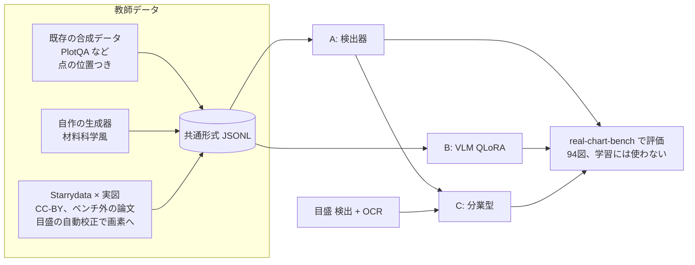
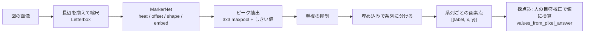

# ローカル抽出モデル(real-chart-extractor)設計 v0

2026-10-06、オーナー指示(「作り方の候補はどれも良さそう。並列エージェントでどんどん進めて」)。
調査報告: https://claude.ai/artifact/NmijuazjUqAc86H4fd8TQa

## 目的

実論文の材料科学の図(マーカー付き、log 軸、複数系列)から点を取るローカルモデルを作る。
1枚の RTX 4090 で学習・推論できるものに限る。

- 評価は real-chart-bench の点 F1(τ=2%)。主条件1(完全自動)と主条件2(人が軸を校正)の両方で測る。
- 第一目標は既存のローカル最良(Gemma 4 31B の 0.731)を大きく超えること。続行の目安は、合成だけで ≥0.75、実図を加えて ≥0.85。

## 3つの作り方を並行で進める

| 方式 | 中身 | 最初に測る条件 |
|---|---|---|
| A. 検出器 | マーカー検出器で画素位置を出す。値への変換は人の校正(pixcal)を使う | 主条件2 |
| B. VLM 追加学習 | Qwen 系 VLM を QLoRA で追加学習し、値の表を直接出させる | 主条件1 |
| C. 分業型 | A の検出 + 目盛の検出と OCR による自動校正 + 系列の振り分け | 主条件1 |

A と B が先に動き、C は A の部品と目盛 OCR を組み合わせて後から作る。



## 全エージェント共通のルール(必須)

1. **ベンチマークの図は学習に使わない。** 採点対象 94 図の論文(paper_id)は、学習データから論文単位で除外する。
   - 除外の判定は `domain` の関数1つに集め、テストを付ける。学習データを作るすべての経路がこれを通る。
   - ベンチマークで手法やハイパーパラメータを調整しない。調整には、学習データから切り出した検証用の分割を使う。
2. **Claude / GPT の出力を教師にしない。** Anthropic・OpenAI の規約が、競合モデルの学習への出力利用を禁じているためである。
   - 正解の出どころは3つだけにする: 既存データセットの正解、自作の生成器の正解、Starrydata の人手デジタイズ。
   - 目盛の校正もローカル OCR か規則で行う。エージェントが画像を見て値を打ち込んで教師にすることはしない。
   - コードを書くことは問題ない。
3. **権利:** 学習に使う実図は、当面 CC-BY(再配布可)の論文に限る。
   - CC-BY 以外の図(著作権法30条の4)や BY-SA・NC の図を使うかは、オーナーと司令塔の判断待ち。
   - 外部データセットはライセンスを記録する。
   - ultralytics(YOLOv8/11)は AGPL-3.0 なので使わない。Apache / MIT 系(RT-DETR の transformers 実装、torchvision、DETR 系など)を使う。
4. **GPU は1枚を共有する。** GPU を使うプロセスは必ず `flock /tmp/rcb-gpu.lock <cmd>` で直列化する。長い学習は再開できるようにチェックポイントを保存する。
5. **ディスクは空き約 60GB。** 新しく置くデータとモデルは合計 30GB 以内にする。
   - 大きなものは `~/.cache/real-chart-bench/` に置き、リポジトリには置かない。リポジトリに置くのは manifest・ライセンス・スクリプトだけ。
   - 削除は Python(shutil)で行う。
6. **環境:** 学習用の venv は `~/.cache/real-chart-bench/` に作る。リポジトリの `.venv` は汚さない。
7. **品質:** 純粋なロジックは `src/real_chart_bench/`(domain / adapter)に置き、TDD で書く。
   - 例: 教師データの形式、値→画素の投影、ベンチマーク除外、評価の変換。
   - torch などの重い依存は `scripts/train/` 以下か、adapter の中だけに置く。
   - push 前に pytest・ruff・import-linter を green にする。
   - 各自の作業は git worktree のブランチで行い、main への統合は統括(私)が行う。

## 教師データの共通形式(`labels.jsonl`、1行1画像)

```json
{"image": "relative/path.png", "width": 800, "height": 600,
 "source": "plotqa|synth-materials|starrydata", "license": "CC-BY-4.0", "paper_id": null,
 "axes": {"x": {"scale": "linear", "ticks": [{"px": 120.0, "value": 300}, {"px": 700.0, "value": 900}]},
          "y": {"scale": "log",    "ticks": [{"px": 540.0, "value": 1e-4}, {"px": 60.0, "value": 1e-1}]}},
 "plot_bbox": [x0, y0, x1, y1],
 "series": [{"label": "x=0.1", "marker": "circle|square|triangle|diamond|cross|other",
             "filled": true, "color": "#1f77b4",
             "points_px": [[x, y], ...], "points_value": [[x, y], ...]}]}
```

- `points_px` は画像ファイルの画素(原点は左上、y は下向き)。
- `axes.ticks` は、各軸2本以上の目盛の(画素, 値)。値は図の印字どおり(design §7.82)。
- 分からない項目は null にする。推測では埋めない。

## 評価

- A と C の画素出力は、`adapter/tick_plot_areas.values_from_pixel_answer`(主条件2)で値に直し、既存の採点器で測る。
- B と C の値出力は、主条件1としてそのまま測る。
- 結果は `results/<model>-v0-local-cuda-*.json` に書き、リーダーボードの同じ表に載せる。

## 方式A: 検出器

2026-10-06 実装・初回評価(ブランチ `worktree-agent-acb8004a9aeee5edf`)。

### モデル

MarkerNet: ResNet-34(torchvision、BSD-3、ImageNet 重み)+ U-Net 型デコーダでストライド2まで戻し、CenterNet 型の4つのヘッドを付けた(`scripts/train/marker_detector/model.py`)。

| ヘッド | 出力 | 損失 |
|---|---|---|
| heat | マーカー中心のヒートマップ(形状によらず1ch) | CenterNet の focal loss |
| offset | セル内の中心のずれ | L1 |
| shape | 形(circle / square / triangle / diamond / cross / other) | CE(marker が null のものは除外) |
| embed | 8次元の埋め込み。同じ系列は近く、違う系列は離す | CornerNet の pull / push |

- **ヒートマップ型を選んだ理由:** マーカーは数画素で密に並ぶ。箱を回帰する RT-DETR / Faster R-CNN は小物体と数百個の密集が苦手で、必要なのは中心点だけである。ストライド2なら数画素離れた点も別セルに載る。
- **系列への振り分け:** 色と形を別々に規則で扱わず、埋め込みに両方を学習させた。
  - 推論ではピークを強い順に並べ、埋め込みの距離がしきい値以内にある系列に入れる(leader clustering)。
- 純粋な処理は `domain/marker_detection.py` に置き、テスト20本を付けた。
  - 中身: 画像と入力のあいだの座標変換、検証分割、重複ピークの抑制、系列の振り分け、回答の形、画素での点 F1。
- 依存は Apache / BSD / MIT のみである(ultralytics は使わない)。



### データと学習

- **学習:** 640 画素の切り出し、バッチ 8、AdamW、bf16。
  - 長辺は 1024 × 0.6〜1.4 で揺らした。
  - 増強は色相の一括回転、ぼかし、JPEG、明るさ。
  - 再開できるチェックポイント(`last.pt`)と `--max-minutes` で、GPU ロックを区切って手放せるようにした。
- **検証:** 学習データから決定的に切り出した(合成は画像単位 5%、実図は論文単位 20%)。
  - 指標はベンチマークと同じ点 F1(系列ごとの Hungarian、τ = 2%)を、画素空間で plot_bbox を枠にして測る(`valmetric.py`)。
  - 推論設定(ピークのしきい値、系列のしきい値、長辺)は検証分割の格子探索で決めた(`tune.py`)。ベンチマークでは調整していない。
- **Starrydata:** 一部の系列しかデジタイズされていない。ラベルのないマーカーを「ない」と教えないよう、実図では背景の損失を 0.25 倍にした。
- **環境:** venv は `~/.cache/real-chart-bench/detector/venv`(vlm-cuda の torch 2.13 cu130 を .pth で読み取り専用で重ね、scipy / matplotlib だけを追加)。
  - 重み・チェックポイントは `~/.cache/real-chart-bench/detector/`(約 1GB)に置いた。

| 実行 | データ | 学習 | 推論設定(検証で選択) |
|---|---|---|---|
| (a) `markernet-r34-synth` | PlotQA dot_line 24,521 枚 + synth-materials 20,000 枚(学習 42,261 / 検証 2,260) | 20,000 step、約34分(RTX 4090、0.10 s/step) | しきい値 0.4、系列 0.5、長辺 1024(検証 F1 0.945) |
| (b) `markernet-r34-synth-real` | (a) の重みから、合成 + Starrydata × CC-BY 実図(89 枚・35 論文のうち学習 76 枚を40倍に重複) | 8,000 step、14.3分。実図の検証 F1 が最良の step 4000 を採用 | しきい値 0.4、系列 0.5、長辺 768(検証 F1 0.939) |

### 結果(主条件2、採点対象94図、点 F1 τ = 2%、密な14図を除く80図の macro)

| 行 | 点 F1 | 再現率 | 適合率 | 秒/図(RTX 4090) |
|---|---|---|---|---|
| (a) 合成のみ | **0.834** | 0.851 | 0.851 | 0.02(94図で計2.2秒)。CPU 16スレッドでは約0.7 |
| (b) 合成 + 実図 | **0.841** | 0.824 | 0.888 | 0.02(計1.6秒) |
| 参考: Qwen3.5-9B pixcal(ローカル) | 0.420 | | | |
| 参考: GPT-6.1-Sol pixcal | 0.861 | | | |
| 参考: Claude Opus 5.5 pixcal | 0.985 | | | |

- 合成だけで、続行の目安(≥0.75)と既存のローカル最良を大きく超えた。重みは 85MB、1図 20ms で動く。
- **実図を足した効果は小さい(+0.007)。**
  - 適合率は上がった(0.851 → 0.888)が、再現率が下がった。
  - 密な14図の曲線一致率は 0.37 → 0.61 に上がった。
  - 実図の検証分割は 13 図しかなく、ラベルも一部の系列だけなので、step と設定の選択はぶれやすい。
- 結果ファイル: `results/markernet-r34-synth{,-real}-v0-local-cuda-pixcal-detector.json`
- 生出力: `data/local_model_runs/<run>/pixpts_px.jsonl`(検出ごとの座標・スコア・形も記録)
- 採点の条件: `score_llm_predictions.py local-cuda-detector-<run>`

### 失敗の分析(図ごと、(a) を中心に)

非密集の 80 図で見ると、F1 ≥ 0.9 が 39 図、< 0.6 が 10 図だった。原因は5種類に分かれた。

1. **大きな模様付きマーカーで重複ピークが出る**(10939-1536/1537/1538、P 0.3 前後)。
   - 中が十字や半塗りの大きな四角・丸で、1つのマーカーに 2〜4 個のピークが立つ。
   - 重複抑制の半径(長辺の 0.4%)が小さすぎる。
   - 対策の候補: マーカーの大きさに合わせた抑制。合成データに大きく模様の入ったマーカーを足し、検証で調整する。
2. **目盛・文字・矢印への誤検出**(32593-40587、高解像度 2500 画素、P 0.11)。
   - 目盛線の端や文字の点に弱いピークが散らばり、小さな偽の系列ができる。
   - 対策の候補: 人の目盛校正から軸の内側を推定して外を捨てる。主条件2で使える情報だけで済む。
3. **異なる系列のマーカーが重なる**(18668-12224/12229/12230、R 0.3〜0.5)。
   - 低温側で4系列が同じ位置に重なり、1点しか出ない。
   - 同じ位置に複数の系列がある場合はヒートマップでは表せない。形クラスごとの heat に分ければ一部は救える。
4. **正解にない系列**(ベンチマークの正解は Starrydata がデジタイズした系列だけ)。
   - 凡例のマーカーや、デジタイズされなかった系列が誤検出として数えられる。
   - (b) で適合率が上がったのは、この傾向が少し学習されたためと見られる。
5. **密な図**(44283-*、16111-15452 など、点 F1 の集計からは除外)。
   - 数百点が重なり合い、ピークが潰れる。検出器の方式そのものの限界である。

### 次の手

- 上の 1 と 2 は検証分割で直せる。重複抑制の半径を検証で探し、目盛校正から作枠する。
- Starrydata の実図は 89 枚では足りない。量が増えたら、背景損失の重みと重複倍率を検証で決め直す。
- 方式C は、この検出器と目盛 OCR を組み合わせて作る。
