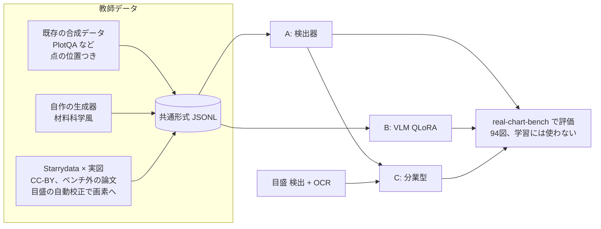

# ローカル抽出モデル(real-chart-extractor)設計 v0

2026-10-06、オーナー指示(「作り方の候補はどれも良さそう。並列エージェントでどんどん進めて」)。
調査報告: https://claude.ai/artifact/NmijuazjUqAc86H4fd8TQa

## 目的

実論文の材料科学の図(マーカー付き、log 軸、複数系列)から点を取るローカルモデルを作る。
1枚の RTX 4090 で学習・推論できるものに限る。

- 評価は real-chart-bench の点 F1(τ=2%)。主条件1(完全自動)と主条件2(人が軸を校正)の両方で測る。
- 第一目標は既存のローカル最良(Gemma 4 31B の 0.731)を大きく超えること。続行の目安は、合成だけで ≥0.75、実図を加えて ≥0.85。

## 3つの作り方を並行で進める

| 方式 | 中身 | 最初に測る条件 |
|---|---|---|
| A. 検出器 | マーカー検出器で画素位置を出す。値への変換は人の校正(pixcal)を使う | 主条件2 |
| B. VLM 追加学習 | Qwen 系 VLM を QLoRA で追加学習し、値の表を直接出させる | 主条件1 |
| C. 分業型 | A の検出 + 目盛の検出と OCR による自動校正 + 系列の振り分け | 主条件1 |

A と B が先に動き、C は A の部品と目盛 OCR を組み合わせて後から作る。



## 全エージェント共通のルール(必須)

1. **ベンチマークの図は学習に使わない。** 採点対象 94 図の論文(paper_id)は、学習データから論文単位で除外する。
   - 除外の判定は `domain` の関数1つに集め、テストを付ける。学習データを作るすべての経路がこれを通る。
   - ベンチマークで手法やハイパーパラメータを調整しない。調整には、学習データから切り出した検証用の分割を使う。
2. **Claude / GPT の出力を教師にしない。** Anthropic・OpenAI の規約が、競合モデルの学習への出力利用を禁じているためである。
   - 正解の出どころは3つだけにする: 既存データセットの正解、自作の生成器の正解、Starrydata の人手デジタイズ。
   - 目盛の校正もローカル OCR か規則で行う。エージェントが画像を見て値を打ち込んで教師にすることはしない。
   - コードを書くことは問題ない。
3. **権利:** 学習に使う実図は、当面 CC-BY(再配布可)の論文に限る。
   - CC-BY 以外の図(著作権法30条の4)や BY-SA・NC の図を使うかは、オーナーと司令塔の判断待ち。
   - 外部データセットはライセンスを記録する。
   - ultralytics(YOLOv8/11)は AGPL-3.0 なので使わない。Apache / MIT 系(RT-DETR の transformers 実装、torchvision、DETR 系など)を使う。
4. **GPU は1枚を共有する。** GPU を使うプロセスは必ず `flock /tmp/rcb-gpu.lock <cmd>` で直列化する。長い学習は再開できるようにチェックポイントを保存する。
5. **ディスクは空き約 60GB。** 新しく置くデータとモデルは合計 30GB 以内にする。
   - 大きなものは `~/.cache/real-chart-bench/` に置き、リポジトリには置かない。リポジトリに置くのは manifest・ライセンス・スクリプトだけ。
   - 削除は Python(shutil)で行う。
6. **環境:** 学習用の venv は `~/.cache/real-chart-bench/` に作る。リポジトリの `.venv` は汚さない。
7. **品質:** 純粋なロジックは `src/real_chart_bench/`(domain / adapter)に置き、TDD で書く。
   - 例: 教師データの形式、値→画素の投影、ベンチマーク除外、評価の変換。
   - torch などの重い依存は `scripts/train/` 以下か、adapter の中だけに置く。
   - push 前に pytest・ruff・import-linter を green にする。
   - 各自の作業は git worktree のブランチで行い、main への統合は統括(私)が行う。

## 教師データの共通形式(`labels.jsonl`、1行1画像)

```json
{"image": "relative/path.png", "width": 800, "height": 600,
 "source": "plotqa|synth-materials|starrydata", "license": "CC-BY-4.0", "paper_id": null,
 "axes": {"x": {"scale": "linear", "ticks": [{"px": 120.0, "value": 300}, {"px": 700.0, "value": 900}]},
          "y": {"scale": "log",    "ticks": [{"px": 540.0, "value": 1e-4}, {"px": 60.0, "value": 1e-1}]}},
 "plot_bbox": [x0, y0, x1, y1],
 "series": [{"label": "x=0.1", "marker": "circle|square|triangle|diamond|cross|other",
             "filled": true, "color": "#1f77b4",
             "points_px": [[x, y], ...], "points_value": [[x, y], ...]}]}
```

- `points_px` は画像ファイルの画素(原点は左上、y は下向き)。
- `axes.ticks` は、各軸2本以上の目盛の(画素, 値)。値は図の印字どおり(design §7.82)。
- 分からない項目は null にする。推測では埋めない。

## 評価

- A と C の画素出力は、`adapter/tick_plot_areas.values_from_pixel_answer`(主条件2)で値に直し、既存の採点器で測る。
- B と C の値出力は、主条件1としてそのまま測る。
- 結果は `results/<model>-v0-local-cuda-*.json` に書き、リーダーボードの同じ表に載せる。
