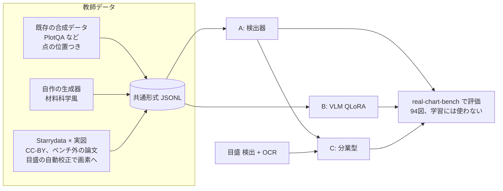

# ローカル抽出モデル(real-chart-extractor)設計 v0

2026-10-06、オーナー指示(「作り方の候補はどれも良さそう。並列エージェントでどんどん進めて」)。
調査報告: https://claude.ai/artifact/NmijuazjUqAc86H4fd8TQa

## 目的

実論文の材料科学の図(マーカー付き、log 軸、複数系列)から点を取るローカルモデルを作る。
1枚の RTX 4090 で学習・推論できるものに限る。

- 評価は real-chart-bench の点 F1(τ=2%)。主条件1(完全自動)と主条件2(人が軸を校正)の両方で測る。
- 第一目標は既存のローカル最良(Gemma 4 31B の 0.731)を大きく超えること。続行の目安は、合成だけで ≥0.75、実図を加えて ≥0.85。

## 3つの作り方を並行で進める

| 方式 | 中身 | 最初に測る条件 |
|---|---|---|
| A. 検出器 | マーカー検出器で画素位置を出す。値への変換は人の校正(pixcal)を使う | 主条件2 |
| B. VLM 追加学習 | Qwen 系 VLM を QLoRA で追加学習し、値の表を直接出させる | 主条件1 |
| C. 分業型 | A の検出 + 目盛の検出と OCR による自動校正 + 系列の振り分け | 主条件1 |

A と B が先に動き、C は A の部品と目盛 OCR を組み合わせて後から作る。



## 全エージェント共通のルール(必須)

1. **ベンチマークの図は学習に使わない。** 採点対象 94 図の論文(paper_id)は、学習データから論文単位で除外する。
   - 除外の判定は `domain` の関数1つに集め、テストを付ける。学習データを作るすべての経路がこれを通る。
   - ベンチマークで手法やハイパーパラメータを調整しない。調整には、学習データから切り出した検証用の分割を使う。
2. **Claude / GPT の出力を教師にしない。** Anthropic・OpenAI の規約が、競合モデルの学習への出力利用を禁じているためである。
   - 正解の出どころは3つだけにする: 既存データセットの正解、自作の生成器の正解、Starrydata の人手デジタイズ。
   - 目盛の校正もローカル OCR か規則で行う。エージェントが画像を見て値を打ち込んで教師にすることはしない。
   - コードを書くことは問題ない。
3. **権利:** 学習に使う実図は、当面 CC-BY(再配布可)の論文に限る。
   - CC-BY 以外の図(著作権法30条の4)や BY-SA・NC の図を使うかは、オーナーと司令塔の判断待ち。
   - 外部データセットはライセンスを記録する。
   - ultralytics(YOLOv8/11)は AGPL-3.0 なので使わない。Apache / MIT 系(RT-DETR の transformers 実装、torchvision、DETR 系など)を使う。
4. **GPU は1枚を共有する。** GPU を使うプロセスは必ず `flock /tmp/rcb-gpu.lock <cmd>` で直列化する。長い学習は再開できるようにチェックポイントを保存する。
5. **ディスクは空き約 60GB。** 新しく置くデータとモデルは合計 30GB 以内にする。
   - 大きなものは `~/.cache/real-chart-bench/` に置き、リポジトリには置かない。リポジトリに置くのは manifest・ライセンス・スクリプトだけ。
   - 削除は Python(shutil)で行う。
6. **環境:** 学習用の venv は `~/.cache/real-chart-bench/` に作る。リポジトリの `.venv` は汚さない。
7. **品質:** 純粋なロジックは `src/real_chart_bench/`(domain / adapter)に置き、TDD で書く。
   - 例: 教師データの形式、値→画素の投影、ベンチマーク除外、評価の変換。
   - torch などの重い依存は `scripts/train/` 以下か、adapter の中だけに置く。
   - push 前に pytest・ruff・import-linter を green にする。
   - 各自の作業は git worktree のブランチで行い、main への統合は統括(私)が行う。

## 教師データの共通形式(`labels.jsonl`、1行1画像)

```json
{"image": "relative/path.png", "width": 800, "height": 600,
 "source": "plotqa|synth-materials|starrydata", "license": "CC-BY-4.0", "paper_id": null,
 "axes": {"x": {"scale": "linear", "ticks": [{"px": 120.0, "value": 300}, {"px": 700.0, "value": 900}]},
          "y": {"scale": "log",    "ticks": [{"px": 540.0, "value": 1e-4}, {"px": 60.0, "value": 1e-1}]}},
 "plot_bbox": [x0, y0, x1, y1],
 "series": [{"label": "x=0.1", "marker": "circle|square|triangle|diamond|cross|other",
             "filled": true, "color": "#1f77b4",
             "points_px": [[x, y], ...], "points_value": [[x, y], ...]}]}
```

- `points_px` は画像ファイルの画素(原点は左上、y は下向き)。
- `axes.ticks` は、各軸2本以上の目盛の(画素, 値)。値は図の印字どおり(design §7.82)。
- 分からない項目は null にする。推測では埋めない。

## 評価

- A と C の画素出力は、`adapter/tick_plot_areas.values_from_pixel_answer`(主条件2)で値に直し、既存の採点器で測る。
- B と C の値出力は、主条件1としてそのまま測る。
- 結果は `results/<model>-v0-local-cuda-*.json` に書き、リーダーボードの同じ表に載せる。

## データ: 合成

2026-10-06 作成。どちらも `labels.jsonl` の全行が `validate_label` を通り、さらに「`points_value` を自分の目盛で画素に直すと `points_px` に重なる」自己検査(`domain/training_data.max_axis_residual_px`)を通ったものだけを残している。manifest は `data/train_manifest/<source>.json`。

| source | 置き場所 | 画像 | 点 | 容量 | ライセンス |
|---|---|---|---|---|---|
| plotqa | `~/.cache/real-chart-bench/train-data/plotqa/` | train 24,521 + val 5,246 | 341,515 + 73,912 | 1.1 GB | CC-BY-4.0(ATTRIBUTION.md 同梱) |
| synth-materials | `~/.cache/real-chart-bench/train-data/synth-materials/` | 20,000 | 977,319 | 0.68 GB | CC0-1.0(自作、乱数データ) |

### PlotQA(`scripts/train/prepare_plotqa.py`、変換は `adapter/plotqa_training.py`)

- train と validation 分割の dot_line だけを使う。**test 分割は読まない**(その100枚が合成ベンチマーク)。
- `labels_val.jsonl` は PlotQA の validation 分割。ハイパーパラメータ調整用の検証分割として使える。
- `points_px` はマーカー bbox の中心、目盛は tick bbox の中心と印字ラベル(数値として読めるものだけ)。
- x 軸は等間隔のカテゴリ(年)である。印字の年が等差でない図(約23%)は線形軸ではないため、`axes: null`・`x_categorical: true` とし、y の目盛だけを `y_ticks` に残す。
- マーカー bbox が欠けた図(train 1,489、val 325)は捨てた。残りの自己検査の残差は最大 1.3 px(val で実測。train も 3 px 超えは0件)。
- マーカーは塗りつぶしの丸だけで、軸は線形だけ。材料系の多様さは次の生成器で補う。
- 画像の入手元: Google Drive がクォータで拒否したため、HF のミラー `Dodon/plotqa-dataset` の `png_train.tar.gz` を使った。全画像の寸法が注釈と一致することを確認済み。アーカイブは展開後に削除し、注釈 JSON(1.6 GB)は `~/.cache/real-chart-bench/plotqa/` に残している。

### 材料科学風の生成器(`scripts/train/gen_synth_materials.py`、純ロジックは `adapter/synth_chart_labels.py`)

- 軸の種類:
  - x: T(250〜1000 K)、1000/T、組成、一般の線形、log x。
  - y: 線形、log 軸、log10 の値を線形軸に印字したもの。
- 系列は 1〜8 本。マーカーは 13 種で、塗り・白抜き・混在の3通り。
- 描き方: マーカーのみ、線+マーカー、破線+マーカー。誤差棒は 20%、密集・重なりは 15%、図内の凡例(枠あり・なし)、インセットは 8%(線のみ)。
- フォントは 7 種、dpi は 72〜200。半分は JPEG(品質 35〜91)で保存する。
- 正解の座標:
  - 画素位置は、描画後の `ax.transData` から求める。
  - Agg はマーカーを整数画素に寄せる(最大約0.7 px)。そこで 4 倍の大きさで描いてから縮小し、ずれを約0.2 px に抑えた。
  - `tests/scripts/test_gen_synth_materials.py` が、孤立した点対称マーカーのインク重心を実測して確かめる(中央値 <0.35 px、最大 <1 px)。
- 目盛: 描かれた主目盛の位置と、印字テキストを読んだ値を使う。log 軸が1桁未満のときは、ラベル付きの副目盛も使う。印字が目盛の値と一致しないもの(オフセット表記など)は捨てる。
- 隠れた点:
  - 枠付きの凡例やインセットの下に隠れた点は、ラベルから除く(計 60k 点)。
  - 凡例の矩形は `synth.legend_bbox` に記録してある。凡例の見本マーカーは正解に含めない(学習側で負例として扱える)。
- 再現性: 画像 i は `default_rng(20261006 + i)` から作るので、1枚ずつ再生成できる。

### 他の公開データの確認(変換はしていない)

| データ | 点単位の画素ラベル | ライセンス | 判断 |
|---|---|---|---|
| LineEX 合成(WACV 2023) | 線のキーポイント | コードは Apache-2.0。データ(Drive)の条件は未確認 | 線グラフ中心で、マーカーの多様さは自作の生成器に及ばない。保留 |
| Scatteract(Bloomberg) | 点 bbox | データは配布されず、生成スクリプトのみ | 自作の生成器と役割が重なる。不要 |
| FigureQA(Microsoft) | dot-line の bbox あり | 同意クリック型の独自規約で、未確認 | 規約の確認が要る。保留 |
| ChartNet grounding(IBM) | bbox(対象の要素は不明) | CC-BY-4.0 / CDLA-Permissive-2.0 | 図の再構成コードを作った VLM が非開示で、GPT・Claude 由来の可能性を否定できない(ルール2)。使わない |
| SML2023 | 未確認 | 未確認 | 時間内に入手先を確認できず |

### まだ足りないもの

- 実図の質感: スキャン、複数パネル、注記の矢印・テキスト、マーカーと文字の重なり。これは Starrydata × 実図(CC-BY)で補う。
- 生成器が出さないもの:
  - 軸の反転、二重 y 軸、破断軸、分数や 10^x 以外の印字(×10^3 のオフセット表記は目盛を捨てているだけ)。
  - 単色の白抜きマーカーが同じ形で重なる極端な密集。
- 系列の対応は、PlotQA・生成器とも `series` 単位で正解を持つ。C(分業型)の振り分け学習にもそのまま使える。
