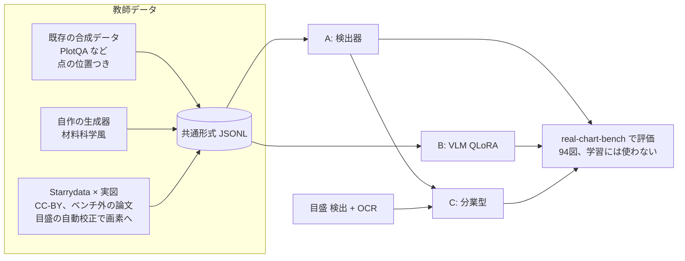
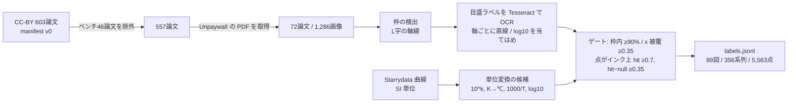
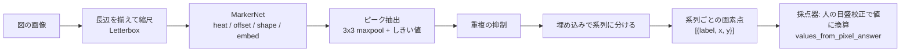
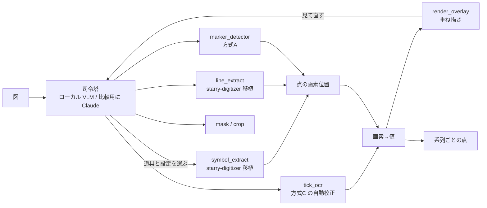
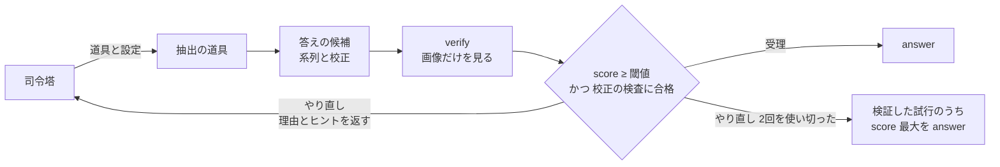
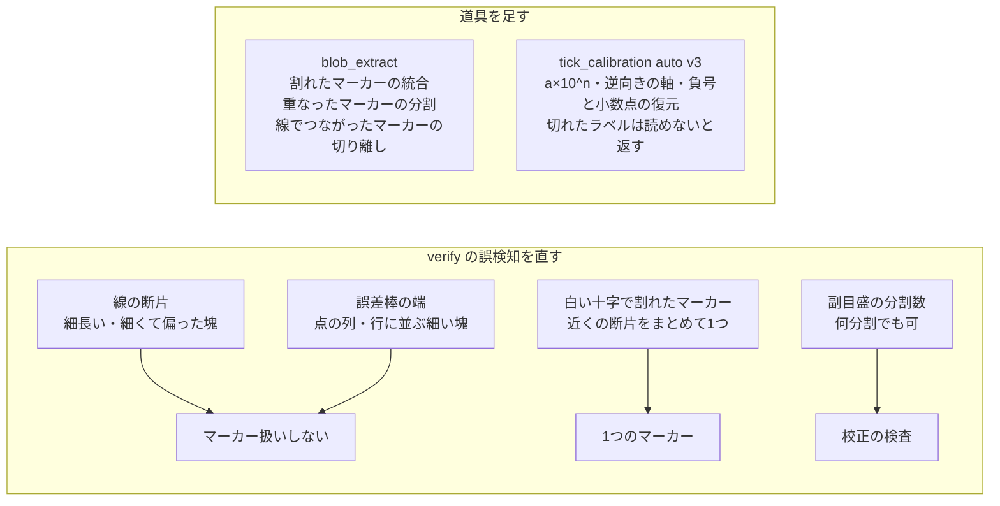
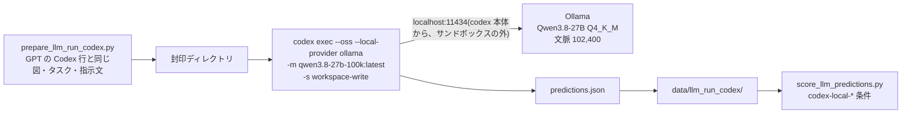

# ローカル抽出モデル(real-chart-extractor)設計 v0

2026-10-06、オーナー指示(「作り方の候補はどれも良さそう。並列エージェントでどんどん進めて」)。
調査報告: https://claude.ai/artifact/NmijuazjUqAc86H4fd8TQa

## 目的

実論文の材料科学の図(マーカー付き、log 軸、複数系列)から点を取るローカルモデルを作る。
1枚の RTX 4090 で学習・推論できるものに限る。

- 評価は real-chart-bench の点 F1(τ=2%)。主条件1(完全自動)と主条件2(人が軸を校正)の両方で測る。
- 第一目標は既存のローカル最良(Gemma 4 31B の 0.731)を大きく超えること。続行の目安は、合成だけで ≥0.75、実図を加えて ≥0.85。

## 3つの作り方を並行で進める

| 方式 | 中身 | 最初に測る条件 |
|---|---|---|
| A. 検出器 | マーカー検出器で画素位置を出す。値への変換は人の校正(pixcal)を使う | 主条件2 |
| B. VLM 追加学習 | Qwen 系 VLM を QLoRA で追加学習し、値の表を直接出させる | 主条件1 |
| C. 分業型 | A の検出 + 目盛の検出と OCR による自動校正 + 系列の振り分け | 主条件1 |

A と B が先に動き、C は A の部品と目盛 OCR を組み合わせて後から作る。



## 全エージェント共通のルール(必須)

1. **ベンチマークの図は学習に使わない。** 採点対象 94 図の論文(paper_id)は、学習データから論文単位で除外する。
   - 除外の判定は `domain` の関数1つに集め、テストを付ける。学習データを作るすべての経路がこれを通る。
   - ベンチマークで手法やハイパーパラメータを調整しない。調整には、学習データから切り出した検証用の分割を使う。
2. **Claude / GPT の出力を教師にしない。** Anthropic・OpenAI の規約が、競合モデルの学習への出力利用を禁じているためである。
   - 正解の出どころは3つだけにする: 既存データセットの正解、自作の生成器の正解、Starrydata の人手デジタイズ。
   - 目盛の校正もローカル OCR か規則で行う。エージェントが画像を見て値を打ち込んで教師にすることはしない。
   - コードを書くことは問題ない。
3. **権利:** 学習に使う実図は、当面 CC-BY(再配布可)の論文に限る。
   - CC-BY 以外の図(著作権法30条の4)や BY-SA・NC の図を使うかは、オーナーと司令塔の判断待ち。
   - 外部データセットはライセンスを記録する。
   - ultralytics(YOLOv8/11)は AGPL-3.0 なので使わない。Apache / MIT 系(RT-DETR の transformers 実装、torchvision、DETR 系など)を使う。
4. **GPU は1枚を共有する。** GPU を使うプロセスは必ず `flock /tmp/rcb-gpu.lock <cmd>` で直列化する。長い学習は再開できるようにチェックポイントを保存する。
5. **ディスクは空き約 60GB。** 新しく置くデータとモデルは合計 30GB 以内にする。
   - 大きなものは `~/.cache/real-chart-bench/` に置き、リポジトリには置かない。リポジトリに置くのは manifest・ライセンス・スクリプトだけ。
   - 削除は Python(shutil)で行う。
6. **環境:** 学習用の venv は `~/.cache/real-chart-bench/` に作る。リポジトリの `.venv` は汚さない。
7. **品質:** 純粋なロジックは `src/real_chart_bench/`(domain / adapter)に置き、TDD で書く。
   - 例: 教師データの形式、値→画素の投影、ベンチマーク除外、評価の変換。
   - torch などの重い依存は `scripts/train/` 以下か、adapter の中だけに置く。
   - push 前に pytest・ruff・import-linter を green にする。
   - 各自の作業は git worktree のブランチで行い、main への統合は統括(私)が行う。

## ライセンスと利用条件(2026-10-06、オーナー判断)

- **Starrydata:** NIMS の研究チームが、学術研究として非営利で運営している(https://www.starrydata.org/ )。営利企業ではない。本研究も学術目的である。
  - 利用規約(https://www.starrydata.org/utility/terms.html )は次を求めている。
    - Starrydata の論文を引用すること
    - できる範囲で元論文も引用すること
    - Starrydata と誤認されるコピーを作らないこと
  - モデルの学習を制限する条項はない。
- **学習したモデルの重みは非商用(NC)ライセンスで公開する**(オーナー判断)。NC の図で学習しても条件が矛盾しないようにするためである。公開そのものは、司令塔経由で人の承認を得る。
- **CHART-Infographics(UB-PMC):** 配布 ZIP(CHART-Info 2024 Train、v4.0)の `license.txt` によると、データセットは **CC BY-NC-SA 4.0** である。
  - readme には「画像は PubMed Central のオープンアクセス部分から取り、元は Creative Commons のライセンスで公開されていた」とある。CC-BY に限るとは書かれていない。
  - 主催者サイトにある「CC-BY の図だけを選んだ」という記述は、ICDAR 2023 の説明だった。配布物の license.txt を正とする。
  - 帰結は次の3つ。
    1. 学術目的の利用(NC)は問題ない。
    2. 改変物を公開するときは BY-NC-SA で出す(SA)。この図で学習したモデルの重みは、**CC BY-NC-SA 4.0** で公開する。
    3. 正解データから派生させてリポジトリに入れたファイル(`data/chartinfo_pilot/`)には、帰属と BY-NC-SA を明記する(`LICENSE.md`)。
  - 利用時は、競技会の論文(Davila et al.)と元論文を引用する。
- 上の結果、ルール3の「学習に使う実図は当面 CC-BY に限る」は次のように緩める。
  - **学術目的の学習には、NC の図も使ってよい**(著作権法30条の4、オーナー判断)。
  - データセットとして再配布するのは、CC-BY の図だけに限る(変更なし)。

## 教師データの共通形式(`labels.jsonl`、1行1画像)

```json
{"image": "relative/path.png", "width": 800, "height": 600,
 "source": "plotqa|synth-materials|starrydata", "license": "CC-BY-4.0", "paper_id": null,
 "axes": {"x": {"scale": "linear", "ticks": [{"px": 120.0, "value": 300}, {"px": 700.0, "value": 900}]},
          "y": {"scale": "log",    "ticks": [{"px": 540.0, "value": 1e-4}, {"px": 60.0, "value": 1e-1}]}},
 "plot_bbox": [x0, y0, x1, y1],
 "series": [{"label": "x=0.1", "marker": "circle|square|triangle|diamond|cross|other",
             "filled": true, "color": "#1f77b4",
             "points_px": [[x, y], ...], "points_value": [[x, y], ...]}]}
```

- `points_px` は画像ファイルの画素(原点は左上、y は下向き)。
- `axes.ticks` は、各軸2本以上の目盛の(画素, 値)。値は図の印字どおり(design §7.82)。
- 分からない項目は null にする。推測では埋めない。

## 評価

- A と C の画素出力は、`adapter/tick_plot_areas.values_from_pixel_answer`(主条件2)で値に直し、既存の採点器で測る。
- B と C の値出力は、主条件1としてそのまま測る。
- 結果は `results/<model>-v0-local-cuda-*.json` に書き、リーダーボードの同じ表に載せる。

## データ: 合成

2026-10-06 作成。どちらも `labels.jsonl` の全行が `validate_label` を通り、さらに「`points_value` を自分の目盛で画素に直すと `points_px` に重なる」自己検査(`domain/training_data.max_axis_residual_px`)を通ったものだけを残している。manifest は `data/train_manifest/<source>.json`。

| source | 置き場所 | 画像 | 点 | 容量 | ライセンス |
|---|---|---|---|---|---|
| plotqa | `~/.cache/real-chart-bench/train-data/plotqa/` | train 24,521 + val 5,246 | 341,515 + 73,912 | 1.1 GB | CC-BY-4.0(ATTRIBUTION.md 同梱) |
| synth-materials | `~/.cache/real-chart-bench/train-data/synth-materials/` | 20,000 | 977,319 | 0.68 GB | CC-BY-4.0(自作、乱数データ。オーナー指示で CC0 から変更、2026-10-06) |

### PlotQA(`scripts/train/prepare_plotqa.py`、変換は `adapter/plotqa_training.py`)

- train と validation 分割の dot_line だけを使う。**test 分割は読まない**(その100枚が合成ベンチマーク)。
- `labels_val.jsonl` は PlotQA の validation 分割。ハイパーパラメータ調整用の検証分割として使える。
- `points_px` はマーカー bbox の中心、目盛は tick bbox の中心と印字ラベル(数値として読めるものだけ)。
- x 軸は等間隔のカテゴリ(年)である。印字の年が等差でない図(約23%)は線形軸ではないため、`axes: null`・`x_categorical: true` とし、y の目盛だけを `y_ticks` に残す。
- マーカー bbox が欠けた図(train 1,489、val 325)は捨てた。残りの自己検査の残差は最大 1.3 px(val で実測。train も 3 px 超えは0件)。
- マーカーは塗りつぶしの丸だけで、軸は線形だけ。材料系の多様さは次の生成器で補う。
- 画像の入手元: Google Drive がクォータで拒否したため、HF のミラー `Dodon/plotqa-dataset` の `png_train.tar.gz` を使った。全画像の寸法が注釈と一致することを確認済み。アーカイブは展開後に削除し、注釈 JSON(1.6 GB)は `~/.cache/real-chart-bench/plotqa/` に残している。

### 材料科学風の生成器(`scripts/train/gen_synth_materials.py`、純ロジックは `adapter/synth_chart_labels.py`)

- 軸の種類:
  - x: T(250〜1000 K)、1000/T、組成、一般の線形、log x。
  - y: 線形、log 軸、log10 の値を線形軸に印字したもの。
- 系列は 1〜8 本。マーカーは 13 種で、塗り・白抜き・混在の3通り。
- 描き方: マーカーのみ、線+マーカー、破線+マーカー。誤差棒は 20%、密集・重なりは 15%、図内の凡例(枠あり・なし)、インセットは 8%(線のみ)。
- フォントは 7 種、dpi は 72〜200。半分は JPEG(品質 35〜91)で保存する。
- 正解の座標:
  - 画素位置は、描画後の `ax.transData` から求める。
  - Agg はマーカーを整数画素に寄せる(最大約0.7 px)。そこで 4 倍の大きさで描いてから縮小し、ずれを約0.2 px に抑えた。
  - `tests/scripts/test_gen_synth_materials.py` が、孤立した点対称マーカーのインク重心を実測して確かめる(中央値 <0.35 px、最大 <1 px)。
- 目盛: 描かれた主目盛の位置と、印字テキストを読んだ値を使う。log 軸が1桁未満のときは、ラベル付きの副目盛も使う。印字が目盛の値と一致しないもの(オフセット表記など)は捨てる。
- 隠れた点:
  - 枠付きの凡例やインセットの下に隠れた点は、ラベルから除く(計 60k 点)。
  - 凡例の矩形は `synth.legend_bbox` に記録してある。凡例の見本マーカーは正解に含めない(学習側で負例として扱える)。
- 再現性: 画像 i は `default_rng(20261006 + i)` から作るので、1枚ずつ再生成できる。

### 他の公開データの確認(変換はしていない)

| データ | 点単位の画素ラベル | ライセンス | 判断 |
|---|---|---|---|
| LineEX 合成(WACV 2023) | 線のキーポイント | コードは Apache-2.0。データ(Drive)の条件は未確認 | 線グラフ中心で、マーカーの多様さは自作の生成器に及ばない。保留 |
| Scatteract(Bloomberg) | 点 bbox | データは配布されず、生成スクリプトのみ | 自作の生成器と役割が重なる。不要 |
| FigureQA(Microsoft) | dot-line の bbox あり | 同意クリック型の独自規約で、未確認 | 規約の確認が要る。保留 |
| ChartNet grounding(IBM) | bbox(対象の要素は不明) | CC-BY-4.0 / CDLA-Permissive-2.0 | 図の再構成コードを作った VLM が非開示で、GPT・Claude 由来の可能性を否定できない(ルール2)。使わない |
| SML2023 | 未確認 | 未確認 | 時間内に入手先を確認できず |

### まだ足りないもの

- 実図の質感: スキャン、複数パネル、注記の矢印・テキスト、マーカーと文字の重なり。これは Starrydata × 実図(CC-BY)で補う。
- 生成器が出さないもの:
  - 軸の反転、二重 y 軸、破断軸、分数や 10^x 以外の印字(×10^3 のオフセット表記は目盛を捨てているだけ)。
  - 単色の白抜きマーカーが同じ形で重なる極端な密集。
- 系列の対応は、PlotQA・生成器とも `series` 単位で正解を持つ。C(分業型)の振り分け学習にもそのまま使える。

## データ: 実図(Starrydata)

2026-10-06。Starrydata の人手デジタイズ値と、CC-BY 論文の実図を組み合わせた教師データ。LLM の出力はどこにも入らない(ルール2)。

- 出力: `~/.cache/real-chart-bench/train-data/starrydata/{images/, labels.jsonl}`(共通形式、`validate_label` と `assert_no_benchmark_leak` を通す)
- 目視用シート: `.../starrydata/review/index.html`(無作為30図。枠・校正に使った目盛・投影点を重ねた PNG)
- 記録: `data/train_manifest/starrydata.json`(論文・図ごとの件数と信頼度、各段の歩留まり)
- スクリプト: `scripts/train/starrydata_fetch.py`(段1)→ `starrydata_build.py`(段2〜4)→ `starrydata_review.py`
- 純粋ロジック(TDD): `domain/axis_frame.py`(枠と目盛の検出)、`domain/tick_calibration.py`(目盛ラベルの解釈・軸の当てはめ・単位変換の候補・投影・自己整合ゲート)。OCR は `adapter/tesseract_ocr.py`



### 作り方

1. 候補: manifest v0 の CC-BY 603論文から、registry.json の全論文(状態を問わず46論文)を除き 557論文。Unpaywall で license を再確認し、CC-BY でなくなった 9論文を除外した。
2. 画像: PDF から v0 と同じ抽出器で図を取り出す(埋め込み画像。無いページは 200 dpi のページ画像)。
3. 枠: 長い水平線と垂直線が左下で接する所を、プロットの枠とする。複数パネルの図やページ画像でも、パネル分割器(§7.12)は使わずに各枠を直接拾う。中が暗い枠(写真・顕微鏡像)と太い線は除く。
4. 目盛: 枠の下と左の帯を Tesseract 5.3.4(Apache-2.0、システムのバイナリ。リポジトリの .venv には何も入れていない)で読む。外向きの目盛線は帯から外す(「1」「-」と誤読されるため)。数字の解釈では、上付きが消えた「103」を 103 と 10³ の両方の候補として残す。軸ごとに、3本以上が一直線に乗る組を選ぶ(線形か log10、外れ値は捨てる)。線形軸では、ラベルが一つの格子 v0 + k·step に乗ることも確かめる(「800」を「809」と誤読したものを落とす)。検出した目盛線があれば、その画素に吸着させる。
5. 投影: Starrydata の値は SI で保存されている。図に印字された単位への変換は、決まった候補から選ぶ。候補は 10^k 倍(µV/K、S/cm など)、K→℃、10^k/T(1000/T)、log10 印字、log 量の整数シフトである。当てはめはしない。点の 90% 以上が枠内に入り、x の広がりが枠の 35% 以上(pairing_checks の被覆 p5 = 0.376 と同じ考え方)、y の広がりが 20% 以上になる候補だけを残す。
6. ペアリング: 論文ごとに、図(Starrydata の figure_id)と枠の組を contrast の高い順に一対一で割り当てる。軸の組(prop_x, prop_y)は図の中で最も多いもの1つだけを使う。右側の第2軸の系列は使わない。
7. ゲート: 点が印刷されたマーカーの上に乗っているかを見る。hit は、点の近く(半径は枠の短辺の 1%、最低 2 px)にインクがある割合。null は、同じ点を枠の 4% ずらしたときの hit。枠線とその近くの点は数えない(数えると、軸に押しつぶされた誤った投影が hit になる)。図ごとに hit ≥ 0.7 かつ hit − null ≥ 0.35 で採用する。系列ごとにも hit ≥ 0.7 を求め、満たさない系列は外す(別パネルや第2軸の試料)。

### 歩留まり(2026-10-06 実行)

| 段 | 数 |
|---|---|
| CC-BY 論文 | 603 |
| ベンチ論文を除外 | 557 |
| PDF 取得成功 | 72(403: 208、PDF でない: 168、URL なし: 98、ライセンス変更: 9、接続失敗: 2) |
| 画像 / 対象図 / 対象曲線 | 1,286 / 289 / 1,038 |
| 検出した枠 | 1,108 |
| 目盛の校正に成功した枠(x / y / 両方) | 446 / 555 / 331 |
| 枠内・被覆を満たす図×枠の組 | 619 |
| 割り当てた図 | 104 |
| **ゲート通過** | **89図 / 356系列 / 5,563点 / 35論文** |

対象図に対する採用率は 89/289 = 31%。最大の損失は PDF の取得である(出版社の 403 とボット対策ページ。v0 収集時の 179論文から 72論文に減った)。

### 閾値と品質の根拠

- ホールドアウト: 20論文(SHA-1 順で固定。`starrydata.json` には書かず、下のとおり)で閾値を決めた。対象は 22807, 23115, 18894, 31549, 16336, 13457, 14649, 963, 18870, 17052, 5167, 186, 18760, 18751, 21412, 27760, 18501, 31587, 14662, 16227。
- 判定は重ね描きの目視で行った(値は読んでいない。「点がマーカーの上にあるか」だけを見た)。
- 最終設定でのホールドアウト: 採用31図はすべて正しかった(精度 31/31。3件の法則で誤り率の上限は約 10%)。却下は4図で、誤り3、正しいもの1(16336 Fig.4a。y≈0 の点が多く、枠線の近くで数えられなかった)。ほかに正しいペア1図(23115 の S²/ρ 図)が、ラベルの格子チェックを入れたあと校正を通らなくなった。
- 閾値を作る途中で、誤りのまま採用された3図(x が枠の 1/5 に押しつぶされた投影、軸線の上の点)が見つかり、被覆 0.35 と枠線の除外を加えた。
- ホールドアウト外の採用図から 12+8 図を抜き取って見た。点がずれていたのは、1図の1系列だけだった(7745 Fig.25(f) の κ_el。そのあと系列の閾値を 0.5 から 0.7 に上げた)。
- 信頼度は図ごとに `extra.confidence` に入れた(hit, null, contrast, margin = 次点との差, 目盛の残差, 目盛の本数)。

### ラベルの扱い

- `series_complete` は常に null。Starrydata は図の一部の系列しかデジタイズしないことが多い(例: 22807 Fig.5c は図に6系列あるが、Starrydata には2系列しかない)ので、ラベルは不完全でありうる。完全かどうかは推測しない。
- `marker` / `filled` は null。`color` は点の近くで最も濃い、または最も彩度の高い画素の中央値で、画像から測った値である。
- `axes.*.ticks` は OCR で読んだ値で、図の印字どおり(log10 印字の軸は linear で、値は指数)。`axes.*.transform_from_starrydata` に、選んだ単位変換を書いた。
- `points_value` は印字空間の値(design 7.82 と同じ)。
- `license` は "CC-BY" とした(Unpaywall は版を返さない)。`paper_id` は Starrydata の SID。

### 既知の失敗モード

- 軸線のない図(despine)、軸の破断、右の第2軸は扱えない。この3つは枠として拾えないか、使わない。
- log 軸の校正はほとんど成功しない(採用は 1図)。10ⁿ の上付きを Tesseract が読み落とすためで、`103` 型の救済だけでは足りない。
- 縦に積んだ共有 x 軸のパネルでは、枠が上のパネルまで伸びることがある。そのとき、上のパネルの目盛ラベルが偶然一直線に乗ると、ラベルに混ざる(21247 Fig.4(c))。点の位置は正しい。
- 切り出しは枠の周り(左 35〜45%、下 30%)なので、隣のパネルの一部が写り込む。
- マーカーと線が密な図では null が高く、0.35 の contrast を満たせずに落ちる。逆に、密な図では数 px ずれた系列も hit になりうる(上の κ_el の例)。
- 同じ図が PDF に2回入っていると、margin が 0 になる(31587, 27760)。判定には使っていない。

### 次の手

- PDF 取得の改善(出版社別の正規 OA ルート。ボット対策を回避するのはしない)が最も効く。
- log 軸の上付きの読み取り(上付き領域だけを切り出して再 OCR する)。
- CC-BY 以外(著作権法30条の4)を使うかは、オーナーと司令塔の判断待ち(ルール3)。

## 方式A: 検出器

2026-10-06 実装・初回評価(ブランチ `worktree-agent-acb8004a9aeee5edf`)。

### モデル

MarkerNet: ResNet-34(torchvision、BSD-3、ImageNet 重み)+ U-Net 型デコーダでストライド2まで戻し、CenterNet 型の4つのヘッドを付けた(`scripts/train/marker_detector/model.py`)。

| ヘッド | 出力 | 損失 |
|---|---|---|
| heat | マーカー中心のヒートマップ(形状によらず1ch) | CenterNet の focal loss |
| offset | セル内の中心のずれ | L1 |
| shape | 形(circle / square / triangle / diamond / cross / other) | CE(marker が null のものは除外) |
| embed | 8次元の埋め込み。同じ系列は近く、違う系列は離す | CornerNet の pull / push |

- **ヒートマップ型を選んだ理由:** マーカーは数画素で密に並ぶ。箱を回帰する RT-DETR / Faster R-CNN は小物体と数百個の密集が苦手で、必要なのは中心点だけである。ストライド2なら数画素離れた点も別セルに載る。
- **系列への振り分け:** 色と形を別々に規則で扱わず、埋め込みに両方を学習させた。
  - 推論ではピークを強い順に並べ、埋め込みの距離がしきい値以内にある系列に入れる(leader clustering)。
- 純粋な処理は `domain/marker_detection.py` に置き、テスト20本を付けた。
  - 中身: 画像と入力のあいだの座標変換、検証分割、重複ピークの抑制、系列の振り分け、回答の形、画素での点 F1。
- 依存は Apache / BSD / MIT のみである(ultralytics は使わない)。



### データと学習

- **学習:** 640 画素の切り出し、バッチ 8、AdamW、bf16。
  - 長辺は 1024 × 0.6〜1.4 で揺らした。
  - 増強は色相の一括回転、ぼかし、JPEG、明るさ。
  - 再開できるチェックポイント(`last.pt`)と `--max-minutes` で、GPU ロックを区切って手放せるようにした。
- **検証:** 学習データから決定的に切り出した(合成は画像単位 5%、実図は論文単位 20%)。
  - 指標はベンチマークと同じ点 F1(系列ごとの Hungarian、τ = 2%)を、画素空間で plot_bbox を枠にして測る(`valmetric.py`)。
  - 推論設定(ピークのしきい値、系列のしきい値、長辺)は検証分割の格子探索で決めた(`tune.py`)。ベンチマークでは調整していない。
- **Starrydata:** 一部の系列しかデジタイズされていない。ラベルのないマーカーを「ない」と教えないよう、実図では背景の損失を 0.25 倍にした。
- **環境:** venv は `~/.cache/real-chart-bench/detector/venv`(vlm-cuda の torch 2.13 cu130 を .pth で読み取り専用で重ね、scipy / matplotlib だけを追加)。
  - 重み・チェックポイントは `~/.cache/real-chart-bench/detector/`(約 1GB)に置いた。

| 実行 | データ | 学習 | 推論設定(検証で選択) |
|---|---|---|---|
| (a) `markernet-r34-synth` | PlotQA dot_line 24,521 枚 + synth-materials 20,000 枚(学習 42,261 / 検証 2,260) | 20,000 step、約34分(RTX 4090、0.10 s/step) | しきい値 0.4、系列 0.5、長辺 1024(検証 F1 0.945) |
| (b) `markernet-r34-synth-real` | (a) の重みから、合成 + Starrydata × CC-BY 実図(89 枚・35 論文のうち学習 76 枚を40倍に重複) | 8,000 step、14.3分。実図の検証 F1 が最良の step 4000 を採用 | しきい値 0.4、系列 0.5、長辺 768(検証 F1 0.939) |

### 結果(主条件2、採点対象94図、点 F1 τ = 2%、密な14図を除く80図の macro)

| 行 | 点 F1 | 再現率 | 適合率 | 秒/図(RTX 4090) |
|---|---|---|---|---|
| (a) 合成のみ | **0.834** | 0.851 | 0.851 | 0.02(94図で計2.2秒)。CPU 16スレッドでは約0.7 |
| (b) 合成 + 実図 | **0.841** | 0.824 | 0.888 | 0.02(計1.6秒) |
| 参考: Qwen3.5-9B pixcal(ローカル) | 0.420 | | | |
| 参考: GPT-6.1-Sol pixcal | 0.861 | | | |
| 参考: Claude Opus 5.5 pixcal | 0.985 | | | |

- 合成だけで、続行の目安(≥0.75)と既存のローカル最良を大きく超えた。重みは 85MB、1図 20ms で動く。
- **実図を足した効果は小さい(+0.007)。**
  - 適合率は上がった(0.851 → 0.888)が、再現率が下がった。
  - 密な14図の曲線一致率は 0.37 → 0.61 に上がった。
  - 実図の検証分割は 13 図しかなく、ラベルも一部の系列だけなので、step と設定の選択はぶれやすい。
- 結果ファイル: `results/markernet-r34-synth{,-real}-v0-local-cuda-pixcal-detector.json`
- 生出力: `data/local_model_runs/<run>/pixpts_px.jsonl`(検出ごとの座標・スコア・形も記録)
- 採点の条件: `score_llm_predictions.py local-cuda-detector-<run>`

### 失敗の分析(図ごと、(a) を中心に)

非密集の 80 図で見ると、F1 ≥ 0.9 が 39 図、< 0.6 が 10 図だった。原因は5種類に分かれた。

1. **大きな模様付きマーカーで重複ピークが出る**(10939-1536/1537/1538、P 0.3 前後)。
   - 中が十字や半塗りの大きな四角・丸で、1つのマーカーに 2〜4 個のピークが立つ。
   - 重複抑制の半径(長辺の 0.4%)が小さすぎる。
   - 対策の候補: マーカーの大きさに合わせた抑制。合成データに大きく模様の入ったマーカーを足し、検証で調整する。
2. **目盛・文字・矢印への誤検出**(32593-40587、高解像度 2500 画素、P 0.11)。
   - 目盛線の端や文字の点に弱いピークが散らばり、小さな偽の系列ができる。
   - 対策の候補: 人の目盛校正から軸の内側を推定して外を捨てる。主条件2で使える情報だけで済む。
3. **異なる系列のマーカーが重なる**(18668-12224/12229/12230、R 0.3〜0.5)。
   - 低温側で4系列が同じ位置に重なり、1点しか出ない。
   - 同じ位置に複数の系列がある場合はヒートマップでは表せない。形クラスごとの heat に分ければ一部は救える。
4. **正解にない系列**(ベンチマークの正解は Starrydata がデジタイズした系列だけ)。
   - 凡例のマーカーや、デジタイズされなかった系列が誤検出として数えられる。
   - (b) で適合率が上がったのは、この傾向が少し学習されたためと見られる。
5. **密な図**(44283-*、16111-15452 など、点 F1 の集計からは除外)。
   - 数百点が重なり合い、ピークが潰れる。検出器の方式そのものの限界である。

### 次の手

- 上の 1 と 2 は検証分割で直せる。重複抑制の半径を検証で探し、目盛校正から作枠する。
- Starrydata の実図は 89 枚では足りない。量が増えたら、背景損失の重みと重複倍率を検証で決め直す。
- 方式C は、この検出器と目盛 OCR を組み合わせて作る。

## 方式C: 分業型

2026-10-06 実装・初回評価(ブランチ `worktree-agent-ae7d446904c780f1f`)。クラウドの上位エージェントがやっていること(枠を見つける → 目盛を読む → マーカーを拾う → 値に直す)を、固定のローカル処理でつないだ。Claude / GPT は一切使わない。

### 部品

```mermaid
flowchart LR
  I[図の画像] --> D[MarkerNet 方式A (b) の重み<br/>ピーク・形・埋め込み]
  I --> F[枠の検出<br/>左下 L + 右下 L]
  F --> T[目盛ラベルの OCR<br/>Tesseract 5.3.4]
  T --> S[ラベルの修復<br/>連結の分割・10^n の指数]
  S --> A[軸ごとの当てはめ<br/>線形 / log10]
  D --> P[後処理<br/>しきい値・重複抑制・系列分け]
  F -.枠.-> P
  P --> PX[系列ごとの画素点]
  PX --> C2[主条件2: 人の校正で換算]
  PX & A --> C1[主条件1: 自動校正で換算<br/>印字空間の値]
```

| 部品 | 場所 | 中身 |
|---|---|---|
| 枠・目盛線 | `domain/axis_frame.py` | 既存の左下 L に加え、y 軸が右にある枠(`detect_right_axis_frames`、鏡像で検出)。連結ラベルの切り分け(`split_at_widest_gaps`)、上付き指数の位置(`exponent_span`) |
| 目盛の解釈 | `domain/tick_calibration.py` | 連結ラベルの等差分割(`split_merged_labels`、"300320340" → 300, 320, 340)、10^n の連番化(`decade_readings`: 等間隔の "10…" ラベルを連続する桁とし、読めた指数の多数決で桁をそろえる。符号の落ちた指数にも半票)、人の校正との一致度(`axis_agreement`) |
| 自動校正 | `adapter/auto_axis_calibration.py` | 枠を大きい順に試し、両軸が当てはまった最初の枠を採用。y ラベルは左、だめなら右。指数は "10" の右上の盛り上がったインクだけを切り出して 6 倍で再 OCR |
| 検出の後処理 | `domain/marker_detection.py` | `PostConfig` / `postprocess`: しきい値、枠への限定、枠線付近の除外、同じ系列の重複抑制(埋め込みが近いものだけを広い半径で抑制。別系列の重なりは残す)、系列分け |
| 実行・調整 | `scripts/train/marker_detector/` | `cache_dets.py`(検出を1回だけ回して保存)、`gen_stress_val.py`(ストレス検証セット)、`tune_post.py`(後処理の格子探索)、`run_hybrid.py`(ベンチ94図、両条件の出力) |
| 校正の検証 | `scripts/train/calib_val.py`(合成の検証分割)、`scripts/eval/auto_calibration_check.py`(ベンチで成功率を測るだけ) |
| 採点 | `score_llm_predictions.py` の `local-cuda-hybrid-<run>`(noaxis、印字空間、`answers_in_printed_space=True`)と既存の `local-cuda-detector-<run>`(pixcal) |

- 学習はしていない。重みは方式A (b) `markernet-r34-synth-real` のまま。
- GPU は他のエージェントのモデルサーバーが作業中ずっとロックを保持していたので、検出は CPU(16 スレッド)で回した。CPU で回した方式A の後処理は 0.840 で、GPU の 0.841 と同じ。
- 秒/図(主条件1、CPU): 中央値 0.71、平均 0.80、最大 3.8(検出 + Tesseract)。

### 調整に使ったもの(ベンチマークでは決めていない)

- 自動校正: 合成の検証分割(synth-materials の 5%、300図)で、各機能を足して確かめた。

  | 設定 | x 一致 | y 一致 | 両軸 | log x / log y |
  |---|---|---|---|---|
  | 指数の処理なし | 247 | 188 | 165 | 1/31, 0/84 |
  | 全部入り(採用) | 267 | 233 | **223** | 20/31, 45/84 |

  一致は、ラベルの最初と最後の目盛で `axis_agreement` ≤ 1%。連結ラベルの行単位の分割は合成では変化なし(合成のラベルは連結しない)。誤分割を防ぐため、切る隙間が残りの隙間の 1.5 倍以上あることを条件にした。

- 検出の後処理: 学習データの検証分割(合成 400 図、Starrydata の論文 20% = 13 図)と、ストレス検証セット 300 図の3つの平均点 F1(画素空間)で、1,458 通りから選んだ。
  - ストレス検証セットは、方式A の失敗に似せた合成図(シード 5,000,000 以降、学習に使わない): マーカー 1.5〜2.5 倍、半塗り、白い十字で4分割、同色の十字入り、2〜3 倍の dpi。
  - 選ばれた設定: 長辺 768、しきい値 0.3、系列 0.5、同じ系列の重複抑制 半径 = 長辺の 0.8%(埋め込み 0.5 以内)、枠への限定なし、枠線除外なし。
  - 検証の目的関数は 0.719 → 0.741。ほぼすべて Starrydata の 13 図(0.447 → 0.515、しきい値を 0.4 → 0.3 に下げた効果)から来ている。合成とストレスでは差がない。
  - 枠への限定と枠線付近の除外は、検証の3セットすべてで下がったので採用されなかった。

### 結果(採点対象 94 図、点 F1 τ = 2%、密な14図を除く 80 図の macro)

| 行 | 条件 | 点 F1 | 再現率 | 適合率 |
|---|---|---|---|---|
| 方式A (b)(GPU、既存) | 主条件2 | 0.841 | 0.824 | 0.888 |
| 方式A (b) の後処理、CPU 再実行 `markernet-r34-hybrid-posta` | 主条件2 | 0.840 | 0.823 | 0.889 |
| **方式C の後処理(検証で選択)`markernet-r34-hybrid`** | 主条件2 | **0.814** | 0.831 | 0.839 |
| **方式C(検証で選択した後処理 + 自動校正)** | **主条件1** | **0.698** | 0.705 | 0.721 |
| 参考: 方式A の後処理 + 自動校正 `-posta` | 主条件1 | 0.718 | 0.699 | 0.760 |
| 参考: Gemma 4 31B(ローカル VLM) | 主条件1 | 0.731 | | |
| 参考: Qwen3.5-9B / 方式B (b) | 主条件1 | 0.485 / 0.537 | | |
| 参考: GPT-6.1-Sol(Codex) | 主条件1 | 0.978 | | |

- 結果ファイル: `results/markernet-r34-hybrid{,-posta}-v0-local-cuda-{noaxis-hybrid,pixcal-detector}.json`。生出力(自動校正の枠・目盛も記録)は `data/local_model_runs/markernet-r34-hybrid{,-posta}/`。
- **検出器の改善は、ベンチマークに移らなかった(0.840 → 0.814)。** 検証で選んだしきい値 0.3 で再現率は上がった(0.823 → 0.831)が、適合率がそれ以上に下がった(0.889 → 0.839)。決め手の Starrydata 検証が 13 図しかなく、ラベルも一部の系列だけなので、この選択は当てにならなかった。方式A の節の注意がそのまま当たった。行は検証で選んだものを正とし、ベンチで選び直してはいない。
- **主条件1 は 0.698 で、Gemma 4 31B の 0.731 に届かなかった。** 方式A の後処理のままなら 0.718。
- 自動校正が正しい 65 図では、主条件1 と主条件2 の点 F1 が一致した(校正による損失 0)。差 0.116 はすべて校正の失敗から来る: 回答なし 9 図で −0.076、誤った校正 6 図で −0.039。

### 自動校正の成功率(ベンチ 94 図、人の校正 `tick_calibration.json` と比較、測っただけ)

| 許容(人の目盛間隔に対する誤差) | x | y | 両軸 |
|---|---|---|---|
| 0.5% | 74 | 72 | 64 |
| **1%** | 80 | 79 | **75(80%)** |
| 2% | 84 | 80 | 77 |

- 既存の部品(Starrydata の作業のまま)では両軸 57/94。右の y 軸と連結ラベルの分割(文字数比で箱を切る版)で 63、箱をインクの隙間で切るようにして 75 になった。指数の処理はベンチでは log y の 1/4 を救っただけ(ベンチの log 軸は 4 図しかない)。
- 枠が見つからないのは 2 図。

### 失敗の分析(主条件1、非密集 80 図のうち点 F1 を落とした 15 図)

1. **低解像度・ぼやけた図(18668-12225〜12230 の6図)。** 600 px 幅の JPEG で、目盛の数字が潰れている。x は 1.1〜1.4% ずれ(数字の中心がずれる)、log y は指数が読めない。救えたのは 12225 だけ。
2. **ラベルが切り抜きの外(17040-21020, 17044-20739)、パネルの切り抜きで左軸が切れている(10939-1528, 10939-1536)。** 画像に目盛の数字がないので、OCR では原理的に読めない。
3. **枠線が見つからない(32593-40587、47534-49581)。** 32593 は 2500 px の透過 PNG。どちらも原因は未調査。
4. **数字の誤読(17038-20816 "3.5" → "3.51"、21682-21283、18869-18872、43697-39917 の連結ラベルの誤った箱)。** 格子チェックを通る系統的な誤読は、自己整合では見抜けない。
5. **検出器側(主条件2 と共通)。** 4 つの小さな四角に分かれた模様のマーカー(10939-1536、1つのマーカーに4ピーク)、高解像度図の枠線の内向き目盛への弱いピーク(32593-40587)、同じ位置の別系列(18668)。

### 残っていること

- **校正の失敗時の代替。** 回答なしの 9 図で −0.076。小さな VLM(Qwen3.5-9B)に「目盛の値だけ」を読ませて当てはめに渡す段を考えたが、GPU が使えず試していない。上限は 0.698 + 0.076 ≈ 0.77。
- **検出器の再学習。** 後処理では、模様付きマーカーの重複(4 ピーク)は消えなかった。合成のストレスセットでは重複がほとんど出ず(予測数/正解数 1.1)、実図の失敗を再現できていない。白い十字で分けたマーカーや内向き目盛を、学習データ側(負例・正例)に入れて学習し直す必要がある。
- **実図の検証分割を増やす。** 後処理の選択は Starrydata の 13 図に引っ張られた。図が増えるまでは、合成とストレスだけで選ぶ方が安全かもしれない(今回は、事前に決めた目的関数のまま報告した)。
- `scripts/train/starrydata_build.py` は自分の `calibrate_frame` を持ったまま(結果を変えないため)。新しい adapter は、全オプションを切ると同じ処理になる。

## 方式B: VLM 追加学習

2026-10-06。ブランチ `worktree-agent-ab49cd549e6f4c94a`。

### 基礎モデルの選択

- **Qwen3.5-9B(Apache-2.0)を QLoRA で追加学習した。** 理由は3つ。
  - ベンチマークの v3 単発プロンプトで、既に点 F1 0.485(主条件1)/ 0.420(主条件2)の実測がある。追加学習の効果を、同じプロンプト・同じ推論系で比べられる。
  - 重みはキャッシュ済み(新たなダウンロードなし、ディスク予算を食わない)。
  - 24GB に収まる。NF4 量子化で重み 8.1 GiB、学習中のピークは 19〜22 GiB(画像 1.6MP 上限、勾配チェックポイント、バッチ1×累積8)。
- 小さいモデル(Qwen-VL の 2〜4B、Florence-2、PaliGemma-2)は、9B が 24GB に収まったので試していない。
- 推論は bf16 の公開重み + LoRA を vLLM 0.30 の LoRA 機能で行う(マージした重みをディスクに置かない)。vLLM は Qwen3.5 の GDN 射影(`in_proj_qkv` / `in_proj_z` / `out_proj`)にも LoRA を当てられる。
  - 学習は NF4 の基礎重み、推論は bf16 の基礎重み、という通常の QLoRA の使い方である。

### 中身

| 部品 | 場所 |
|---|---|
| labels.jsonl の1行 → タスク・正解 JSON(純ロジック) | `src/real_chart_bench/domain/vlm_training_example.py`(テスト `tests/domain/test_vlm_training_example.py`) |
| 学習例の組み立て(検査・ベンチ除外・プロンプト) | `scripts/train/vlm_lora/examples.py` |
| 学習(QLoRA、再開可能、時間分割) | `scripts/train/vlm_lora/train.py`, `run_train.sh` |
| 検証分割での点 F1 | `scripts/train/vlm_lora/score_val.py` |
| 推論(ベンチ / 検証分割) | `scripts/eval/local_vlm/worker_ft.py`, `run_ft.sh` |
| 採点条件 | `score_llm_predictions.py` の `local-cuda-ft-noaxis` / `local-cuda-ft-pixcal` |

- **プロンプトはベンチマークのものをそのまま使う。** `worker_v3.build_prompt`(v3 単発版)に、学習例のタスクを入れる。出力も同じ形 `{"fig_NNN.png": [{"label", "x", "y"}]}`、値は印字空間(design 7.82)。
  - 主条件1(noaxis)のタスク: 両軸とも「印字どおりに報告」の文言(ベンチの既定と同じ文)。
  - 主条件2(pixcal)のタスク: 各軸の外側の目盛2本(画素は 0.1px、値は有効4桁)、スケール、画像サイズ。目盛のある学習例の 30% を pixcal にした。
  - 正解の数値は有効4桁に丸め、点は x の昇順。ラベルがない系列は "series N"。
- **損失は回答のトークンだけ**(画像とプロンプトはマスク)。
- 画像は長辺比を保って 1.6MP 以下に縮小する。推論でも同じ縮小をかける。
  - 縮小の影響は、追加学習なしの対照行で測った(下の表)。0.485 → 0.483 で、差はない。
- 検証分割は学習データから切る(画像単位で 3%。Starrydata は論文単位で 20%)。ベンチマークは調整に使わない。
- 全ラベルは `validate_label` と `assert_no_benchmark_leak`(レジストリの全論文)を通る。

### LoRA と学習の設定

- LoRA: r=16, alpha=32, dropout 0.05。対象は言語側の全線形層(attention の q/k/v/o、GDN の in_proj_qkv / in_proj_z / out_proj、MLP の gate/up/down)。学習パラメータ 40.1M。
- 視覚塔は凍結し、量子化もしない(`llm_int8_skip_modules` は transformers 5 では先頭一致なので `model.visual` と書く必要がある)。
- AdamW、lr 1e-4、cosine、warmup 50、勾配クリップ 1.0、バッチ1×累積8。
- GPU は他のエージェントと共有なので、学習は 60 分ごとに保存して `flock` を手放す(`run_train.sh`)。保存は 50 ステップごと。

### 実行した学習

| run | データ(サンプリング重み) | ステップ | 学習時間(GPU) | ピークメモリ |
|---|---|---|---|---|
| (a) synth | PlotQA 23,787 : 材料風合成 19,408 = 1 : 2(検証分割を除く) | 1,500(= 12,000 例、全体の約 0.28 エポック) | 3.1 時間(11,302 秒、1ステップ約 7.5 秒) | 21.6 GiB(最大 22.3) |
| (b) synth-real | (a) の adapter から続けて、PlotQA : 合成 : Starrydata 実図 76図 = 1 : 2 : 1 | 300(lr 5e-5、warmup 20)| 0.7 時間(2,561 秒) | 20.8 GiB |

- (b) では実図 76 図を約 600 回引く(1図あたり約8回)。
- 検証分割の損失(回答トークンあたり): (a) 0.276(100 ステップ)→ 0.239(1,500)。
- 合成の検証分割 200 例での点 F1(ラベルの点の範囲で正規化、τ 2%): 追加学習なし 0.890 → (a) の途中(477 ステップ)0.960。主条件2型の例では 0.778 → 0.974。
  - 合成の検証は、追加学習なしでも 0.89 と易しすぎて、判断材料にならない。
- Starrydata の検証分割(7論文13図): 追加学習なし 0.167、(a) 0.143、(b) 0.167。n が小さく、Starrydata のラベルは図の一部の系列しか持たない(精度が不当に下がる)ので、これも判断材料にならない。

### ベンチマークの結果(採点対象 94 図、点 F1 は密な 14 図を除く 80 図のマクロ平均)

| 行 | 主条件1 noaxis | 主条件2 pixcal | 回答なし(noaxis / pixcal)| 生成トークン中央値 / 平均 | 秒/図(中央値) |
|---|---|---|---|---|---|
| Qwen3.5-9B bf16(既存、上限なし) | 0.485 | 0.420 | 5 / — | 574 / — | 10.5 |
| 対照: 同、1.6MP 上限 | 0.483 | 0.424 | 6 / 5 | 574 / 1,145 | 14.5 |
| (a) + QLoRA 合成のみ | 0.494 | 0.511 | 14 / 11 | 696 / 1,877 | 14.7 |
| **(b) + QLoRA 合成 + 実図** | **0.537** | **0.566** | 9 / 9 | 591 / 1,654 | 14.7 |

- 結果ファイル: `results/qwen3.5-9b-{cap1600k,qlora-synth,qlora-synth-real}-v0-local-cuda-ft-{v3-noaxis,pixcal}.json`。生出力と adapter の学習状態は `data/local_vlm_run_ft/`。
- 秒/図は 16 図をまとめた推論の、まとまりの壁時計時間 ÷ 16。まとまりの中で一番長い出力(8,192 トークンで打ち切られたもの)が時間を決める。同じ機械の行どうしでしか比べられない。
- 両方が回答した図だけで比べると、対照に対して (b) は noaxis 0.512 → 0.573(75図、良くなった 26・悪くなった 19)、pixcal 0.434 → 0.569(78図、31・13)。
- 実図を加えた効果は大きい。合成だけ (a) では noaxis がほぼ動かず(+0.01)、実図 76 図・300 ステップの追加で +0.04 上がった。
- 目安(合成だけで ≥0.75、実図を加えて ≥0.85)には遠い。ローカル最良(Gemma 4 31B の 0.731)にも届かない。

### 失敗の分析

1. **等差数列の暴走(最大の失敗)。** 追加学習後、8,192 トークンで打ち切られる図が増えた(対照 6 → (a) 14 → (b) 9、noaxis)。
   - 出力を見ると、x が等差数列で延々と続く(`-100, -96.15, -92.31, ...`)か、同じ値の繰り返し(`21.11, 21.11, ...`)である。
   - 原因は教師データの偏りと考える。PlotQA の x は毎年の年、材料風の生成器の x は等間隔(linspace)で、どちらも「x は等差」である。モデルは、点を数えずに等差数列を書き続けることを覚えた。
   - 実図(x が不規則)を混ぜた (b) で減った(14 → 9)のは、この解釈と合う。
   - 打ち切られた図は回答なし(全点ミス)になる。多くは密な図(点 F1 の対象外)だが、summary_score(曲線距離)は下がった(対照 0.837 → (a) 0.712 → (b) 0.753)。
   - 対策の候補: 生成器の x を不規則にする(ジッター、欠測、測定点らしい間隔)。系列あたりの点数の上限を、学習データの分布から決めて推論で切る(ベンチマークでは決めない)。
2. **主条件1の伸びが小さい。** 目盛を読む部分(どの値の目盛か)は、合成データでは鍛えられていない可能性がある。合成 → pixcal は +0.09 伸びたが noaxis は +0.01 だった。
   - 実図の目盛の書式(×10ⁿ、単位つき、斜体、論文ごとのフォント)の多様さが、合成に足りない。
3. **Starrydata ラベルの不完全さ。** Starrydata は図の一部の系列しかデジタイズしないことが多い。この図を教師にすると「系列を出さない」ことも学ぶおそれがある。今回は (b) で精度・再現率とも上がったので、害は目立たなかった。
4. **ベンチマークの log10 印字軸。** noaxis のタスクのうち 14 図は旧ルール(10^値で報告)の文言のままである(ベースラインと比べるため、同じタスクを使った)。追加学習は「印字どおり」の文言しか見ていない。

### 再現

```bash
# 学習 (a)。60 分ごとに保存して GPU を手放す。再実行で続きから。
scripts/train/vlm_lora/run_train.sh --data ~/.cache/real-chart-bench/train-data/{plotqa,synth-materials} \
  --weights 1 2 --out ~/.cache/real-chart-bench/vlm-lora-runs/synth --steps 1500 --accum 8 --warmup 50 --save-every 50
# ベンチ採点、(b) の学習、Starrydata 検証、(b) のベンチ
scripts/train/vlm_lora/pipeline_v0.sh
.venv/bin/python scripts/eval/score_llm_predictions.py local-cuda-ft-noaxis   # と local-cuda-ft-pixcal
```

- 学習用の venv は `~/.cache/real-chart-bench/vlm-train`(22 MB)。`vlm-cuda` の site-packages を `.pth` で読み、peft 0.21.2・accelerate 1.15.0・flash-linear-attention 0.5.2 だけを足した(`vlm-cuda` は変更していない)。
- adapter は `~/.cache/real-chart-bench/vlm-lora-runs/{synth,synth-real}/adapter/`(各 154 MB、optimizer を含めて 460 MB)。

### 次の手

- 生成器の x 間隔を不規則にして (a) をやり直す(暴走対策。データ担当への依頼)。
- 実図を増やす(Starrydata の歩留まり改善、CC-BY 以外の扱いの判断)。今回の伸びの大半は 76 図の実図から来ている。
- 推論での系列あたり点数の上限(学習データの分布から決める)。

## 方式D: 司令塔 + 道具(2026-10-06、オーナー指示)

LLM は司令塔だけを担い、点の抽出は決まった道具に任せる。上位のエージェントが毎回コードで書いている手順(色で抽出、塊の重心、目盛で値に変換、重ね描きで確認)を道具として固定する。モデルは、どの道具を使うか、その設定、マスク、どの系列をどちらの軸で読むかを選ぶ。



**道具**
- starry-digitizer の Symbol Extract / Line Extract を Python に忠実に移植する(MIT、原典は t29mato/starry-digitizer の `application/strategies/extractStrategies/`)。移植の一致は、同じ入力で同じ点が出ることをテストで確かめる。
- これまでに作った部品を道具として包む。
  - 方式A の検出器
  - 方式C の目盛 OCR と軸枠の検出
  - 色の候補を出す(図の主な色のクラスタ)
  - マスク・切り出し
  - 重ね描き画像の生成

**司令塔**
- **ローカル:** Qwen3.5-9B(または Gemma)。JSON で道具呼び出しを返させる単純なループにし、データは外に出さない。
- **比較用:** Claude を、同じ道具の CLI だけで動かす。自分で画像処理のコードを書くことは禁止する。推論時の利用だけで、学習には使わない。これにより「道具の選び方」の上限を測る。

**評価**
- 主条件1(完全自動)と主条件2(人が軸を校正)。
- 失敗の分類(2軸、系列の分け方、密集、目盛)ごとに、方式C や検出器だけの場合と比べる。

**starry-digitizer への還元**
- 新しく足した道具(重なりの分割、検出器の呼び出しなど)を starry-digitizer に戻すときは、このリポジトリでは作業しない。
- starry-digitizer を別の場所(`~/projects/starry-digitizer`)に clone し、専用のブランチ(`feature/rcb-*`)で作業する。
- main への取り込みは PR で行い、オーナーの判断を経る。

### 実装(2026-10-06、ブランチ `worktree-agent-a1d414e3e40be56ea`)

```mermaid
flowchart LR
  subgraph tools[道具 adapter/orchestrator_tools.py]
    S[symbol_extract / line_extract<br/>domain/starry_extract.py<br/>starry-digitizer の移植]
    D[marker_detector<br/>方式A (b) の検出を後処理]
    T[tick_calibration<br/>auto: 方式C / given: 人 / manual: 司令塔が読む]
    C[dominant_colors / mask]
    O[render_overlay]
    V[to_values]
  end
  L[司令塔<br/>JSON の行動を1手ずつ] -->|道具と設定| tools
  tools -->|結果 r1, r2, ...| L
  O -->|重ね描き画像| L
  L -->|final: どの結果のどの系列か + 校正| A[答え<br/>数値はすべて道具から]
```

| 部品 | 場所 | 中身 |
|---|---|---|
| 移植 | `domain/starry_extract.py` | Symbol Extract / Line Extract と基底クラス(matchColor・isOnMask)。docstring に MIT の著作権表示 |
| 道具の純ロジック | `domain/digitizer_tools.py` | 色の候補(ビン分け + 近い色の統合、背景の除外)、マスク(矩形・枠・除外)、目盛からの当てはめ、画素→値 |
| 司令塔の純ロジック | `domain/orchestration.py` | 行動の JSON スキーマと検証、final の組み立て、最大 12 手、終わらないときの固定の代替、表示縮尺の変換 |
| 道具 | `adapter/orchestrator_tools.py` | 上の8道具。検出器は方式A (b) の生の検出(しきい値 0.1、長辺 768/1024/1280)を画像の sha256 で引き、指定の設定で後処理する(既定は方式A (b) の設定) |
| CLI | `scripts/tools/rcb_tool.py <tool> --image ... --params json` | JSON を出す。`answer` は保存した結果から答えを書く |
| ローカル司令塔 | `scripts/eval/orchestrator/run_local.py`(`run_local.sh` で GPU ロック) | 全図を同時に1手ずつ進める(1手 = vLLM の一括推論 1回 + CPU の道具 12並列) |
| Claude 用の封印 | `scripts/eval/prepare_orchestrator_claude.py`、`orchestrator/sealed_tool.py`、`orchestrator/claude_prompt.md` | 画像・タスク・道具の複製(コードと検出結果だけ)・`tool` コマンド・INSTRUCTIONS.md |
| 採点 | `score_llm_predictions.py` の `local-orch-<run>-{noaxis,pixcal}` と `orch-claude-{noaxis,pixcal}` | 主条件1は値(印字空間)、主条件2は画素を人の校正で換算(検出器の行と同じ経路) |
| 分類別の比較 | `scripts/eval/orchestrator/category_compare.py` | 2軸・系列の分け方・密集・目盛ごとの点 F1 |

- 司令塔は答えの数値を書かない。最後に「どの結果のどの系列を、どの校正で」と名指しするだけである。
- 司令塔が数値を読むのは、自動校正が失敗したときの `tick_calibration` の manual(目盛ラベルの値)だけである。

### 移植の一致の確かめ方

- 原典の JavaScript(vendored の `starry-digitizer-2.0.0-dev-a13c927.tgz` の `library-build/dist/core.js`)から、2つの戦略クラスと基底クラスをそのまま切り出して node で動かした(`scripts/tools/starry_extract_crosscheck.mjs`)。starry-digitizer 自体は変更・clone していない。
- 小さな合成画像 32 件(色の塊・線・ノイズ、マスクあり 11 件、パラメータ違い)で原典の出力を記録し(`tests/fixtures/starry_extract_js_cases.json`、74 点)、Python の出力が**全件で完全一致**することをテストにした(node がなくても回る)。
- 実図 6 枚(Starrydata の学習用、ベンチ外)× 主な3色 × 2戦略の 36 回でも、**36/36 で完全一致**(計 40,321 点)。
- 一致させた細部: 色の距離の浮動小数点の順序、`toFixed(1)` の丸め(2.25 → 2.3、Python の round とは違う)、Symbol は行順・Line は列順の走査、Line の ±dx/±dy の窓。
- 色の判定だけは画素ごとの純関数なので、画像全体で一度にベクトル化した(結果は変わらない)。

### 道具の確認(司令塔なし)

- `marker_detector` の既定設定は、方式A (b) の CPU 再実行(`markernet-r34-hybrid-posta`)の画素出力と 94/94 図で一致した。
- 固定手順(`--policy scripted`: 自動校正 → 検出器の既定 → 全系列を答える)で採点まで通すと、主条件1 0.718、主条件2 0.840 で、方式C の `-posta` 行と同じ値になった(`results/orch-scripted-*`、diagnostic 扱いで順位表には載らない)。

### ローカル司令塔(Qwen3.5-9B)の開発用の試行(ベンチ外、Starrydata の検証用 13 図)

ベンチマークでは何も決めていない。ループとプロンプトの確認は、方式A の検証分割と同じ Starrydata の論文 20%(13 図、ベンチ外)で行った。指標は主条件2の出力(画素)を全系列まとめた画素の点 F1(半径は枠の長辺の 2%、`scripts/eval/orchestrator/dev_score.py`)。Starrydata は一部の系列しかデジタイズしないので適合率は低めに出る。行どうしの比較にだけ使う。

| 行 | 画素の点 F1 | 手数(平均) | final で終了 |
|---|---|---|---|
| 固定手順(検出器の既定のまま) | **0.501** | 2.8 | 12 / 13 |
| Qwen3.5-9B、プロンプト v1 | 0.420 | 12.0(全図で上限まで) | 13 / 13(上限の手で final) |

- 1図あたり 12 手を使い切り、最初の検出器の結果より悪いものを答えることが多かった。
- 手順の記録(`~/.cache/real-chart-bench/orchestrator/dev-runs/dev-vlm/transcripts/`)を見ると、次の3つが目立つ。
  - 凡例を除くマスクの座標を誤り、マスクが空(fraction 0)になる。
  - symbol_extract で色の許容を変え続ける。
  - 最後の手で、途中の試行の結果を答える。
- 速さ: 13 図 × 12 手で1条件 約 150 秒(RTX 4090、1手 = 一括推論1回、5〜27 秒)。94 図でも1条件 20 分程度の見込み。
- プロンプト v2(「既定で正しいことが多い」「悪くなった変更は使わず、前の結果を名指ししてよい」「空のマスクは使わない」「3〜6 手で終える」を追記)を用意した。開発用の 13 図での確認は、GPU を確保できず未実施である(次節)。

### 状態(2026-10-06 23:40)

- ベンチ 94 図でのローカル司令塔の実行は**未実施**。
- 開発用の試行のあと、`run_local.py` の終わり方の不具合で vLLM の EngineCore(23GB)が親なしで GPU に残った。
  - 原因: `os._exit(0)` だけで終えたため。
  - 修正: 終了時に engine を shutdown し、子プロセスを止める。例外のときも同じ。
  - 残ったプロセスは自分の権限では止められなかったので、司令塔に停止を依頼した。
- 次の手順: 開発用 13 図でプロンプト v1 と v2 を比べ、開発用の画素 F1 が高い方をベンチ 94 図に使う(決め方は事前にこう定め、ベンチでは選ばない)。

```bash
scripts/eval/orchestrator/run_local.sh --run dev-vlm-p2 --dev 13 --conditions pixcal
.venv/bin/python scripts/eval/orchestrator/dev_score.py ~/.cache/real-chart-bench/orchestrator/dev-runs/dev-vlm{,-p2}
scripts/eval/orchestrator/run_local.sh --run qwen3.5-9b-orch          # 94 図 × 2条件
.venv/bin/python scripts/eval/score_llm_predictions.py local-orch-qwen3.5-9b-orch-noaxis   # と -pixcal
.venv/bin/python scripts/eval/orchestrator/category_compare.py results/qwen3.5-9b-orch-v0-local-orch-*.json \
    results/markernet-r34-hybrid-v0-local-cuda-noaxis-hybrid.json results/markernet-r34-synth-real-v0-local-cuda-pixcal-detector.json
```

### 分類ごとの比較(比べる相手の値、密でない 80 図の点 F1)

分類は `scripts/eval/orchestrator/category_compare.py` で一度だけ決め、`data/local_orchestrator_runs/figure_categories.json` に書いた。どの行の点数からも決めていない。

- 2軸: 右に別の目盛の y 軸がある。94 図の一覧を目視して付けた。
- 系列の分け方: 正解が 5 系列以上。
- 目盛: 自動校正が人の校正と 1% で合わない。

| 行 | 全体 | 2軸(7) | 2軸以外(73) | 5系列以上(16) | それ以外(64) | 目盛 不一致(15) | 目盛 一致(65) | 密集 14 図(summary_score) |
|---|---|---|---|---|---|---|---|---|
| 方式C 主条件1 | 0.698 | 0.502 | 0.717 | 0.698 | 0.698 | 0.144 | 0.826 | 0.517 |
| 検出器 方式A (b) 主条件2 | 0.841 | 0.695 | 0.855 | 0.802 | 0.850 | 0.801 | 0.850 | 0.720 |
| 方式D ローカル | (未実施) | | | | | | | |
| 方式D Claude | (未実施) | | | | | | | |

- 方式C の損失は、ほぼすべて目盛から来ている(不一致の 15 図で 0.144)。
- 2軸の図は、どちらの行でも低い。

### Claude を司令塔にした上限(封印ディレクトリは用意済み、起動は司令塔)

- 置き場所: `~/.cache/real-chart-bench/orchestrator/claude-sealed/{noaxis,pixcal}/claude-opus-5-5/part{1,2}/`(各 47 図、計 33MB)
- 中身: `images/`、`tasks.json`、`INSTRUCTIONS.md`、`tool`、`tools/`(道具のコードの複製と、検出器の生の検出。正解は含まない)
- 道具はシステムの python3(numpy・Pillow)と tesseract で動く。
- INSTRUCTIONS.md は次を禁じている。
  - 自分で画像処理のコードを書くこと
  - 答えの数値を手で打つこと
- 答えは `./tool answer` が、保存した道具の結果から書く。
- 回収と採点:

```bash
.venv/bin/python scripts/eval/archive_orchestrator_claude.py ~/.cache/real-chart-bench/orchestrator/claude-sealed
.venv/bin/python scripts/eval/score_llm_predictions.py orch-claude-noaxis   # と orch-claude-pixcal
```

### 方式D の上限: Claude Opus 5.5 を司令塔にした結果(2026-10-06)

| 条件 | 点 F1 | 再現率 | 適合率 |
|---|---|---|---|
| 主条件1(完全自動) | 0.904 | 0.876 | 0.945 |
| 主条件2(人が軸を校正) | 0.895 | 0.868 | 0.935 |

比較対象は次のとおり。

| 手法 | 主条件1 | 主条件2 |
|---|---|---|
| 同じ Opus で、自由にコードを書く | 0.985 | 0.985 |
| 方式C | 0.698 | — |
| 検出器のみ | — | 0.841 |

- 4バッチとも、全図を道具の出力だけから答えた。
- 自己申告の逸脱がある。各バッチで1回ずつ、道具の出力を何もしない `python3 -c 1` に流して捨てた。処理はしていない。
- 主条件1 の fig_009(part1)は、x の目盛の数字が画像に写っていなかった。司令塔は、インセットから範囲を推測して手動で校正した。
- **主条件1 の封印タスクには、旧ルールの換算指示(log10 の13軸 → 10^値、°C の1軸 → K)が残っていた**(v3 のタスクを流用したため)。
  - 答えは、旧ルールに従ったものと、印字のままの目盛を道具で読んだものとが混在した。
  - 採点では、図ごとに答えの値がどちらの空間にあるかを、値の範囲だけで判定して換算した(`adapter/printed_space.answer_to_printed_if_old`、テストあり)。
  - 判定の結果: 12図は旧ルール、2図(45356、45360)は印字どおりだった。
  - 判定に点数は使っていない。今後の封印タスクは、印字どおりの単一ルールで作る。

### 検証とやり直し(2026-10-07、オーナー案)

司令塔が道具で抽出したあと、その結果を**画像の上で客観的に検証**し、検証に落ちたら別の道具や設定でやり直す。
人がデジタイズするときの「重ね描きを見て、取り逃しや誤検出を直す」作業に当たる。

- やり直すかどうかは**司令塔の判断や指示文の書き方ではなく、測った閾値**で決める。
- 閾値は開発用データ(ベンチ外)だけで決め、ベンチマークを走らせる前に固定した。
- ブランチ `worktree-agent-a100994f3e71cfff0`。



#### 信号(`domain/verification.py`、TDD)

正解は見ない。入力は、画像、答えの点(画素)、任意のマスク、OCR の文字枠、検出器の生のピーク、条件1では校正と検出した目盛線である。

| 信号 | 中身 |
|---|---|
| hit / null(系列ごと) | 点の近く(枠の短辺の 1%)にインクがある割合。null は、同じ点を枠の 4% ずらしたときの割合。Starrydata のゲートと同じ関数で、枠線の近くの点は数えない |
| 色の一貫性(系列ごと) | 点の下のインクの色が、系列の主な色と同じ(RGB 距離 60 以内)である割合 |
| 重複・枠外 | 系列内でマーカーの半径より近い点、別の系列の点に重なる点、枠の外の点 |
| 説明されない塊 | 枠内にある、マーカーの大きさの連結成分のうち、どの点も覆っていないもの。マスクの外、OCR の文字、凡例の記号(文字枠のすぐ左にある塊)は数えない |
| 似た場所 | 系列の点の周りの画像の中央値をテンプレートにし、正規化相互相関が 0.7 以上なのに点がない場所。線でつながったマーカー(連結成分では見えない取り逃し)を拾う |
| 検出器との一致 | 方式A の検出器の生のピークを、答えとは独立なマーカーの地図として使う。support は、スコア 0.2 以上のピークが近くにある点の割合。coverage は、スコア 0.5 以上のピークのうち点が近くにあるものの割合。近さは枠の長辺の 1.5% |
| 校正の自己整合(条件1) | 目盛ラベルの当てはめ直線からのずれ(目盛の範囲に対する割合)、ラベルが一つの格子に乗るか(log 軸では d×10^k の形か)、検出した目盛線が格子の値に乗るか、軸の向き |

`score` は次のとおりである。この形は、下の開発用データで図ごとに道具の結果を選ぶ性能を比べて決めた。

- 検出器のピークがあるとき: 検出器との一致の F1 ×(1 − 説明されない場所の割合)
- ないとき: hit のコントラストから作る適合率と、説明されない場所から作る再現率の F1

`verdict` は、score が閾値以上で、かつ条件1で校正の検査に通れば受理する。
ほかの信号は判定に使わず、何を直すかの「ヒント」として返す。

#### 開発用データでの根拠(`scripts/eval/orchestrator/verify_dev.py`、結果は `data/local_orchestrator_runs/verify_dev_report.json`)

**データ**
- 方式A の検証分割から3つ。ベンチ外である。
  - val_synth 400 図(PlotQA 217、材料科学風の生成器 183)
  - stress 300 図
  - val_real 13 図(Starrydata の検証用論文。ラベルは一部の系列だけ)
- 検出器の生の検出は方式A のキャッシュから書き出した(`~/.cache/real-chart-bench/orchestrator/dev-dets`)。

**候補**
- 1図につき、司令塔が試しうる道具の結果を最大 8 個作った。
  - 検出器: 既定、しきい値 0.25 / 0.6、長辺 1280、長辺 1024 + しきい値 0.3、枠マスク
  - 色の道具: 主な色 → symbol_extract
  - 司令塔の失敗を模したもの: 既定から最大の系列を落とした答え
- 各候補を、ラベルとの画素の点 F1(半径は枠の長辺の 2%、dev_score と同じ)で採点した。
- 「やり直すべき」は F1 < 0.8 とした。

**信号が良い抽出と悪い抽出を分けるか**(AUC。括弧内は F1 との順位相関)

| 信号 | val_synth(3,107 候補) | stress(2,346) | val_real(102) |
|---|---|---|---|
| **score(採用)** | 0.782 (0.50) | 0.807 (0.57) | **0.842** (0.67) |
| 検出器との一致 F1 | **0.859** (0.68) | **0.862** (0.72) | 0.597 (0.47) |
| 画像だけの score | 0.820 (0.53) | 0.718 (0.40) | 0.779 (0.45) |
| 説明されない場所の割合 | 0.686 | 0.651 | 0.806 |
| hit − null(系列の最小) | 0.611 | 0.608 | 0.591 |
| 色の一貫性 | 0.649 | 0.650 | 0.529 |
| 別系列との重複 | 0.645 | 0.588 | 0.407 |
| 枠外の点 | 0.498 | 0.505 | 0.432 |

- 検出器との一致は合成では最も強い。ただし実図では弱く(0.597)、説明されない場所が効く(0.806)。
- そこで両者の積を score にした。3組とも 0.78〜0.84 である。
- hit はほぼ常に 1 だった。線・ほかの系列・文字の上の点もインクに当たるためで、hit − null だけでは誤った位置を見分けにくい。そのため hit − null は判定に使わず、ヒントにだけ使う。

**やり直しの効果の見積もり**

- やり直しの手順を固定した: 検出器の既定 → 枠マスク → 長辺 1280 →(以下略)。
- 司令塔の代わりにこの順で候補を試し、`retry_decision`(やり直し最大 2 回、使い切ったら score 最大)で選んだ。

| 組 | 既定のまま | 検証とやり直し | 悪化 / 改善(図) | やり直した図 | 試した候補の上限 |
|---|---|---|---|---|---|
| val_synth | 0.964 | 0.965 | 2 / 11 | 57 / 400 | 0.966 |
| stress | 0.820 | 0.815 | 14 / 15 | 96 / 300 | 0.822 |
| val_real | 0.501 | **0.607** | 1 / 7 | 9 / 13 | 0.626 |
| (画像だけの score で判定した場合) | | 0.960 / 0.782 / 0.581 | | | |

- **司令塔の失敗(最大の系列を落とした答え)は差し戻せる。** 差し戻しは val_synth 292/318 図(92%)、stress 218/256(85%)、val_real 10/11 だった。
- 一方、既定の答えをそのまま受理した割合は 84% / 66% / 4/11 である。

**校正の検査**
- 自動校正(方式C)を、合成図の正解の目盛と比べた。正解とは、目盛の範囲の 1% 以内で一致するものとした。
- 誤った校正は val_synth で 13 件中 8 件、stress で 28 件中 19 件を差し戻した。
- 正しい校正を誤って差し戻したのは 10/131 件と 17/198 件だった。
- 信号ごとの AUC: 当てはめのずれ 0.82 / 0.76、目盛線が格子に乗るか 0.84 / 0.71。
- val_real の目盛ラベルは同じ OCR から作ったものなので、この検査には使えない。

#### 閾値と方針(固定)

| 項目 | 値 | 決め方 |
|---|---|---|
| score の閾値(検出器のピークあり) | 0.75 | val_synth の全候補で、F1 ≥ 0.8 に対する balanced accuracy を最大にする値 |
| score の閾値(画像だけ) | 0.85 | 同上 |
| 校正 | 当てはめのずれ ≤ 0.02、格子のずれ ≤ 0.5、目盛線が格子に乗る割合 ≥ 0.5 | val_synth の自動校正で同上 |
| やり直し | 最大 2 回。使い切ったら、検証した試行のうち score 最大(同点は先のもの) | `domain/orchestration.retry_decision` / `may_answer`(TDD) |

- stress と val_real は確かめに使っただけで、閾値の選択には使っていない。
- コードの既定値(`Thresholds()`)は、選んだ値と同じである(report の `thresholds_in_code`)。

#### 組み込み

**ローカル司令塔**(`run_local.py --verify`)
- 司令塔の final を verify にかけ、`retry_decision` に従う。
- やり直しのときは、理由・ヒント・点のない「マーカーらしい場所」を伝えて、次の final を待つ。
- 手数の上限に達したら、検証した final のうち score 最大を答える。
- 指示文への追記は `VERIFY_TEXT` の1段落だけである。prompt.md は変えていない。
- 固定手順(`--policy scripted --verify`)では、やり直しのたびに検出器の次の設定を試す。

**Claude 用の封印**(`prepare_orchestrator_claude.py --v2`、`claude_prompt_v2.md`)
- 道具 `verify` を足した。
- `./tool answer` は次のどちらかに当たる系列だけを受け付ける。判断を指示文に任せず、機械的に強制する。
  - verify が受理した系列
  - やり直し 2 回を使い切った後の、score 最大の試行
- verify の記録は `work/<task>/_verify_log.json` に残り、回収時に `tool_calls.json` に入る。

**v2 タスク**
- 新しいシード(20261007)と新しい図の名前で作り、鍵は `data/llm_run_orch2/` に置いた。
- 主条件1の報告ルールは、印字どおりの1本だけにした(design 7.82)。v1 の封印タスクに残っていた旧ルール(10^値、K)は入っていない。
- 主条件2は `tick_calibration.json` の印字空間の値をそのまま渡す。

#### 開発用データでのローカル司令塔(Starrydata 検証用 13 図、主条件2、画素の点 F1)

| 行 | 画素の点 F1 | finish |
|---|---|---|
| 固定手順(検出器の既定) | 0.501 | 12 final / 1 fallback |
| 固定手順 + 検証とやり直し | **0.582** | 7 final / 5 final-best / 1 fallback |
| Qwen3.5-9B、プロンプト v1 | 0.420 | 13 final |
| Qwen3.5-9B、プロンプト v2 | (GPU 待ち) | |
| Qwen3.5-9B、プロンプト v2 + 検証とやり直し | (GPU 待ち) | |

- vLLM の環境(`~/.cache/real-chart-bench/vlm-cuda`)には scipy 1.18.1 を足した。verify が使うためである(numpy は変えていない)。

#### Claude を司令塔にした v2(封印ディレクトリは用意済み、起動は司令塔)

- 置き場所: `~/.cache/real-chart-bench/orchestrator/claude-sealed-v2/{noaxis,pixcal}/claude-opus-5-5/part{1,2}/`(各 47 図)
- 起動文: `Read <DIR>/INSTRUCTIONS.md and follow it exactly. Work only inside <DIR>.`
- 回収と採点:

```bash
.venv/bin/python scripts/eval/archive_orchestrator_claude.py ~/.cache/real-chart-bench/orchestrator/claude-sealed-v2 --v2
.venv/bin/python scripts/eval/score_llm_predictions.py orch2-claude-noaxis   # と orch2-claude-pixcal
```

#### 残っていること

- **ベンチでの効果は未測定。** Claude v2 の実行と、ローカル司令塔の `--verify` のベンチ実行が要る。
  - 比べる相手は v1 の 0.904 / 0.895 と、自由にコードを書く Opus の 0.985 である。
- **検出器の地図に頼る部分がある。** 検出器が見落とすマーカー(大きい・中抜き・密集)は、verify も見落とす。stress では、やり直しがわずかに悪化させた(0.820 → 0.815)。
- **実図の開発用データが少ない。** val_real は 13 図で、ラベルも一部の系列だけである。CHART-Infographics のうち計測用でない図を、検出器のキャッシュに加えて確かめたい。
- **適合率側の信号が弱い。** 点がマーカーの中心にあるか(線や文字の上ではないか)を直接見る信号が、まだない。

### v3: 検証の誤検知と道具の追加(2026-10-08)

v2 が点 F1 を上げなかった3つの理由(下の「v2 を Claude Opus 5.5 で測った結果」)に、それぞれ手を入れた。
ベンチの v2 の記録(`claude-sealed-v2/*/work/`)からは**失敗の種類だけ**を読み、閾値や設定はすべてベンチ外の開発用データで決めた。



#### 開発用データ(すべてベンチ外)

| 組 | 中身 | 使い方 |
|---|---|---|
| val_synth / stress / val_real | v2 と同じ(方式A の検証分割) | val_synth は閾値の選択に使う |
| v3_tune / v3_check(各 160 図) | v2 の失敗の種類を合成した新しい stress(`scripts/eval/orchestrator/gen_v3_stress.py`)。点: 線が手前で止まる太い線分(Origin 風)・誤差棒と端・近似線・白い十字入りマーカー・重なったマーカー。軸: 副目盛 2/4/5/10/11 分割・負の値・0.5 刻み・a×10^n・逆向き・目盛ラベルの途中で切った画像 | 閾値は v3_tune だけで選び、v3_check は確かめるだけ |
| chartinfo(400 図) | CHART-Infographics 2024 の **line** 図(`chartinfo_dev.py`。計測用の scatter 592 図とは別、計測の鍵に載る図は除外)。目盛は task 4、点は task 6 の頂点。点の評価には、検出器が頂点の 70% 以上にマーカーを見つけた図だけを使う | 実図の確かめと校正の閾値の選択 |

- 検出器の生の検出は CPU で作った(`scripts/tools/detect_images_cpu.py`、GPU ロックは取らない)。
- before は v2 のコード(コミット 4ddecb5 の `src/` の複製)、after は v3 のコードで、同じ図・同じ候補を回した(`scripts/eval/orchestrator/v3_dev.py run before|after`、`compare`)。
- 結果: `data/local_orchestrator_runs/v3_dev_report.json`、`v3_calcheck_report.json`、`v3_tools_dev_report.json`。

#### 1. verify の誤検知(`domain/verification.py`、TDD は `tests/domain/test_verification_v3.py`)

**変えたこと**
- 「説明されない塊」の数え方
  - 塊ごとに形を測る(`blob_shape`: 2次モーメントの細長さ、穴を埋めた後の太さ、インクの重心の偏り)。
  - 線の断片(`is_stroke`)はマーカーとして数えない。細長い(√固有値比 ≥ 2.5 かつ 太さ ≤ 辺の 1/4)、細くてやや細長い(≥ 1.8)、細くて偏った(T 字・L 字、誤差棒と端)のいずれか。「+」「×」マーカーは細いが細長くも偏ってもいないので残る。
  - 誤差棒の端: 点と同じ列・行で 4 直径以内にある、細くてやや細長い塊は数えない。
  - 白い十字で割れたマーカー: 近い(短辺の 0.8%、3 px 以上)断片の集まりが、丸い箱(縦横比 ≤ 1.5)をよく埋める(2片なら 60%、3片以上なら 40%)とき1つのマーカーとして扱う(`group_pieces`)。マーカーの大きさの推定にもこのまとまりを使う。
  - 中抜きマーカーの大きさ: 点から短辺の 3% までのインクを見る(リングが点から離れているため)。
- 似た場所(look-alike): 系列の点の周りと同じくらいのインク(60% 以上)がない場所は数えない。線や近似線が窓を横切るだけの場所を外す。
- 校正の検査
  - 値の格子: 中央値ではなく最小の刻みを単位にする(ラベルの読み落としがあっても誤報しない。例 650, 600, 450, …)。
  - 目盛線: ラベルが目盛線の上に半分以上乗るときだけ、目盛線を判定に使う(関係ない線を拾ったときの誤報を消す)。
  - 線形軸の目盛線は、何分割の副目盛でもよい(Origin の「副目盛 10 本」は 11 分割)。間隔が副目盛の整数倍かを見る。
  - 新しい信号 `step_dev`: ラベルから求めた刻みと、目盛線の並びから最小二乗で求めた刻みの差。ラベルの画素がずれた校正を見つける。
  - 逆向きの軸は、やり直しの理由から外し、ヒントにした(逆向きの軸を読めるようにしたため)。
- 点の判定の閾値(0.75)は v2 のまま。「本当の取り逃しを失わない」ことを確かめるため、閾値を動かさずに信号だけを比べた。

**「やり直すべき」信号の精度**(F1 < 0.8 を正解とする。同じ候補・同じ閾値)

| 組(候補数) | 適合率 v2 → v3 | 再現率 v2 → v3 | 誤検知率 v2 → v3 |
|---|---|---|---|
| val_synth(2,696) | 0.616 → 0.637 | 0.816 → 0.813 | 0.207 → 0.188 |
| stress(2,043) | 0.689 → 0.715 | 0.840 → 0.814 | 0.340 → 0.291 |
| val_real(88) | 0.753 → 0.757 | 0.821 → 0.791 | 0.857 → 0.810 |
| v3_tune(1,120) | 0.615 → 0.748 | 0.701 → 0.696 | 0.274 → 0.147 |
| **v3_check(1,120)** | 0.654 → **0.789** | 0.685 → 0.680 | 0.238 → **0.120** |
| chartinfo(963、実図) | 0.580 → 0.604 | 0.863 → 0.842 | 0.492 → 0.434 |

v3_check の種類別(誤検知率 / 再現率):

| 種類 | v2 | v3 |
|---|---|---|
| 線が手前で止まる太い線分 | 0.433 / 1.000 | **0.107** / 1.000 |
| 近似線 | 0.386 / 0.915 | **0.190** / 0.901 |
| 誤差棒と端 | 0.081 / 0.973 | 0.074 / 0.973 |
| 白い十字入りマーカー | 0.274 / 0.298 | 0.274 / 0.291 |
| 重なったマーカー | 0.033 / 0.644 | 0.033 / 0.644 |

- 誤検知は、狙った種類(線分・近似線)で半分以下になった。再現率の低下は 0〜3 ポイントである。
- 白い十字は、verify ではほとんど変わらない。残る誤検知は、検出器の地図(score の半分)が十字の断片に反応するためである。直すのは道具の側(下の blob_extract)にした。
- 参考: v2 と同じ決め方(val_synth の balanced accuracy)で閾値を選び直すと 0.65 になる。誤検知はさらに下がるが、再現率が 4〜11 ポイント落ちるので採らなかった。

**校正の検査**(自動校正が正しい / 誤りのとき、検査が差し戻した割合)

| 組 | 誤検知率 v2 → v3 | 誤りの検出率 v2 → v3 |
|---|---|---|
| val_synth | 7.6% → 2.2% | 61.5%(8/13)→ 44.4%(4/9) |
| stress | 8.6% → 1.0% | 67.9%(19/28)→ 34.8%(8/23) |
| v3_tune | 12.4% → 0.8% | 4.2%(1/24)→ 0%(0/3) |
| v3_check | 16.3% → 0.8% | 0%(0/21)→ 0%(0/4) |
| chartinfo | 8.9% → 8.7% | 31%(13/42)→ 15%(6/40) |

- 決め方は測る前に固定した: val_synth + v3_tune + chartinfo で、誤検知率 5% 以下のうち誤りの検出率が最大の設定(`v3_dev.py caltune`)。v2 の「目盛線が格子に乗る割合」は、この決め方で外れた(`min_marks_on_grid` 0)。`max_step_dev` は 0.02。
- v2 で 300–550 K の図に出ていた「目盛が格子の間にある」は、11 分割の副目盛が原因だった。v3 では出ない(テストあり)。
- 誤りの検出率は下がった。誤りの多くは、ラベルの読み違いではなく倍率の読み違い(a×10^n など)で、ラベルどうしは整合しているため、自己整合の検査では見つからない。誤り自体は下の自動校正の改良で減った(v3_tune 24 → 3)。

#### 2a/2b. 道具 `blob_extract`(`domain/marker_blobs.py`、TDD は `tests/domain/test_marker_blobs.py`)

1色のマスクから、1マーカー1点を返す。

- **割れたマーカーの統合:** 断片が近く(典型的な断片の辺の 35%、3 px 以上)、まとまりが丸い箱をよく埋めるとき、その箱の中心を1点とする(verify と同じ `group_pieces`)。
- **重なったマーカーの分割:** マーカーの大きさを系列自身から取る(覆われた断片を除いた、典型的な単独の塊)。面積が 1.4 倍以上か長さが 1.35 倍以上の塊は、面積と形から個数 k を決め、塊の芯(縁から半径の 60% 以上内側)を k-means で分ける。芯を使うので、重なりで中心が寄らない。
- **線でつながったマーカーの切り離し:** 同じ色の線でつながって1つの細長い塊になったとき、線だけが消える最小の円で開く(opening)。
- 設定: `color`、`distance_pct`、`min_diameter_px` / `max_diameter_px`、`marker_px`(大きさを固定)、`merge` / `split`、`merge_gap_px`、`mask`。結果の `info` に統合・分割・切り離しの数が出る。

**開発用データでの効果**(各系列を正しい色で抽出し、その系列の点 F1。`v3_tools_dev.py`、色の許容 3%)

| 種類 | symbol_extract(tune / check) | blob_extract(tune / check) |
|---|---|---|
| 白い十字入りマーカー | 0.470 / 0.458 | **0.898 / 0.908** |
| 線が手前で止まる太い線分 | 0.499 / 0.491 | **0.905 / 0.920** |
| 近似線 | 0.663 / 0.654 | **0.910 / 0.870** |
| 誤差棒と端 | 0.592 / 0.587 | **0.833 / 0.863** |
| 重なったマーカー | 0.949 / 0.953 | 0.938 / 0.936 |

- 重なったマーカーだけ、わずかに悪い。手前のマーカーに覆われた奥のマーカーの断片が、余分な点として残るためである。
- 方式A の検出器は、これらの合成図ではすでに強い(0.70〜0.99)。blob_extract は、検出器が割れたマーカーを4つに数える図や、色で取るほうが確かな図での代わりになる。

#### 2c. 目盛の自動読み取り v3(`auto_axis_calibration.calibrate_image(v3=True)`、純ロジックは `tick_calibration.py` / `axis_frame.label_glyphs`、TDD は `tests/domain/test_tick_calibration_v3.py`)

ベンチの v2 の記録で、司令塔が目盛を手入力した約40図の失敗の種類は次のとおりだった: 縁のラベルの画素ずれ、0.5 刻みの小数点の読み落とし(3.0 → 30 と読み、さらに対数として当てはめる)、負号の読み落とし、a×10^n、目盛ラベルが画像の端で切れている。

- **a×10^n:** 「3.5x10^4」「1.0×10⁴」に加え、OCR が「×」を落とした「4.0104」も 4.0×10^4 と読む(この読みは v3 のときだけ使う)。
- **ありえない対数軸を捨てる:** 1桁以上にまたがるか、ラベルが d×10^k の形のときだけ対数の当てはめを認める(30, 25, 20, 14 のような当てはめを捨てる)。
- **逆向きの軸:** 正の向きで当てはまらないときだけ、逆向きを試す。
- **負号と小数点:** ラベルのインクから、数字の左の短く細い横棒(負号)と、基線上の小さな点(小数点)を見つけ、OCR が落としたときに戻す。
- **切れたラベル:** 画像の端に触れる語は使わない。読めるラベルが足りなければ、推測せず「読めない」と返す。
- v3 の挙動は `v3=True` のときだけで、これまでの経路(Starrydata のラベル作りなど)は変えていない。司令塔の道具だけが v3 を使う。
- 縁のラベルを枠の端に寄せる処理も試したが、stress で正解を減らした(198 → 188)ので外した。

**自動校正の結果**(正しい / 誤り / 読めない。正しいとは、ラベルの目盛の範囲の 1% 以内)

| 組 | v2 | v3 |
|---|---|---|
| val_synth(400) | 131 / 13 / 256 | 136 / 9 / 255 |
| stress(300) | 198 / 28 / 74 | 201 / 23 / 76 |
| v3_tune(160) | 89 / 24 / 47 | **130 / 3 / 27** |
| v3_check(160) | 92 / 21 / 47 | **129 / 4 / 27** |
| chartinfo(400、実図) | 191 / 42 / 167 | 195 / 40 / 165 |

v3_tune + v3_check の種類別: 逆向き 0/2/39 → **41/0/0**、a×10^n 0/43/0 → **36/7/0**、切れたラベル 0/0/53 → 0/0/53(推測しない)、0.5 刻み 46/0/2 → 47/0/1、負の値 57/0/0 → 57/0/0、副目盛 31/0/0 → 31/0/0。

#### 3. Claude を司令塔にした v3(封印ディレクトリは用意済み、起動は司令塔)

- 置き場所: `~/.cache/real-chart-bench/orchestrator/claude-sealed-v3/{noaxis,pixcal}/claude-opus-5-5/part{1,2}/`(各 47 図、計 33MB)。
- 新しいシード(20261008)と新しい図の名前。鍵は `data/llm_run_orch3/`。主条件1は印字どおりの単一ルール。
- 指示文は `scripts/eval/orchestrator/claude_prompt_v3.md`。v2 との違いは、道具 `blob_extract` の行だけである。規則(自分でコードを書かない、数値を手で打たない、verify の判定に従う)は v2 と同じ。
- 道具の複製には verify v3、blob_extract、目盛の読み取り v3 が入る。システムの python3 と tesseract で動くことを確かめた。
- 起動文: `Read <DIR>/INSTRUCTIONS.md and follow it exactly. Work only inside <DIR>.`
- 回収と採点:

```bash
.venv/bin/python scripts/eval/archive_orchestrator_claude.py ~/.cache/real-chart-bench/orchestrator/claude-sealed-v3 --v3
.venv/bin/python scripts/eval/score_llm_predictions.py orch3-claude-noaxis   # と orch3-claude-pixcal
```

#### 残っていること(v3)

- **ベンチでの効果は未測定。** 比べる相手は v1 の 0.904 / 0.895、v2 の 0.900 / 0.894 である。
- **白い十字入りマーカーの verify の再現率は低い(約 0.3)。** 検出器の地図が十字の断片に反応するためである。
- **実図(chartinfo)の verify の誤検知率は、まだ 43% ある。** PubMed Central の線図は、合成図より線と記号の種類が多い。
- **覆われたマーカーの断片**が、blob_extract で余分な点になる。
- 自己整合の検査は、倍率の読み違いを見つけられない。
- 縁のラベルの数画素のずれ(v2 で手入力の理由の一つ)は、直せていない。

## ローカルエージェント(Codex + ローカルモデル)

2026-10-06〜、統括の依頼。問い: クラウドのエージェント(Claude / GPT)と同じやり方 — 画像処理のコードを書き、目盛から校正し、
拡大して確かめる — を、**機械の外に何も出さずに**ローカルの VLM でできるか。

### 構成(動いたもの)



- **Codex CLI 0.160 + Ollama** で動いた(手順の1つ目)。vLLM の Qwen3.5-9B(手順の2つ目)は試していない。
- モデルは Ollama の `qwen3.8:27b`(Q4_K_M、17 GB、Apache-2.0、vision・tools 対応)の文脈 100k 版 `qwen3.8-27b-100k:latest`。
  RTX 4090 に全層が載る(VRAM 20.8 GB)。`-m` にはタグまで書く(`:latest` がないと Codex が pull しようとして失敗する)。
- Codex のモデル情報にこのモデルはなく、「fallback metadata」の警告が出る。文脈長は `-c model_context_window=102400` で教えた
  (これがないと Codex の自動要約が働く前に Ollama 側で文脈があふれる)。推論レベルは GPT 行と同じく `-c model_reasoning_effort=medium`。
- **CODEX_HOME は別にした**(`~/.cache/real-chart-bench/codex-local/home`)。オーナーの `~/.codex`(ChatGPT ログインと config.toml)には触れない。
  セッションログはその `sessions/` に残り、`collect_run_costs.py` はそこも読む。
- **サンドボックスで許可したものはない。** モデルへの接続は codex 本体(サンドボックスの外)が localhost の Ollama に対して行う。
  サンドボックスに入るのはモデルが実行するシェルコマンドだけで、そのネットワークは GPT 行と同じく遮断のまま(`network_access: false`)。
- スクリプト: `scripts/eval/run_codex_local_batch.sh`(1バッチ)、`resume_codex_local_batch.sh`(再開)、
  `run_codex_local_batches.sh`(順に実行。GPU ロックはセッションごとに取り、終わるたびにモデルを降ろす)。

### 画像がモデルに届くか(確認済み)

4桁の数字(4729)を描いた PNG で2通り確かめた。どちらも正しく読んだ。
1. `codex exec -i number.png -- "What number ..."`(`-i` は複数値を取るので、プロンプトの前に `--` が要る)。
2. 画像を添付せず「カレントディレクトリの number.png を見て」と頼む。セッションログに `view_image` の呼び出しと `input_image` があり、
   Codex の画像閲覧ツール経由で Ollama のモデルに画像が届いた。ベンチマークの実行はこちらの経路を使う。

### 10図の試行(pixcal、GPT の Codex 行と同じ固定シード)

| 同じ10図(密な1図を除く9図で点 F1) | 点 F1(τ=2%) |
|---|---|
| **Qwen3.8-27B Q4(Codex CLI + Ollama、ローカル)** | **0.941** |
| Claude Opus 5.5 / Sonnet 5.5(pixcal) | 0.950 |
| Claude Fable 5.1(pixcal) | 0.948 |
| 検出器 markernet-r34 synth+real(pixcal) | 0.847 |
| GPT-6.1-Sol(Codex CLI、pixcal) | 0.785 |
| Qwen3.8-27B 8bit 単発(v3、軸レンジなし) | 0.660 |
| Qwen3.5-9B bf16 単発(pixcal) | 0.302 |

- 10図すべてに回答した(34系列、453点)。summary_score は 0.978。
- 5166-23909 は 0.571 で、Claude 上位と同じ値(正解データ側の問題の可能性、§7.81)。
- **やり方はクラウドのエージェントと同じだった。** 目測で値を打ち込むことはしていない。
  - 最初に全図を `view_image` で見て、系列・マーカーの形・凡例の位置を把握した。
  - Pillow / numpy / scipy(`ndimage.label`、`binary_fill_holes`)で色マスクと連結成分を作るライブラリ(`markerlib.py`)を書き、図ごとの検出スクリプトを足した。
  - 重なったマーカーは、列ごとに画素の色の帯を数えて中心を決めた。凡例を検出から外した。
  - 拡大した切り抜き(`/tmp/f66_zoom2.png` など)を作って `view_image` で見直した(56回)。検出点を描き込んだ重ね合わせ画像は作らなかった。
  - 校正は渡された目盛の画素位置と値をそのまま使った(log 軸は log10 で補間)。
- コマンド 275 回(うち python 248 回)。作業ディレクトリの外を読んだコマンドはない。書き込みは作業ディレクトリと `/tmp`(拡大画像)だけ
  (`workspace-write` は `/tmp` への書き込みを許す。GPT 行と同じ設定)。
- **遅い。** 91 分(5,473 秒、1図 547 秒)。入力 15.3M トークン(うち 14.3M はキャッシュ)、出力 332k トークン。
  文脈 100k に対して自動要約が6回起きた。GPT-6.1-Sol の試行(コマンド8回、出力 3,620 トークン)の約 100 倍の出力である。

### 全図の実行(途中、2026-10-07 時点)

- 試行が妥当だったので、残りの pixcal 84図(7バッチ、各12図)と noaxis 94図(8バッチ、12/11図)を用意した(`prepare_llm_run_codex.py ... parts7` / `parts8`)。
  文脈 100k で要約の回数を抑えるため、GPT 行の2バッチより細かく分けた。
- **pixcal part1 は 12図中6図で止まった。** モデルが「次にこれを調べる」という途中のメッセージだけを返してツールを呼ばず、Codex がそれをターンの終わりとして扱った(2時間、入力 23.3M・出力 428k トークン)。
  ローカルモデル特有の失敗である。GPT 行でサーバーエラーの後に `codex exec resume` したのと同じく、図を名指ししない中立の文で同じセッションを再開する(最大3回、`resume_codex_local_batch.sh`)。
- **GPU が空かず止まっている。** part1 の後、GPU ロックを取らずに起動された vLLM の EngineCore(親プロセスなし、使用率 0%)が VRAM 23 GB を持ったままになり、
  Ollama がモデルを載せられなかった(out of memory)。その間に走った part2〜4 と再開2回はモデルを読み込めずに即座に失敗した(作業なし、ログは削除)。
  ドライバは VRAM が 21.5 GB 空くまでロックの外で待つように直し、待機中である。

### pixcal 全図の結果(2026-10-09、`codex-local-pixcal`)

pilot10 + part1〜7(94タスク、採点対象 91図)がすべて終わった。回答は `data/llm_run_codex/pixcal/qwen3.8-27b/`、結果は `results/qwen3.8-27b-v0-codex-local-pixcal.json`。

| 同じ 91図(点 F1 は密でない 77図の macro、τ=2%) | 点 F1 | 密な14図の summary_score |
|---|---|---|
| Claude Opus 5.5(pixcal) | 0.984 | 0.975 |
| Claude Sonnet 5.5(pixcal) | 0.981 | 0.968 |
| Claude Fable 5.1(pixcal) | 0.973 | 0.970 |
| 方式D v3(Opus が司令塔 + 道具、pixcal) | 0.931 | 0.868 |
| **Qwen3.8-27B Q4(Codex CLI + Ollama、ローカル)** | **0.913** | **0.833** |
| GPT-6.1-Sol(Codex CLI、pixcal) | 0.863 | 0.977 |
| GPT-5.5(Codex CLI、pixcal) | 0.278 | 0.917 |

- **ローカルモデルが GPT-6.1-Sol を上回った(点 F1 0.913 対 0.863)。** Claude の3モデルとは 0.06〜0.07 の差。再現率 0.912、適合率 0.919、summary_score 0.928。
- **回答は 91図中 86図。** 5図は回答がなく、全損(点 F1 0)として採点した(part1: fig_016・fig_061、part2: fig_017・fig_055、part5: fig_092)。
  3バッチとも再開を上限の3回まで使い、最後も「次にこれを調べる」という途中のメッセージで終わった(10図の試行の節と同じ失敗)。
  このうち密でない図は3図。回答した密でない 74図だけで比べると Qwen 0.950、Opus 0.985、GPT-6.1-Sol 0.869 で、差の約半分は未回答による。
- 密な図(14図)は 0.833 で、クラウドのエージェント(0.92〜0.98)より弱い。
- **遅い。** 8バッチ・8セッションの作業時間の合計は 92,624 秒(25.7 時間、1図 約 1,018 秒)。
  入力 638M トークン(うち 597M はキャッシュ)、出力 12.3M トークン(`run_cost`、`data/run_costs/codex.json`)。
  バッチごとの時間は 2,364 秒(part4)から 29,795 秒(part6)までばらついた。
- 論文 446 の3図(fig_042・058・081)は採点対象外になったため、回答はあるが採点から外れている(ライセンス CC BY-NC-ND による除外、他の行の 91図での再採点と同じ扱い)。

#### v2(検証とやり直し)を Claude Opus 5.5 で測った結果(2026-10-07)

| 条件 | v1(重ね描きで直す) | v2(verify + 測定値でやり直し) |
|---|---|---|
| 主条件1(完全自動) | 0.904 | 0.900 |
| 主条件2(人が軸を校正) | 0.895 | 0.894 |

**v2 は点 F1 を上げなかった。** 4バッチの司令塔の報告から読める理由は次の3つである。

- **verify の誤検知:** やり直しの大半は、本当の失敗ではなく誤検知に使われた。
  - 太い線分、誤差棒の端、近似線を「取り逃したマーカー」と数える。
  - 300–550 K の図で、「目盛が格子の間にある」という誤報が出る。
- **道具で解けない失敗:** 残る失敗は、やり直しても同じ道具では解けない種類のものだった。
  - 重なった系列
  - 白い十字で4つに割れるマーカー
  - 密な曲線の断片化
- **目盛の自動読み取りの弱さ:** 主条件1 では、約40図で司令塔が目盛を手入力した(自動読み取りが失敗したか、数画素ずれていた)。手入力でも、目盛の数字が切れている図(fig_009、fig_058)は推定になる。

規則の逸脱(自己申告): 各バッチで1回ずつ、何もしない `python3 -c 1` に出力を流した。part2 では作業ファイルを根に残した。

**次の手:**
- verify の誤検知を減らす。線分・誤差棒を除外し、目盛の格子判定を直す。
- 道具を足す。重なり分離、十字入りマーカーの統合。
- いずれもベンチ外の開発データで調整する。

#### v3 を Claude Opus 5.5 で測った結果(主条件2、2026-10-08)

| 版 | 点 F1 | 再現率 | 適合率 | summary_score |
|---|---|---|---|---|
| v1(重ね描きで直す) | 0.895 | 0.868 | 0.935 | 0.911 |
| v2(verify + やり直し) | 0.894 | 0.866 | 0.938 | 0.927 |
| **v3(verify の誤検知修正 + blob_extract + 目盛 v3)** | **0.933** | **0.902** | **0.977** | **0.954** |

- **v3 で初めて点 F1 が上がった(+0.039)。** 適合率は 0.938 から 0.977 に上がり、余分な点がほぼ消えた。再現率も 0.866 から 0.902 に上がった。
- **変えたものの効果:** 白十字のマーカーと、同色で形の違うマーカーを、司令塔が blob_extract と矩形マスクで分けるようになった(fig_007、037、053、065、067)。
- **残る失敗:** 系列の取り違え(fig_011、043、093)、密な系列のまとめ方(fig_085、089)、黒い x=0.00 の系列の見逃し(fig_075、089)。
- **設定の凍結:** 閾値と道具の設定はベンチ外で決め、ベンチを走らせる前に固定した(v3 の節)。
- **自己申告の逸脱:** part2 で、何もしない `python3 -c 1` を1回使った。part1 は道具だけで答えている。
- 主条件1 の v3 は次のセッションで測る。

#### v3 の主条件1(完全自動、2026-10-08)

| 版 | 点 F1 | 再現率 | 適合率 |
|---|---|---|---|
| v1 | 0.904 | 0.876 | 0.945 |
| v2 | 0.900 | 0.868 | 0.946 |
| **v3** | **0.919** | **0.888** | **0.961** |

- 主条件1 でも v3 が改善した(+0.015)。主条件2(0.933)との差 0.014 は、目盛の読み取りによるもの。
- 自動の目盛読み取りは、なお各パートで約20図が失敗または誤読だった。司令塔が手動で目盛を入力している。
- **推測した図が2つある:** fig_093(part1)と、v2 で同様だった fig_058 系の図。x の目盛ラベルが写っておらず、司令塔がインセットから範囲を推測した。
- **自己申告の逸脱:**
  - part1: `python3 -c 1` を1回使った。verify の出力を作業ディレクトリ外(`/tmp/claude-1000/v043.json`)に1回保存した。
  - part2: `python3 -c 1` を1回使った。

**91図での再採点(2026-10-08):** 別マシンで、論文 446 の3図がライセンス(CC BY-NC-ND)を理由に除外された。採点対象は 94 → 91図になり、点 F1 の対象は密でない77図である。方式D の数値は次のとおりで、順序は変わらない。

| 版 | 主条件1(完全自動) | 主条件2(人が軸を校正) |
|---|---|---|
| v1 | 0.901 | 0.893 |
| v2 | 0.898 | 0.891 |
| v3 | 0.917 | 0.931 |

比較として、Opus が自由にコードを書く場合は 0.985 である。

## 方式A v2: MarkerNet v2(M3 Max / MPS、2026-10-09、オーナー指示)

オーナー指示(2026-10-09): 「LLM に頼らない専用モデルを、使える学習データを全部使って学習する。散布図・XY 図の最新の論文を調べて組み方を決める。GPU はこの M3 MacBook Pro を使う」。ブランチ `train-dedicated-model`(main は別の機械で進んでいるため)。

### 論文調査の結論(2026-10-09)

- 実論文の散布図を専用モデルで抽出する研究は、2023 年(ChartOCR → LineFormer、CACHED、ChartDETR、LineEX)以降ほとんど増えていない。2025〜26 年の主流は VLM の評価(PlotGround arXiv 2610.06825 など)である。重なったマーカーを直接扱ったのは OsmLocator(arXiv 2312.11146、学習なし)だけだった。
- 方式A の失敗(大きい模様付きマーカーの重複ピーク、目盛・文字・凡例への誤検出、別系列の重なり)は、CenterNet のヘッドとデータで直す方が、DETR 系への移行より効果が見込める。
  - 大きさの回帰と、大きさに応じた重複抑制(CenterNet の wh ヘッドと同じ考え方)。
  - 誤検出しやすい場所(描画領域の外、凡例)を補助の出力として学習させ、推論で除く(CACHED の「文脈」の考え方を軽くしたもの)。
  - 実図のデータを増やす。
- DETR 系(RT-DETR、D-FINE、RF-DETR)は、MPS で deformable attention を学習できるか未確認で、収束も遅い。点 query 方式(PET、APGCC、MIT)は密な図の次の候補とする。P2PNet の公式コードは学術利用限定で、LineFormer にはライセンスファイルがないため、コードは流用しない。

### 変更点(v1 の重みとの互換は保つ)

| 部品 | v1 | v2 |
|---|---|---|
| ヘッド | heat / offset / shape / embed | + **size**(マーカーの直径。log 画素、ストライド2の格子で回帰。大きさが分かるラベルだけで損失を取る)+ **region**(2ch: 描画領域 `plot_bbox`、凡例 `legend_bbox`。分かるラベルだけで損失を取る) |
| 重複抑制 | 長辺の 0.4% の固定半径 | **予測した直径 × 係数**(係数は検証分割で決める)。大きさが出ないときは従来の半径 |
| 領域の制限 | なし(v1 では枠の矩形で絞ると検証が下がった) | **region の予測で、描画領域の外と凡例の中のピークを捨てる**(しきい値は検証で決める。0 にすると無効) |
| 学習機 | RTX 4090、CUDA bf16 | M3 Max(MPS)。デバイスは自動選択(cuda → mps → cpu) |

純粋な処理(大きさに応じた重複抑制、領域による除去)は `domain/marker_detection.py` に置き、TDD で書く。

### データ(すべて LLM の出力を含まない)

| source | 枚数 | 中身 | ライセンス |
|---|---|---|---|
| plotqa | 24,521 | train の dot_line(val 分割はこの機械にないので、画像単位で 5% を検証に回す) | CC-BY-4.0 |
| synth-materials | 20,000 | 既存の生成器を同じシードで再生成(大きさ `marker_size_px`、凡例 `legend_bbox` つき) | CC-BY-4.0 |
| synth-stress | 4,000 | 方式A の失敗に似せた合成(大きく模様の入ったマーカー、白い十字で4分割、半塗り、高 dpi)。シード 6,000,000 以降(ストレス検証の 5,000,000 以降とは重ならない) | CC-BY-4.0 |
| **chartinfo** | 下記 | CHART-Infographics 2024 Train の実図(PubMed Central)。散布図は task 6 の点、折れ線は頂点 | **CC BY-NC-SA 4.0**(学術目的の学習は可、オーナー判断 2026-10-06。重みは BY-NC-SA で公開) |

- **CHART-Info の計測に使う図の論文は、すべて学習から除く**(オーナー判断 2026-10-09)。`data/chartinfo_runs/*/_key.json` と `data/chartinfo_pilot/_key.json` に載る図の PMCID を集め、その論文の図はどの種類でも使わない(`adapter/chartinfo_training.excluded_pmcids` + `assert_no_benchmark_leak`)。
- 主ベンチ(94 図)の論文は従来どおり除く(Starrydata の論文で、PMC の図とは別の集まり)。
- 点の正解(task 6)があるのは、散布図 644 図(うち 592 図が計測用)と折れ線 1,885 図だけ。散布+線の 3,446 図には正解がない。
- 折れ線の頂点はマーカーとは限らない。まず合成と散布図で学習した重みで頂点にマーカーがあるかを測り、頂点の 70% 以上でマーカーが見つかった図だけを、第2段の学習に加える(v3 の chartinfo 開発用データと同じ基準)。
- Starrydata × 実図(89 図)は、PDF の再取得が要るため今回は使わない。

### 学習と選択

- 第1段: plotqa + synth-materials + synth-stress + chartinfo 散布図。ImageNet 重みから始める。
- 第2段: 第1段の重みから、chartinfo の折れ線(マーカーありと判定した図)を加えて続ける。
- 後処理の設定(しきい値、系列、重複係数、領域)は、学習データの検証分割(合成・ストレス・chartinfo の論文単位 20%)だけで選ぶ。ベンチマークでは調整しない。
- 評価は v1 と同じ: 主条件2(pixcal)と主条件1(自動校正)。結果は `results/markernet-v2-*-v0-local-mps-*.json`。
