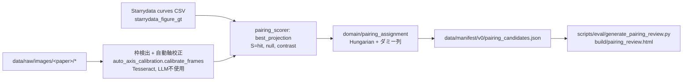

# 画像↔GTペアリングの自動化: 設計ノート

作成日: 2026-09-02
位置づけ: `benchmark-architecture.md` §7.10(「ペアリングは一般には未解決」)に対する設計回答。
状態: 設計確定、実装は段階1のみ着手。

---

## 0. この設計が依拠する構造的転換 — 「ファクターをフィットしない」

現在の目視監査スクリプト(`scripts/eval/generate_verified_pairs_visual_audit.py` の
`_derive_factor`)は、印刷軸の目盛ラベル値を registry の `x_range`/`y_range` で割って
単位換算ファクターを**フィット**し、min端とmax端で得た値(`k_min`, `k_max`, `k_span`)が
食い違うエントリを「要注意」として立てる。111件中**45件**が立っている。

この方式の欠陥は、監査ドキュメント自身が認めているとおり「不一致は必ずしも誤りではない」
点にある。registry のレンジが最外目盛より外まで伸びているだけ(良性の余白)なのか、
本物の単位バグなのかを、フィットしたファクターは吸収してしまって区別できない。

転換点は commit 31bd7e9(§7.47)である。registry.json と ground_truth.json は
**各論文の表示単位で保存する**方針に変わった。したがって registry と印刷軸のあいだの
期待変換は**アプリオリに恒等写像**である。フィットする必要がないどころか、フィットすると
信号が壊れる。期待値を1に固定して初めて、

- 両端が揃って恒等でない → 単位空間が違う
- 片端だけずれている → 余白の大小の問題

という二つが分離できる。45件を仕分けるのに必要なのは、この分離そのものである。

## 1. 訂正: 変換はアフィンであって、乗法ではない(2026-09-02 実測)

上記の「両端が揃って恒等でない」を、当初は**比**で判定する設計にしていた。
111件の検証済みエントリ・208軸を実測した結果、**この判定は不十分であることが分かった**ため、
設計を訂正する。比による判定が発火したのは 208軸中わずか 6軸(paper 46278 のx軸、両端ちょうど
×1000)だけで、実際の単位空間差の大半を取りこぼしていた。取りこぼしの実例:

| エントリ | registry | 印刷ラベル | 実体 | 比判定が失敗する理由 |
|---|---|---|---|---|
| `4965/13164` x | [298.15, 353.15] | (30, 80) | **K vs ℃** | 純粋なオフセット。比では原理的に見えない |
| `446/8724` x | [273.15, 723.15] | (0, 400) | **K vs ℃** | 同上 |
| `44283/38965` y | [0.0, 2.5e-05] | (0.5, 2.5) | ×1e5 | 下端が **0** で比が未定義 |
| `21682/21283,21284` y | [-0.0004, 2e-05] | (-400, 0) | ×1e6 | 端が0近傍/符号あり |
| `4173/20121` y | [-5.6e-05, -4.4e-05] | (-60, -40) | ×1e6 | 負値 |
| `5902/15114` y | [-8e-06, 2.5e-06] | (-8, 2) | ×1e6 | 負値 + 0近傍 |
| `34286/33296` y | [0.0, 0.0025] | (5, 30) | ×1e4 | 下端が0 |
| `46278/51437–51442` x | [0.0008, 0.0018] | (0.8, 1.8) | ×1000 | (比判定で唯一検出できた6件) |

したがって判定は、両端の対応から**アフィン写像 `label = a·registry + b` を解く**方式に改める。
ゼロ端・負値・オフセット(K/℃)がすべて素直に扱える。

**ただし2点だけでアフィン写像は一意に決まるので、両端だけからは写像の妥当性を検証できない。**
第三の拘束が要る。

> **訂正(2026-09-02、実装時に判明)**: 当初この第三の拘束に**GT曲線の値域**を充てる
> と書いていたが、これは**数学的に成立しない**。単調なアフィン写像のもとでは、GTが
> `[reg_lo, reg_hi]` の内側にあれば `[label_min, label_max]` の内側に写ることが
> **恒に保証される**ため、GT値域は写像について何の情報も持たない。実装者が
> `domain/pairing_checks.py` の作業中にこれを発見し、隠さずテストで固定した。
>
> **本当に独立な第三の拘束は単位文字列である。** GT曲線自身の `unit_x`/`unit_y`
> (`ground_truth.json`)と、画像から読み取った印刷軸の単位
> (`axis_pixel_candidates.json` の `x_axis_unit`/`y_axis_unit`)は、端点の値を一切
> 参照せずに**期待される変換**を与える。`domain/unit_conversion.py` の
> `si_to_display_factor` と次元解析(§7.46)がまさにこのために存在する。
>
> - 解いた `a` が次元解析の期待値と一致(かつ `b` が期待どおり: 純粋なスケーリングなら
>   0、K↔℃ なら ∓273.15)→ `unit_space_difference`(推測ではなく**証拠**を伴う)
> - 単位が次元的に非両立(`IncompatibleUnitsError`)→ `real_mismatch` の強い証拠。
>   端点のずれどころか、そもそも別の図とペアリングされている可能性がある
> - 次元は両立するが `a` が期待値と食い違う → `real_mismatch`。端点が、単位自身が
>   宣言している関係を裏切っている
> - 単位文字列が欠落・解析不能・次元的に曖昧(`'-'`)→ `indeterminate`。推測しない
>
> なお `46278` のように、次元は同一(`K^(-1)` vs `1/K`)なのに端点が `a=1000` を
> 示すケースがある。印刷軸が `1000/T` だからである。これは軸ラベル側のスケール係数
> (`1000/T`、`σ×10⁴`)であって誤りではなく、このコーパスでは頻出する。次元一致下での
> きれいな10のべき乗の食い違いは、この signature として扱う必要がある。

## 2. 判定は3値ではなく4値

| 判定 | 意味 | スコアリングへの影響 |
|---|---|---|
| `benign_margin` | 同一単位空間。registryが最外目盛の外に少し出ているだけ | なし(正常) |
| `unit_space_difference` | registryとGTは相互に自己完結しているが、印刷軸とは別の単位空間 | **なし(正常)**。ただし表示単位変換の未処理バックログ |
| `real_mismatch` | 端点から解いた写像をGTの値域が否定する | 要修正 |
| `indeterminate` | 軸ピクセルデータ欠損等で判定不能 | 判定を出さない |

`unit_space_difference` を独立の判定値にするのが要点である。paper 46278 の6件は、registry
レンジ・GT曲線・両者の相互関係のすべてがSIで自己完結しており、印刷軸(1000/T、log10表示)と
だけ違う。README/§7.47 が明示的に認めている「SIのまま残る少数派」であって、**誤りではない**。
これを `real_mismatch` に混ぜると、正常なデータを6件壊すことになる。

同時に、これを `benign_margin` に混ぜてもいけない。表示単位への変換が未完了であるという
事実は追跡する価値があり、混ぜると追跡できなくなる。

## 3. 実測した許容幅の根拠

同一単位空間と判定された軸の 404 端点について、`|registry端点 − ラベル| / L`
(L = ラベル張り幅、log軸はlog10空間)の分布:

| 分位 | 値 |
|---|---|
| p50 | 0.000 |
| p75 | 0.000 |
| p90 | 0.125 |
| p95 | 0.446 |

0.25 を超える端点は 24/404(5.9%)。**この残差の裾には、比判定が取りこぼした単位空間差が
まだ混入している**ため、真の良性余白分布はこれよりさらに締まっているはずである。

したがって許容幅は 0.25·L を出発点としつつ、「p95」と称してはならない(実測ではp93相当)。
アフィン判定で汚染を除去したのち **0.15·L 程度まで締められる見込み**である。閾値は
モジュール定数として、この分布をdocstringに残した上で置くこと。

GT張り幅比 `GT_span / L` は同一単位空間の202軸で p5 = 0.376 / p50 = 0.900 / p95 = 1.093。
被覆帯 [0.35, 1.15] は実測に耐える。

## 4. 候補生成 — 論文単位の割当問題

ペアリングは 2,555 図の独立判定ではなく、**論文ごとの割当問題**である。1論文が P 個の
パネル画像と F 個のGT図集合を持ち(中央値4図/論文、最大30)、コスト行列は P×F ≤ 約40×30。
Hungarian法にダミー行・列(未割当を一定コストで許す)を足して解く。1つのGT図集合は高々1つの
パネルに対応する。1つの `figure_id` が2パネルにまたがる場合は solver に渡さず人手に回す。

コスト行列は幾何計算の前にほぼ無限大で埋まる:

- **次元ゲート**: `unit_conversion.si_to_display_factor` が `IncompatibleUnitsError` を
  投げる組はコスト∞。Seebeck係数・電気伝導率・ZT・熱伝導率が混同されることはなくなる。
  これだけで論文内の候補は通常1〜3件に落ちる(ZTパネル2枚、本図とinset、HP系列とSPS系列)。
- **参照文字列ゲート(ソフト)**: `figure_reference`(「3(a)」「4_ZT」「9 right」)と抽出側が
  記録したページ番号・パネル文字を突き合わせる。一致はボーナス、不一致はペナルティ止まりで
  ブロックはしない。Starrydata の参照文字列は自由記述で信頼できないため(2,555図中、パネル
  文字を持つのは765件、裸の数字が473件、自由記述が1,317件)。

## 5. 数値クロス検証の検査項目

すべて表示単位空間で行う。

| # | 検査 | 種別 | 許容幅とその根拠 |
|---|---|---|---|
| C1 | x/y の単位次元が両立 | ハード | 次元解析は厳密。許容幅なし |
| C2 | 図参照文字列の一致 | ソフト | Starrydata側が自由記述のためブロックしない |
| C3 | **包含**: GTの値域が [min_label − 0.25L, max_label + 0.25L] に入る | ハード | §3の実測。目盛4〜6本の軸の主目盛1つ分に相当。目盛**誤読**は離散的(桁違い、×10ⁿ の見落とし)なのでこの幅を大きく超え、粗い失敗として現れる。許容幅が吸収する必要はない |
| C4 | **被覆**: `GT_span / L` が [0.35, 1.15] | 下限ハード/上限スコア | 実測 p50=0.900。0.35未満は共有軸・多パネル画像か別図 |
| C5 | GT系列数 ≤ 画像上の可視系列数 | ハード | 描かれている以上の曲線をデジタイズできるはずがない。一致はボーナス。軸読みLLMプロンプトに系列数の取得を追加する必要あり |
| C6 | スケール整合: log軸 ⇔ GTが1桁以上、線形軸 ⇒ GTが2.5桁未満 | ハード | 2.5桁を線形軸で描く論文は存在しない |
| C7 | **インク重なり**: 目盛→ピクセル校正でGT点を投影し、3px以内に暗ピクセルがある点の割合 | 連続値 0–1 | 3px = モデル間ピクセル不一致の中央値1.5pxの2倍 + 150dpiでの線幅 |

C7 は、**同一物理量・同一軸レンジの2パネル**(例: 10939 の Fig 3d と 5d)を分離できる唯一の
検査であり、既存レビューUIが描いているオーバーレイをそのまま再利用できる。

**C7 は本設計で最も確信度が低い項目である。** グリッド線・曲線の重なり・マーカーのみの
プロットで値が膨らんだり潰れたりしうる。**決着させる実験**: 111件の正例と、論文内の
次元両立する誤ペアリング全件を負例として C7 を回し、2つの分布を出す。重なりが5%未満なら
下記閾値を採用、そうでなければ C7 は自動判定から外してレビュー専用にする。

## 6. 信頼度と閾値

重み付き和にはしない。ゲート列 → 連続値、の二段。

1. C1 / C3 / C4下限 / C5 / C6 のいずれかが落ちたら候補コスト∞。全候補が∞のGT図集合は
   **自動未割当**(記録するがレビューには回さない — データ量の損失はここで安く受ける)。
2. 生き残った候補: スコア *S* = C7のインク割合、マージン *M* = 同一論文内の S(最良) − S(次点)
   (競合なしなら M = 1)。
3. **自動採用**: S ≥ 0.80 かつ M ≥ 0.30 かつ C2が矛盾しない。**レビュー**: ゲートを通った
   その他すべて。**自動棄却**: ゲート落ちのみ。**Sが低いだけで棄却はしない。**

動作点の根拠は非対称性にある。**偽陽性(誤って採用)はGTを静かに汚染し、目視監査でしか
発見できない**(既知の誤り12件はすべて目視監査で見つかった)。偽陰性(誤って棄却)は
2,555図のうち1図を失うだけである。したがって採用レーンは意図的に狭く、単一のハードゲートで
図集合ごと自動棄却する一方、単一のソフト検査だけで自動採用することはない。

## 7. 人手抜き取りのプロトコル

現在の規模(目標300、約30論文)では、人の役割は探索ではなく確認である。レビューUIの1画面に
クロップ・校正オーバーレイ・表示単位で再プロットしたGT・C3/C4/C7の数値を並べ、問う質問は
**1つだけ**にする: 「GTの点が描かれた曲線の上に乗っているか」— はい / いいえ / 判断不能。
単位もレンジもライセンスも聞かない(機械検査済み、あるいは別管理)。

- **バーンイン: 自動採用の100%を人が見る。** 連続100件を覆しなし(許容: 1件以内)で通過するまで
  続ける。1画面10秒なら300件で1時間未満であり、GTが1件汚染されるコストより安い。
- バーンイン後: 自動採用の25%(全論文から最低1件になるよう層化)+ **S ∈ [0.80, 0.90] または
  M < 0.5 のものは100%**。
- レビューレーンは当然100%。
- 覆りが出たらバーンインのカウンタをリセットし、その事例を C7 実験の負例として記録する。

## 8. 監査可能性

本プロジェクトの明示された優先順位は**「監査可能性 > 精度」**である。

新規コミット対象ファイル `data/verified_pairs/pairing_decisions.json` に、採用・棄却・未割当・
レビュー済みを問わず**候補ごとに1レコード**を残す:

```
{candidate_id, paper_id, figure_id, image_path, image_sha256,
 axis_candidate_ref, gt_curve_ids, gt_n_points_hash,
 affine_map {a, b, source, third_constraint_ok},
 checks: {C1..C7: {inputs, value, threshold, pass}},
 competitors: [{figure_id, S}], S, M,
 decision, decided_by: "rule@<git sha>" | "human:<id>",
 decided_at, human_verdict?, note?}
```

規約:
- 閾値は単一のドメインモジュール(`domain/pairing_checks.py`、純関数、カバレッジ100%)にのみ
  置く。散文中に閾値を書かない。
- **記録された git sha のルールを記録された入力に対して再実行したら、判定がバイト一致で
  再現しなければならない。** 既存の111採用 + 9棄却に対してこれをCIで検証する。
- registry.json の `evidence` は、判定レコードへのポインタ + 人のコメントに置き換えていく。
  自由記述の数値ナラティブは、まさに paper 10939 で4回転記ミスを起こした形式である。

## 9. 45件の要注意エントリへの適用

§1〜§3を適用した判定手順:

1. 両端からアフィン写像 `label = a·registry + b` を解く。
2. GT値域を第三の拘束として写像の妥当性を見る。
3. `a ≈ 1, b ≈ 0` でない かつ 写像が妥当 → `unit_space_difference`(正常、変換バックログ)。
4. `a ≈ 1, b ≈ 0` なら残差を余白として評価: 各端点が 0.25·L 以内(§3)、かつ registry レンジが
   GT値域を包含し、かつ**両端点を校正経由でピクセルに投影して画像内(±3px)に落ちる**
   → `benign_margin`。
5. それ以外 → `real_mismatch`。

**手順4の投影チェックは省略不可。** paper 10939 の figure 1528 は、registry 下端 −20 に対し
印刷ラベル −30 µV/K で、ずれは 0.11·L しかなく余白判定を通ってしまうが、その端点は画像の
上端より外に落ちる。投影チェックだけがこれを捕まえる。

## 10. 段階計画

1. **§9のルールを45件に適用**(純関数 + テスト、1回実行)。最も安く、既存111件のリスクを
   即座に下げる。← 本ノート時点でここに着手。
2. `domain/pairing_checks.py` に C1・C3〜C6 とHungarian割当を実装。回帰テスト: 既存の
   111採用 / 9棄却を再現すること。**新規LLM呼び出しは不要** — C5以外の入力はすべて既存。
3. 既存の2モデル軸読みパスを候補プールに対して実行。優先順位は期待収量順:
   未使用かつ3〜8図の論文、頻出上位6量の `prop_y`、パネル文字付き参照、insetなし。
   約40論文で200ペアが見込める。
4. C7 と §5 の分離実験、その後に判定ファイルとレビューUIの判定ボタン。
5. §7のバーンインレビュー。

## 11. 自動化しないと決めたもの

- **ライセンス検証**: 対象は約30論文。pymupdfのテキスト抽出 + 人の目視を維持する。
  この方式は過去にOpenAlexの誤分類を1件捕まえた実績がある。
- **inset・軸破断・共有軸スタックの切り出し**: 未対応として未割当に落とす。ここでの
  ヒューリスティクスは過去に例外なくバグを生んでいる。
- **系列ラベルと曲線の対応付け**: ペアリングには不要。
- **Starrydata側の単位タグの修正**: C1で検出して報告するに留め、上流データを書き換えない。

---

## 12. 段階1(候補生成と一括レビュー画面)の実装メモ(2026-10-09、レビュー待ち)

対象: §7.87 で再取得した CC BY 46論文 / 721画像 / 図170(public 139)。**候補とレビュー画面を作るだけ**で、
`registry.json`・`ground_truth.json`・`verified_pairs/` は触らない。ネットワークアクセスなし
(Starrydata 曲線は `~/.cache/real-chart-bench/starrydata-work/` のローカルCSV)。

### 12.1 パイプライン



### 12.2 §5/§6 からの逸脱(明示)

- **C1(次元ゲート)は数値形のみ**: 印刷軸の単位文字列は LLM 読みが無いと得られないため、
  `candidate_transforms`(スケール・K→℃・1000/T・log10)のうち、点が枠内に収まる形が無ければ
  「別の量」として候補から落とす。`unit_conversion` による次元ゲートは未使用。
- **C2(参照文字列)・C5(系列数)は未使用**(C5 は LLM の系列数読みが要る)。C3/C4/C6 は `best_projection` の
  枠内率・被覆の判定で代替。
- **C7 = hit(S)**。§5 の「決着させる実験」は未実施。よって閾値は暫定(`pairing_assignment.py` の定数)。
  → 2026-10-10 に検証済みペア136図で実施: [docs/experiments/2026-10-10-pairing-threshold-validation.md](../experiments/2026-10-10-pairing-threshold-validation.md)。
  結論: S は S=1.0 で飽和して誤りを分けず、M だけが判別軸。精度≥99%の採用レーンはこのデータでは根拠づけられない(閾値は未変更)。
- 採用レーンは作らない。**全候補を人が見る**(§7 バーンイン)。レーン `high`(S≥0.80, M≥0.30, contrast≥0.35)は
  レビュー順を決めるだけ。`MIN_HIT=0.5`, `MIN_CONTRAST=0.2` 未満は `unassigned` として記録のみ(レビューに出さない)。

### 12.3 割当と判定

論文ごとに 枠×図 の Hungarian(未割当ダミー列付き)。1図=1枠、1枠=1図。図は Starrydata の
最頻 (prop_x, unit_x, prop_y, unit_y) の曲線だけを投影し、他は件数だけ記録。判定値:
`proposed_high` / `proposed_review` / `unassigned`(理由: `no_calibrated_frame` / `no_eligible_frame` / `lost_assignment`)。
同一図が埋込画像とページ描画に二重に写る場合、互いが競合になり M が小さくなる(レビュー側に回るだけで害はない)。
1論文3図の上限(scaling §1.1)は強制せず `paper_rank` を記録する。

### 12.4 レビュー画面

1枚のHTML(画像は data: URI JPEG)、グリッド、問いは1つ「点は曲線の上に乗っているか」(はい/いいえ/判断不能)。
判定は JSON で書き出し、`shown_sha256`(見せた絵のハッシュ)に紐付ける(scaling §4.4)。Artifact db 連携は未実装。
**画像は public 分割の図のみ埋め込む**(held_out は候補レコードのみ、画像なし)。HTML は `build/`(gitignore)。
ライセンスは論文単位の CC BY(OpenAlex + 今日の Unpaywall)であり、図単位の目視確認(§11)は未了 —
レコードに `licence_figure_verified: false` を置く。

### 12.5 同一図の二重写り: 埋込画像を優先する(2026-10-09、§12.3 の改訂)

ページ描画(`pNN_page_render_*`)は、同じページの埋込画像(`pNN_embedded_*`)と同じ図を二重に写す。
二重写りは互いが競合になり M を潰す(§12.3)ため、**割当の前に**重複を除く:
同一ページ(ファイル名の `pNN`)の埋込画像の枠と、ページ描画の枠が、**同じ図に対して両方とも適格**
(`PairScore.eligible`)なら、ページ描画の枠を落とす(埋込のほうが画質がよく、ベンチマーク画像として使える)。
別の図を写しているページ描画の枠(埋込と共有する適格図なし)は残す。落とした枠は競合にも候補にも数えない。
実装: `usecase/pairing_candidates.prefer_embedded_frames`(純関数)。

### 12.6 第2の画像ソース: starrydata-work(2026-10-10)

`~/.cache/real-chart-bench/starrydata-work/images/<paper>/`(72論文、すべて papers.json で CC BY)も同じ候補パイプラインに通す。
`scripts/train/starrydata_fetch.py` の出力で、**ネットワークは使わない**(ローカル済み)。既に候補ファイルにある論文
(data/raw と重なる26件)・ベンチマーク登録論文は**再処理しない**。新規は46論文 / Starrydata図183(public 128)。

`pairing_candidates.json` は同じファイルに追記し、各レコードに `image_source`
(`data_raw_refetch` | `starrydata_work`)を持たせる。既存レコードは値を変えない(`image_source` の追記のみ。
`decided_by` は決めたルールのコミットのまま)。生成は増分(`usecase/pairing_candidates.merge_candidate_records`)。

**出自(provenance)の差異** — data/raw と同等ではない:

| | data_raw_refetch | starrydata_work |
|---|---|---|
| PDF取得 | `refetch_cc_by_pdfs.py`: 全 OA ロケーションを試行、`refetch_log.json` に経路URL・`pdf_sha256`・画像sha | `starrydata_fetch.py`: Unpaywall の最初に取れたURL。URLは**記録なし**(`fetch_status.json` は状態のみ) |
| 画像抽出 | `PyMuPdfFigureExtractor`、ページ描画150dpi、`.jpg`/`.png` | 同抽出器、ページ描画**200 dpi**、埋込画像は生バイトの `.img` |
| sha | refetch_log に画像sha | 保存ファイルから計算。PDF shaは `work_pdf_sha256`(ローカルPDFから計算) |

重なる26論文で画像shaを突き合わせると多くが一致しない(PDFの入手元が異なる版、描画dpiが違う)。したがって
同一論文でも2ソースの画像は別物として扱い、論文の重複処理はしない。ライセンスは両ソースとも論文単位(今日の Unpaywall
で再確認済みなのは refetch 側のみ。work 側は `starrydata_fetch.py` が取得時に確認)。図単位のライセンス確認(§11)は未了で、
`licence_figure_verified: false` のまま。

### 12.7 校正・射影の再現率改善(2026-10-10、診断と方針。しきい値は変更しない)

動機: [検証実験](../experiments/2026-10-10-pairing-threshold-validation.md) で、検証済み136図のうち47図が未割当
(真ペアが適格にならない)。閾値ではなく校正・射影段の問題。LLM 出力は一切使わない。

**評価分割**: 検証済み論文を id 昇順に並べ index%3==2 の13論文を held-out(3733, 4965, 5904, 17037, 17044, 18869,
27759, 29352, 36305, 44283, 46278, 47367, 48032)、他26論文を dev とする。修正は dev の失敗から選ぶ。
ただし診断中に held-out の 28331(dev)・3733・44283・18869 の画像も目にしている(分割前に失敗一覧を見た)。

**失敗の分類(47図、目視+校正ログ)**

| 原因 | 図の例 | 対処 |
|---|---|---|
| 目盛り語が画像端に接し v3 が丸ごと捨てる(結合語 "300320…500" 等、切れた左端ラベル) | 28331×5, 36342 3f | 通常読みが <3 目盛りのときだけ端接触語を残して再読(フォールバック) |
| 結合語の分割が最長片優先で退化(220230240… を3個の巨大数に) | 43697 | `split_merged_labels` は最多片の分解を採る |
| スケール変換が ±12 桁まで(キャリア濃度 m^-3→10^20 cm^-3 は 1e-26) | 36342, 3733×4 | `candidate_transforms` の scale を ±30 |
| 二重 y 軸(左右とも校正可でも左のみ採用) | 36342 34990 | 左右両方を別フレームとして保持(次段) |
| log(σ) 保存値が対数軸の印刷値 σ に写せない(兄弟図に画像を奪われる) | 45906, 45914, 47247, 47265, 47367, 48032, 36305 | 兄弟(同一プロット二重デジタイズ)問題。今回は対処しない |
| 画像側の限界: 軸が切れた/破断軸/枠線が途切れ/低解像度 OCR 誤読 | 10939 3b, 44283 fig1, 18869 3b, 17040, 18759, 18668, 83, 47534, 32593 | 対処しない |

**結果(実装済み: 結合語分割・scale ±30・端接触語フォールバック。二重 y 軸フレームは未実装)**

| 検証済み136図 | 前 | 後 |
|---|---|---|
| 正しい提案 | 87 (64%) | 92 (68%) |
| wrong(精度の誤り) | 2 | 2(同じ 28331/28505, 44283/39571) |
| sibling | 6 | 6 |
| dev 26論文(73図)正 | 44 | 46 |
| held-out 13論文(63図)正 | 43 | 46 |

本番候補(340図)を `generate_pairing_candidates.py --redecide`(人手判定がまだ無いので安全。既定の増分動作は不変)で再決定:
high 97→101, review 50→54, unassigned 193→185(no_eligible 133→124, no_calibrated 41→41, lost 19→20)。
画像が変わった提案は0。新規提案9、high→review 1(5167-3495)、high→unassigned 1(14649-43660, S=1.0 M=1.0 だったもの)。
後者は要人手確認(scale 範囲拡大かフォールバックで最良射影が変わった疑い。原因未調査)。

### 12.8 二重 y 軸フレーム(左右の y 校正を別フレームで保持)と 14649-43660 の回帰(2026-10-10)

**回帰の原因**: §12.7 の `split_merged_labels` を最多片にしたことで、14649 のページ描画の x ラベル行 "50100150200250300"
(psm 6 が "0" を落とす)が 6 語に分かれ、箱位置のずれで 4/6 しか直線に乗らない fit(n=4)が出る。従来は
`n>=4` で psm 11 を試さず打ち切っていたため、psm 11 なら読める全7目盛り(0〜300)に届かなかった。
修正: 打切りは「読んだ全ラベルを説明する fit(n>=4 かつ n>=読み数)」のときだけ。それ以外は他方の読みも試し最良を採る。

**二重 y 軸**: `calibrate_frames(both_y_sides=True)` は、左・右どちらの y 軸も校正できた枠を別エントリ(同一 bbox、
`y_side` が left/right)で返す。既定 False(他の呼び出し元は不変)。割当は 1図=1枠のままなので、二つの量を持つ
プロットは2図が同じ画像の別側に割り当たる。生成スクリプトは `--both-y-sides`、検証は `collect --both-y-sides`。

**結果(検証済み136図)**: 打切り修正のみ・二重 y 追加とも 正92/誤2/sibling6 で不変(dev 46、held-out 46)。
検証済み図には二重 y で救えたものが無かった(36342 34990 は別原因)ため、**検証集合では効果も害も測れていない**。
本番340図の再決定(`--redecide`): 

| | §12.7 | 打切り修正のみ | + 二重 y(採用) |
|---|---|---|---|
| high | 101 | 108 | 107 |
| review | 54 | 52 | 60 |
| unassigned | 185 | 180 | 173 |

二重 y は 新規提案 +12、high→review 3(競合枠が増えて M が下がる)、提案画像の変更0、提案の消失0。
追加の12件は人手未確認(検証集合で精度を裏付けられない)。レビュー画面は全件を人が見る前提なので採用したが、
精度の根拠は無い点を明記する。

### 12.9 兄弟(同一プロットの二重デジタイズ)をグループで扱う(2026-10-10)

問題: Starrydata は同じ印刷プロットを σ と log(σ)(保存値は 100·log10σ−200 という単位変換の産物)、あるいは同一曲線を
2つの図レコードとして持つことがある。log 版は射影できず(shift ±6 に収まらない)、σ 版だけが画像に割り当たる。
検証実験では「正解画像に別図番号が付く sibling 6件」と、人手検証済み log 版 6図の未割当(no_eligible_frame)として現れた。

```mermaid
flowchart LR
  G[Starrydata 図] --> D[domain/pairing_siblings.sibling_groups]
  D -->|グループ| C[decide_paper: グループを1つの図として Hungarian]
  C --> P[primary: proposed_*, siblings=[…]]
  C --> S[他のメンバー: decision=sibling_of, sibling_of=primary]
  P --> R[レビュー画面: 1タイル]
```

**検出(`domain/pairing_siblings.are_siblings`、保守的)**: 同一論文・同一正規化図番号("8a sigma"≈"8a")・同一 x 量/単位・同一 y 量
(`log(…)` 接頭辞は無視。同じく温度で単調増加する σ と κ は別量なので兄弟にしない)、かつ小さい側の曲線の50%以上に、
x 値が一致する相手曲線があり、y が(a)一致するか(b)片方だけが log 量のとき3点以上で厳密単調関係にある。グループは推移閉包。
実データ走査(本番候補89論文+検証済み論文): 12グループ=既知の6組+46278 の log/σ 6組。誤検出なし。

**割当(`decide_paper(sibling_groups=…)`)**: グループは1つの図として扱う(同じ枠を二重に取り合わず、互いが競合として M を潰さない)。
枠ごとに最も良く射影するメンバー(S 最大、同点なら印刷軸の尺度に合う方 = `ScoredProjection.matches_axis_scale`
〔log10 変換を要さず、log 量は線形軸のとき〕、次に小さい id)を primary とし、primary は通常の `proposed_*` 記録
(+`siblings: [candidate_id…]`)。他メンバーは `decision: "sibling_of"`, `sibling_of: <primary の candidate_id>`, `image`, `frame_id` のみ
(独立したペアリングではなく、レビュー画面にも出ない)。グループのどのメンバーも適格な枠が無いときは各自の `unassigned` 理由のまま。
グループ指定が無い場合の挙動はバイト単位で従来と同じ。

**評価の数え方**: primary の提案が、検証済みメンバーの所有画像を指すとき `group_correct`、その検証済みメンバーの記録は
`covered`(sibling_of で画像が一致)。再現率 = (correct + covered) / 検証済み図数。
