# 検証を規模化する — 94図の先にある人手の設計

- Status: **Draft(司令塔レビュー待ち)**
- Author: worker (Claude Opus 5, herdr 経由)
- Created: 2026-10-07
- 位置づけ: オーナー判断「1790図まで増やせるならそれは良いと思います。律速のペアリング検証はまぁやるしかないと思っています」
- **2026-10-07 追記: 本書の提案どおり、目標は 600図(論文300本以上)に確定した。** オーナー判断「規模の目標はそれでokです」。
  1,790 は実測の歩留まりでは届かず、届く唯一の道(`gt_incomplete` の補足デジタイズ)は人手を増やす方向で意図と逆を向く。
  600 は分解能から正当化できる数字であり、それ以上は正解データ自身の誤差(未測定)に埋もれる。
  に対する**人手設計の回答**。
  `pairing-automation.md`(ペアリング自動化、2026-09-02)の段階2〜5を具体化し、
  `figure-fetch-distribution.md`(配布方式、2026-10-07)の Phase 0〜2 と前提を共有する。
  `benchmark-architecture.md` §7.19(量より信頼性)・§7.44〜§7.45(目視監査)・§7.60(軸レビュー)・
  §7.77(目盛校正)・§7.82(主条件2つ・費用記録)を引く。
- 実装: **なし**(設計ファースト方針。司令塔レビュー合格まで着手しない)
- 実測: 本書の数字はすべてコミット済みファイルから再導出した。導出方法は §2.1 と各表の脚注に書く。

---

## 0. 結論の先出し

| # | 結論 | 根拠 |
|---|---|---|
| 1 | **1,790 という数字は、今日の方針・今日の経路・今日の歩留まりでは出てこない。** 実測の歩留まりで引き直すと **約 790図**、held-out 枠を使い切って全論文の PDF が取れた場合の上限が **約 1,290図** である | §1.2 |
| 2 | 1,790 に届く道は1本だけある。**除外の最大分類 `gt_incomplete`(45件中26件)を補足デジタイズで救うこと。** これは人手を減らす話ではなく**増やす**話で、オーナーの意図と逆を向く | §1.3 |
| 3 | **私が擁護できる目標は 600図(論文300本以上)である。** 理由は規模ではなく**分解能**: 現在の 80図では上位3モデルの差(0.017〜0.018)が検出限界(0.030)の下にあり、**順位表は上位3行を区別できていない**。600図で区別できるようになる | §1.1 |
| 4 | 図は**論文単位で相関している**。opus-sonnet の差の論文内相関は 0.46、設計効果 2.22 で、80図の実効 n は 36 しかない。**同じ論文からパネルを足すのは半分しか効かない。** 1論文3図の上限を置き、幅を先に取る | §1.1 |
| 5 | 今日の人手は「1図を1回見る」ではなく「**全図を7回見直す**」に消えている。削るべきは初回レビューではなく**再レビュー**である | §2.3 |
| 6 | 今日の手作業の**誤受容率は実測で 4.3%**(139件中6件が verified 後に `gt_mismatch` で除外)、**事後修正率 10.1%**(14件)。規模化した手順は「同等」では不足で、**これより良くなければ採ってはいけない** | §6.1 |
| 7 | **1,790図での順位表1周は、サブスクリプションに入らない。** 実測の消費率から、4モデル×2条件で**使用枠 31周ぶん**。常用セット(screen)と全体セット(full)の分離は選択肢ではなく**強制**である | §7 |
| 8 | human ceiling(正解データ自身の精度)は今も `pending_external_run` で**一度も測っていない**。20倍にする前に測る。測っていない誤差より細かい分解能を主張してはいけない | §6.4 |

**要するに**: 規模化はやるべきである(§1.1 の分解能の穴は実在する)。ただし目標は 1,790 ではなく **600**、
増やす単位は図ではなく**論文**、削る対象は初回レビューではなく**再レビュー**である。

---

## 1. 目標を問い直す — 何図あれば何が言えるのか

### 1.1 現在の 80図は、上位3モデルを区別できていない(実測)

主指標は点 F1(τ=2%、macro、密集マーカー14図を除いた **80図**)。
`results/claude-{opus-5-5,fable-5-1,sonnet-5-5}-v0-r3-noaxis.json` の
`per_figure[].point.by_tau["0.02"].point_f1` を図ごとに対応させ、**対応のある差**を取った。

| 組 | 平均差 | 差の標準偏差 | t(n=80) | 80%検出力に要する n(素) | 論文クラスタ補正後 |
|---|---|---|---|---|---|
| Opus 5.5 − Fable 5.1 | **0.0170** | 0.0943 | 1.61 | 241 | **241** |
| Opus 5.5 − Sonnet 5.5 | 0.0346 | 0.1012 | 3.06 | 67 | **149** |
| Fable 5.1 − Sonnet 5.5 | **0.0176** | 0.1412 | 1.11 | 506 | **818** |
| Opus 5.5 − GPT-6.1-Sol | 0.0073 | 0.0291 | 2.26 | 123 | — |
| Opus 5.5 − Qwen3.5-9B | 0.5002 | 0.3909 | 11.45 | 5 | — |

**n=80 での最小検出可能差は 0.0295 である**(α=0.05 両側、検出力80%、Opus-Fable の差の sd を使用)。
Opus−Fable(0.0170)と Fable−Sonnet(0.0176)は**どちらもこの下にある**。
順位表の上位3行の並びは、現在のデータセットでは**統計的に支持されていない**。

| n | 最小検出可能差 |
|---|---|
| 20 | 0.0591 |
| 80(現在) | **0.0295** |
| 94 | 0.0272 |
| 120 | 0.0241 |
| 200 | 0.0187 |
| **600** | **0.0107** |
| 800 | 0.0093 |
| 1,790 | 0.0062 |

**論文単位の相関(実測).** 80図は **22論文**から来ており、上位4論文が 45図(56%)を占める。
一元配置の ICC を差の系列について計算した:

| 組 | 論文内相関 ICC | 設計効果 | 実効 n(名目80) |
|---|---|---|---|
| Opus−Fable | +0.001 | 1.00 | 79.8 |
| Opus−Sonnet | **+0.464** | **2.22** | **36.0** |
| Fable−Sonnet | +0.234 | 1.62 | 49.4 |

同じ論文の別パネルは、モデル差について**同じことを言う**ことがある(論文の体裁・解像度・マーカー種が共通だから)。
したがって:

- **増やす単位は図ではなく論文である。** 1論文から12図取るより、12論文から1図ずつ取るほうが情報が多い。
- 第1段では **1論文あたり3図を上限**にし、幅を先に取る。上限は後から外せるが、偏りは後から直せない。
- 現在の 94図の `scoreable/論文` は 94/46 = 2.04 なので、上限3は**収量をほとんど削らない**。

**結論**: 600図を**論文300本以上**から取れば、現在隣り合っている組のうち Fable−Sonnet 以外すべてが分離する。
Fable−Sonnet まで分離するには 800〜1,000図。**1,790図が買うのは 0.0093 → 0.0062 の分解能**であり、
その差は正解データ自身の誤差(§6.4、未測定)より小さい可能性が高い。**測っていない誤差より細かい主張はできない。**

### 1.2 1,790 という数字を引き直す

`docs/experiments/2026-10-07-license-rescreen.md` の見込みは
「CC BY 632論文 × 論文survival 0.90 × 3.13図/論文 ≒ 1,790」である。
この式の 3.13 は**図を1枚でも採点対象にできた30論文だけ**の平均で、0.90 は
「500論文スクリーニング → CC BY 33本 → 採点30論文」から来ている。

`registry.json`(main 36838ee)から直接数え直す:

| 実測 | 値 |
|---|---|
| 着手した論文 | **46** |
| そのうち採点対象を1図でも出した論文 | **30(65.2%)** |
| 登録エントリ | 157(verified 139 / rejected 18) |
| 採点対象 | **94**(paper 446 の3図を除外する判断が出れば 91) |
| **着手1論文あたりの採点対象** | **2.04** |
| 生産的な1論文あたり | 3.13 |
| 登録/着手論文 | 3.41 |

論文survival は 0.90 ではなく **0.65** である。したがって 2.04 を使うのが正しい。

| 条件 | 見込み図数 |
|---|---|
| 632論文 × 2.04(全論文の PDF が取れ、held-out も使う) | **約 1,290** |
| held-out 枠(論文の19.2%)を守る | 約 1,040 |
| さらに PDF 到達率を実測で掛ける(§1.2 脚注) | **約 790** |
| rescreen の見込み | 1,790 |

> **到達率の内訳**(`figure-fetch-distribution.md` §8.4 の実測から):
> 画像を持つ179論文の public 677図 × 図レベル歩留まり 0.48 ≒ 325図。
> 画像を持たないが今日 CC BY かつ PDF URL がある324論文の public 1,107図 × 取得成功率 0.87 × 0.48 ≒ 462図。
> 合計 **約 790図**。図レベル歩留まり 0.48 は 2.04 ÷ (2,555図/603論文 = 4.24図/論文) から。

**790図は、それでも今日の 8.4倍である。**§1.1 の目標 600図はこの内側にあり、方針変更も法務判断も要らない。

### 1.3 1,790 に届く唯一の道は、人手を増やす道である

採点除外45件の内訳(registry から再集計)は `gt_incomplete` 26、`gt_mismatch` 6、`harness_limit` 4、
`gt_wrong` 3、`no_markers` 3、`axis_unreadable` 3 である。
**`gt_incomplete` が 58% を占める。** これは「図に描かれている系列が正解データに無い」状態で、
正解データの誤りではなく、デジタイズした研究者が自分に必要な曲線だけを起こしたという事実である(paper 2.3)。

`ground_truth_supplement/` と `import_gt_supplement.py` は既にあり、欠けた系列を補えば採点に戻せる。
全部救えたとすると歩留まりは 2.04 → 2.60図/論文になり、632論文で **約1,640図**。
rescreen の 1,790 にようやく近づく。

**ただしこれは「1図あたりの人手を減らす」ことの真逆である。** 補足デジタイズは曲線1本を人が点で起こす作業で、
ペアリング確認(1図あたり秒〜分)とは桁が違う。

> **正直に書く**: オーナーが受け入れた労力は「ペアリング検証」である。
> 1,790 に届けるには、それとは別種の「補足デジタイズ」を 500本規模で引き受ける必要がある。
> これは別の判断であり、本設計では**第4段の任意項目**として置き、推奨はしない(§5)。

---

## 2. 今日の人手はどこに消えているか

### 2.1 測定方法と、測れなかったもの

3つの独立な出所をコミット済みファイルから使った。

1. **`registry.json` の `verified_at`**(157件、7日付)と、registry を触った git コミットの時刻。
   バルク拡充の作業窓を壁時計で囲める。
2. **`review_decisions.json` の 148件の判定**(`reviewer: "owner"` 全件)。
   質問文・判定・メモ・事後処置が記録されている。
3. **`benchmark-architecture.md` §7.x の記述**。オーナーが何をしたかが引用つきで日付入りで残っている。

**測れなかったもの: 1件あたりの秒数。** `review_decisions.json` の `reviewed_at` は
**セッション単位で一括書き込み**されている(セッション内の判定間隔は中央値 0.0 秒、全141間隔が 0.0 秒)。
7セッションのうち最大は 2026-09-08 の 96件で、これが全部同一秒を持つ。
**1件あたりの時間はリポジトリのどこにも記録されていない。**

> したがって本節の人手の数字は**上下に挟んだ推定**であり、測定ではない。
> **最初に入れるべき計測器は、レビュー画面の1件あたり滞在時間である**(§4.5)。
> 次回この見積りを出すときは、推定ではなく実測になる。

### 2.2 工程ごとの内訳

| # | 工程 | 今日やっているのは | 実測の錨 | 1図あたり(機械) | 1図あたり(人) |
|---|---|---|---|---|---|
| 1 | 候補生成(論文→図→GT図集合) | エージェントが CSV と画像を突き合わせて選ぶ | 2026-08-30、69図を 10:12→13:31 JST = 199分 | **2.9 分**(工程1+2) | ~0 |
| 2 | 数値クロス検証 + evidence 記述 | 同上。evidence は中央値733字の数値ナラティブ | 同上 | (上に含む) | ~0 |
| 3 | ライセンス検証 | PDF 本文を pymupdf で抽出し、CC-BY 文言を人が読む。**自動化しないと決めている**(pairing-automation §11) | 46論文。§7.32 で OpenAlex の誤分類1件、§7.39 で文言不在1件を捕まえた実績 | 0 | **20〜40 秒**(論文あたり 1.5〜3分 ÷ 4.24図) |
| 4 | パネル分割・クロップ | 139件のうち **123件が手製クロップで、枠がどこにも記録されていない**(fetch-distribution §3.5)。自動分割器は実画像で誤検出が多く(2026-08-16 実験、軸目盛ストリップをパネルと誤認)、既定で「自信が無ければ切らない」 | 3件を枠のインク検出で切り直した(paper 2.4) | 0.5 分 | **30〜60 秒**(枠の確認) |
| 5 | 軸・目盛校正 | 2モデルが独立に目盛を読み、不一致を裁定。§7.77 で 97図中85図が既存記録で足り、**12図をオーナーが Web 画面で手入力**(目盛クリック + 値入力 + 重なり確認) | 2026-08-30 の69図で2モデルのラベル値不一致 9件(13%)、画素不一致 中央値1.5px | 0.3 分 | **40〜90 秒**(手入力の12図は分単位、既存流用は0) |
| 6 | 単位の確認 | 表示単位移行(30軸/29図)と印字空間移行(14軸)を一括で実施。異常ごとにオーナー判断 | §7.47 / §7.82(2) | 0.2 分 | **10〜20 秒**(異常のみ) |
| 7 | 目視レビュー | 重ね描き139図をオーナーが通し見し、ずれた20図を指摘(§7.60)。別途 148件の判定 | §7.60、review_decisions 148件 | 0.3 分 | **1.5〜3 分**(§2.3) |

**1図あたりの合計: 機械 約4分、人 約3〜6分。**

人の側のいちばん硬い実測値は**件数**である:

```
オーナーの「1件を見た」回数 = 148(記録された判定)
                            + 139(重ね描きの通し見、§7.60)
                            +  12(手入力の目盛校正、§7.77)
                            = 299 回 ÷ 採点対象94図 = 1図あたり 3.18 回
```

`pairing-automation.md` §7 は「1画面10秒」を仮定していた。実際の判定には
`unclear` 9件・`unsure` 8件が含まれ、§7.60 のような判断は数分かかっている。
1回 30〜60秒と置くと **1図あたり 1.6〜3.2分**。これが人手の主項である。

### 2.3 本当の主項は「再レビュー」である

全図またはそれに近い範囲の見直しが、2026-08-31 から 2026-10-05 までに**7回**走っている。

| 時期 | きっかけ | 規模 |
|---|---|---|
| 08-31 | レビュー Web UI 新設。paper 10939 の y_range 誤り4件 | 111件対象、2件を実見 |
| 09-04 | 目盛値を registry へ昇格(§7.57)、rule (d)(f) の変更 | 24件の判定 |
| 09-07 | GT 重ね描きの通し見(§7.60) | **139件** |
| 09-08 | 軸位置修正34件 + Fable 独立測定46件の確認 | **96件の判定** |
| 09-12 | 軸未レビューだった14図 | 14件 |
| 09-30 | 4件の除外、表示単位移行 | 13件 |
| 10-05 | 目盛ピクセル位置の整備(§7.77) | 97図見直し、12図手入力 |

毎回、**規則が変わったから全部見直した**のである —— 表示単位、印字空間、点指標、マーカーのみ、
dual-y、目盛校正。94図なら一晩で終わる。**1,790図なら20晩になる。**

> **設計の核心はここにある。** 削るべきは初回レビューの秒数ではなく、
> **規則が変わったときに人をもう一度呼ぶ件数**である。
> そのためには、人の判定を「見せた内容のハッシュ」に紐付け、
> 規則変更で**実際に見た目が変わった図だけ**を再キューに入れる必要がある(§4.4)。
>
> `review_decisions.json` の `_comment` 自身がこう書いている ——
> 「ブラウザの localStorage は端末ごとで**項目IDが変わると失われる**ため、判定そのものはここに残す」。
> 項目IDで紐付けるのをやめる、というのはこの観察の自然な続きである。

---

## 3. 工程ごとの処遇 — 自動 / はい・いいえ / 人

```mermaid
flowchart TB
  subgraph AUTO["完全自動(人を呼ばない)"]
    A1["候補生成<br/>論文単位のハンガリアン割当<br/>次元ゲートで候補を1〜3件に"]
    A2["数値検証 C1/C3/C4/C6<br/>domain/pairing_checks.py(実装済)"]
    A3["目盛の自動読み取り v3<br/>adapter/auto_axis_calibration.py(実装済)"]
    A4["系列名の付与<br/>attach_series_labels.py 98.4%"]
    A5["マーカー/線のみ判定<br/>marker_detection.py"]
    A6["gt_incomplete 検出(新規)<br/>枠内の色数 vs GT曲線数"]
    A7["クロップ枠の記録<br/>fetch-distribution Phase 0"]
  end
  subgraph YN["はい/いいえ1打鍵"]
    B1["レーンA 正解点が描かれた曲線に乗っているか"]
    B2["レーンB この曲線はこの試料名か"]
    B3["レーンC 目盛の値はこれか<br/>2読み手が食い違った軸のみ"]
  end
  subgraph HUMAN["人の判断が不可避"]
    C1["ライセンスの裁定<br/>索引が食い違う / PDFに文言が無い"]
    C2["ベンチ図として成立するか<br/>「このグラフ意味わからん」"]
    C3["gt_wrong の確定<br/>他者のデータへの主張"]
    C4["方針の変更"]
  end
  AUTO -->|自動採用| OK[(registry<br/>採点対象)]
  AUTO -->|境界| YN --> OK
  AUTO -->|ゲート落ち| REJ[(自動未割当<br/>人に回さない)]
  YN -->|いいえ| HUMAN
  AUTO -.->|年次| C1

  style AUTO fill:#13301d,stroke:#3a7
  style YN fill:#2a2a3a,stroke:#66a
  style HUMAN fill:#3a2010,stroke:#b73
```



### 3.1 自動化できるもの(機構を具体に)

| 工程 | 機構 | 既にあるもの | 実測された性能 | 残る危険 |
|---|---|---|---|---|
| 候補生成 | 論文ごとに P×F のコスト行列を作り、`unit_conversion.si_to_display_factor` の次元ゲートで∞埋め → ハンガリアン法 + ダミー行列 | `pairing-automation.md` §4 の設計、`domain/unit_conversion.py`、`figure_reference.py` | 未実装(設計は確定) | 1図が2パネルにまたがる場合は solver に渡さず人へ |
| 数値検証 | C1(次元両立)/ C3(包含、0.25L)/ C4(被覆 0.35〜1.15)/ C6(スケール整合) | **`domain/pairing_checks.py` 実装済**(閾値はモジュール定数、208軸の実測が docstring にある) | 既存111採用/9棄却を再現するテストが要件 | C7(インク重なり)は**本設計でいちばん確信度が低い**。§3.4 |
| 目盛校正 | 枠検出 + Tesseract + 等間隔の梯子当てはめ。a×10ⁿ・負号・小数点・逆向き軸・切れたラベルを処理 | **`adapter/auto_axis_calibration.py` の v3 実装済** | **ベンチ94図で両軸一致 75図(80%、許容1%)。** 別コーパス(chartinfo 実図400)で 正しい195 / **誤り40(10%)** / 読めない165 | **誤り10%が本設計最大の品質リスク。** 自己整合検査は誤検知0.8%まで締まったが**誤りの検出率は15%**しかない。倍率(a×10ⁿ)の読み違いはラベル同士が整合するので自己整合では見えない |
| 単位 | 印字どおり1本の規則(§7.82(2))。次元解析で不整合を検出 | `domain/unit_conversion.py`、`adapter/printed_space.py` | 印字空間移行後、報告規則は全軸1文 | Starrydata 側の単位タグの誤りは**検出して報告するだけ**(上流を書き換えない) |
| 系列名 | `sample_name` を正規化した点列の形一致でハンガリアン割当 | **`attach_series_labels.py` 実装済** | 140図549曲線で **98.4% 命名、曖昧28曲線**。採点94図では名前なし0 | 形が同じ曲線が2本あると曖昧。`ambiguous` で人へ |
| 図の種類 | マーカー検出でマーカー/線のみを提案 | `domain/marker_detection.py`、`marker_blobs.py` | `blob_extract` は開発データで 0.83〜0.91 | 線とマーカーの中間(細い線 + 小さい点)は人へ |
| **`gt_incomplete` 検出(新規)** | `sample_curve_styles.py` は既に**軸校正を使って正解点の位置の画素から色を読んでいる**。これを拡張し、**枠内のインク画素全体を色でクラスタリングして系列数を数え、GT 曲線数と比べる**。図の系列数 > GT 曲線数 なら `gt_incomplete` 候補 | `sample_curve_styles.py`(色採取は確認範囲で全曲線一致)、`tick_calibration.json` | 色の採取は実測で全一致、**マーカー形は約75%** | 参照線が本系列と同色のとき見落とす。グリッド線・誤差棒を系列と数える誤検出。**これは人に投げる前の優先順位付けに使い、自動除外には使わない** |
| クロップ枠 | 新規エントリは `crop` 矩形と `final_sha256` を**登録と同時に必須**にする。既存123件は fetch-distribution Phase 0 で逆算 | `adapter/panel_layout.py`、`evaluate_panel_splitter.py` | Phase 0 の受け入れ基準は「123件すべてバイト一致」 | **1件でも落ちたら本設計も撤回する。** 自分の作ったクロップを再現できないなら、新規図でも再現できない |
| ライセンス再確認 | Unpaywall / OpenAlex を定期的に引き直し、許可リスト外への移動をエスカレーション | `scripts/eval/recheck_figure_licenses.py`(2026-10-07 に新設) | **実測で 603論文の 3.0%(18件)が移動**、うち paper 446 は採点対象3図を占めて配布中 | ライセンスは後から変わる。**年次ではなく、リリースごとに回す** |

**`gt_incomplete` の自動検出が、収量にいちばん効く。** 除外45件中26件がここで、
現在の発見経路は「複数の LLM が揃って正解に無い系列を抽出したこと」と「結果閲覧ページで重ね描きを見たこと」である
(paper 2.3)。つまり**採点まで行かないと分からなかった**。
前段で検出できれば、人のレビューキューから26/45が消えるだけでなく、
誤って採点に入った図が**正しい手法を罰する**事故を予防できる。

### 3.2 はい/いいえ1打鍵に落とすもの

`pairing-automation.md` §7 の「問う質問は1つだけ」を継承し、**レーンごとに1問**にする。
レーンを混ぜないのが要点である。混ぜると人が「何を見ているのか」を切り替え続けることになり、
これが 1件30〜60秒の主因である。

| レーン | 問い | 見せるもの | 既定の答え |
|---|---|---|---|
| **A: ペアリング** | 正解点が描かれた曲線に乗っているか | 元図 + 正解点 + 試料名の重ね描き(§4.1) | はい |
| **B: 系列名** | この曲線はこの試料名か | 同じ重ね描き + 凡例の原本 | はい |
| **C: 目盛の値** | 印字はこの数字か | 目盛ラベルの切り抜きを拡大 + 読み取った値 | はい(2読み手が一致した軸はレーンに入れない) |
| **D: ベンチ図として成立するか** | この図は課題として成立するか | 元図のみ | はい |

レーン C は**2モデルが食い違った軸だけ**に入れる。実測で 69図中9件(13%)。
レーン D は自動検出できないので全図を通すが、見るのは図だけで 2〜3秒である。

### 3.3 人の判断が不可避なもの

- **ライセンスの裁定。** 索引が食い違う / PDF に文言が無い(paper 28438)/ 許可リスト外へ移動した(paper 446)。
  過去に OpenAlex の誤分類を1件捕まえた実績がある方式を、自動化で置き換える理由がない。
- **ベンチ図として成立するか。** 26108 の Pisarenko 散布図は軸も GT も整合していたが、
  オーナーの「このグラフ意味わからんので除外」で落ちた。これは規則で書けない。
- **`gt_wrong` の確定。** 他者のデータについての主張であり、上流に報告する。
  このプロジェクトは一度、`human_confirmed` の主張を**自分の証拠が誤っていたとして撤回している**
  (コミット fc08204)。この事実は、この判断の敷居を人のままにする理由そのものである。
- **方針の変更。** 印字空間へ移すか、ND を含めるか、held-out を使うか。

### 3.4 自動化しないと決めたもの(追加)

`pairing-automation.md` §11 のリストに次を足す。

- **C7(インク重なり)を自動採用の根拠にしない。** §7.60 が記録している通り、
  「候補校正を GT 点がインクに乗る割合で採点する」操作は**4回続けてもっともらしく誤った**。
  C7 はレビュー画面の表示と、キューの並べ替えにのみ使う。採否は決めない。
- **`gt_incomplete` を自動で除外しない。** 検出は自動、除外はレーン D の人の答えで確定する。
  自動除外にすると、参照線を1本見落とした図が静かに採点に入り続ける。
- **2モデルの食い違いを平均しない。** §7.60.2 の実測 —— 522.5 と 567.0 の平均 544.75 は
  **どちらのモデルも主張していない、どの目盛にも乗っていない位置**だった。
  食い違いが大きいエントリは平均せずレーン C に入れる。

---

## 4. レビュー装置の設計 — よくある場合を1打鍵にする

### 4.1 決め手の絵は既にある

`docs/experiments/2026-10-07-series-labels-available.md` が3枚組のうち
**1枚目が決め手**だと書いている:

> 元の図の上に、正解点と試料名を直接重ねたもの。色・マーカー・線種は
> `sample_curve_styles.py` が軸校正を使って**元の図の画素から読んだ**もの。凡例と直接照らせる

これがレーン A と B を同時に答えられる唯一の絵である。
`tick_calibration.json` の校正で正解点を画像の座標に投影し、
その位置の画素から色を採り(実測で確認範囲の全曲線一致)、線種は隣接マーカー間のインクの連続率で決める。
**本設計はこの絵を単位に組む。** 新しい描画は要らない。

### 4.2 画面はグリッドである(1件ずつではない)

現在の `_review_html_template.html` は1件ずつ前後移動する作りで、
94件なら成立するが 1,790件では**移動そのものが仕事になる**。

```mermaid
flowchart LR
  subgraph S["1画面 = 12件のグリッド"]
    direction TB
    G["決め手の絵のサムネイル × 12<br/>各タイルに機械の自信・論文・量・系列数"]
    K["Space = この画面すべて「はい」<br/>1..9,0,-,= = n番目を「いいえ」に落とす<br/>Enter = 確定して次の画面<br/>f = 今の画面を拡大一件表示へ"]
  end
  Q[(キュー<br/>自信の高い順)] --> S
  S -->|はい| OK[(verdicts.json<br/>内容ハッシュで紐付け)]
  S -->|いいえ| D["差し戻し一件表示<br/>拡大・重ね描きの切替・メモ"]
  D --> OK
  style S fill:#13301d,stroke:#3a7
```



- **よくある場合が1打鍵**: 12件が全部まともなら Space → Enter の2打鍵で12件。
  1画面10秒なら **1件0.8秒**。
- **キューは自信の高い順に並べる。** 画面が均質になり、人は「この画面は全部いい」を1秒で判断できる。
  混ざった画面を出すと、人は12件を個別に見ることになり、グリッドの利点が消える。
  並べ替えの材料はすべて既にある: C3/C4 の残差、C7 のインク重なり、
  `model_disagreement_px`、自動校正と人の校正の差、`gt_points_inside_image`、`ambiguous` フラグ。
- **自信の低い尾は一件表示に落ちる。** ここは速くならないし、速くしてはいけない。
- 画像は data: URI で埋め込み、長辺を抑えて JPEG にする(既存の `MAX_EDGE = 1000` の方針を継承)。
  1画面12枚なら、1,790件でも画面ごとに遅延読み込みできる。

### 4.3 永続化は Artifact の db にする

系列名の確認ページが既に「判定はアーティファクトの `db` に保存されるので、そのまま読み戻せる」方式になっている。
これを全レーンの既定にする。localStorage は端末ごとで、しかも項目IDが変わると失われる
(`review_decisions.json` の `_comment` が記録している失敗)。

`data/verified_pairs/review_decisions.json` は**追記型の正本**として残し、
db から取り込むスクリプトを1本置く。人の判定を2か所に持たない。

### 4.4 判定は「見せた内容のハッシュ」に紐付ける(再レビューを殺す鍵)

1判定レコードを次の形にする。

```
{verdict_id, lane: "A"|"B"|"C"|"D", figure_key: "<paper>-<figure>",
 shown_sha256,            # 実際に見せた決め手の絵のバイト列のハッシュ
 shown_inputs: {image_sha256, crop, tick_calibration_sha256,
                gt_curve_ids, gt_points_sha256, series_labels_sha256},
 verdict: "yes"|"no"|"unsure", note?,
 reviewed_at, dwell_ms,   # ← 1件あたりの滞在時間(新規)
 reviewer, rule_sha: "<git sha of the rule module>"}
```

規則が変わったら、各図の `shown_inputs` を再計算し、**ハッシュが変わった図だけ**を再キューに入れる。

これが §2.3 の7回の再レビューに効いたかを、実際に当ててみる:

| 変更 | 今日の扱い | ハッシュ紐付けなら再キューに入る図 |
|---|---|---|
| 表示単位移行(30軸/29図) | 全件見直し | **29図**(絵の目盛り数字が変わる) |
| 印字空間移行(14軸) | 全件見直し | **14図** |
| 主指標を点単位へ | 全件再採点 | **0図**(絵は変わらない。採点だけ変わる) |
| マーカーのみに限定 | 全件見直し | **0図**(レーン D の再問だけ、3図が落ちた) |
| dual-y 対応 | 全件再採点 | **0図** |
| 目盛ピクセル位置の整備 | 97図見直し | **12図**(校正が変わった図) |
| rule (d)(f) の閾値変更 | 24件の判定 | **0図**(絵は変わらない) |

**7回の全件見直しのうち、人が見る必要があったのは実質3回・計55図である。**
残りは採点側の変更で、絵は1画素も動いていない。
今日その区別がつかないのは、判定が「何を見せたか」に紐付いていないからである。

### 4.5 1件あたりの滞在時間を記録する

`dwell_ms` を全判定に付ける。理由は2つ。

1. **次の見積りを推定ではなく測定にする。**§2.1 で測れなかったのはこれである。
2. **慣れによる劣化を検出する。**§6.3。滞在時間が中位数の 1/3 を割った連続区間は、
   監査の抜き取り率を上げる対象にする。

---

## 5. 段階計画 — 各段の後に判断点を置く

```mermaid
flowchart TB
  S0["第0段: 前提を直す<br/>図を1枚も増やさない"] --> D0{"Phase 0 が<br/>123/123 バイト一致?"}
  D0 -->|いいえ| STOP["撤回<br/>記録できないものは規模化できない"]
  D0 -->|はい| S1["第1段: 装置 + 150図<br/>新規論文75本以上"]
  S1 --> D1{"Opus と Fable が<br/>分離したか?<br/>誤受容率 2%以下?"}
  D1 -->|いいえ| FIX["規則を直して第1段をやり直す"]
  D1 -->|はい| S2["第2段: +250図 → 約400<br/>論文200本以上"]
  S2 --> D2{"監査の覆り率と<br/>human ceiling は?"}
  D2 -->|はい| S3["第3段: +200図 → 約600<br/>論文300本以上"]
  S3 --> D3{"これ以上の分解能に<br/>意味があるか?"}
  D3 -->|いいえ| END["ここで止める(推奨)"]
  D3 -->|はい| S4["第4段(任意): → 約1,000<br/>held-out を使う / 補足デジタイズ"]
  style STOP fill:#4a1f1f,stroke:#a33
  style END fill:#13301d,stroke:#3a7
  style S4 fill:#3a2010,stroke:#b73
```



### 第0段 — 前提を直す(図を増やさない)

| やること | 受け入れ基準 |
|---|---|
| 既存123件のクロップ枠を逆算し `registry.json` に埋める(fetch-distribution Phase 0) | **123/123 でバイト一致。1件でも落ちたら本設計を撤回する** → **2026-10-07 実測で 4/11。下記参照** |
| 新規エントリに `crop` + `final_sha256` + 軸ピクセルの独立読みを**同時必須**にする(AGENTS.md の既存規約の拡張) | テストで強制。片方だけのコミットが CI で落ちる |
| 判定を内容ハッシュに紐付ける(§4.4)。既存148件を遡って紐付け | 既存判定のうち、紐付けできない件数を正直に記録する |
| レビュー画面に `dwell_ms` を入れる(§4.5) | — |
| ライセンス再確認をリリース手順に組み込む(`recheck_figure_licenses.py` を定期実行に) | 既知の drift 18件を全件検出する |

**オーナーの時間: 1〜2時間**(設計レビューと paper 446 の判断)。
**ここで止めても得るもの**: クロップが決定的手順になり、ライセンス drift が監視下に入る。
取得スクリプト方式(fetch-distribution)の前提も同時に満たされる。

> **2026-10-07 実測 — 第0段の1項目目を実装して走らせた。**
> 実装は `scripts/tools/recover_crop_boxes.py`、
> `domain/crop_recovery.py`、`adapter/crop_recovery.py`。
> 詳細な内訳は `figure-fetch-distribution.md` §3.5.1 に書いた。要点だけ:
>
> - クロップを指すエントリは **124件**(verified 123 + rejected 1)。
> - **110件は元画像がリポジトリに無い。** 手製クロップの元になった抽出画像は
>   `data/verified_pairs/images/` に 23枚しかコミットされておらず、
>   残りは gitignore 下の `data/raw/images/`(このマシンには5論文ぶんしか残っていない)。
>   **逆算より先に PDF の再取得・再抽出(第1段の取得経路多経路化)が要る。順序が逆である。**
> - 元画像がある **11件では、矩形を 11/11 で画素単位に厳密特定できた。**
>   枠が「分からない」ものは1件も無かった。
> - **バイト一致は 4/11。** 落ちた7件はいずれも Pillow / zlib ビルドのバージョン差で、
>   矩形の誤りではない(4件は走査線列まで完全一致し deflate だけが違う、
>   3件は PNG フィルタの選択が違う)。
>   バイト一致した4件のうち3件は 2026-09-30 に現在の環境で切り直したものである。
> - レジストリに書いたのは**バイト一致した4件だけ**で、
>   画素一致どまりの7件は書いていない(近似の枠は tick_calibration を静かに壊す)。
>   `tests/adapter/test_registry_crop_boxes_reproduce.py` が、
>   書かれたレシピが実際にバイト一致で再現することをコミット済みファイルに対して固定する。
>
> **§5 の mermaid のゲート `D0` は、したがって「いいえ」である。**
> ただし「枠を逆算できなかった」からではなく、
> (a) 元画像が無い、(b) 基準が符号化器のビルドに依存している、という2つの別の理由からである。
> 基準を「復号後の画素列の一致」に書き換えるかは司令塔の判断を要する
> (`figure-fetch-distribution.md` §10.3 の項目0)。**ワーカーの判断では緩めない。**

### 第1段 — 装置を作り、150図(新規論文75本以上)

| やること | 内容 |
|---|---|
| 取得経路の多経路化 | fetch-distribution Phase 2。実測上限 324論文 / public 1,107図 |
| 候補生成 | `pairing-automation.md` §4 のハンガリアン割当を実装。回帰テスト: 既存111採用/9棄却の再現 |
| `gt_incomplete` 検出器 | §3.1。枠内の色クラスタ数 vs GT 曲線数 |
| 自動校正 + 2読み手 | `auto_axis_calibration.calibrate_image(v3=True)` を第1読み手、既存の2モデル読みを第2読み手にする。食い違いはレーン C |
| バッチレビュー画面 | §4.2。4レーン、グリッド、内容ハッシュ、dwell |
| **1論文3図の上限** | §1.1。幅を先に取る |
| **バーンイン: 自動採用の100%を人が見る** | 連続100件を覆しなし(許容1件)で通過するまで |

**オーナーの時間: 4〜8時間。** 150図 × レーンA/B(1画面12件・10秒想定)+ レーンD +
自信の低い尾(15%を1件60秒)+ バーンインの100%確認。
内訳の見積り: グリッド 150÷12×10秒 ≒ 2分 ×2レーン、尾 23件×60秒 ≒ 23分、
レーンD 150×3秒 ≒ 8分、レーンC 20件×30秒 ≒ 10分 = **約45分の正味**。
これに不整合の追跡・方針の問い合わせ・最初の装置の慣らしを乗せて 4〜8時間と見る。
**正味とのこの開きが、§2.3 の「主項は再レビュー」の別の言い方である。**

**判断点**: (a) 第1段の 244図で Opus と Fable が分離するか(§1.1 の予測ではする)、
(b) 監査の覆り率が 2% 以下か(§6.2)、(c) 実測された1件あたり秒数。
**ここで止めても得るもの**: **順位表の上位3行が初めて統計的に支持される。**
これは今日のベンチマークのいちばん弱いところで、150図でそれが消える。

### 第2段 — +250図 → 約400図(論文200本以上)

バーンイン後の抜き取りに移る: 自動採用の 25%(全論文から最低1件になるよう層化)+
自信の低い帯は100%。**オーナーの時間: 4〜6時間。**

**判断点**: 監査の覆り率、human ceiling の初回測定値(第2段で必ず測る、§6.4)。

### 第3段 — +200図 → 約600図(論文300本以上)

**オーナーの時間: 3〜5時間**(装置が効いていれば、ここから1図あたりの時間は下がり続ける)。

**判断点**: 隣り合う組のうち Fable−Sonnet 以外すべてが分離している見込み。
**ここで止めることを推奨する。**

### 第4段(任意) — 約1,000図

2つの道があり、どちらも方針変更である。

1. **held-out 枠(論文の19.2%)を使う。** 外部提出の受付(設計 §7.5)のために確保した枠を消費する。
   +約250図。オーナーの時間 +3〜4時間。**外部提出の構想を畳むという判断が必要。**
2. **補足デジタイズを定常化する。**`gt_incomplete` を救う(§1.3)。+約350図。
   **オーナーの時間 +30〜50時間**(曲線1本を点で起こす作業)。

**1,790図**は 1 と 2 の両方をやって、かつ全論文の PDF が取れた場合である。
**推奨しない。**§1.1 の通り、600 を超えたあたりで分解能の利得は
正解データ自身の誤差(未測定)より小さくなる。

### 工数のまとめ

| 段 | 図数 | 累積オーナー時間 | 止めたときに残るもの |
|---|---|---|---|
| 0 | 94 | 1〜2 h | クロップの決定化、ライセンス監視、再レビューを殺す仕組み |
| 1 | 244 | 5〜10 h | **上位3モデルの順位が統計的に支持される** |
| 2 | 約400 | 9〜16 h | 全条件で安定した順位、human ceiling の初測 |
| 3 | 約600 | 12〜21 h | 隣接組のほぼ全部が分離。既存ベンチ(PaperUnPlot 950)に規模で並ばないが**分解能では上回る** |
| 4a | 約850 | 15〜25 h | 外部提出の枠を失う |
| 4b | 約1,200 | 45〜75 h | 補足デジタイズの定常化 |
| — | 1,790 | 不明(80 h 超) | 推奨しない |

> この表の第4段の図数は、**第3段の600図に積み上げた保守的な見方**である。
> §1.3 の 1,640図は「632論文すべての PDF が取れ、かつ `gt_incomplete` を全件救えた場合」の上限で、
> 取得到達率(実測 0.73、§1.2)を掛けていない。4b の約1,200図のほうが実測に忠実である。
> 1,790 は、4a と 4b の両方をやり、かつ取得が実測より良くなった場合にしか出てこない。

---

## 6. 品質のリスクと、抜き取り監査

### 6.1 今日の品質を先に測る — 「劣化」は何に対する劣化か

「安く検証すると品質が静かに落ちる」は正しいが、**今日の品質は完璧ではない**。
registry から再導出した、今日の手作業の誤りの率:

| 指標 | 実測 | 導出 |
|---|---|---|
| **誤受容率(ペアリング)** | **4.3%** | verified 139件のうち、後から `gt_mismatch` で除外されたもの 6件 |
| **事後修正率(フィールドの値)** | **10.1%** | evidence に「CORRECTION / 修正」を持つエントリ 14件 / 139 |
| 発見経路 | すべて目視監査か LLM 実行の副作用 | §7.44(8件)・§7.45(4件)・§7.60(3件)・paper 2.6(1件) |
| ライセンス drift | **3.0% / 期間** | 603論文のうち18件が許可リスト外へ |

**したがって受け入れ基準は「今日と同等」ではなく「今日より良い」である。**
規模化した手順の誤受容率が **2% を超えたら採ってはいけない**。
これは恣意的な数字ではなく、今日の 4.3% の半分である。

### 6.2 何が起こりうるか、具体に

| # | 失敗 | なぜ起こるか | 実測された素地 |
|---|---|---|---|
| R1 | **自動校正が誤っているのに自己整合している** | 倍率(a×10ⁿ)の読み違いはラベル同士が整合するので、自己整合検査では見えない | chartinfo 実図400で**誤り40件(10%)**。自己整合検査の誤り検出率は**15%**しかない |
| R2 | **`gt_incomplete` を見落とす** | 参照線が本系列と同色・同マーカーのとき、色クラスタ数が増えない | 除外26件のうち、他論文の参照線が原因のものが6件。**発見は採点後だった** |
| R3 | **同一量・同一レンジの2パネルを入れ違える** | 分離できるのは C7(インク重なり)だけで、それが最も確信度の低い検査 | paper 10939 の Fig 3d / 5d。4回の自動化の試みがすべて失敗(§7.60) |
| R4 | **グリッドレビューの慣れ** | 12件が10回続けて全部まともだと、11回目を見なくなる | — (今は 1件ずつなので未観測。**規模化で初めて生まれるリスク**) |
| R5 | **ライセンスが後から変わる** | 出版社が条項を差し替える | 3.0%(18/603)。うち1件は採点対象3図を配布中 |
| R6 | **論文の偏りが隠れる** | 幅を取らずに数だけ増えると、実効 n が名目 n より小さいまま | ICC 0.46、設計効果 2.22(§1.1) |

### 6.3 抜き取り監査の設計 — おとりを混ぜる

覆り率だけを測ると、R4(慣れ)が測れない。人が何も見ずに Space を押していても覆り率は 0% になる。
**人が実際に見ているかを別に測る必要がある。**

リリースごとに次を回す。

| 項目 | 内容 |
|---|---|
| **標本** | 採点対象から **60図**を層化無作為抽出(層: 論文、軸スケール、系列数、マーカー密度、y 物性量)。固定シード、抽出スクリプトは `select_human_ceiling_subset.py` の決定論的な選び方を流用 |
| **提示** | **機械の判定を隠して**再提示する。前回の人の判定も隠す |
| **おとり** | 標本に **10%(6件)の意図的な改変**を混ぜる。改変は決定的に生成する:<br>(a) 軸の端点を主目盛1つ分ずらす(§7.45 の 10939 の誤りと同型)<br>(b) 同一論文の兄弟パネルから GT 曲線1本を差し替える(R3 と同型)<br>(c) 試料名を2本入れ替える(レーン B の検査) |
| **測るもの** | (1) 実物に対する**覆り率**、(2) おとりの**捕捉率**、(3) 1件あたり滞在時間の分布 |

**閾値**:

| 測定 | 合格 | 要調査 | 不合格(収集を止める) |
|---|---|---|---|
| 覆り率(実物) | ≤ 2% | 2〜5% | **> 5%** |
| おとり捕捉率 | ≥ 90% | 80〜90% | **< 80%** |
| 滞在時間の中位数 | 前回比 ±50% 内 | — | 1/3 を割った |

**おとり捕捉率が 80% を割ったら、その回の覆り率は報告してはいけない。**
装置か人が働いていないので、覆り率は「誤りが無い」ことの証拠にならない。
これは §7.19 の「量より信頼性」を、規模化した手順で保つための具体的な歯止めである。

不合格時の処置: 収集を止め、原因の分類を `docs/experiments/` に日付つきで記録し、
**同じ分類の既存エントリを全件再キューに入れる**(§4.4 のハッシュ紐付けで、
どのエントリが同じ分類かを機械的に引ける)。

### 6.4 human ceiling を先に測る

`results/human-ceiling.json` は今も `status: "pending_external_run"` である。
**正解データ自身の精度を、このプロジェクトは一度も測っていない。**

94図なら「量より信頼性」という方針宣言で持つが、600図・1,790図では持たない。
外部レビュアーの最初の一撃がここに来る。

**規則にする**: **ベンチマークは、human ceiling の不一致より細かい分解能を主張しない。**
第2段で 25図の独立再デジタイズを実施し(`select_human_ceiling_subset.py` は既に25件を選んである)、
`compare_annotations` で両方向の一致度を出す。
`require_human_ceiling()` が `annotation_source: human` でないものに
`human_ceiling` のラベルを**型で拒否する**仕組みは既にある。これを使う。

測った値が仮に点 F1 相当で 0.97 だったなら、0.985 と 0.968 の差(§1.1)は
**正解データのノイズと同じ桁**ということになる。その場合は図を増やしても順位は決まらない。
**これは第2段で測るべきで、第4段まで先延ばしにしてはいけない。**

---

## 7. 1,790図の採点費用と、常用セットの必要性

### 7.1 実測された1図あたりの費用

`results/*.json` の `run_cost`(§7.82(3) で導入)から。94図・2バッチ。

| モデル | 条件 | 秒/図 | トークン/図 |
|---|---|---|---|
| Claude Opus 5.5 | 完全自動 | 2.80 | 6,058 |
| Claude Opus 5.5 | 人が軸を校正 | 30.77 | 6,093 |
| Claude Sonnet 5.5 | 完全自動 | 8.25 | 2,815 |
| Claude Sonnet 5.5 | 人が軸を校正 | 11.86 | 3,434 |
| Claude Fable 5.1 | 完全自動 | 13.67 | 7,902 |
| Claude Fable 5.1 | 人が軸を校正 | 30.79 | 6,179 |
| Claude Haiku 4.5 | 完全自動 | 7.99 | 1,977 |
| Claude Haiku 4.5 | 人が軸を校正 | 2.35 | 901 |
| **Claude 8行の合計** | | **108.5** | **35,359** |
| GPT-6.1-Sol(Codex、別サブスク) | 完全自動 | 24.85 | 52,609 |
| Qwen3.5-9B bf16(ローカル GPU) | 完全自動 | 7.07 | — |
| Gemma 4 31B 8bit(ローカル) | 完全自動 | 112.23 | — |
| chartgemma / deplot(ローカル) | 完全自動 | 2.4〜4.5 | — |
| markernet-r34(ローカル) | 完全自動 | 0.79 | — |

### 7.2 サブスクリプションでの消費(実測)

`docs/handoff/2026-10-08-resume-after-account-switch.md` に、オーナーの運用指示と**実測の消費目安**がある。

> - Claude のセッション使用量が **80% を超えないこと**。75% で止める見張りを使う。
> - **同時に動かすのは4つまで。** 消費の目安:
>   - Sonnet: 1回(30図)で 3〜4%
>   - Opus / Fable: 1回で 10% 前後

ここから1図あたりに落とす(Haiku はトークン比 1977/2815 から Sonnet の 0.70倍と推定)。

| モデル | 使用枠 % / 図 |
|---|---|
| Opus 5.5 | 0.333 |
| Fable 5.1 | 0.333 |
| Sonnet 5.5 | 0.117 |
| Haiku 4.5 | 0.082(推定) |
| **4モデル×1条件** | **0.865** |
| **4モデル×2条件** | **1.73** |

| 図数 | 順位表1周の消費 | オーナーの75%規則の下で必要な周回 |
|---|---|---|
| 94(今日) | 163% | 2.2 |
| 120 | 208% | 2.8 |
| 600 | 1,038% | **14** |
| **1,790** | **3,097%** | **41** |

**この見積りは観測で裏打ちされている。** CHART-Infographics コーパス 582図を
**1モデル1条件**で回す途中で、アカウントを切り替える必要が生じた(コミット d5d188d)。
1,790図 × 4モデル × 2条件 = **14,320 図実行**は、その作業の 24倍である。

**結論: 1,790図での順位表1周はサブスクリプションに入らない。** 600図でも14周ぶんで、
他の作業が一切できない。**常用セットの分離は設計の選択肢ではなく、物理的な強制である。**

> 参考(API 相当の金額、現行の第一者 API 価格で換算):
> 1,790図・4モデル・2条件で 63.3M トークン。入力9割・出力1割・キャッシュ無しと置くと **約 $540**。
> 600図なら約 $180、94図なら約 $29。
> `subagent_tokens` は累積コンテキスト量なので、キャッシュが効けば過大、
> ツール結果を含めれば過小である。桁の目安として読むこと。
> なお本プロジェクトはサブスクリプション経由で実行しており、この金額は支払っていない。

### 7.3 常用セット(screen)と全体セット(full)

> **命名の衝突に注意。**`figure-fetch-distribution.md` §4.4 の `core` / `extended` は
> **配布形態**の軸(同梱か取得か)である。ここで定義するのは**採点費用**の軸であり、別の軸である。
> 混同を避けるため `screen` / `full` という別の語を使う。両者は直交する。

| 部分集合 | 規模 | 誰が走るか | 役割 |
|---|---|---|---|
| **screen** | **約120図、論文60本以上** | 全モデル・全条件・毎回 | 見出しの数字。モデル間の順位はここで付ける |
| **full** | 全図(第3段で約600) | 費用の安い行(ローカル VLM、chartinfo 系、LineFormer、markernet)は毎回。**Claude は1リリースに1行だけ**(基準行) | 規模と多様性。偏りの検査 |

**screen の作り方**:

- 今日の 94図を**種として含める**(既存の結果行との連続性を保つ)。
- 今日の 94図が**明らかに埋めていない層を足して120にする**。
  最大の穴は **x 軸が log の図が 111件中1件しかない**こと(candidate-pool-survey)。
  これはコーパス固有の偏りではなく、**ベンチマークの検出力そのものの穴**である。
- 層: 軸スケール(linear / log-x / log-y)、系列数、マーカー密度、y 物性量、論文。
  `select_human_ceiling_subset.py` の coverage-then-balance の選び方を流用する。
- `dataset_version` は `v1-screen-n120` / `v1-full-n600`。導出は `select_verified_pairings` の返す件数から
  (§2.7 の規律をそのまま)。

**screen が full の代理になっていることを、毎回測る**:

費用の安い行は screen と full の両方を持つ。リリースごとに全行について
`|screen のスコア − full のスコア|` を出し、順位表の列に載せる。
**2行以上で screen の95%信頼区間を超えたら、screen を引き直す。**
これは「代表的な部分集合である」という主張を、宣言ではなく**測定**にする操作である。

```mermaid
flowchart LR
  F[(full<br/>約600図)] --> SC["screen<br/>約120図<br/>層化・固定シード"]
  SC --> T1["主表<br/>全モデル・全条件・毎回"]
  F --> T2["全体表<br/>安い行は毎回<br/>Claude は1行/リリース"]
  T1 --- CHK{"|screen − full|<br/>両方持つ行で毎回測る"}
  T2 --- CHK
  CHK -->|2行以上で CI 超過| RE["screen を引き直す"]
  style SC fill:#13301d,stroke:#3a7
  style RE fill:#4a1f1f,stroke:#a33
```



---

## 8. 既存設計との整合

| 文書 | 本設計が変えること / 継承すること |
|---|---|
| `pairing-automation.md` §0〜§9 | **変えない。**4値判定・アフィン写像・単位文字列を第三の拘束にする・論文単位の割当は全面的に継承する |
| 同 §7(人手抜き取りのプロトコル) | **拡張する。** 1画面1件 → 1画面12件のグリッド(§4.2)。おとりを混ぜる(§6.3)。判定を内容ハッシュに紐付ける(§4.4) |
| 同 §10(段階計画) | **置き換える。**「目標300」を前提にしていた段階1〜5を、本書 §5 の第0〜4段に差し替える。段階1(45件への規則適用)と段階2(`pairing_checks.py`)は**実装済**なので第1段の前提として扱う |
| 同 §11(自動化しないと決めたもの) | **3項目を足す**(§3.4): C7 を採否に使わない、`gt_incomplete` を自動除外しない、2モデルの食い違いを平均しない |
| `figure-fetch-distribution.md` Phase 0 | **本設計の第0段と同一。** クロップ枠の逆算が通らなければ、どちらの設計も撤回する。**重複ではなく共有前提である** |
| 同 Phase 1(ライセンス再確認) | 第0段に含める。`recheck_figure_licenses.py` は既にある |
| 同 Phase 2(取得経路の多経路化) | **本設計の第1段の前提。** public 1,107図が候補に入らないと、第2段以降の図が無い |
| 同 §4.4(core / extended) | **別の軸として共存**(§7.3 の注記)。`core`/`extended` は配布形態、`screen`/`full` は採点費用 |
| `2026-10-07-license-rescreen.md` の 1,790 | **引き直す**(§1.2)。論文survival 0.90 は実測 0.65。見込みは 1,290、今日の経路では 790 |
| `local-model.md` 方式C | 自動校正の実測値(ベンチ 80%、実図コーパス 誤り10%)を本設計の品質リスク R1 の素地として引く |
| `benchmark-architecture.md` §7.19 | **これが最上位の制約である。** §6.1 の「今日より良くなければ採らない」は §7.19 の規模化版である |

---

## 9. 正直に書いておくこと

1. **1,790 は、オーナーの受け入れた労力(ペアリング検証)では届かない。**
   届くのは約790〜1,290図で、1,790 には別種の労力(補足デジタイズ、数十時間)が要る(§1.2、§1.3)。
2. **私が擁護する数字は 600図(論文300本以上)である。** 理由は規模ではなく分解能で、
   600 を超えると利得が正解データ自身の誤差(未測定)より小さくなる(§1.1、§6.4)。
3. **人手の秒数は測定ではなく推定である。**`reviewed_at` が一括書き込みなので、
   リポジトリには1件あたりの時間が残っていない(§2.1)。第0段で計測器を入れる。
4. **既存ベンチマークとの規模比較では勝てない。** PaperUnPlot 950、EpiCurveBench 1,000 に対し
   600 は下回る。**勝てるのは分解能と監査可能性である** —— 向こうが上位モデルを区別できているかは、
   向こうの per-figure 分散を見ないと分からない。本設計の 600図は
   「上位3モデルの差を検出できることを、分散から示したベンチマーク」になる。これは規模とは別の主張である。
5. **第4段は推奨しない。** held-out を使えば外部提出の構想が畳まれ、
   補足デジタイズをすれば本来の律速(ペアリング検証)とは別の作業に数十時間を使う。
6. **本設計は、品質が落ちない保証をしない。**§6.3 のおとり監査は落ちたことを**検出する**仕組みで、
   落ちないことを保証する仕組みではない。保証は存在しない。だから閾値(覆り 5%、おとり捕捉 80%)で
   収集を止める条項を先に書いた。

---

## 10. 司令塔・オーナーへの確認事項

1. **目標図数を 600 にするか。**§1.1 の分解能の議論を認めるなら 600。
   1,790 を目標に据える場合、§1.3 の補足デジタイズ(+30〜50時間)を引き受けるかの判断が別に必要。
2. **1論文3図の上限を置くか。**§1.1 の ICC(最大0.46、設計効果2.22)が根拠。収量はほとんど落ちない。
3. **held-out 枠(論文の19.2%)を使うか。** 使うと外部提出の受付(§7.5)の構想を畳むことになる。
   第3段(600図)までは使わなくて済む。
4. **human ceiling の初回測定を第2段に入れるか。** 25図の独立再デジタイズ。
   誰が再デジタイズするか(オーナー / Starrydata チームの別の人)は本設計では決められない。
   **`annotation_source: human` でなければ `human_ceiling` と呼べない**(型で拒否される)ので、
   LLM で代替はできない。
5. **screen(約120図)の採用と、x軸 log の穴を埋めるか。** candidate-pool-survey が
   `series_label` が `log(...)` の未ペア28図 / 17論文を特定している。増分コストの低い paper 46278 が6図。
6. **paper 446 のライセンス drift**(fetch-distribution §10.3(2) と同じ確認事項)。
   未決のため本書の測定はすべて n=94 で行った。除外されれば n=91 になる。
7. **第0段の受け入れ基準に同意するか** —— クロップ枠の逆算が 123/123 で通らなければ、
   本設計も `figure-fetch-distribution.md` も撤回する。

---

## 11. 参照

- `pairing-automation.md`(2026-09-02)— 4値判定、アフィン写像、論文単位の割当、§7 の抜き取りプロトコル
- `figure-fetch-distribution.md`(2026-10-07)— Phase 0(クロップ枠)、Phase 2(取得経路)、§4.4(core/extended)、§8(実測)
- `local-model.md` 方式C — `auto_axis_calibration.py` の実測成功率、v3 の改良、自己整合検査の限界
- `benchmark-architecture.md` §7.19 / §7.39 / §7.43 / §7.44 / §7.45 / §7.57 / §7.60 / §7.72 / §7.76 / §7.77 / §7.82
- `docs/paper/02-construction.md` — 157→94 の脱落の内訳、軸校正の方法論上の失敗4回
- `docs/experiments/2026-10-07-license-rescreen.md` — コーパス全件のライセンス分布
- `docs/experiments/2026-09-02-candidate-pool-survey.md` — 未ペアリングプール、型バランス、x軸 log の穴
- `docs/experiments/2026-10-07-series-labels-available.md` — `sample_name`、決め手の絵、`sample_curve_styles.py`
- `docs/handoff/2026-10-08-resume-after-account-switch.md` — 使用量の実測目安とオーナーの運用指示
- 実装: `domain/pairing_checks.py`、`adapter/auto_axis_calibration.py`、`scripts/eval/sample_curve_styles.py`、
  `scripts/eval/generate_series_label_review.py`、`scripts/eval/generate_verified_pairs_visual_audit.py`、
  `scripts/eval/attach_series_labels.py`、`scripts/eval/auto_calibration_check.py`、
  `scripts/eval/select_human_ceiling_subset.py`、`scripts/eval/recheck_figure_licenses.py`
